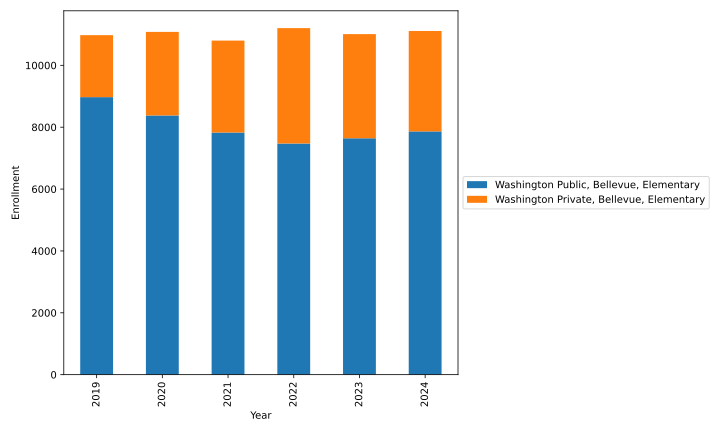
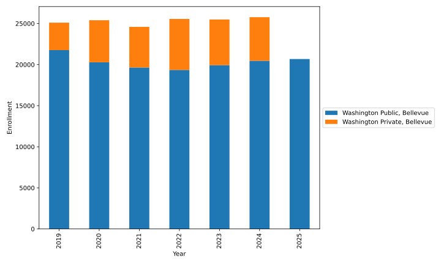
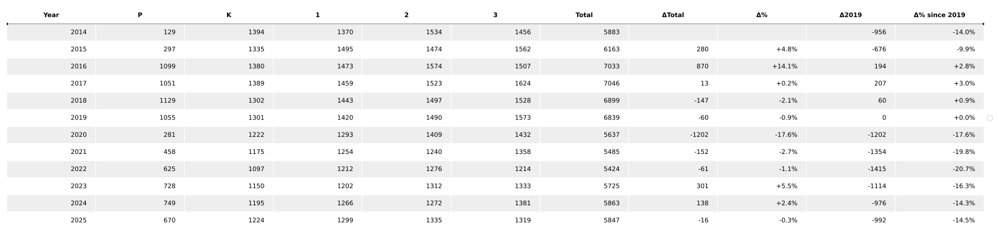
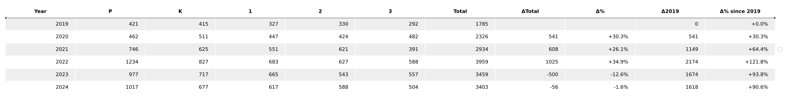
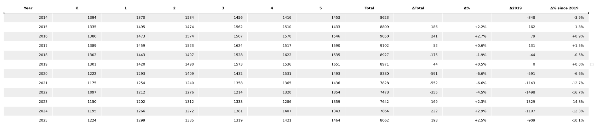
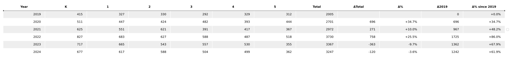
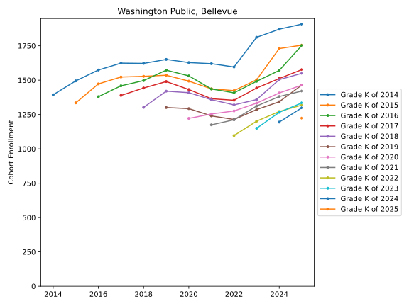
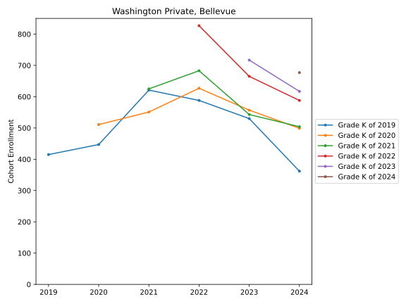

# Washington School Enrollment Data

This project processes data from the OSPI Data Portal and SBE Data Portal to summarize changes in Washington school
enrollment from state data (OPSI for public schoole and Washington State Board of Education for private schools).
It should be noted that the private school data reported to SBE is voluntary reporting and likely under-estimates private
school enrollment, and that reporting may be inconsistent from year to year with both *over* and under-estimation 
of public school growth being possible consequences.

Generated plots are available in the `plots` directories:

* [Public school enrollment](plots/Washington_Public) by district
* [Private school enrollment](plots/Washington_Private) by district by similar zip/city

Individual directories contains state-wide and county-wide (e.g. King county) views.

Several kinds of plots are available:

* Cohort progression plots. These track enrollment over time for a grade as it ages and progress. Of particular interest to
  future enrollment are trends following a grade from Kindergarten. We see:
  - recession in Kindergarten enrollment (the start of each trace) appears to have bottomed and is turning around.
  - grades generally grow year-on-year. Because few births go on to initially enter the public system *after* Kindergarten, we should infer that
    growth in the size of a grade as it ages is due one of the following causes: inward migration (foreign or domestic) 
    into the state and its cities, and/or movement between public and homeschool and private.
    These trends indicate that it is dangerous to rely primarily on state birthrates when
    predicting future public school enrollment.
    State and local demographers models provided narrative
    warnings that "birthrates are in decline and we must prepare". Simply, this
    has not held and cohorts have continued to grow past kindergarten, as they
    have in the past.
    State demographers should carefully model:
    - immigration and internal migration, and 
    - public/private/homeschool transfer
    if it wishes to more accurately model future enrollment than it has. 

### Directory

```{include} plots/directory.md 
```
[Directory](plots/directory.md)


# Washington Summary


*State public school cohort trends*


*State private school cohort trends*


*State public school cohort trends - cohort growth, even as kindergarden declines.*


*State private school cohort trends - in decline*


**Caution on interpretation of private school trends** 

It is unclear whether some years had more private school reporting than others, which might significantly affect the
interpretation of private school trends. However, independent estimation of the number of children in a city can be obtained from county demographers.
At least for Bellevue, we saw roughly a net-zero growth in the city's population of school aged children via
county demographer models in the same period  a (roughly) net-zero public/private transfer of students during
and following COVID.

## Bellevue 

Although Bellevue public school enrollment is briefly in decline, it is instructive to know where the loss
is coming from.

The Bellevue school district has argued:

* declining birth rates
* families selling homes and exiting the district, are replaced by childless families
* high costs of living (ignoring that families in all income brackets have children)
* new housing unattractive to parents (but are unable to say how it knows whether these new families are really childless, or just not enrolled in the the district).

The administration has ignored:

* parent dissatisfaction in the public school district, particular over COVID school closures
* the boom in personal finances during COVID that made private school more affordable to homeowners able to refinance to low monthly payments and take equity out of their home.
* Bellevue's population is composed heavily of migrant workers, and worker migration is largely unmodeled.
* That the extremely expensive housing market is a consequences of quality schools, which is a negative value to childless families.
* A steady or rising (not falling) population of children in the city, according to county demographers.

We can see clearly in the local private school data that public school losses were principally to local
private schools.


The sum of public+private elementary enrollment doesn't appear in decline:



Neither does sum of public+private total enrollment doesn't appear in decline in Bellevue:




Since elementary schools suffered the most loss, and schools were subsequently closed - let's look at that:


For P-3 enrollment, for the school year starting in 2019/20 - 2021/22, Bellevue public schools lost 1354, (-19.8%):



Bellevue P-3 private schools gained 1149 (+64.4%) in the same period:



**For every 100 lost from the public district, private gained 85.** That is, 85% of the enrollment loss seems
explainable by  public-private choice.

K-5 (2019/20 - 2021/22). Bellevue public lost 1143 (-12.7%):


In the same period Bellevue private gained 967 (+48.2%):


**For every 100 lost to private schools, 85 were gained by private.**

Brandon Adams has performed a similar analysis and found similar transfer to private (85 per 100):
https://mostlywashington.substack.com/p/how-do-births-and-housing-prices

Every grade cohort in Bellevue now appear to be strongly in recovery, including kindergarden enrollment, despite
demographer forecasts that 10 years of decline will follow from declining birthrates: 



At the same time, private school is sharply in decline, even as private kindergarden enrollment is historically high:



Declining birthrates, and subsequent kindergarden enrollment don't appear to be the major driver of either
public or private enrollment in Bellevue, and the district would do better to expand its enrollment modelling
to include migration, immigration (e.g. visa applications) and public/private preference.

## Seattle 


Seattle public school enrollment appears stalled and not in recovery:


Seattle private school enrollment appears stalled:


The sum of public+private enrollment has held steady (no in decline). Seattle public schools appear to have lost
enrollment to private schools:


--- 

Feedback is welcome. (Perhaps submit an issue).


* Public school data: https://ospi.k12.wa.us/data-reporting/data-portal
* Public schools directory: https://eds.ospi.k12.wa.us/DirectoryEDS.aspx?_gl=1*sgzoun*_ga*MzEwMTc3NDYxLjE3NTczNTA2ODI.*_ga_SQS5QZLGMR*czE3NjA5MTA5NjMkbzgkZzEkdDE3NjA5MTA5NzMkajUwJGwwJGgw*_ga_ZKSN9461S2*czE3NjA5MTA5NjMkbzgkZzEkdDE3NjA5MTA5NzMkajUwJGwwJGgw
* Private school enrollment data: https://sbe.wa.gov/our-work/private-schools#Private%20School%20Enrollment
* Private schools directory: https://sbe.wa.gov/our-work/private-schools#ApprovedSchoolsList