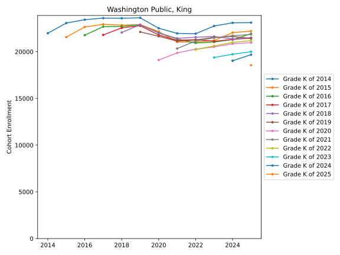
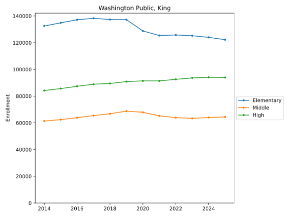

# Public Schools 

 - [Academy of Citizenship and Empowerment (Closed after 2016-2017 school year)](Washington_Public/King/school_cohorts/Academy_of_Citizenship_and_Empowerment_(Closed_after_2016_2017_school_year).cohorts.svg)
 - [Adams Elementary School](Washington_Public/King/school_cohorts/Adams_Elementary_School.cohorts.svg)
 - [Adelaide Elementary School](Washington_Public/King/school_cohorts/Adelaide_Elementary_School.cohorts.svg)
 - [Aki Kurose Middle School](Washington_Public/King/school_cohorts/Aki_Kurose_Middle_School.cohorts.svg)
 - [Alan T. Sugiyama High School](Washington_Public/King/school_cohorts/Alan_T._Sugiyama_High_School.cohorts.svg)
 - [Albert Einstein Elementary](Washington_Public/King/school_cohorts/Albert_Einstein_Elementary.cohorts.svg)
 - [Albert Einstein Middle School](Washington_Public/King/school_cohorts/Albert_Einstein_Middle_School.cohorts.svg)
 - [Alexander Graham Bell Elementary](Washington_Public/King/school_cohorts/Alexander_Graham_Bell_Elementary.cohorts.svg)
 - [Alki Elementary School](Washington_Public/King/school_cohorts/Alki_Elementary_School.cohorts.svg)
 - [Alpac Elementary School](Washington_Public/King/school_cohorts/Alpac_Elementary_School.cohorts.svg)
 - [Apollo Elementary](Washington_Public/King/school_cohorts/Apollo_Elementary.cohorts.svg)
 - [Arbor Heights Elementary School](Washington_Public/King/school_cohorts/Arbor_Heights_Elementary_School.cohorts.svg)
 - [Ardmore Elementary School](Washington_Public/King/school_cohorts/Ardmore_Elementary_School.cohorts.svg)
 - [Arrowhead Elementary](Washington_Public/King/school_cohorts/Arrowhead_Elementary.cohorts.svg)
 - [Arthur Jacobsen Elementary](Washington_Public/King/school_cohorts/Arthur_Jacobsen_Elementary.cohorts.svg)
 - [Arts & Academics Academy (Closed after 2016-2017 school year)](Washington_Public/King/school_cohorts/Arts_&_Academics_Academy_(Closed_after_2016_2017_school_year).cohorts.svg)
 - [Ashe Preparatory Academy (Closed after 2019-2020 school year)](Washington_Public/King/school_cohorts/Ashe_Preparatory_Academy_(Closed_after_2019_2020_school_year).cohorts.svg)
 - [Auburn Mountainview High School](Washington_Public/King/school_cohorts/Auburn_Mountainview_High_School.cohorts.svg)
 - [Auburn Online](Washington_Public/King/school_cohorts/Auburn_Online.cohorts.svg)
 - [Auburn Opportunity Project](Washington_Public/King/school_cohorts/Auburn_Opportunity_Project.cohorts.svg)
 - [Auburn Riverside High School](Washington_Public/King/school_cohorts/Auburn_Riverside_High_School.cohorts.svg)
 - [Auburn Senior High School](Washington_Public/King/school_cohorts/Auburn_Senior_High_School.cohorts.svg)
 - [B F Day Elementary School](Washington_Public/King/school_cohorts/B_F_Day_Elementary_School.cohorts.svg)
 - [Bailey Gatzert Elementary School](Washington_Public/King/school_cohorts/Bailey_Gatzert_Elementary_School.cohorts.svg)
 - [Ballard High School](Washington_Public/King/school_cohorts/Ballard_High_School.cohorts.svg)
 - [Beacon Hill International School](Washington_Public/King/school_cohorts/Beacon_Hill_International_School.cohorts.svg)
 - [Bear Creek Elementary](Washington_Public/King/school_cohorts/Bear_Creek_Elementary.cohorts.svg)
 - [Beaver Lake Middle School](Washington_Public/King/school_cohorts/Beaver_Lake_Middle_School.cohorts.svg)
 - [Bellevue Big Picture School](Washington_Public/King/school_cohorts/Bellevue_Big_Picture_School.cohorts.svg)
 - [Bellevue Digital Discovery](Washington_Public/King/school_cohorts/Bellevue_Digital_Discovery.cohorts.svg)
 - [Bellevue High School](Washington_Public/King/school_cohorts/Bellevue_High_School.cohorts.svg)
 - [Bellevue Open Doors Reengagement](Washington_Public/King/school_cohorts/Bellevue_Open_Doors_Reengagement.cohorts.svg)
 - [Benjamin Franklin Elementary](Washington_Public/King/school_cohorts/Benjamin_Franklin_Elementary.cohorts.svg)
 - [Benjamin Rush Elementary](Washington_Public/King/school_cohorts/Benjamin_Rush_Elementary.cohorts.svg)
 - [Bennett Elementary School](Washington_Public/King/school_cohorts/Bennett_Elementary_School.cohorts.svg)
 - [Benson Hill Elementary School](Washington_Public/King/school_cohorts/Benson_Hill_Elementary_School.cohorts.svg)
 - [Beverly Park Elem at Glendale](Washington_Public/King/school_cohorts/Beverly_Park_Elem_at_Glendale.cohorts.svg)
 - [Big Picture School](Washington_Public/King/school_cohorts/Big_Picture_School.cohorts.svg)
 - [Birth to 3 Contracts](Washington_Public/King/school_cohorts/Birth_to_3_Contracts.cohorts.svg)
 - [Birth to Age 2](Washington_Public/King/school_cohorts/Birth_to_Age_2.cohorts.svg)
 - [Birth to Three Development Center](Washington_Public/King/school_cohorts/Birth_to_Three_Development_Center.cohorts.svg)
 - [Black Diamond Elementary](Washington_Public/King/school_cohorts/Black_Diamond_Elementary.cohorts.svg)
 - [Bothell High School](Washington_Public/King/school_cohorts/Bothell_High_School.cohorts.svg)
 - [Bow Lake Elementary](Washington_Public/King/school_cohorts/Bow_Lake_Elementary.cohorts.svg)
 - [Bowman Creek Elementary](Washington_Public/King/school_cohorts/Bowman_Creek_Elementary.cohorts.svg)
 - [Briarcrest Elementary](Washington_Public/King/school_cohorts/Briarcrest_Elementary.cohorts.svg)
 - [Briarwood Elementary](Washington_Public/King/school_cohorts/Briarwood_Elementary.cohorts.svg)
 - [Bridges Transition](Washington_Public/King/school_cohorts/Bridges_Transition.cohorts.svg)
 - [Brigadoon Elementary School](Washington_Public/King/school_cohorts/Brigadoon_Elementary_School.cohorts.svg)
 - [Broadview-Thomson K-8 School](Washington_Public/King/school_cohorts/Broadview_Thomson_K_8_School.cohorts.svg)
 - [Brookside Elementary](Washington_Public/King/school_cohorts/Brookside_Elementary.cohorts.svg)
 - [Bryant Elementary School](Washington_Public/King/school_cohorts/Bryant_Elementary_School.cohorts.svg)
 - [Bryn Mawr Elementary School](Washington_Public/King/school_cohorts/Bryn_Mawr_Elementary_School.cohorts.svg)
 - [Byron Kibler Elementary School](Washington_Public/King/school_cohorts/Byron_Kibler_Elementary_School.cohorts.svg)
 - [C O Sorenson](Washington_Public/King/school_cohorts/C_O_Sorenson.cohorts.svg)
 - [CHOICE Academy](Washington_Public/King/school_cohorts/CHOICE_Academy.cohorts.svg)
 - [CLIP](Washington_Public/King/school_cohorts/CLIP.cohorts.svg)
 - [Camelot Elementary School](Washington_Public/King/school_cohorts/Camelot_Elementary_School.cohorts.svg)
 - [Campbell Hill Elementary School](Washington_Public/King/school_cohorts/Campbell_Hill_Elementary_School.cohorts.svg)
 - [Canyon Creek Elementary](Washington_Public/King/school_cohorts/Canyon_Creek_Elementary.cohorts.svg)
 - [Canyon Park Middle School](Washington_Public/King/school_cohorts/Canyon_Park_Middle_School.cohorts.svg)
 - [Canyon Ridge Middle School](Washington_Public/King/school_cohorts/Canyon_Ridge_Middle_School.cohorts.svg)
 - [Career Academy at Truman High School](Washington_Public/King/school_cohorts/Career_Academy_at_Truman_High_School.cohorts.svg)
 - [Career Education Options Reengagement Program](Washington_Public/King/school_cohorts/Career_Education_Options_Reengagement_Program.cohorts.svg)
 - [Career Link](Washington_Public/King/school_cohorts/Career_Link.cohorts.svg)
 - [Carl Sandburg Elementary](Washington_Public/King/school_cohorts/Carl_Sandburg_Elementary.cohorts.svg)
 - [Carnation Elementary School](Washington_Public/King/school_cohorts/Carnation_Elementary_School.cohorts.svg)
 - [Carriage Crest Elementary School](Washington_Public/King/school_cohorts/Carriage_Crest_Elementary_School.cohorts.svg)
 - [Cascade Elementary School](Washington_Public/King/school_cohorts/Cascade_Elementary_School.cohorts.svg)
 - [Cascade K-8 Community School](Washington_Public/King/school_cohorts/Cascade_K_8_Community_School.cohorts.svg)
 - [Cascade Middle School](Washington_Public/King/school_cohorts/Cascade_Middle_School.cohorts.svg)
 - [Cascade Parent Partnership Program](Washington_Public/King/school_cohorts/Cascade_Parent_Partnership_Program.cohorts.svg)
 - [Cascade Public Schools](Washington_Public/King/school_cohorts/Cascade_Public_Schools.cohorts.svg)
 - [Cascade Ridge Elementary](Washington_Public/King/school_cohorts/Cascade_Ridge_Elementary.cohorts.svg)
 - [Cascade View Elementary](Washington_Public/King/school_cohorts/Cascade_View_Elementary.cohorts.svg)
 - [Cascade View Elementary School](Washington_Public/King/school_cohorts/Cascade_View_Elementary_School.cohorts.svg)
 - [Cascadia Elementary](Washington_Public/King/school_cohorts/Cascadia_Elementary.cohorts.svg)
 - [Catharine Blaine K-8 School](Washington_Public/King/school_cohorts/Catharine_Blaine_K_8_School.cohorts.svg)
 - [Cedar Heights Middle School](Washington_Public/King/school_cohorts/Cedar_Heights_Middle_School.cohorts.svg)
 - [Cedar Park Elementary School](Washington_Public/King/school_cohorts/Cedar_Park_Elementary_School.cohorts.svg)
 - [Cedar River Elementary](Washington_Public/King/school_cohorts/Cedar_River_Elementary.cohorts.svg)
 - [Cedar Trails Elementary](Washington_Public/King/school_cohorts/Cedar_Trails_Elementary.cohorts.svg)
 - [Cedar Valley Elementary School](Washington_Public/King/school_cohorts/Cedar_Valley_Elementary_School.cohorts.svg)
 - [Cedarcrest High School](Washington_Public/King/school_cohorts/Cedarcrest_High_School.cohorts.svg)
 - [Cedarhurst Elementary](Washington_Public/King/school_cohorts/Cedarhurst_Elementary.cohorts.svg)
 - [Central Educational Services](Washington_Public/King/school_cohorts/Central_Educational_Services.cohorts.svg)
 - [Challenger Elementary](Washington_Public/King/school_cohorts/Challenger_Elementary.cohorts.svg)
 - [Chautauqua Elementary](Washington_Public/King/school_cohorts/Chautauqua_Elementary.cohorts.svg)
 - [Cherry Crest Elementary School](Washington_Public/King/school_cohorts/Cherry_Crest_Elementary_School.cohorts.svg)
 - [Cherry Valley Elementary School](Washington_Public/King/school_cohorts/Cherry_Valley_Elementary_School.cohorts.svg)
 - [Chief Kanim Middle School](Washington_Public/King/school_cohorts/Chief_Kanim_Middle_School.cohorts.svg)
 - [Chief Sealth International High School](Washington_Public/King/school_cohorts/Chief_Sealth_International_High_School.cohorts.svg)
 - [Chinook Elementary School](Washington_Public/King/school_cohorts/Chinook_Elementary_School.cohorts.svg)
 - [Chinook Middle School](Washington_Public/King/school_cohorts/Chinook_Middle_School.cohorts.svg)
 - [Choice](Washington_Public/King/school_cohorts/Choice.cohorts.svg)
 - [Christa Mcauliffe Elementary](Washington_Public/King/school_cohorts/Christa_Mcauliffe_Elementary.cohorts.svg)
 - [Clara Barton Elementary School](Washington_Public/King/school_cohorts/Clara_Barton_Elementary_School.cohorts.svg)
 - [Clark Elementary](Washington_Public/King/school_cohorts/Clark_Elementary.cohorts.svg)
 - [Cleveland High School STEM](Washington_Public/King/school_cohorts/Cleveland_High_School_STEM.cohorts.svg)
 - [Clyde Hill Elementary](Washington_Public/King/school_cohorts/Clyde_Hill_Elementary.cohorts.svg)
 - [Community School](Washington_Public/King/school_cohorts/Community_School.cohorts.svg)
 - [Concord International School](Washington_Public/King/school_cohorts/Concord_International_School.cohorts.svg)
 - [Contractual Schools](Washington_Public/King/school_cohorts/Contractual_Schools.cohorts.svg)
 - [Cottage Lake Elementary](Washington_Public/King/school_cohorts/Cottage_Lake_Elementary.cohorts.svg)
 - [Cougar Mountain Middle School](Washington_Public/King/school_cohorts/Cougar_Mountain_Middle_School.cohorts.svg)
 - [Cougar Ridge Elementary](Washington_Public/King/school_cohorts/Cougar_Ridge_Elementary.cohorts.svg)
 - [Covington Elementary School](Washington_Public/King/school_cohorts/Covington_Elementary_School.cohorts.svg)
 - [Creekside Elementary](Washington_Public/King/school_cohorts/Creekside_Elementary.cohorts.svg)
 - [Crestwood Elementary School](Washington_Public/King/school_cohorts/Crestwood_Elementary_School.cohorts.svg)
 - [Crystal Springs Elementary](Washington_Public/King/school_cohorts/Crystal_Springs_Elementary.cohorts.svg)
 - [Daniel Bagley Elementary School](Washington_Public/King/school_cohorts/Daniel_Bagley_Elementary_School.cohorts.svg)
 - [David T. Denny International Middle School](Washington_Public/King/school_cohorts/David_T._Denny_International_Middle_School.cohorts.svg)
 - [Dearborn Park International School](Washington_Public/King/school_cohorts/Dearborn_Park_International_School.cohorts.svg)
 - [Decatur High School](Washington_Public/King/school_cohorts/Decatur_High_School.cohorts.svg)
 - [Des Moines Elementary](Washington_Public/King/school_cohorts/Des_Moines_Elementary.cohorts.svg)
 - [Dick Scobee Elementary School](Washington_Public/King/school_cohorts/Dick_Scobee_Elementary_School.cohorts.svg)
 - [Dimmitt Middle School](Washington_Public/King/school_cohorts/Dimmitt_Middle_School.cohorts.svg)
 - [Discovery Community  School](Washington_Public/King/school_cohorts/Discovery_Community_School.cohorts.svg)
 - [Discovery Elementary](Washington_Public/King/school_cohorts/Discovery_Elementary.cohorts.svg)
 - [Dunlap Elementary School](Washington_Public/King/school_cohorts/Dunlap_Elementary_School.cohorts.svg)
 - [Dynamic Family Services](Washington_Public/King/school_cohorts/Dynamic_Family_Services.cohorts.svg)
 - [Eagle Rock Multiage School](Washington_Public/King/school_cohorts/Eagle_Rock_Multiage_School.cohorts.svg)
 - [Early Childhood Education (Closed after 2018-2019 school year)](Washington_Public/King/school_cohorts/Early_Childhood_Education_(Closed_after_2018_2019_school_year).cohorts.svg)
 - [Early Learning Center](Washington_Public/King/school_cohorts/Early_Learning_Center.cohorts.svg)
 - [East Hill Elementary School](Washington_Public/King/school_cohorts/East_Hill_Elementary_School.cohorts.svg)
 - [East Ridge Elementary](Washington_Public/King/school_cohorts/East_Ridge_Elementary.cohorts.svg)
 - [Eastgate Elementary School](Washington_Public/King/school_cohorts/Eastgate_Elementary_School.cohorts.svg)
 - [Eastlake High School](Washington_Public/King/school_cohorts/Eastlake_High_School.cohorts.svg)
 - [Echo Glen School](Washington_Public/King/school_cohorts/Echo_Glen_School.cohorts.svg)
 - [Echo Lake Elementary School](Washington_Public/King/school_cohorts/Echo_Lake_Elementary_School.cohorts.svg)
 - [Eckstein Middle School](Washington_Public/King/school_cohorts/Eckstein_Middle_School.cohorts.svg)
 - [Edmonds S. Meany Middle School](Washington_Public/King/school_cohorts/Edmonds_S._Meany_Middle_School.cohorts.svg)
 - [Education Service Centers (Closed after 2016-2017 school year)](Washington_Public/King/school_cohorts/Education_Service_Centers_(Closed_after_2016_2017_school_year).cohorts.svg)
 - [Edwin Pratt Learning Center](Washington_Public/King/school_cohorts/Edwin_Pratt_Learning_Center.cohorts.svg)
 - [Edwin R Opstad Elementary](Washington_Public/King/school_cohorts/Edwin_R_Opstad_Elementary.cohorts.svg)
 - [Elizabeth Blackwell Elementary](Washington_Public/King/school_cohorts/Elizabeth_Blackwell_Elementary.cohorts.svg)
 - [Ella Baker Elementary School](Washington_Public/King/school_cohorts/Ella_Baker_Elementary_School.cohorts.svg)
 - [Ella Baker High School (Open Doors)](Washington_Public/King/school_cohorts/Ella_Baker_High_School_(Open_Doors).cohorts.svg)
 - [Emerald Park Elementary School](Washington_Public/King/school_cohorts/Emerald_Park_Elementary_School.cohorts.svg)
 - [Emerson Elementary School](Washington_Public/King/school_cohorts/Emerson_Elementary_School.cohorts.svg)
 - [Emerson High School](Washington_Public/King/school_cohorts/Emerson_High_School.cohorts.svg)
 - [Emerson K-12](Washington_Public/King/school_cohorts/Emerson_K_12.cohorts.svg)
 - [Emily Dickinson Elementary](Washington_Public/King/school_cohorts/Emily_Dickinson_Elementary.cohorts.svg)
 - [Employment Transition Program](Washington_Public/King/school_cohorts/Employment_Transition_Program.cohorts.svg)
 - [Enatai Elementary School](Washington_Public/King/school_cohorts/Enatai_Elementary_School.cohorts.svg)
 - [Endeavour Elementary School](Washington_Public/King/school_cohorts/Endeavour_Elementary_School.cohorts.svg)
 - [Enterprise Elementary School](Washington_Public/King/school_cohorts/Enterprise_Elementary_School.cohorts.svg)
 - [Enumclaw Middle School](Washington_Public/King/school_cohorts/Enumclaw_Middle_School.cohorts.svg)
 - [Enumclaw Sr High School](Washington_Public/King/school_cohorts/Enumclaw_Sr_High_School.cohorts.svg)
 - [Environmental & Adventure School](Washington_Public/King/school_cohorts/Environmental_&_Adventure_School.cohorts.svg)
 - [Evergreen Heights Elementary](Washington_Public/King/school_cohorts/Evergreen_Heights_Elementary.cohorts.svg)
 - [Evergreen High School](Washington_Public/King/school_cohorts/Evergreen_High_School.cohorts.svg)
 - [Evergreen Middle School](Washington_Public/King/school_cohorts/Evergreen_Middle_School.cohorts.svg)
 - [Excel Public Charter School (Closed after 2018-2019 school year)](Washington_Public/King/school_cohorts/Excel_Public_Charter_School_(Closed_after_2018_2019_school_year).cohorts.svg)
 - [Experimental Education Unit (Closed after 2015-2016 school year)](Washington_Public/King/school_cohorts/Experimental_Education_Unit_(Closed_after_2015_2016_school_year).cohorts.svg)
 - [Explorer Community School](Washington_Public/King/school_cohorts/Explorer_Community_School.cohorts.svg)
 - [Fairmount Park Elementary School](Washington_Public/King/school_cohorts/Fairmount_Park_Elementary_School.cohorts.svg)
 - [Fairwood Elementary School](Washington_Public/King/school_cohorts/Fairwood_Elementary_School.cohorts.svg)
 - [Fall City Elementary](Washington_Public/King/school_cohorts/Fall_City_Elementary.cohorts.svg)
 - [Family Link](Washington_Public/King/school_cohorts/Family_Link.cohorts.svg)
 - [Federal Way High School](Washington_Public/King/school_cohorts/Federal_Way_High_School.cohorts.svg)
 - [Federal Way Public Academy](Washington_Public/King/school_cohorts/Federal_Way_Public_Academy.cohorts.svg)
 - [Federal Way Public School ECEAP](Washington_Public/King/school_cohorts/Federal_Way_Public_School_ECEAP.cohorts.svg)
 - [Federal Way Public Schools Headstart](Washington_Public/King/school_cohorts/Federal_Way_Public_Schools_Headstart.cohorts.svg)
 - [Federal Way Running Start Home School](Washington_Public/King/school_cohorts/Federal_Way_Running_Start_Home_School.cohorts.svg)
 - [Fernwood Elementary](Washington_Public/King/school_cohorts/Fernwood_Elementary.cohorts.svg)
 - [Finn Hill Middle School](Washington_Public/King/school_cohorts/Finn_Hill_Middle_School.cohorts.svg)
 - [Fircrest Residential Habilitation](Washington_Public/King/school_cohorts/Fircrest_Residential_Habilitation.cohorts.svg)
 - [First Place Scholars Charter School (Closed after 2015-2016 school year)](Washington_Public/King/school_cohorts/First_Place_Scholars_Charter_School_(Closed_after_2015_2016_school_year).cohorts.svg)
 - [Foster Senior High School](Washington_Public/King/school_cohorts/Foster_Senior_High_School.cohorts.svg)
 - [Frank Love Elementary](Washington_Public/King/school_cohorts/Frank_Love_Elementary.cohorts.svg)
 - [Franklin High School](Washington_Public/King/school_cohorts/Franklin_High_School.cohorts.svg)
 - [Frantz Coe Elementary School](Washington_Public/King/school_cohorts/Frantz_Coe_Elementary_School.cohorts.svg)
 - [Futures School](Washington_Public/King/school_cohorts/Futures_School.cohorts.svg)
 - [Garfield High School](Washington_Public/King/school_cohorts/Garfield_High_School.cohorts.svg)
 - [Gateway to College](Washington_Public/King/school_cohorts/Gateway_to_College.cohorts.svg)
 - [Gatewood Elementary School](Washington_Public/King/school_cohorts/Gatewood_Elementary_School.cohorts.svg)
 - [Genesee Hill Elementary](Washington_Public/King/school_cohorts/Genesee_Hill_Elementary.cohorts.svg)
 - [George T. Daniel Elementary School](Washington_Public/King/school_cohorts/George_T._Daniel_Elementary_School.cohorts.svg)
 - [Gibson Ek High School](Washington_Public/King/school_cohorts/Gibson_Ek_High_School.cohorts.svg)
 - [Gildo Rey Elementary School](Washington_Public/King/school_cohorts/Gildo_Rey_Elementary_School.cohorts.svg)
 - [Glacier Middle School](Washington_Public/King/school_cohorts/Glacier_Middle_School.cohorts.svg)
 - [Glacier Park Elementary](Washington_Public/King/school_cohorts/Glacier_Park_Elementary.cohorts.svg)
 - [Glenridge Elementary](Washington_Public/King/school_cohorts/Glenridge_Elementary.cohorts.svg)
 - [Global Connections High School (Closed after 2016-2017 school year)](Washington_Public/King/school_cohorts/Global_Connections_High_School_(Closed_after_2016_2017_school_year).cohorts.svg)
 - [Graham Hill Elementary School](Washington_Public/King/school_cohorts/Graham_Hill_Elementary_School.cohorts.svg)
 - [Grand Ridge Elementary](Washington_Public/King/school_cohorts/Grand_Ridge_Elementary.cohorts.svg)
 - [Grass Lake Elementary School](Washington_Public/King/school_cohorts/Grass_Lake_Elementary_School.cohorts.svg)
 - [Green Gables Elementary School](Washington_Public/King/school_cohorts/Green_Gables_Elementary_School.cohorts.svg)
 - [Green Lake Elementary School](Washington_Public/King/school_cohorts/Green_Lake_Elementary_School.cohorts.svg)
 - [Greenwood Elementary School](Washington_Public/King/school_cohorts/Greenwood_Elementary_School.cohorts.svg)
 - [Gregory Heights Elementary](Washington_Public/King/school_cohorts/Gregory_Heights_Elementary.cohorts.svg)
 - [Griffin Home](Washington_Public/King/school_cohorts/Griffin_Home.cohorts.svg)
 - [H.O.M.E. Program](Washington_Public/King/school_cohorts/H.O.M.E._Program.cohorts.svg)
 - [Hamilton International Middle School](Washington_Public/King/school_cohorts/Hamilton_International_Middle_School.cohorts.svg)
 - [Handicapped Contractual Services](Washington_Public/King/school_cohorts/Handicapped_Contractual_Services.cohorts.svg)
 - [Hawthorne Elementary School](Washington_Public/King/school_cohorts/Hawthorne_Elementary_School.cohorts.svg)
 - [Hazel Valley Elementary](Washington_Public/King/school_cohorts/Hazel_Valley_Elementary.cohorts.svg)
 - [Hazel Wolf K-8](Washington_Public/King/school_cohorts/Hazel_Wolf_K_8.cohorts.svg)
 - [Hazelwood Elementary School](Washington_Public/King/school_cohorts/Hazelwood_Elementary_School.cohorts.svg)
 - [Hazen Senior High School](Washington_Public/King/school_cohorts/Hazen_Senior_High_School.cohorts.svg)
 - [Head Start (Closed after 2018-2019 school year)](Washington_Public/King/school_cohorts/Head_Start_(Closed_after_2018_2019_school_year).cohorts.svg)
 - [Health Sciences & Human Services (Closed after 2016-2017 school year)](Washington_Public/King/school_cohorts/Health_Sciences_&_Human_Services_(Closed_after_2016_2017_school_year).cohorts.svg)
 - [Helen Keller Elementary](Washington_Public/King/school_cohorts/Helen_Keller_Elementary.cohorts.svg)
 - [Henry David Thoreau Elementary](Washington_Public/King/school_cohorts/Henry_David_Thoreau_Elementary.cohorts.svg)
 - [Highland Middle School](Washington_Public/King/school_cohorts/Highland_Middle_School.cohorts.svg)
 - [Highland Park Elementary School](Washington_Public/King/school_cohorts/Highland_Park_Elementary_School.cohorts.svg)
 - [Highland Terrace Elementary](Washington_Public/King/school_cohorts/Highland_Terrace_Elementary.cohorts.svg)
 - [Highlands Elementary School](Washington_Public/King/school_cohorts/Highlands_Elementary_School.cohorts.svg)
 - [Highline High School](Washington_Public/King/school_cohorts/Highline_High_School.cohorts.svg)
 - [Highline Home School Center](Washington_Public/King/school_cohorts/Highline_Home_School_Center.cohorts.svg)
 - [Highline Open Doors 1418](Washington_Public/King/school_cohorts/Highline_Open_Doors_1418.cohorts.svg)
 - [Highline Public Schools Virtual Academy](Washington_Public/King/school_cohorts/Highline_Public_Schools_Virtual_Academy.cohorts.svg)
 - [Hillcrest Special Services Center (Closed after 2016-2017 school year)](Washington_Public/King/school_cohorts/Hillcrest_Special_Services_Center_(Closed_after_2016_2017_school_year).cohorts.svg)
 - [Hilltop Elementary](Washington_Public/King/school_cohorts/Hilltop_Elementary.cohorts.svg)
 - [Hilltop Heritage Elementary School](Washington_Public/King/school_cohorts/Hilltop_Heritage_Elementary_School.cohorts.svg)
 - [Holly Street Early Learning Center](Washington_Public/King/school_cohorts/Holly_Street_Early_Learning_Center.cohorts.svg)
 - [Holly Street Preschool](Washington_Public/King/school_cohorts/Holly_Street_Preschool.cohorts.svg)
 - [Hollywood Hill Elementary](Washington_Public/King/school_cohorts/Hollywood_Hill_Elementary.cohorts.svg)
 - [Home Education Exchange](Washington_Public/King/school_cohorts/Home_Education_Exchange.cohorts.svg)
 - [Honey Dew Elementary](Washington_Public/King/school_cohorts/Honey_Dew_Elementary.cohorts.svg)
 - [Horace Mann Elementary](Washington_Public/King/school_cohorts/Horace_Mann_Elementary.cohorts.svg)
 - [Horizon Elementary School](Washington_Public/King/school_cohorts/Horizon_Elementary_School.cohorts.svg)
 - [Hutch School (Closed after 2017-2018 school year)](Washington_Public/King/school_cohorts/Hutch_School_(Closed_after_2017_2018_school_year).cohorts.svg)
 - [Ilalko Elementary School](Washington_Public/King/school_cohorts/Ilalko_Elementary_School.cohorts.svg)
 - [Illahee Middle School](Washington_Public/King/school_cohorts/Illahee_Middle_School.cohorts.svg)
 - [Impact Public Schools](Washington_Public/King/school_cohorts/Impact_Public_Schools.cohorts.svg)
 - [Impact | Black River Elementary](Washington_Public/King/school_cohorts/Impact_|_Black_River_Elementary.cohorts.svg)
 - [Impact | Puget Sound Elementary](Washington_Public/King/school_cohorts/Impact_|_Puget_Sound_Elementary.cohorts.svg)
 - [Impact | Salish Sea Elementary](Washington_Public/King/school_cohorts/Impact_|_Salish_Sea_Elementary.cohorts.svg)
 - [Individualized Graduation & Degree Program](Washington_Public/King/school_cohorts/Individualized_Graduation_&_Degree_Program.cohorts.svg)
 - [Inglemoor HS](Washington_Public/King/school_cohorts/Inglemoor_HS.cohorts.svg)
 - [Inglewood Middle School](Washington_Public/King/school_cohorts/Inglewood_Middle_School.cohorts.svg)
 - [Ingraham High School](Washington_Public/King/school_cohorts/Ingraham_High_School.cohorts.svg)
 - [Innovation Heights Academy](Washington_Public/King/school_cohorts/Innovation_Heights_Academy.cohorts.svg)
 - [Innovation Lab High School](Washington_Public/King/school_cohorts/Innovation_Lab_High_School.cohorts.svg)
 - [Interagency Detention School](Washington_Public/King/school_cohorts/Interagency_Detention_School.cohorts.svg)
 - [Interagency Open Doors](Washington_Public/King/school_cohorts/Interagency_Open_Doors.cohorts.svg)
 - [Interagency Programs](Washington_Public/King/school_cohorts/Interagency_Programs.cohorts.svg)
 - [Interlake Senior High School](Washington_Public/King/school_cohorts/Interlake_Senior_High_School.cohorts.svg)
 - [International Community School](Washington_Public/King/school_cohorts/International_Community_School.cohorts.svg)
 - [International School](Washington_Public/King/school_cohorts/International_School.cohorts.svg)
 - [Internet Academy](Washington_Public/King/school_cohorts/Internet_Academy.cohorts.svg)
 - [Island Park Elementary](Washington_Public/King/school_cohorts/Island_Park_Elementary.cohorts.svg)
 - [Islander Middle School](Washington_Public/King/school_cohorts/Islander_Middle_School.cohorts.svg)
 - [Issaquah High School](Washington_Public/King/school_cohorts/Issaquah_High_School.cohorts.svg)
 - [Issaquah Middle School](Washington_Public/King/school_cohorts/Issaquah_Middle_School.cohorts.svg)
 - [Issaquah Preschool Academy](Washington_Public/King/school_cohorts/Issaquah_Preschool_Academy.cohorts.svg)
 - [Issaquah Special Services](Washington_Public/King/school_cohorts/Issaquah_Special_Services.cohorts.svg)
 - [Issaquah Valley Elementary](Washington_Public/King/school_cohorts/Issaquah_Valley_Elementary.cohorts.svg)
 - [JJ Smith Elementary](Washington_Public/King/school_cohorts/JJ_Smith_Elementary.cohorts.svg)
 - [James Baldwin Elementary School](Washington_Public/King/school_cohorts/James_Baldwin_Elementary_School.cohorts.svg)
 - [Jane Addams Middle School](Washington_Public/King/school_cohorts/Jane_Addams_Middle_School.cohorts.svg)
 - [Jenkins Creek Elementary School](Washington_Public/King/school_cohorts/Jenkins_Creek_Elementary_School.cohorts.svg)
 - [Jing Mei Elementary School](Washington_Public/King/school_cohorts/Jing_Mei_Elementary_School.cohorts.svg)
 - [John Hay Elementary School](Washington_Public/King/school_cohorts/John_Hay_Elementary_School.cohorts.svg)
 - [John J. Audubon Elementary](Washington_Public/King/school_cohorts/John_J._Audubon_Elementary.cohorts.svg)
 - [John Muir Elementary](Washington_Public/King/school_cohorts/John_Muir_Elementary.cohorts.svg)
 - [John Muir Elementary School](Washington_Public/King/school_cohorts/John_Muir_Elementary_School.cohorts.svg)
 - [John Rogers Elementary School](Washington_Public/King/school_cohorts/John_Rogers_Elementary_School.cohorts.svg)
 - [John Stanford International School](Washington_Public/King/school_cohorts/John_Stanford_International_School.cohorts.svg)
 - [Juanita Elementary](Washington_Public/King/school_cohorts/Juanita_Elementary.cohorts.svg)
 - [Juanita High School](Washington_Public/King/school_cohorts/Juanita_High_School.cohorts.svg)
 - [Kamiakin Middle School](Washington_Public/King/school_cohorts/Kamiakin_Middle_School.cohorts.svg)
 - [Kellogg Middle School](Washington_Public/King/school_cohorts/Kellogg_Middle_School.cohorts.svg)
 - [Kenmore Elementary](Washington_Public/King/school_cohorts/Kenmore_Elementary.cohorts.svg)
 - [Kenmore Middle School](Washington_Public/King/school_cohorts/Kenmore_Middle_School.cohorts.svg)
 - [Kennydale Elementary School](Washington_Public/King/school_cohorts/Kennydale_Elementary_School.cohorts.svg)
 - [Kent Elementary School](Washington_Public/King/school_cohorts/Kent_Elementary_School.cohorts.svg)
 - [Kent Laboratory Academy](Washington_Public/King/school_cohorts/Kent_Laboratory_Academy.cohorts.svg)
 - [Kent Mountain View Academy](Washington_Public/King/school_cohorts/Kent_Mountain_View_Academy.cohorts.svg)
 - [Kent Phoenix Academy](Washington_Public/King/school_cohorts/Kent_Phoenix_Academy.cohorts.svg)
 - [Kent Virtual Academy](Washington_Public/King/school_cohorts/Kent_Virtual_Academy.cohorts.svg)
 - [Kent-Meridian High School](Washington_Public/King/school_cohorts/Kent_Meridian_High_School.cohorts.svg)
 - [Kentlake High School](Washington_Public/King/school_cohorts/Kentlake_High_School.cohorts.svg)
 - [Kentridge High School](Washington_Public/King/school_cohorts/Kentridge_High_School.cohorts.svg)
 - [Kentwood High School](Washington_Public/King/school_cohorts/Kentwood_High_School.cohorts.svg)
 - [Kilo Middle School](Washington_Public/King/school_cohorts/Kilo_Middle_School.cohorts.svg)
 - [Kimball Elementary School](Washington_Public/King/school_cohorts/Kimball_Elementary_School.cohorts.svg)
 - [Kirkland Middle School](Washington_Public/King/school_cohorts/Kirkland_Middle_School.cohorts.svg)
 - [Kokanee Elementary](Washington_Public/King/school_cohorts/Kokanee_Elementary.cohorts.svg)
 - [Lafayette Elementary School](Washington_Public/King/school_cohorts/Lafayette_Elementary_School.cohorts.svg)
 - [Lake Dolloff Elementary School](Washington_Public/King/school_cohorts/Lake_Dolloff_Elementary_School.cohorts.svg)
 - [Lake Forest Park Elementary](Washington_Public/King/school_cohorts/Lake_Forest_Park_Elementary.cohorts.svg)
 - [Lake Grove Elementary School](Washington_Public/King/school_cohorts/Lake_Grove_Elementary_School.cohorts.svg)
 - [Lake Hills Elementary](Washington_Public/King/school_cohorts/Lake_Hills_Elementary.cohorts.svg)
 - [Lake View Elementary School](Washington_Public/King/school_cohorts/Lake_View_Elementary_School.cohorts.svg)
 - [Lake Washington High School](Washington_Public/King/school_cohorts/Lake_Washington_High_School.cohorts.svg)
 - [Lake Washington SD Online School](Washington_Public/King/school_cohorts/Lake_Washington_SD_Online_School.cohorts.svg)
 - [Lake Washington Technical Academy](Washington_Public/King/school_cohorts/Lake_Washington_Technical_Academy.cohorts.svg)
 - [Lake Wilderness Elementary](Washington_Public/King/school_cohorts/Lake_Wilderness_Elementary.cohorts.svg)
 - [Lake Youngs Elementary School](Washington_Public/King/school_cohorts/Lake_Youngs_Elementary_School.cohorts.svg)
 - [Lakeland Elementary School](Washington_Public/King/school_cohorts/Lakeland_Elementary_School.cohorts.svg)
 - [Lakeland Hills Elementary](Washington_Public/King/school_cohorts/Lakeland_Hills_Elementary.cohorts.svg)
 - [Lakeridge Elementary School](Washington_Public/King/school_cohorts/Lakeridge_Elementary_School.cohorts.svg)
 - [Lakeview Elementary](Washington_Public/King/school_cohorts/Lakeview_Elementary.cohorts.svg)
 - [Lakota Middle School](Washington_Public/King/school_cohorts/Lakota_Middle_School.cohorts.svg)
 - [Laura Ingalls Wilder Elementary](Washington_Public/King/school_cohorts/Laura_Ingalls_Wilder_Elementary.cohorts.svg)
 - [Laurelhurst Elementary School](Washington_Public/King/school_cohorts/Laurelhurst_Elementary_School.cohorts.svg)
 - [Lawton Elementary School](Washington_Public/King/school_cohorts/Lawton_Elementary_School.cohorts.svg)
 - [Lea Hill Elementary School](Washington_Public/King/school_cohorts/Lea_Hill_Elementary_School.cohorts.svg)
 - [Leota Middle School](Washington_Public/King/school_cohorts/Leota_Middle_School.cohorts.svg)
 - [Leschi Elementary School](Washington_Public/King/school_cohorts/Leschi_Elementary_School.cohorts.svg)
 - [Liberty Sr High School](Washington_Public/King/school_cohorts/Liberty_Sr_High_School.cohorts.svg)
 - [Licton Springs K-8](Washington_Public/King/school_cohorts/Licton_Springs_K_8.cohorts.svg)
 - [Lincoln High School](Washington_Public/King/school_cohorts/Lincoln_High_School.cohorts.svg)
 - [Lindbergh Senior High School](Washington_Public/King/school_cohorts/Lindbergh_Senior_High_School.cohorts.svg)
 - [Lockwood Elementary](Washington_Public/King/school_cohorts/Lockwood_Elementary.cohorts.svg)
 - [Louisa Boren STEM K-8](Washington_Public/King/school_cohorts/Louisa_Boren_STEM_K_8.cohorts.svg)
 - [Louisa May Alcott Elementary](Washington_Public/King/school_cohorts/Louisa_May_Alcott_Elementary.cohorts.svg)
 - [Lowell Elementary School](Washington_Public/King/school_cohorts/Lowell_Elementary_School.cohorts.svg)
 - [Loyal Heights Elementary School](Washington_Public/King/school_cohorts/Loyal_Heights_Elementary_School.cohorts.svg)
 - [Madison Middle School](Washington_Public/King/school_cohorts/Madison_Middle_School.cohorts.svg)
 - [Madrona Elementary](Washington_Public/King/school_cohorts/Madrona_Elementary.cohorts.svg)
 - [Madrona K-5 School](Washington_Public/King/school_cohorts/Madrona_K_5_School.cohorts.svg)
 - [Magnolia Elementary School](Washington_Public/King/school_cohorts/Magnolia_Elementary_School.cohorts.svg)
 - [Maple Elementary School](Washington_Public/King/school_cohorts/Maple_Elementary_School.cohorts.svg)
 - [Maple Hills Elementary](Washington_Public/King/school_cohorts/Maple_Hills_Elementary.cohorts.svg)
 - [Maple View Middle School](Washington_Public/King/school_cohorts/Maple_View_Middle_School.cohorts.svg)
 - [Maplewood Heights Elementary School](Washington_Public/King/school_cohorts/Maplewood_Heights_Elementary_School.cohorts.svg)
 - [Margaret Mead Elementary](Washington_Public/King/school_cohorts/Margaret_Mead_Elementary.cohorts.svg)
 - [Maritime High School](Washington_Public/King/school_cohorts/Maritime_High_School.cohorts.svg)
 - [Mark Twain Elementary](Washington_Public/King/school_cohorts/Mark_Twain_Elementary.cohorts.svg)
 - [Mark Twain Elementary School](Washington_Public/King/school_cohorts/Mark_Twain_Elementary_School.cohorts.svg)
 - [Martin Luther King Jr. Elementary School](Washington_Public/King/school_cohorts/Martin_Luther_King_Jr._Elementary_School.cohorts.svg)
 - [Martin Sortun Elementary School](Washington_Public/King/school_cohorts/Martin_Sortun_Elementary_School.cohorts.svg)
 - [Marvista Elementary](Washington_Public/King/school_cohorts/Marvista_Elementary.cohorts.svg)
 - [Mattson Middle School](Washington_Public/King/school_cohorts/Mattson_Middle_School.cohorts.svg)
 - [Maywood Hills Elementary](Washington_Public/King/school_cohorts/Maywood_Hills_Elementary.cohorts.svg)
 - [Maywood Middle School](Washington_Public/King/school_cohorts/Maywood_Middle_School.cohorts.svg)
 - [McClure Middle School](Washington_Public/King/school_cohorts/McClure_Middle_School.cohorts.svg)
 - [McDonald International School](Washington_Public/King/school_cohorts/McDonald_International_School.cohorts.svg)
 - [McGilvra Elementary School](Washington_Public/King/school_cohorts/McGilvra_Elementary_School.cohorts.svg)
 - [McKnight Middle School](Washington_Public/King/school_cohorts/McKnight_Middle_School.cohorts.svg)
 - [McMicken Heights Elementary](Washington_Public/King/school_cohorts/McMicken_Heights_Elementary.cohorts.svg)
 - [McMurray Middle School](Washington_Public/King/school_cohorts/McMurray_Middle_School.cohorts.svg)
 - [Meadow Crest Early Childhood Education Center](Washington_Public/King/school_cohorts/Meadow_Crest_Early_Childhood_Education_Center.cohorts.svg)
 - [Meadow Ridge Elementary School](Washington_Public/King/school_cohorts/Meadow_Ridge_Elementary_School.cohorts.svg)
 - [Meadowbrook School](Washington_Public/King/school_cohorts/Meadowbrook_School.cohorts.svg)
 - [Medina Elementary School](Washington_Public/King/school_cohorts/Medina_Elementary_School.cohorts.svg)
 - [Meeker Middle School](Washington_Public/King/school_cohorts/Meeker_Middle_School.cohorts.svg)
 - [Melvin G Syre Elementary](Washington_Public/King/school_cohorts/Melvin_G_Syre_Elementary.cohorts.svg)
 - [Mercer International Middle School](Washington_Public/King/school_cohorts/Mercer_International_Middle_School.cohorts.svg)
 - [Mercer Island High School](Washington_Public/King/school_cohorts/Mercer_Island_High_School.cohorts.svg)
 - [Meredith Hill Elementary School](Washington_Public/King/school_cohorts/Meredith_Hill_Elementary_School.cohorts.svg)
 - [Meridian Elementary School](Washington_Public/King/school_cohorts/Meridian_Elementary_School.cohorts.svg)
 - [Meridian Middle School](Washington_Public/King/school_cohorts/Meridian_Middle_School.cohorts.svg)
 - [Meridian Park Elementary School](Washington_Public/King/school_cohorts/Meridian_Park_Elementary_School.cohorts.svg)
 - [Merit School (Closed after 2015-2016 school year)](Washington_Public/King/school_cohorts/Merit_School_(Closed_after_2015_2016_school_year).cohorts.svg)
 - [Middle College High School](Washington_Public/King/school_cohorts/Middle_College_High_School.cohorts.svg)
 - [Midway Elementary](Washington_Public/King/school_cohorts/Midway_Elementary.cohorts.svg)
 - [Mill Creek Middle School](Washington_Public/King/school_cohorts/Mill_Creek_Middle_School.cohorts.svg)
 - [Millennium Elementary School](Washington_Public/King/school_cohorts/Millennium_Elementary_School.cohorts.svg)
 - [Mirror Lake Elementary School](Washington_Public/King/school_cohorts/Mirror_Lake_Elementary_School.cohorts.svg)
 - [Montlake Elementary School](Washington_Public/King/school_cohorts/Montlake_Elementary_School.cohorts.svg)
 - [Moorlands Elementary](Washington_Public/King/school_cohorts/Moorlands_Elementary.cohorts.svg)
 - [Mount Rainier High School](Washington_Public/King/school_cohorts/Mount_Rainier_High_School.cohorts.svg)
 - [Mount Si High School](Washington_Public/King/school_cohorts/Mount_Si_High_School.cohorts.svg)
 - [Mount View Elementary](Washington_Public/King/school_cohorts/Mount_View_Elementary.cohorts.svg)
 - [Mt Baker Middle School](Washington_Public/King/school_cohorts/Mt_Baker_Middle_School.cohorts.svg)
 - [Muckleshoot Tribal School](Washington_Public/King/school_cohorts/Muckleshoot_Tribal_School.cohorts.svg)
 - [Nathan Hale High School](Washington_Public/King/school_cohorts/Nathan_Hale_High_School.cohorts.svg)
 - [Nautilus K-8 School](Washington_Public/King/school_cohorts/Nautilus_K_8_School.cohorts.svg)
 - [Neely O Brien Elementary School](Washington_Public/King/school_cohorts/Neely_O_Brien_Elementary_School.cohorts.svg)
 - [Nelsen Middle School](Washington_Public/King/school_cohorts/Nelsen_Middle_School.cohorts.svg)
 - [New Start](Washington_Public/King/school_cohorts/New_Start.cohorts.svg)
 - [Newcastle Elementary School](Washington_Public/King/school_cohorts/Newcastle_Elementary_School.cohorts.svg)
 - [Newport Heights Elementary](Washington_Public/King/school_cohorts/Newport_Heights_Elementary.cohorts.svg)
 - [Newport Senior High School](Washington_Public/King/school_cohorts/Newport_Senior_High_School.cohorts.svg)
 - [Nikola Tesla STEM High School](Washington_Public/King/school_cohorts/Nikola_Tesla_STEM_High_School.cohorts.svg)
 - [Norman Rockwell Elementary](Washington_Public/King/school_cohorts/Norman_Rockwell_Elementary.cohorts.svg)
 - [North Beach Elementary School](Washington_Public/King/school_cohorts/North_Beach_Elementary_School.cohorts.svg)
 - [North Bend Elementary School](Washington_Public/King/school_cohorts/North_Bend_Elementary_School.cohorts.svg)
 - [North City](Washington_Public/King/school_cohorts/North_City.cohorts.svg)
 - [North Creek High School](Washington_Public/King/school_cohorts/North_Creek_High_School.cohorts.svg)
 - [North Hill Elementary](Washington_Public/King/school_cohorts/North_Hill_Elementary.cohorts.svg)
 - [Northgate Elementary School](Washington_Public/King/school_cohorts/Northgate_Elementary_School.cohorts.svg)
 - [Northshore Family Partnership](Washington_Public/King/school_cohorts/Northshore_Family_Partnership.cohorts.svg)
 - [Northshore Learning Options](Washington_Public/King/school_cohorts/Northshore_Learning_Options.cohorts.svg)
 - [Northshore Middle School](Washington_Public/King/school_cohorts/Northshore_Middle_School.cohorts.svg)
 - [Northshore Networks](Washington_Public/King/school_cohorts/Northshore_Networks.cohorts.svg)
 - [Northshore Online Reengagement Program](Washington_Public/King/school_cohorts/Northshore_Online_Reengagement_Program.cohorts.svg)
 - [Northshore Primary Center (Closed after 2016-2017 school year)](Washington_Public/King/school_cohorts/Northshore_Primary_Center_(Closed_after_2016_2017_school_year).cohorts.svg)
 - [Northshore Special Services](Washington_Public/King/school_cohorts/Northshore_Special_Services.cohorts.svg)
 - [Northstar Middle School](Washington_Public/King/school_cohorts/Northstar_Middle_School.cohorts.svg)
 - [Northwood Elementary School](Washington_Public/King/school_cohorts/Northwood_Elementary_School.cohorts.svg)
 - [Northwood Middle School](Washington_Public/King/school_cohorts/Northwood_Middle_School.cohorts.svg)
 - [Nova High School](Washington_Public/King/school_cohorts/Nova_High_School.cohorts.svg)
 - [Odle Middle School](Washington_Public/King/school_cohorts/Odle_Middle_School.cohorts.svg)
 - [Old Redmond Schoolhouse](Washington_Public/King/school_cohorts/Old_Redmond_Schoolhouse.cohorts.svg)
 - [Olympic Hills Elementary School](Washington_Public/King/school_cohorts/Olympic_Hills_Elementary_School.cohorts.svg)
 - [Olympic Middle School](Washington_Public/King/school_cohorts/Olympic_Middle_School.cohorts.svg)
 - [Olympic View Elementary School](Washington_Public/King/school_cohorts/Olympic_View_Elementary_School.cohorts.svg)
 - [Open Door Youth Reengagement](Washington_Public/King/school_cohorts/Open_Door_Youth_Reengagement.cohorts.svg)
 - [Open Doors Youth Reengagement (1418)](Washington_Public/King/school_cohorts/Open_Doors_Youth_Reengagement_(1418).cohorts.svg)
 - [Open Doors at LWIT](Washington_Public/King/school_cohorts/Open_Doors_at_LWIT.cohorts.svg)
 - [Orca K-8 School](Washington_Public/King/school_cohorts/Orca_K_8_School.cohorts.svg)
 - [Out Of District Facility](Washington_Public/King/school_cohorts/Out_Of_District_Facility.cohorts.svg)
 - [PARADE](Washington_Public/King/school_cohorts/PARADE.cohorts.svg)
 - [Pacific Cascade Middle School](Washington_Public/King/school_cohorts/Pacific_Cascade_Middle_School.cohorts.svg)
 - [Pacific Middle School](Washington_Public/King/school_cohorts/Pacific_Middle_School.cohorts.svg)
 - [Panther Lake Elementary School](Washington_Public/King/school_cohorts/Panther_Lake_Elementary_School.cohorts.svg)
 - [Park Orchard Elementary School](Washington_Public/King/school_cohorts/Park_Orchard_Elementary_School.cohorts.svg)
 - [Parkside Elementary](Washington_Public/King/school_cohorts/Parkside_Elementary.cohorts.svg)
 - [Parkwood Elementary](Washington_Public/King/school_cohorts/Parkwood_Elementary.cohorts.svg)
 - [Pathfinder K-8 School](Washington_Public/King/school_cohorts/Pathfinder_K_8_School.cohorts.svg)
 - [Peter Kirk Elementary](Washington_Public/King/school_cohorts/Peter_Kirk_Elementary.cohorts.svg)
 - [Phantom Lake Elementary](Washington_Public/King/school_cohorts/Phantom_Lake_Elementary.cohorts.svg)
 - [Pine Lake Middle School](Washington_Public/King/school_cohorts/Pine_Lake_Middle_School.cohorts.svg)
 - [Pine Tree Elementary School](Washington_Public/King/school_cohorts/Pine_Tree_Elementary_School.cohorts.svg)
 - [Pioneer Elementary School](Washington_Public/King/school_cohorts/Pioneer_Elementary_School.cohorts.svg)
 - [Private School Services](Washington_Public/King/school_cohorts/Private_School_Services.cohorts.svg)
 - [Puesta del Sol Elementary School](Washington_Public/King/school_cohorts/Puesta_del_Sol_Elementary_School.cohorts.svg)
 - [Puget Sound High School](Washington_Public/King/school_cohorts/Puget_Sound_High_School.cohorts.svg)
 - [Puget Sound Skills Center](Washington_Public/King/school_cohorts/Puget_Sound_Skills_Center.cohorts.svg)
 - [Queen Anne Elementary](Washington_Public/King/school_cohorts/Queen_Anne_Elementary.cohorts.svg)
 - [Rachel Carson Elementary](Washington_Public/King/school_cohorts/Rachel_Carson_Elementary.cohorts.svg)
 - [Rainier Beach High School](Washington_Public/King/school_cohorts/Rainier_Beach_High_School.cohorts.svg)
 - [Rainier Middle School](Washington_Public/King/school_cohorts/Rainier_Middle_School.cohorts.svg)
 - [Rainier Prep](Washington_Public/King/school_cohorts/Rainier_Prep.cohorts.svg)
 - [Rainier Valley Leadership Academy](Washington_Public/King/school_cohorts/Rainier_Valley_Leadership_Academy.cohorts.svg)
 - [Rainier View Elementary School](Washington_Public/King/school_cohorts/Rainier_View_Elementary_School.cohorts.svg)
 - [Raisbeck Aviation High School](Washington_Public/King/school_cohorts/Raisbeck_Aviation_High_School.cohorts.svg)
 - [Ready Start Preschool](Washington_Public/King/school_cohorts/Ready_Start_Preschool.cohorts.svg)
 - [Redmond Elementary](Washington_Public/King/school_cohorts/Redmond_Elementary.cohorts.svg)
 - [Redmond High School](Washington_Public/King/school_cohorts/Redmond_High_School.cohorts.svg)
 - [Redmond Middle School](Washington_Public/King/school_cohorts/Redmond_Middle_School.cohorts.svg)
 - [Regional Justice Center](Washington_Public/King/school_cohorts/Regional_Justice_Center.cohorts.svg)
 - [Renaissance School of Art and Reasoning](Washington_Public/King/school_cohorts/Renaissance_School_of_Art_and_Reasoning.cohorts.svg)
 - [Renton Academy](Washington_Public/King/school_cohorts/Renton_Academy.cohorts.svg)
 - [Renton Park Elementary School](Washington_Public/King/school_cohorts/Renton_Park_Elementary_School.cohorts.svg)
 - [Renton Remote School](Washington_Public/King/school_cohorts/Renton_Remote_School.cohorts.svg)
 - [Renton Senior High School](Washington_Public/King/school_cohorts/Renton_Senior_High_School.cohorts.svg)
 - [Renton Technical College](Washington_Public/King/school_cohorts/Renton_Technical_College.cohorts.svg)
 - [Renton Technical High School](Washington_Public/King/school_cohorts/Renton_Technical_High_School.cohorts.svg)
 - [Residential Consortium](Washington_Public/King/school_cohorts/Residential_Consortium.cohorts.svg)
 - [Ridgecrest Elementary](Washington_Public/King/school_cohorts/Ridgecrest_Elementary.cohorts.svg)
 - [Ridgewood Elementary School](Washington_Public/King/school_cohorts/Ridgewood_Elementary_School.cohorts.svg)
 - [Rising Star Elementary School](Washington_Public/King/school_cohorts/Rising_Star_Elementary_School.cohorts.svg)
 - [River Ridge Elementary](Washington_Public/King/school_cohorts/River_Ridge_Elementary.cohorts.svg)
 - [Robert Eagle Staff Middle School](Washington_Public/King/school_cohorts/Robert_Eagle_Staff_Middle_School.cohorts.svg)
 - [Robert Frost Elementary](Washington_Public/King/school_cohorts/Robert_Frost_Elementary.cohorts.svg)
 - [Rock Creek Elementary](Washington_Public/King/school_cohorts/Rock_Creek_Elementary.cohorts.svg)
 - [Roosevelt High School](Washington_Public/King/school_cohorts/Roosevelt_High_School.cohorts.svg)
 - [Rosa Parks Elementary](Washington_Public/King/school_cohorts/Rosa_Parks_Elementary.cohorts.svg)
 - [Rose Hill Elementary](Washington_Public/King/school_cohorts/Rose_Hill_Elementary.cohorts.svg)
 - [Rose Hill Middle School](Washington_Public/King/school_cohorts/Rose_Hill_Middle_School.cohorts.svg)
 - [Roxhill Elementary School](Washington_Public/King/school_cohorts/Roxhill_Elementary_School.cohorts.svg)
 - [Ruby Bridges Elementary](Washington_Public/King/school_cohorts/Ruby_Bridges_Elementary.cohorts.svg)
 - [Russell Ridge Center (Closed after 2014-2015 school year)](Washington_Public/King/school_cohorts/Russell_Ridge_Center_(Closed_after_2014_2015_school_year).cohorts.svg)
 - [SNOQUALMIE VALLEY SCHOOL DISTRICT OPEN DOORS](Washington_Public/King/school_cohorts/SNOQUALMIE_VALLEY_SCHOOL_DISTRICT_OPEN_DOORS.cohorts.svg)
 - [SVI 1418 Re-Engagement Program (Closed after 2017-2018 school year)](Washington_Public/King/school_cohorts/SVI_1418_Re_Engagement_Program_(Closed_after_2017_2018_school_year).cohorts.svg)
 - [Sacajawea Elementary School](Washington_Public/King/school_cohorts/Sacajawea_Elementary_School.cohorts.svg)
 - [Sacajawea Middle School](Washington_Public/King/school_cohorts/Sacajawea_Middle_School.cohorts.svg)
 - [Saghalie Middle School (Closed after 2016-2017 school year)](Washington_Public/King/school_cohorts/Saghalie_Middle_School_(Closed_after_2016_2017_school_year).cohorts.svg)
 - [Salmon Bay K-8 School](Washington_Public/King/school_cohorts/Salmon_Bay_K_8_School.cohorts.svg)
 - [Samantha Smith Elementary](Washington_Public/King/school_cohorts/Samantha_Smith_Elementary.cohorts.svg)
 - [Sammamish River Valley Online School](Washington_Public/King/school_cohorts/Sammamish_River_Valley_Online_School.cohorts.svg)
 - [Sammamish Senior High](Washington_Public/King/school_cohorts/Sammamish_Senior_High.cohorts.svg)
 - [Sand Point Elementary](Washington_Public/King/school_cohorts/Sand_Point_Elementary.cohorts.svg)
 - [Sanislo Elementary School](Washington_Public/King/school_cohorts/Sanislo_Elementary_School.cohorts.svg)
 - [Sartori Elementary School](Washington_Public/King/school_cohorts/Sartori_Elementary_School.cohorts.svg)
 - [Sawyer Woods Elementary School](Washington_Public/King/school_cohorts/Sawyer_Woods_Elementary_School.cohorts.svg)
 - [Scenic Hill Elementary School](Washington_Public/King/school_cohorts/Scenic_Hill_Elementary_School.cohorts.svg)
 - [Seahurst Elementary School](Washington_Public/King/school_cohorts/Seahurst_Elementary_School.cohorts.svg)
 - [Seattle World School](Washington_Public/King/school_cohorts/Seattle_World_School.cohorts.svg)
 - [Secondary Academy for Success](Washington_Public/King/school_cohorts/Secondary_Academy_for_Success.cohorts.svg)
 - [Sequoyah Middle School](Washington_Public/King/school_cohorts/Sequoyah_Middle_School.cohorts.svg)
 - [Shadow Lake Elementary](Washington_Public/King/school_cohorts/Shadow_Lake_Elementary.cohorts.svg)
 - [Shelton View Elementary](Washington_Public/King/school_cohorts/Shelton_View_Elementary.cohorts.svg)
 - [Sherwood Forest Elementary](Washington_Public/King/school_cohorts/Sherwood_Forest_Elementary.cohorts.svg)
 - [Sherwood Forest Elementary School](Washington_Public/King/school_cohorts/Sherwood_Forest_Elementary_School.cohorts.svg)
 - [Shorecrest High School](Washington_Public/King/school_cohorts/Shorecrest_High_School.cohorts.svg)
 - [Shorewood Elementary](Washington_Public/King/school_cohorts/Shorewood_Elementary.cohorts.svg)
 - [Shorewood High School](Washington_Public/King/school_cohorts/Shorewood_High_School.cohorts.svg)
 - [Showalter Middle School](Washington_Public/King/school_cohorts/Showalter_Middle_School.cohorts.svg)
 - [Sierra Heights Elementary School](Washington_Public/King/school_cohorts/Sierra_Heights_Elementary_School.cohorts.svg)
 - [Silver Lake Elementary School](Washington_Public/King/school_cohorts/Silver_Lake_Elementary_School.cohorts.svg)
 - [Skykomish Elementary School](Washington_Public/King/school_cohorts/Skykomish_Elementary_School.cohorts.svg)
 - [Skykomish High School](Washington_Public/King/school_cohorts/Skykomish_High_School.cohorts.svg)
 - [Skyline High School](Washington_Public/King/school_cohorts/Skyline_High_School.cohorts.svg)
 - [Skyview Middle School](Washington_Public/King/school_cohorts/Skyview_Middle_School.cohorts.svg)
 - [Snoqualmie Access](Washington_Public/King/school_cohorts/Snoqualmie_Access.cohorts.svg)
 - [Snoqualmie Elementary](Washington_Public/King/school_cohorts/Snoqualmie_Elementary.cohorts.svg)
 - [Snoqualmie Middle School](Washington_Public/King/school_cohorts/Snoqualmie_Middle_School.cohorts.svg)
 - [Snoqualmie Parent Partnership Program](Washington_Public/King/school_cohorts/Snoqualmie_Parent_Partnership_Program.cohorts.svg)
 - [Somerset Elementary School](Washington_Public/King/school_cohorts/Somerset_Elementary_School.cohorts.svg)
 - [Soos Creek Elementary School](Washington_Public/King/school_cohorts/Soos_Creek_Elementary_School.cohorts.svg)
 - [South Shore PK-8 School](Washington_Public/King/school_cohorts/South_Shore_PK_8_School.cohorts.svg)
 - [Southern Heights Elementary](Washington_Public/King/school_cohorts/Southern_Heights_Elementary.cohorts.svg)
 - [Southwood Elementary School](Washington_Public/King/school_cohorts/Southwood_Elementary_School.cohorts.svg)
 - [Special Ed School](Washington_Public/King/school_cohorts/Special_Ed_School.cohorts.svg)
 - [Spiritridge Elementary School](Washington_Public/King/school_cohorts/Spiritridge_Elementary_School.cohorts.svg)
 - [Springbrook Elementary School](Washington_Public/King/school_cohorts/Springbrook_Elementary_School.cohorts.svg)
 - [Star Lake Elementary School](Washington_Public/King/school_cohorts/Star_Lake_Elementary_School.cohorts.svg)
 - [Stella Schola](Washington_Public/King/school_cohorts/Stella_Schola.cohorts.svg)
 - [Stephen Decatur Elementary School](Washington_Public/King/school_cohorts/Stephen_Decatur_Elementary_School.cohorts.svg)
 - [Stevens Elementary School](Washington_Public/King/school_cohorts/Stevens_Elementary_School.cohorts.svg)
 - [Stevenson Elementary](Washington_Public/King/school_cohorts/Stevenson_Elementary.cohorts.svg)
 - [Stillwater Elementary](Washington_Public/King/school_cohorts/Stillwater_Elementary.cohorts.svg)
 - [Student Link](Washington_Public/King/school_cohorts/Student_Link.cohorts.svg)
 - [Summit Public School: Atlas](Washington_Public/King/school_cohorts/Summit_Public_School:_Atlas.cohorts.svg)
 - [Summit Public School: Sierra](Washington_Public/King/school_cohorts/Summit_Public_School:_Sierra.cohorts.svg)
 - [Summit Trail Middle School](Washington_Public/King/school_cohorts/Summit_Trail_Middle_School.cohorts.svg)
 - [Sunny Hills Elementary](Washington_Public/King/school_cohorts/Sunny_Hills_Elementary.cohorts.svg)
 - [Sunnycrest Elementary School](Washington_Public/King/school_cohorts/Sunnycrest_Elementary_School.cohorts.svg)
 - [Sunrise Elementary](Washington_Public/King/school_cohorts/Sunrise_Elementary.cohorts.svg)
 - [Sunrise Elementary School](Washington_Public/King/school_cohorts/Sunrise_Elementary_School.cohorts.svg)
 - [Sunset Elementary](Washington_Public/King/school_cohorts/Sunset_Elementary.cohorts.svg)
 - [Support School](Washington_Public/King/school_cohorts/Support_School.cohorts.svg)
 - [Sylvester Middle School](Washington_Public/King/school_cohorts/Sylvester_Middle_School.cohorts.svg)
 - [Tahoma Elementary](Washington_Public/King/school_cohorts/Tahoma_Elementary.cohorts.svg)
 - [Tahoma Jr High (Closed after 2016-2017 school year)](Washington_Public/King/school_cohorts/Tahoma_Jr_High_(Closed_after_2016_2017_school_year).cohorts.svg)
 - [Tahoma Open Doors](Washington_Public/King/school_cohorts/Tahoma_Open_Doors.cohorts.svg)
 - [Tahoma Senior High School](Washington_Public/King/school_cohorts/Tahoma_Senior_High_School.cohorts.svg)
 - [Talbot Hill Elementary School](Washington_Public/King/school_cohorts/Talbot_Hill_Elementary_School.cohorts.svg)
 - [Talley High School](Washington_Public/King/school_cohorts/Talley_High_School.cohorts.svg)
 - [Technology - Engineering & Communications (Closed after 2016-2017 school year)](Washington_Public/King/school_cohorts/Technology___Engineering_&_Communications_(Closed_after_2016_2017_school_year).cohorts.svg)
 - [Technology Access Foundation Academy (Closed after 2016-2017 school year)](Washington_Public/King/school_cohorts/Technology_Access_Foundation_Academy_(Closed_after_2016_2017_school_year).cohorts.svg)
 - [Technology Access Foundation Academy at Saghalie](Washington_Public/King/school_cohorts/Technology_Access_Foundation_Academy_at_Saghalie.cohorts.svg)
 - [Terminal Park Elementary School](Washington_Public/King/school_cohorts/Terminal_Park_Elementary_School.cohorts.svg)
 - [The Center School](Washington_Public/King/school_cohorts/The_Center_School.cohorts.svg)
 - [The Outreach Program](Washington_Public/King/school_cohorts/The_Outreach_Program.cohorts.svg)
 - [Thomas Jefferson High School](Washington_Public/King/school_cohorts/Thomas_Jefferson_High_School.cohorts.svg)
 - [Thorndyke Elementary](Washington_Public/King/school_cohorts/Thorndyke_Elementary.cohorts.svg)
 - [Thornton Creek Elementary School](Washington_Public/King/school_cohorts/Thornton_Creek_Elementary_School.cohorts.svg)
 - [Thunder Mountain Middle School](Washington_Public/King/school_cohorts/Thunder_Mountain_Middle_School.cohorts.svg)
 - [Thurgood Marshall Elementary](Washington_Public/King/school_cohorts/Thurgood_Marshall_Elementary.cohorts.svg)
 - [Tiffany Park Elementary School](Washington_Public/King/school_cohorts/Tiffany_Park_Elementary_School.cohorts.svg)
 - [Tiger Mountain Community High School (Closed after 2015-2016 school year)](Washington_Public/King/school_cohorts/Tiger_Mountain_Community_High_School_(Closed_after_2015_2016_school_year).cohorts.svg)
 - [Tillicum Middle School](Washington_Public/King/school_cohorts/Tillicum_Middle_School.cohorts.svg)
 - [Timber Ridge Elementary School](Washington_Public/King/school_cohorts/Timber_Ridge_Elementary_School.cohorts.svg)
 - [Timbercrest Middle School](Washington_Public/King/school_cohorts/Timbercrest_Middle_School.cohorts.svg)
 - [Timberline Middle School](Washington_Public/King/school_cohorts/Timberline_Middle_School.cohorts.svg)
 - [Todd Beamer High School](Washington_Public/King/school_cohorts/Todd_Beamer_High_School.cohorts.svg)
 - [Tolt Middle School](Washington_Public/King/school_cohorts/Tolt_Middle_School.cohorts.svg)
 - [Tops K-8 School](Washington_Public/King/school_cohorts/Tops_K_8_School.cohorts.svg)
 - [Tukwila Elementary](Washington_Public/King/school_cohorts/Tukwila_Elementary.cohorts.svg)
 - [Tukwila Online Learning](Washington_Public/King/school_cohorts/Tukwila_Online_Learning.cohorts.svg)
 - [Twin Falls Middle School](Washington_Public/King/school_cohorts/Twin_Falls_Middle_School.cohorts.svg)
 - [Twin Lakes Elementary School](Washington_Public/King/school_cohorts/Twin_Lakes_Elementary_School.cohorts.svg)
 - [Two Rivers School](Washington_Public/King/school_cohorts/Two_Rivers_School.cohorts.svg)
 - [Tyee High School](Washington_Public/King/school_cohorts/Tyee_High_School.cohorts.svg)
 - [Tyee Middle School](Washington_Public/King/school_cohorts/Tyee_Middle_School.cohorts.svg)
 - [Valhalla Elementary School](Washington_Public/King/school_cohorts/Valhalla_Elementary_School.cohorts.svg)
 - [Valley View Early Childhood Center](Washington_Public/King/school_cohorts/Valley_View_Early_Childhood_Center.cohorts.svg)
 - [Vashon Island High School](Washington_Public/King/school_cohorts/Vashon_Island_High_School.cohorts.svg)
 - [Vera Risdon Middle School](Washington_Public/King/school_cohorts/Vera_Risdon_Middle_School.cohorts.svg)
 - [View Ridge Elementary School](Washington_Public/King/school_cohorts/View_Ridge_Elementary_School.cohorts.svg)
 - [Viewlands Elementary School](Washington_Public/King/school_cohorts/Viewlands_Elementary_School.cohorts.svg)
 - [Washington Elementary School](Washington_Public/King/school_cohorts/Washington_Elementary_School.cohorts.svg)
 - [Washington Middle School](Washington_Public/King/school_cohorts/Washington_Middle_School.cohorts.svg)
 - [Washington Network for Innovative Careers Skill Center](Washington_Public/King/school_cohorts/Washington_Network_for_Innovative_Careers_Skill_Center.cohorts.svg)
 - [Wedgwood Elementary School](Washington_Public/King/school_cohorts/Wedgwood_Elementary_School.cohorts.svg)
 - [Wellington Elementary](Washington_Public/King/school_cohorts/Wellington_Elementary.cohorts.svg)
 - [West Auburn Senior High School](Washington_Public/King/school_cohorts/West_Auburn_Senior_High_School.cohorts.svg)
 - [West Mercer Elementary](Washington_Public/King/school_cohorts/West_Mercer_Elementary.cohorts.svg)
 - [West Seattle Elementary School](Washington_Public/King/school_cohorts/West_Seattle_Elementary_School.cohorts.svg)
 - [West Seattle High School](Washington_Public/King/school_cohorts/West_Seattle_High_School.cohorts.svg)
 - [West Woodland Elementary School](Washington_Public/King/school_cohorts/West_Woodland_Elementary_School.cohorts.svg)
 - [Westhill Elementary](Washington_Public/King/school_cohorts/Westhill_Elementary.cohorts.svg)
 - [Westwood Elementary School](Washington_Public/King/school_cohorts/Westwood_Elementary_School.cohorts.svg)
 - [White Center Heights Elementary](Washington_Public/King/school_cohorts/White_Center_Heights_Elementary.cohorts.svg)
 - [Whitman Middle School](Washington_Public/King/school_cohorts/Whitman_Middle_School.cohorts.svg)
 - [Whittier Elementary School](Washington_Public/King/school_cohorts/Whittier_Elementary_School.cohorts.svg)
 - [Wilburton Elementary School](Washington_Public/King/school_cohorts/Wilburton_Elementary_School.cohorts.svg)
 - [Wildwood Elementary School](Washington_Public/King/school_cohorts/Wildwood_Elementary_School.cohorts.svg)
 - [Willow Crest Elementary](Washington_Public/King/school_cohorts/Willow_Crest_Elementary.cohorts.svg)
 - [Wing Luke Elementary School](Washington_Public/King/school_cohorts/Wing_Luke_Elementary_School.cohorts.svg)
 - [Woodin Elementary](Washington_Public/King/school_cohorts/Woodin_Elementary.cohorts.svg)
 - [Woodinville Community Center](Washington_Public/King/school_cohorts/Woodinville_Community_Center.cohorts.svg)
 - [Woodinville HS](Washington_Public/King/school_cohorts/Woodinville_HS.cohorts.svg)
 - [Woodmont K-8 School](Washington_Public/King/school_cohorts/Woodmont_K_8_School.cohorts.svg)
 - [Woodmoor Elementary](Washington_Public/King/school_cohorts/Woodmoor_Elementary.cohorts.svg)
 - [Woodridge Elementary](Washington_Public/King/school_cohorts/Woodridge_Elementary.cohorts.svg)
 - [YouthSource and RTC](Washington_Public/King/school_cohorts/YouthSource_and_RTC.cohorts.svg)
