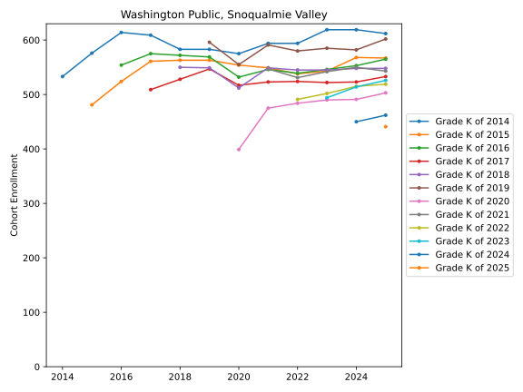
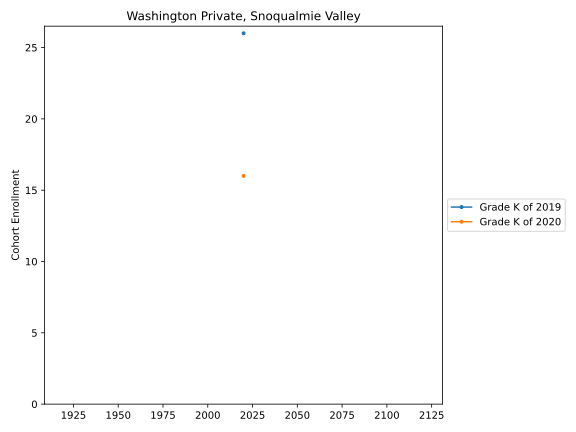
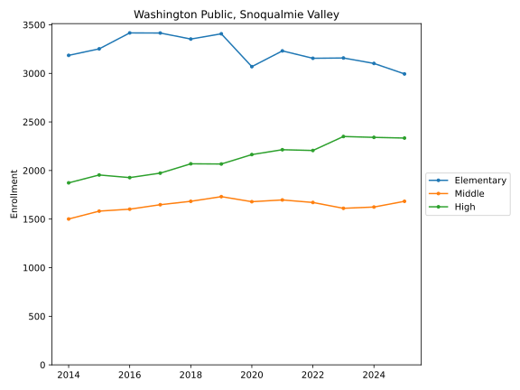
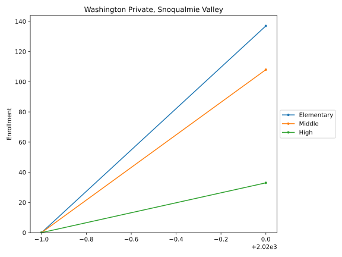
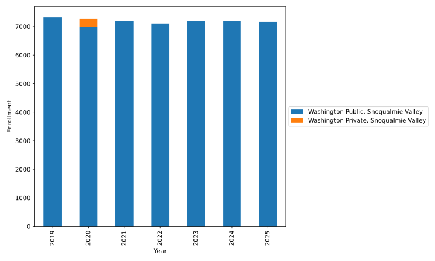
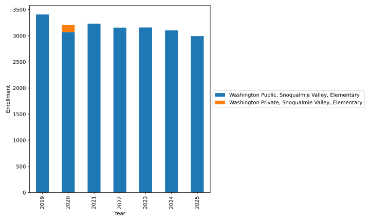
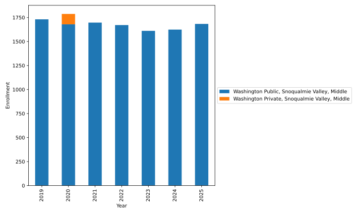
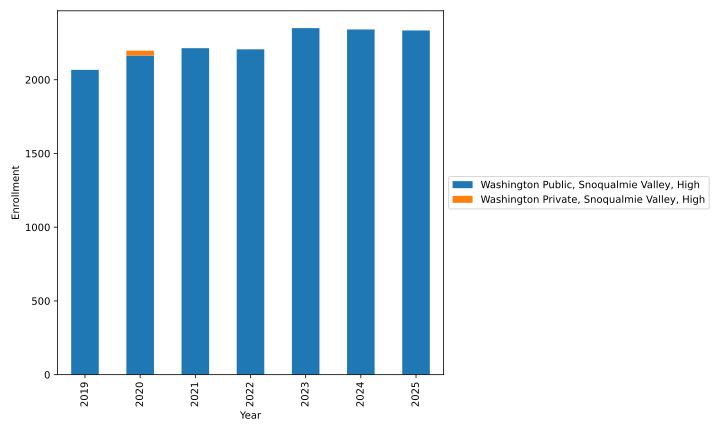

# Public Schools 

 - [Cascade View Elementary School](Washington_Public/Snoqualmie_Valley/school_cohorts/Cascade_View_Elementary_School.cohorts.svg)
 - [Chief Kanim Middle School](Washington_Public/Snoqualmie_Valley/school_cohorts/Chief_Kanim_Middle_School.cohorts.svg)
 - [Early Learning Center](Washington_Public/Snoqualmie_Valley/school_cohorts/Early_Learning_Center.cohorts.svg)
 - [Edwin R Opstad Elementary](Washington_Public/Snoqualmie_Valley/school_cohorts/Edwin_R_Opstad_Elementary.cohorts.svg)
 - [Fall City Elementary](Washington_Public/Snoqualmie_Valley/school_cohorts/Fall_City_Elementary.cohorts.svg)
 - [Meadowbrook School](Washington_Public/Snoqualmie_Valley/school_cohorts/Meadowbrook_School.cohorts.svg)
 - [Mount Si High School](Washington_Public/Snoqualmie_Valley/school_cohorts/Mount_Si_High_School.cohorts.svg)
 - [North Bend Elementary School](Washington_Public/Snoqualmie_Valley/school_cohorts/North_Bend_Elementary_School.cohorts.svg)
 - [SNOQUALMIE VALLEY SCHOOL DISTRICT OPEN DOORS](Washington_Public/Snoqualmie_Valley/school_cohorts/SNOQUALMIE_VALLEY_SCHOOL_DISTRICT_OPEN_DOORS.cohorts.svg)
 - [Snoqualmie Access](Washington_Public/Snoqualmie_Valley/school_cohorts/Snoqualmie_Access.cohorts.svg)
 - [Snoqualmie Elementary](Washington_Public/Snoqualmie_Valley/school_cohorts/Snoqualmie_Elementary.cohorts.svg)
 - [Snoqualmie Middle School](Washington_Public/Snoqualmie_Valley/school_cohorts/Snoqualmie_Middle_School.cohorts.svg)
 - [Snoqualmie Parent Partnership Program](Washington_Public/Snoqualmie_Valley/school_cohorts/Snoqualmie_Parent_Partnership_Program.cohorts.svg)
 - [Timber Ridge Elementary School](Washington_Public/Snoqualmie_Valley/school_cohorts/Timber_Ridge_Elementary_School.cohorts.svg)
 - [Twin Falls Middle School](Washington_Public/Snoqualmie_Valley/school_cohorts/Twin_Falls_Middle_School.cohorts.svg)
 - [Two Rivers School](Washington_Public/Snoqualmie_Valley/school_cohorts/Two_Rivers_School.cohorts.svg)

# Private Schools 

 - [Summit Classical Christian School](Washington_Private/Snoqualmie_Valley/school_cohorts/Summit_Classical_Christian_School.cohorts.svg)
