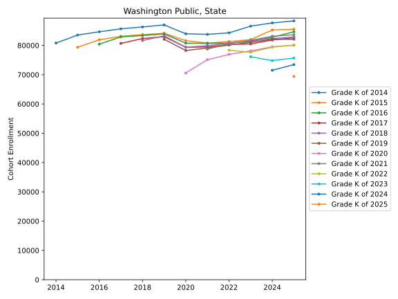
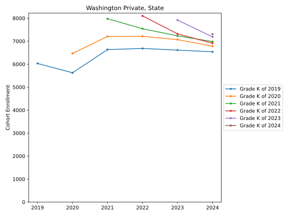
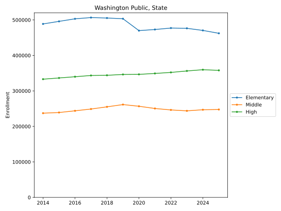
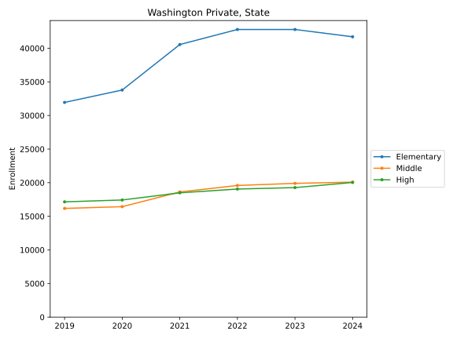
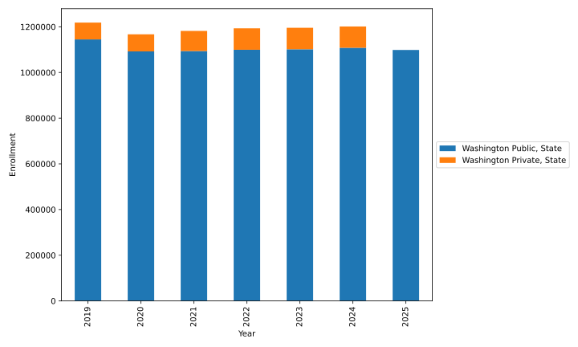
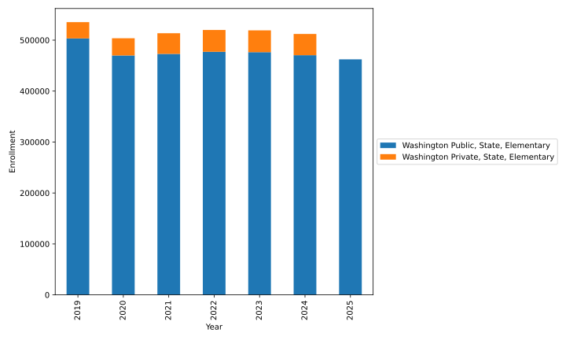
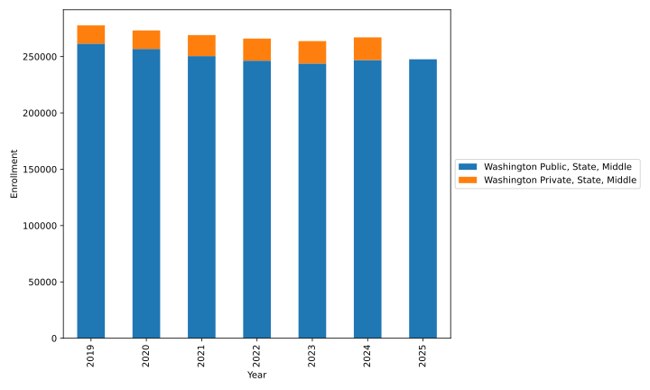
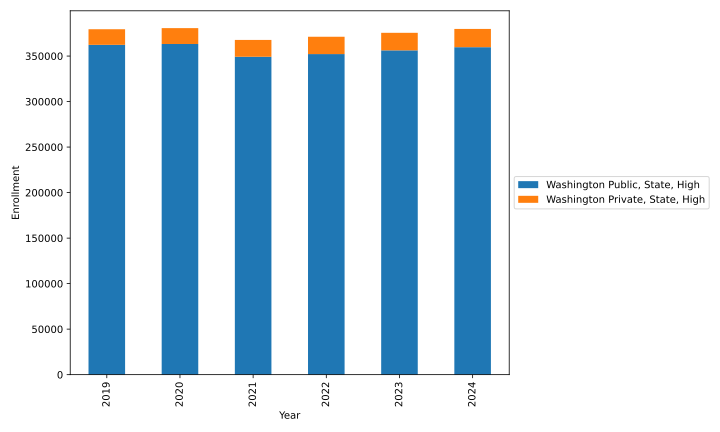

# Public Schools 

 - [10th Street School](Washington_Public/State/school_cohorts/10th_Street_School.cohorts.svg)
 - [A G West Black Hills High School](Washington_Public/State/school_cohorts/A_G_West_Black_Hills_High_School.cohorts.svg)
 - [A J West Elementary](Washington_Public/State/school_cohorts/A_J_West_Elementary.cohorts.svg)
 - [A-3 Multiagency Adolescent Prog](Washington_Public/State/school_cohorts/A_3_Multiagency_Adolescent_Prog.cohorts.svg)
 - [ACES High School](Washington_Public/State/school_cohorts/ACES_High_School.cohorts.svg)
 - [AIM High School](Washington_Public/State/school_cohorts/AIM_High_School.cohorts.svg)
 - [Abraham Lincoln Elementary](Washington_Public/State/school_cohorts/Abraham_Lincoln_Elementary.cohorts.svg)
 - [Academy for Community Transition](Washington_Public/State/school_cohorts/Academy_for_Community_Transition.cohorts.svg)
 - [Academy of Citizenship and Empowerment (Closed after 2016-2017 school year)](Washington_Public/State/school_cohorts/Academy_of_Citizenship_and_Empowerment_(Closed_after_2016_2017_school_year).cohorts.svg)
 - [Academy of Const and Engineering (Closed after 2016-2017 school year)](Washington_Public/State/school_cohorts/Academy_of_Const_and_Engineering_(Closed_after_2016_2017_school_year).cohorts.svg)
 - [Acceleration Academy](Washington_Public/State/school_cohorts/Acceleration_Academy.cohorts.svg)
 - [Acme Elementary](Washington_Public/State/school_cohorts/Acme_Elementary.cohorts.svg)
 - [Adams Elementary](Washington_Public/State/school_cohorts/Adams_Elementary.cohorts.svg)
 - [Adams Elementary School](Washington_Public/State/school_cohorts/Adams_Elementary_School.cohorts.svg)
 - [Adelaide Elementary School](Washington_Public/State/school_cohorts/Adelaide_Elementary_School.cohorts.svg)
 - [Adna Elementary School](Washington_Public/State/school_cohorts/Adna_Elementary_School.cohorts.svg)
 - [Adna Middle/High School](Washington_Public/State/school_cohorts/Adna_Middle_High_School.cohorts.svg)
 - [Ahtanum Valley Elementary](Washington_Public/State/school_cohorts/Ahtanum_Valley_Elementary.cohorts.svg)
 - [Aki Kurose Middle School](Washington_Public/State/school_cohorts/Aki_Kurose_Middle_School.cohorts.svg)
 - [Alan T. Sugiyama High School](Washington_Public/State/school_cohorts/Alan_T._Sugiyama_High_School.cohorts.svg)
 - [Albert Einstein Elementary](Washington_Public/State/school_cohorts/Albert_Einstein_Elementary.cohorts.svg)
 - [Albert Einstein Middle School](Washington_Public/State/school_cohorts/Albert_Einstein_Middle_School.cohorts.svg)
 - [Alderwood Elementary School](Washington_Public/State/school_cohorts/Alderwood_Elementary_School.cohorts.svg)
 - [Alderwood Middle School](Washington_Public/State/school_cohorts/Alderwood_Middle_School.cohorts.svg)
 - [Alexander Graham Bell Elementary](Washington_Public/State/school_cohorts/Alexander_Graham_Bell_Elementary.cohorts.svg)
 - [Alfaretta House](Washington_Public/State/school_cohorts/Alfaretta_House.cohorts.svg)
 - [Alki Elementary School](Washington_Public/State/school_cohorts/Alki_Elementary_School.cohorts.svg)
 - [Alki Middle School](Washington_Public/State/school_cohorts/Alki_Middle_School.cohorts.svg)
 - [Allen Creek Elementary School](Washington_Public/State/school_cohorts/Allen_Creek_Elementary_School.cohorts.svg)
 - [Allen Elementary](Washington_Public/State/school_cohorts/Allen_Elementary.cohorts.svg)
 - [Almira Coulee Hartline High School](Washington_Public/State/school_cohorts/Almira_Coulee_Hartline_High_School.cohorts.svg)
 - [Almira Elementary School](Washington_Public/State/school_cohorts/Almira_Elementary_School.cohorts.svg)
 - [Alpac Elementary School](Washington_Public/State/school_cohorts/Alpac_Elementary_School.cohorts.svg)
 - [Alpine Lakes Elementary](Washington_Public/State/school_cohorts/Alpine_Lakes_Elementary.cohorts.svg)
 - [Alternative Education Program (Closed after 2018-2019 school year)](Washington_Public/State/school_cohorts/Alternative_Education_Program_(Closed_after_2018_2019_school_year).cohorts.svg)
 - [Alternative Educational Experience](Washington_Public/State/school_cohorts/Alternative_Educational_Experience.cohorts.svg)
 - [Alternative High School (Closed after 2016-2017 school year)](Washington_Public/State/school_cohorts/Alternative_High_School_(Closed_after_2016_2017_school_year).cohorts.svg)
 - [Alternative Northeast Community Center Preschool](Washington_Public/State/school_cohorts/Alternative_Northeast_Community_Center_Preschool.cohorts.svg)
 - [Alternative Tamarack School](Washington_Public/State/school_cohorts/Alternative_Tamarack_School.cohorts.svg)
 - [Amboy Middle School](Washington_Public/State/school_cohorts/Amboy_Middle_School.cohorts.svg)
 - [Amistad Elementary School](Washington_Public/State/school_cohorts/Amistad_Elementary_School.cohorts.svg)
 - [Amon Creek Elementary](Washington_Public/State/school_cohorts/Amon_Creek_Elementary.cohorts.svg)
 - [Anacortes High School](Washington_Public/State/school_cohorts/Anacortes_High_School.cohorts.svg)
 - [Anacortes Middle School](Washington_Public/State/school_cohorts/Anacortes_Middle_School.cohorts.svg)
 - [Ancient Lakes Elementary](Washington_Public/State/school_cohorts/Ancient_Lakes_Elementary.cohorts.svg)
 - [Anderson Island Elementary](Washington_Public/State/school_cohorts/Anderson_Island_Elementary.cohorts.svg)
 - [Angelo Giaudrone Middle School](Washington_Public/State/school_cohorts/Angelo_Giaudrone_Middle_School.cohorts.svg)
 - [Apollo Elementary](Washington_Public/State/school_cohorts/Apollo_Elementary.cohorts.svg)
 - [Apple Valley Elementary](Washington_Public/State/school_cohorts/Apple_Valley_Elementary.cohorts.svg)
 - [Arbor Heights Elementary School](Washington_Public/State/school_cohorts/Arbor_Heights_Elementary_School.cohorts.svg)
 - [Arcadia Elementary](Washington_Public/State/school_cohorts/Arcadia_Elementary.cohorts.svg)
 - [Ardmore Elementary School](Washington_Public/State/school_cohorts/Ardmore_Elementary_School.cohorts.svg)
 - [Arlington Elementary](Washington_Public/State/school_cohorts/Arlington_Elementary.cohorts.svg)
 - [Arlington Elementary School](Washington_Public/State/school_cohorts/Arlington_Elementary_School.cohorts.svg)
 - [Arlington High School](Washington_Public/State/school_cohorts/Arlington_High_School.cohorts.svg)
 - [Arlington Open Doors](Washington_Public/State/school_cohorts/Arlington_Open_Doors.cohorts.svg)
 - [Arlington Special Educ School](Washington_Public/State/school_cohorts/Arlington_Special_Educ_School.cohorts.svg)
 - [Armin Jahr Elementary](Washington_Public/State/school_cohorts/Armin_Jahr_Elementary.cohorts.svg)
 - [Arrowhead Elementary](Washington_Public/State/school_cohorts/Arrowhead_Elementary.cohorts.svg)
 - [Arthur Jacobsen Elementary](Washington_Public/State/school_cohorts/Arthur_Jacobsen_Elementary.cohorts.svg)
 - [Artondale Elementary School](Washington_Public/State/school_cohorts/Artondale_Elementary_School.cohorts.svg)
 - [Arts & Academics Academy (Closed after 2016-2017 school year)](Washington_Public/State/school_cohorts/Arts_&_Academics_Academy_(Closed_after_2016_2017_school_year).cohorts.svg)
 - [Artz Fox Elementary](Washington_Public/State/school_cohorts/Artz_Fox_Elementary.cohorts.svg)
 - [Ashe Preparatory Academy (Closed after 2019-2020 school year)](Washington_Public/State/school_cohorts/Ashe_Preparatory_Academy_(Closed_after_2019_2020_school_year).cohorts.svg)
 - [Asotin Elementary](Washington_Public/State/school_cohorts/Asotin_Elementary.cohorts.svg)
 - [Asotin Jr Sr High](Washington_Public/State/school_cohorts/Asotin_Jr_Sr_High.cohorts.svg)
 - [Aspire Academy](Washington_Public/State/school_cohorts/Aspire_Academy.cohorts.svg)
 - [Aspire Middle School](Washington_Public/State/school_cohorts/Aspire_Middle_School.cohorts.svg)
 - [Aspire Performing Arts Academy](Washington_Public/State/school_cohorts/Aspire_Performing_Arts_Academy.cohorts.svg)
 - [Astravo Online Academy](Washington_Public/State/school_cohorts/Astravo_Online_Academy.cohorts.svg)
 - [Auburn Mountainview High School](Washington_Public/State/school_cohorts/Auburn_Mountainview_High_School.cohorts.svg)
 - [Auburn Online](Washington_Public/State/school_cohorts/Auburn_Online.cohorts.svg)
 - [Auburn Opportunity Project](Washington_Public/State/school_cohorts/Auburn_Opportunity_Project.cohorts.svg)
 - [Auburn Riverside High School](Washington_Public/State/school_cohorts/Auburn_Riverside_High_School.cohorts.svg)
 - [Auburn Senior High School](Washington_Public/State/school_cohorts/Auburn_Senior_High_School.cohorts.svg)
 - [Audubon Elementary](Washington_Public/State/school_cohorts/Audubon_Elementary.cohorts.svg)
 - [Avanti High School](Washington_Public/State/school_cohorts/Avanti_High_School.cohorts.svg)
 - [Aylen Jr High](Washington_Public/State/school_cohorts/Aylen_Jr_High.cohorts.svg)
 - [B F Day Elementary School](Washington_Public/State/school_cohorts/B_F_Day_Elementary_School.cohorts.svg)
 - [BECC](Washington_Public/State/school_cohorts/BECC.cohorts.svg)
 - [BETHEL HOPE EARLY LEARNING CENTER](Washington_Public/State/school_cohorts/BETHEL_HOPE_EARLY_LEARNING_CENTER.cohorts.svg)
 - [BOISTFORT ONLINE SCHOOL](Washington_Public/State/school_cohorts/BOISTFORT_ONLINE_SCHOOL.cohorts.svg)
 - [Badger Mountain Elementary](Washington_Public/State/school_cohorts/Badger_Mountain_Elementary.cohorts.svg)
 - [Bailey Gatzert Elementary School](Washington_Public/State/school_cohorts/Bailey_Gatzert_Elementary_School.cohorts.svg)
 - [Bainbridge High School](Washington_Public/State/school_cohorts/Bainbridge_High_School.cohorts.svg)
 - [Bainbridge Special Education Services](Washington_Public/State/school_cohorts/Bainbridge_Special_Education_Services.cohorts.svg)
 - [Baker Middle School](Washington_Public/State/school_cohorts/Baker_Middle_School.cohorts.svg)
 - [Balboa Elementary](Washington_Public/State/school_cohorts/Balboa_Elementary.cohorts.svg)
 - [Ballard High School](Washington_Public/State/school_cohorts/Ballard_High_School.cohorts.svg)
 - [Ballou Jr High](Washington_Public/State/school_cohorts/Ballou_Jr_High.cohorts.svg)
 - [Barbara McClintock STEM Elementary](Washington_Public/State/school_cohorts/Barbara_McClintock_STEM_Elementary.cohorts.svg)
 - [Barge-Lincoln Elementary School](Washington_Public/State/school_cohorts/Barge_Lincoln_Elementary_School.cohorts.svg)
 - [Barker Creek Community School](Washington_Public/State/school_cohorts/Barker_Creek_Community_School.cohorts.svg)
 - [Barnes Elementary](Washington_Public/State/school_cohorts/Barnes_Elementary.cohorts.svg)
 - [Basin City Elem](Washington_Public/State/school_cohorts/Basin_City_Elem.cohorts.svg)
 - [Bates Technical High School](Washington_Public/State/school_cohorts/Bates_Technical_High_School.cohorts.svg)
 - [Battle Ground High School](Washington_Public/State/school_cohorts/Battle_Ground_High_School.cohorts.svg)
 - [Battle Ground Virtual Academy](Washington_Public/State/school_cohorts/Battle_Ground_Virtual_Academy.cohorts.svg)
 - [Bay View Elementary](Washington_Public/State/school_cohorts/Bay_View_Elementary.cohorts.svg)
 - [Beach Elem](Washington_Public/State/school_cohorts/Beach_Elem.cohorts.svg)
 - [Beachwood Elementary School](Washington_Public/State/school_cohorts/Beachwood_Elementary_School.cohorts.svg)
 - [Beacon Avenue Elementary School](Washington_Public/State/school_cohorts/Beacon_Avenue_Elementary_School.cohorts.svg)
 - [Beacon Hill Elementary](Washington_Public/State/school_cohorts/Beacon_Hill_Elementary.cohorts.svg)
 - [Beacon Hill International School](Washington_Public/State/school_cohorts/Beacon_Hill_International_School.cohorts.svg)
 - [Bear Creek Elementary](Washington_Public/State/school_cohorts/Bear_Creek_Elementary.cohorts.svg)
 - [Beaver Lake Middle School](Washington_Public/State/school_cohorts/Beaver_Lake_Middle_School.cohorts.svg)
 - [Beaver Valley School](Washington_Public/State/school_cohorts/Beaver_Valley_School.cohorts.svg)
 - [Beezley Springs Elementary](Washington_Public/State/school_cohorts/Beezley_Springs_Elementary.cohorts.svg)
 - [Belfair Elementary](Washington_Public/State/school_cohorts/Belfair_Elementary.cohorts.svg)
 - [Bellevue Big Picture School](Washington_Public/State/school_cohorts/Bellevue_Big_Picture_School.cohorts.svg)
 - [Bellevue Digital Discovery](Washington_Public/State/school_cohorts/Bellevue_Digital_Discovery.cohorts.svg)
 - [Bellevue High School](Washington_Public/State/school_cohorts/Bellevue_High_School.cohorts.svg)
 - [Bellevue Open Doors Reengagement](Washington_Public/State/school_cohorts/Bellevue_Open_Doors_Reengagement.cohorts.svg)
 - [Bellingham Family Partnership Program](Washington_Public/State/school_cohorts/Bellingham_Family_Partnership_Program.cohorts.svg)
 - [Bellingham High School](Washington_Public/State/school_cohorts/Bellingham_High_School.cohorts.svg)
 - [Bellingham Re-Engagement Program](Washington_Public/State/school_cohorts/Bellingham_Re_Engagement_Program.cohorts.svg)
 - [Bemiss Elementary](Washington_Public/State/school_cohorts/Bemiss_Elementary.cohorts.svg)
 - [Benge Elementary](Washington_Public/State/school_cohorts/Benge_Elementary.cohorts.svg)
 - [Benjamin Franklin Elementary](Washington_Public/State/school_cohorts/Benjamin_Franklin_Elementary.cohorts.svg)
 - [Benjamin Rush Elementary](Washington_Public/State/school_cohorts/Benjamin_Rush_Elementary.cohorts.svg)
 - [Bennett Elementary School](Washington_Public/State/school_cohorts/Bennett_Elementary_School.cohorts.svg)
 - [Benson Hill Elementary School](Washington_Public/State/school_cohorts/Benson_Hill_Elementary_School.cohorts.svg)
 - [Benton County Jail](Washington_Public/State/school_cohorts/Benton_County_Jail.cohorts.svg)
 - [Benton/Franklin Juvenile Justice Center](Washington_Public/State/school_cohorts/Benton_Franklin_Juvenile_Justice_Center.cohorts.svg)
 - [Berney Elementary School](Washington_Public/State/school_cohorts/Berney_Elementary_School.cohorts.svg)
 - [Bess Herian Elementary](Washington_Public/State/school_cohorts/Bess_Herian_Elementary.cohorts.svg)
 - [Bethel Elementary Learning Academy](Washington_Public/State/school_cohorts/Bethel_Elementary_Learning_Academy.cohorts.svg)
 - [Bethel High School](Washington_Public/State/school_cohorts/Bethel_High_School.cohorts.svg)
 - [Bethel Middle School](Washington_Public/State/school_cohorts/Bethel_Middle_School.cohorts.svg)
 - [Bethel Virtual Academy](Washington_Public/State/school_cohorts/Bethel_Virtual_Academy.cohorts.svg)
 - [Betz Elementary](Washington_Public/State/school_cohorts/Betz_Elementary.cohorts.svg)
 - [Beverly Elementary](Washington_Public/State/school_cohorts/Beverly_Elementary.cohorts.svg)
 - [Beverly Park Elem at Glendale](Washington_Public/State/school_cohorts/Beverly_Park_Elem_at_Glendale.cohorts.svg)
 - [Bickleton Elementary & High Schl](Washington_Public/State/school_cohorts/Bickleton_Elementary_&_High_Schl.cohorts.svg)
 - [Big Lake Elementary School](Washington_Public/State/school_cohorts/Big_Lake_Elementary_School.cohorts.svg)
 - [Big Picture School](Washington_Public/State/school_cohorts/Big_Picture_School.cohorts.svg)
 - [Bio Med Academy (Closed after 2016-2017 school year)](Washington_Public/State/school_cohorts/Bio_Med_Academy_(Closed_after_2016_2017_school_year).cohorts.svg)
 - [Birchwood Elementary School](Washington_Public/State/school_cohorts/Birchwood_Elementary_School.cohorts.svg)
 - [Birney Elementary School](Washington_Public/State/school_cohorts/Birney_Elementary_School.cohorts.svg)
 - [Birth To Three](Washington_Public/State/school_cohorts/Birth_To_Three.cohorts.svg)
 - [Birth to 3 Contracts](Washington_Public/State/school_cohorts/Birth_to_3_Contracts.cohorts.svg)
 - [Birth to Age 2](Washington_Public/State/school_cohorts/Birth_to_Age_2.cohorts.svg)
 - [Birth to Three](Washington_Public/State/school_cohorts/Birth_to_Three.cohorts.svg)
 - [Birth to Three (Closed after 2016-2017 school year)](Washington_Public/State/school_cohorts/Birth_to_Three_(Closed_after_2016_2017_school_year).cohorts.svg)
 - [Birth to Three Development Center](Washington_Public/State/school_cohorts/Birth_to_Three_Development_Center.cohorts.svg)
 - [Black Diamond Elementary](Washington_Public/State/school_cohorts/Black_Diamond_Elementary.cohorts.svg)
 - [Black Lake Elementary](Washington_Public/State/school_cohorts/Black_Lake_Elementary.cohorts.svg)
 - [Blaine Elementary School](Washington_Public/State/school_cohorts/Blaine_Elementary_School.cohorts.svg)
 - [Blaine High School](Washington_Public/State/school_cohorts/Blaine_High_School.cohorts.svg)
 - [Blaine Home Connection](Washington_Public/State/school_cohorts/Blaine_Home_Connection.cohorts.svg)
 - [Blaine Home Connections](Washington_Public/State/school_cohorts/Blaine_Home_Connections.cohorts.svg)
 - [Blaine HomeConnection](Washington_Public/State/school_cohorts/Blaine_HomeConnection.cohorts.svg)
 - [Blaine Middle School](Washington_Public/State/school_cohorts/Blaine_Middle_School.cohorts.svg)
 - [Blaine Primary School](Washington_Public/State/school_cohorts/Blaine_Primary_School.cohorts.svg)
 - [Blaine Primary School (Closed after 2024-2025 school year)](Washington_Public/State/school_cohorts/Blaine_Primary_School_(Closed_after_2024_2025_school_year).cohorts.svg)
 - [Blaine Re-Engagement](Washington_Public/State/school_cohorts/Blaine_Re_Engagement.cohorts.svg)
 - [Blix Elementary School](Washington_Public/State/school_cohorts/Blix_Elementary_School.cohorts.svg)
 - [Blue Heron Middle School](Washington_Public/State/school_cohorts/Blue_Heron_Middle_School.cohorts.svg)
 - [Blue Ridge Elementary](Washington_Public/State/school_cohorts/Blue_Ridge_Elementary.cohorts.svg)
 - [Boistfort Elem](Washington_Public/State/school_cohorts/Boistfort_Elem.cohorts.svg)
 - [Bonney Lake Elementary](Washington_Public/State/school_cohorts/Bonney_Lake_Elementary.cohorts.svg)
 - [Bonney Lake High School](Washington_Public/State/school_cohorts/Bonney_Lake_High_School.cohorts.svg)
 - [Bordeaux Elementary School](Washington_Public/State/school_cohorts/Bordeaux_Elementary_School.cohorts.svg)
 - [Boston Harbor Elementary](Washington_Public/State/school_cohorts/Boston_Harbor_Elementary.cohorts.svg)
 - [Bothell High School](Washington_Public/State/school_cohorts/Bothell_High_School.cohorts.svg)
 - [Bow Lake Elementary](Washington_Public/State/school_cohorts/Bow_Lake_Elementary.cohorts.svg)
 - [Bowdish Middle School](Washington_Public/State/school_cohorts/Bowdish_Middle_School.cohorts.svg)
 - [Bowman Creek Elementary](Washington_Public/State/school_cohorts/Bowman_Creek_Elementary.cohorts.svg)
 - [Boze Elementary School](Washington_Public/State/school_cohorts/Boze_Elementary_School.cohorts.svg)
 - [Bremerton High School](Washington_Public/State/school_cohorts/Bremerton_High_School.cohorts.svg)
 - [Bremerton Homelink Program](Washington_Public/State/school_cohorts/Bremerton_Homelink_Program.cohorts.svg)
 - [Brentwood Elementary School](Washington_Public/State/school_cohorts/Brentwood_Elementary_School.cohorts.svg)
 - [Brewster Alternative School](Washington_Public/State/school_cohorts/Brewster_Alternative_School.cohorts.svg)
 - [Brewster Elementary School](Washington_Public/State/school_cohorts/Brewster_Elementary_School.cohorts.svg)
 - [Brewster High School](Washington_Public/State/school_cohorts/Brewster_High_School.cohorts.svg)
 - [Brewster Middle School](Washington_Public/State/school_cohorts/Brewster_Middle_School.cohorts.svg)
 - [Briarcrest Elementary](Washington_Public/State/school_cohorts/Briarcrest_Elementary.cohorts.svg)
 - [Briarwood Elementary](Washington_Public/State/school_cohorts/Briarwood_Elementary.cohorts.svg)
 - [Bridgeport Aurora High School](Washington_Public/State/school_cohorts/Bridgeport_Aurora_High_School.cohorts.svg)
 - [Bridgeport Elementary](Washington_Public/State/school_cohorts/Bridgeport_Elementary.cohorts.svg)
 - [Bridgeport High School](Washington_Public/State/school_cohorts/Bridgeport_High_School.cohorts.svg)
 - [Bridgeport Middle School](Washington_Public/State/school_cohorts/Bridgeport_Middle_School.cohorts.svg)
 - [Bridges Transition](Washington_Public/State/school_cohorts/Bridges_Transition.cohorts.svg)
 - [Brier Elementary](Washington_Public/State/school_cohorts/Brier_Elementary.cohorts.svg)
 - [Brier Terrace Middle School](Washington_Public/State/school_cohorts/Brier_Terrace_Middle_School.cohorts.svg)
 - [Brigadoon Elementary School](Washington_Public/State/school_cohorts/Brigadoon_Elementary_School.cohorts.svg)
 - [Brinnon Elementary](Washington_Public/State/school_cohorts/Brinnon_Elementary.cohorts.svg)
 - [Broad View Elementary](Washington_Public/State/school_cohorts/Broad_View_Elementary.cohorts.svg)
 - [Broadview-Thomson K-8 School](Washington_Public/State/school_cohorts/Broadview_Thomson_K_8_School.cohorts.svg)
 - [Broadway Elementary](Washington_Public/State/school_cohorts/Broadway_Elementary.cohorts.svg)
 - [Broadway Learning Center](Washington_Public/State/school_cohorts/Broadway_Learning_Center.cohorts.svg)
 - [Brookdale Elementary](Washington_Public/State/school_cohorts/Brookdale_Elementary.cohorts.svg)
 - [Brookside Elementary](Washington_Public/State/school_cohorts/Brookside_Elementary.cohorts.svg)
 - [Browne Elementary](Washington_Public/State/school_cohorts/Browne_Elementary.cohorts.svg)
 - [Browns Point Elementary School](Washington_Public/State/school_cohorts/Browns_Point_Elementary_School.cohorts.svg)
 - [Brownsville Elementary](Washington_Public/State/school_cohorts/Brownsville_Elementary.cohorts.svg)
 - [Bryant Center](Washington_Public/State/school_cohorts/Bryant_Center.cohorts.svg)
 - [Bryant Elementary School](Washington_Public/State/school_cohorts/Bryant_Elementary_School.cohorts.svg)
 - [Bryant Montessori Middle School](Washington_Public/State/school_cohorts/Bryant_Montessori_Middle_School.cohorts.svg)
 - [Bryant Montessori School](Washington_Public/State/school_cohorts/Bryant_Montessori_School.cohorts.svg)
 - [Bryn Mawr Elementary School](Washington_Public/State/school_cohorts/Bryn_Mawr_Elementary_School.cohorts.svg)
 - [Burley Glenwood Elementary](Washington_Public/State/school_cohorts/Burley_Glenwood_Elementary.cohorts.svg)
 - [Burley Glenwood Elementary School](Washington_Public/State/school_cohorts/Burley_Glenwood_Elementary_School.cohorts.svg)
 - [Burlington Edison High School](Washington_Public/State/school_cohorts/Burlington_Edison_High_School.cohorts.svg)
 - [Burlington-Edison Alternative School](Washington_Public/State/school_cohorts/Burlington_Edison_Alternative_School.cohorts.svg)
 - [Burnt Bridge Creek Elementary Sch](Washington_Public/State/school_cohorts/Burnt_Bridge_Creek_Elementary_Sch.cohorts.svg)
 - [Burton Elementary School](Washington_Public/State/school_cohorts/Burton_Elementary_School.cohorts.svg)
 - [Butler Acres Elementary](Washington_Public/State/school_cohorts/Butler_Acres_Elementary.cohorts.svg)
 - [Byron Kibler Elementary School](Washington_Public/State/school_cohorts/Byron_Kibler_Elementary_School.cohorts.svg)
 - [C O Sorenson](Washington_Public/State/school_cohorts/C_O_Sorenson.cohorts.svg)
 - [CAM Academy](Washington_Public/State/school_cohorts/CAM_Academy.cohorts.svg)
 - [CASHMERE HIGH SCHOOL](Washington_Public/State/school_cohorts/CASHMERE_HIGH_SCHOOL.cohorts.svg)
 - [CASHMERE MIDDLE SCHOOL](Washington_Public/State/school_cohorts/CASHMERE_MIDDLE_SCHOOL.cohorts.svg)
 - [CHOICE Academy](Washington_Public/State/school_cohorts/CHOICE_Academy.cohorts.svg)
 - [CHOICE School](Washington_Public/State/school_cohorts/CHOICE_School.cohorts.svg)
 - [CK Online Academy (Closed after 2015-2016 school year)](Washington_Public/State/school_cohorts/CK_Online_Academy_(Closed_after_2015_2016_school_year).cohorts.svg)
 - [CLIP](Washington_Public/State/school_cohorts/CLIP.cohorts.svg)
 - [CPSD Open Doors Program](Washington_Public/State/school_cohorts/CPSD_Open_Doors_Program.cohorts.svg)
 - [CRCC-Open Doors](Washington_Public/State/school_cohorts/CRCC_Open_Doors.cohorts.svg)
 - [CVA - Onalaska (Closed after 2017-2018 school year)](Washington_Public/State/school_cohorts/CVA___Onalaska_(Closed_after_2017_2018_school_year).cohorts.svg)
 - [CVA-Lopez Island (Closed after 2018-2019 school year)](Washington_Public/State/school_cohorts/CVA_Lopez_Island_(Closed_after_2018_2019_school_year).cohorts.svg)
 - [CVSD Open Doors Programs](Washington_Public/State/school_cohorts/CVSD_Open_Doors_Programs.cohorts.svg)
 - [Camas Connect Academy](Washington_Public/State/school_cohorts/Camas_Connect_Academy.cohorts.svg)
 - [Camas Elementary](Washington_Public/State/school_cohorts/Camas_Elementary.cohorts.svg)
 - [Camas Elementary (Closed after 2017-2018 school year)](Washington_Public/State/school_cohorts/Camas_Elementary_(Closed_after_2017_2018_school_year).cohorts.svg)
 - [Camas High School](Washington_Public/State/school_cohorts/Camas_High_School.cohorts.svg)
 - [Camas Prairie Elementary](Washington_Public/State/school_cohorts/Camas_Prairie_Elementary.cohorts.svg)
 - [Camas School District Open Doors](Washington_Public/State/school_cohorts/Camas_School_District_Open_Doors.cohorts.svg)
 - [Camelot Elementary School](Washington_Public/State/school_cohorts/Camelot_Elementary_School.cohorts.svg)
 - [Camp Outlook (Closed after 2014-2015 school year)](Washington_Public/State/school_cohorts/Camp_Outlook_(Closed_after_2014_2015_school_year).cohorts.svg)
 - [Campbell Hill Elementary School](Washington_Public/State/school_cohorts/Campbell_Hill_Elementary_School.cohorts.svg)
 - [Canyon Creek Elementary](Washington_Public/State/school_cohorts/Canyon_Creek_Elementary.cohorts.svg)
 - [Canyon Creek Middle School](Washington_Public/State/school_cohorts/Canyon_Creek_Middle_School.cohorts.svg)
 - [Canyon Park Middle School](Washington_Public/State/school_cohorts/Canyon_Park_Middle_School.cohorts.svg)
 - [Canyon Ridge Middle School](Washington_Public/State/school_cohorts/Canyon_Ridge_Middle_School.cohorts.svg)
 - [Canyon View Elementary School](Washington_Public/State/school_cohorts/Canyon_View_Elementary_School.cohorts.svg)
 - [Canyon View Group Home](Washington_Public/State/school_cohorts/Canyon_View_Group_Home.cohorts.svg)
 - [Cap Sante High School](Washington_Public/State/school_cohorts/Cap_Sante_High_School.cohorts.svg)
 - [Cape Flattery Preschool](Washington_Public/State/school_cohorts/Cape_Flattery_Preschool.cohorts.svg)
 - [Cape Horn Skye Elementary](Washington_Public/State/school_cohorts/Cape_Horn_Skye_Elementary.cohorts.svg)
 - [Capital High School](Washington_Public/State/school_cohorts/Capital_High_School.cohorts.svg)
 - [Capt Johnston Blakely Elem Sch](Washington_Public/State/school_cohorts/Capt_Johnston_Blakely_Elem_Sch.cohorts.svg)
 - [Capt. Charles Wilkes Elem School](Washington_Public/State/school_cohorts/Capt._Charles_Wilkes_Elem_School.cohorts.svg)
 - [Captain Gray Early Learning Center (Closed after 2014-2015 school year)](Washington_Public/State/school_cohorts/Captain_Gray_Early_Learning_Center_(Closed_after_2014_2015_school_year).cohorts.svg)
 - [Captain Gray STEM Elementary](Washington_Public/State/school_cohorts/Captain_Gray_STEM_Elementary.cohorts.svg)
 - [Captain Strong](Washington_Public/State/school_cohorts/Captain_Strong.cohorts.svg)
 - [Carbonado Historical School 19](Washington_Public/State/school_cohorts/Carbonado_Historical_School_19.cohorts.svg)
 - [Career & Academic Re-engagement Center](Washington_Public/State/school_cohorts/Career_&_Academic_Re_engagement_Center.cohorts.svg)
 - [Career Academy at Truman High School](Washington_Public/State/school_cohorts/Career_Academy_at_Truman_High_School.cohorts.svg)
 - [Career Education Options Reengagement Program](Washington_Public/State/school_cohorts/Career_Education_Options_Reengagement_Program.cohorts.svg)
 - [Career Link](Washington_Public/State/school_cohorts/Career_Link.cohorts.svg)
 - [Carl Cozier Elementary School](Washington_Public/State/school_cohorts/Carl_Cozier_Elementary_School.cohorts.svg)
 - [Carl Sandburg Elementary](Washington_Public/State/school_cohorts/Carl_Sandburg_Elementary.cohorts.svg)
 - [Carla Peperzak Middle School](Washington_Public/State/school_cohorts/Carla_Peperzak_Middle_School.cohorts.svg)
 - [Carmichael Middle School](Washington_Public/State/school_cohorts/Carmichael_Middle_School.cohorts.svg)
 - [Carnation Elementary School](Washington_Public/State/school_cohorts/Carnation_Elementary_School.cohorts.svg)
 - [Carriage Crest Elementary School](Washington_Public/State/school_cohorts/Carriage_Crest_Elementary_School.cohorts.svg)
 - [Carrolls Elementary](Washington_Public/State/school_cohorts/Carrolls_Elementary.cohorts.svg)
 - [Carson Elementary](Washington_Public/State/school_cohorts/Carson_Elementary.cohorts.svg)
 - [Carson Elementary School](Washington_Public/State/school_cohorts/Carson_Elementary_School.cohorts.svg)
 - [Carter Lake Elementary School](Washington_Public/State/school_cohorts/Carter_Lake_Elementary_School.cohorts.svg)
 - [Cascade Elementary](Washington_Public/State/school_cohorts/Cascade_Elementary.cohorts.svg)
 - [Cascade Elementary School](Washington_Public/State/school_cohorts/Cascade_Elementary_School.cohorts.svg)
 - [Cascade Elementary School (Closed after 2017-2018 school year)](Washington_Public/State/school_cohorts/Cascade_Elementary_School_(Closed_after_2017_2018_school_year).cohorts.svg)
 - [Cascade High School](Washington_Public/State/school_cohorts/Cascade_High_School.cohorts.svg)
 - [Cascade Home-Link](Washington_Public/State/school_cohorts/Cascade_Home_Link.cohorts.svg)
 - [Cascade K-8 Community School](Washington_Public/State/school_cohorts/Cascade_K_8_Community_School.cohorts.svg)
 - [Cascade Middle School](Washington_Public/State/school_cohorts/Cascade_Middle_School.cohorts.svg)
 - [Cascade Parent Partnership Program](Washington_Public/State/school_cohorts/Cascade_Parent_Partnership_Program.cohorts.svg)
 - [Cascade Public Schools](Washington_Public/State/school_cohorts/Cascade_Public_Schools.cohorts.svg)
 - [Cascade Ridge Elementary](Washington_Public/State/school_cohorts/Cascade_Ridge_Elementary.cohorts.svg)
 - [Cascade View Elementary](Washington_Public/State/school_cohorts/Cascade_View_Elementary.cohorts.svg)
 - [Cascade View Elementary School](Washington_Public/State/school_cohorts/Cascade_View_Elementary_School.cohorts.svg)
 - [Cascadia Elementary](Washington_Public/State/school_cohorts/Cascadia_Elementary.cohorts.svg)
 - [Cascadia High School](Washington_Public/State/school_cohorts/Cascadia_High_School.cohorts.svg)
 - [Cascadia Technical Academy Skills Center](Washington_Public/State/school_cohorts/Cascadia_Technical_Academy_Skills_Center.cohorts.svg)
 - [Castle Rock Elementary](Washington_Public/State/school_cohorts/Castle_Rock_Elementary.cohorts.svg)
 - [Castle Rock High School](Washington_Public/State/school_cohorts/Castle_Rock_High_School.cohorts.svg)
 - [Castle Rock Middle School](Washington_Public/State/school_cohorts/Castle_Rock_Middle_School.cohorts.svg)
 - [Castle Rock Virtual Academy](Washington_Public/State/school_cohorts/Castle_Rock_Virtual_Academy.cohorts.svg)
 - [Catalyst Public Schools](Washington_Public/State/school_cohorts/Catalyst_Public_Schools.cohorts.svg)
 - [Catharine Blaine K-8 School](Washington_Public/State/school_cohorts/Catharine_Blaine_K_8_School.cohorts.svg)
 - [Cathcart Elementary](Washington_Public/State/school_cohorts/Cathcart_Elementary.cohorts.svg)
 - [Catlin Elementary](Washington_Public/State/school_cohorts/Catlin_Elementary.cohorts.svg)
 - [Cavelero Mid High School](Washington_Public/State/school_cohorts/Cavelero_Mid_High_School.cohorts.svg)
 - [Cedar Heights Middle School](Washington_Public/State/school_cohorts/Cedar_Heights_Middle_School.cohorts.svg)
 - [Cedar High School](Washington_Public/State/school_cohorts/Cedar_High_School.cohorts.svg)
 - [Cedar Park Elementary School](Washington_Public/State/school_cohorts/Cedar_Park_Elementary_School.cohorts.svg)
 - [Cedar River Elementary](Washington_Public/State/school_cohorts/Cedar_River_Elementary.cohorts.svg)
 - [Cedar Trails Elementary](Washington_Public/State/school_cohorts/Cedar_Trails_Elementary.cohorts.svg)
 - [Cedar Valley Community School](Washington_Public/State/school_cohorts/Cedar_Valley_Community_School.cohorts.svg)
 - [Cedar Valley Elementary](Washington_Public/State/school_cohorts/Cedar_Valley_Elementary.cohorts.svg)
 - [Cedar Valley Elementary School](Washington_Public/State/school_cohorts/Cedar_Valley_Elementary_School.cohorts.svg)
 - [Cedar Way Elementary](Washington_Public/State/school_cohorts/Cedar_Way_Elementary.cohorts.svg)
 - [Cedar Wood Elementary](Washington_Public/State/school_cohorts/Cedar_Wood_Elementary.cohorts.svg)
 - [Cedarcrest High School](Washington_Public/State/school_cohorts/Cedarcrest_High_School.cohorts.svg)
 - [Cedarcrest Middle School](Washington_Public/State/school_cohorts/Cedarcrest_Middle_School.cohorts.svg)
 - [Cedarcrest School](Washington_Public/State/school_cohorts/Cedarcrest_School.cohorts.svg)
 - [Cedarhome Elementary School](Washington_Public/State/school_cohorts/Cedarhome_Elementary_School.cohorts.svg)
 - [Cedarhurst Elementary](Washington_Public/State/school_cohorts/Cedarhurst_Elementary.cohorts.svg)
 - [Centennial Elementary](Washington_Public/State/school_cohorts/Centennial_Elementary.cohorts.svg)
 - [Centennial Elementary School](Washington_Public/State/school_cohorts/Centennial_Elementary_School.cohorts.svg)
 - [Centennial Middle School](Washington_Public/State/school_cohorts/Centennial_Middle_School.cohorts.svg)
 - [Centerville Elementary](Washington_Public/State/school_cohorts/Centerville_Elementary.cohorts.svg)
 - [Central Avenue Elementary](Washington_Public/State/school_cohorts/Central_Avenue_Elementary.cohorts.svg)
 - [Central Educational Services](Washington_Public/State/school_cohorts/Central_Educational_Services.cohorts.svg)
 - [Central Elementary](Washington_Public/State/school_cohorts/Central_Elementary.cohorts.svg)
 - [Central Elementary School](Washington_Public/State/school_cohorts/Central_Elementary_School.cohorts.svg)
 - [Central Emerson Elementary](Washington_Public/State/school_cohorts/Central_Emerson_Elementary.cohorts.svg)
 - [Central Kitsap High School](Washington_Public/State/school_cohorts/Central_Kitsap_High_School.cohorts.svg)
 - [Central Kitsap Middle School](Washington_Public/State/school_cohorts/Central_Kitsap_Middle_School.cohorts.svg)
 - [Central Park Elementary](Washington_Public/State/school_cohorts/Central_Park_Elementary.cohorts.svg)
 - [Central Primary Center](Washington_Public/State/school_cohorts/Central_Primary_Center.cohorts.svg)
 - [Central Valley Early Learning Center](Washington_Public/State/school_cohorts/Central_Valley_Early_Learning_Center.cohorts.svg)
 - [Central Valley High School](Washington_Public/State/school_cohorts/Central_Valley_High_School.cohorts.svg)
 - [Central Valley Virtual Integrated Parent Partnership](Washington_Public/State/school_cohorts/Central_Valley_Virtual_Integrated_Parent_Partnership.cohorts.svg)
 - [Central Valley Virtual Learning](Washington_Public/State/school_cohorts/Central_Valley_Virtual_Learning.cohorts.svg)
 - [Central Valley Virtual Learning High School](Washington_Public/State/school_cohorts/Central_Valley_Virtual_Learning_High_School.cohorts.svg)
 - [Centralia High School](Washington_Public/State/school_cohorts/Centralia_High_School.cohorts.svg)
 - [Centralia Middle School](Washington_Public/State/school_cohorts/Centralia_Middle_School.cohorts.svg)
 - [Centralia School District SpEd Pre-school](Washington_Public/State/school_cohorts/Centralia_School_District_SpEd_Pre_school.cohorts.svg)
 - [Chain Lake Elementary School](Washington_Public/State/school_cohorts/Chain_Lake_Elementary_School.cohorts.svg)
 - [Challenge Elementary](Washington_Public/State/school_cohorts/Challenge_Elementary.cohorts.svg)
 - [Challenger Elementary](Washington_Public/State/school_cohorts/Challenger_Elementary.cohorts.svg)
 - [Challenger High School](Washington_Public/State/school_cohorts/Challenger_High_School.cohorts.svg)
 - [Chambers Elementary](Washington_Public/State/school_cohorts/Chambers_Elementary.cohorts.svg)
 - [Chambers Prairie Elementary School](Washington_Public/State/school_cohorts/Chambers_Prairie_Elementary_School.cohorts.svg)
 - [Charles Francis Adams High School](Washington_Public/State/school_cohorts/Charles_Francis_Adams_High_School.cohorts.svg)
 - [Chase Lake Elementary](Washington_Public/State/school_cohorts/Chase_Lake_Elementary.cohorts.svg)
 - [Chase Middle School](Washington_Public/State/school_cohorts/Chase_Middle_School.cohorts.svg)
 - [Chattaroy Elementary](Washington_Public/State/school_cohorts/Chattaroy_Elementary.cohorts.svg)
 - [Chautauqua Elementary](Washington_Public/State/school_cohorts/Chautauqua_Elementary.cohorts.svg)
 - [Chehalis Middle School](Washington_Public/State/school_cohorts/Chehalis_Middle_School.cohorts.svg)
 - [Chelan County Juvenile Detention Center](Washington_Public/State/school_cohorts/Chelan_County_Juvenile_Detention_Center.cohorts.svg)
 - [Chelan High School](Washington_Public/State/school_cohorts/Chelan_High_School.cohorts.svg)
 - [Chelan Middle School](Washington_Public/State/school_cohorts/Chelan_Middle_School.cohorts.svg)
 - [Chelan School of Innovation](Washington_Public/State/school_cohorts/Chelan_School_of_Innovation.cohorts.svg)
 - [Cheney High School](Washington_Public/State/school_cohorts/Cheney_High_School.cohorts.svg)
 - [Cheney Middle School](Washington_Public/State/school_cohorts/Cheney_Middle_School.cohorts.svg)
 - [Cheney Open Doors](Washington_Public/State/school_cohorts/Cheney_Open_Doors.cohorts.svg)
 - [Cherry Crest Elementary School](Washington_Public/State/school_cohorts/Cherry_Crest_Elementary_School.cohorts.svg)
 - [Cherry Valley Elementary School](Washington_Public/State/school_cohorts/Cherry_Valley_Elementary_School.cohorts.svg)
 - [Cherrydale Elementary](Washington_Public/State/school_cohorts/Cherrydale_Elementary.cohorts.svg)
 - [Cherrydale Primary](Washington_Public/State/school_cohorts/Cherrydale_Primary.cohorts.svg)
 - [Chester Elementary School](Washington_Public/State/school_cohorts/Chester_Elementary_School.cohorts.svg)
 - [Chester H Thompson Elementary](Washington_Public/State/school_cohorts/Chester_H_Thompson_Elementary.cohorts.svg)
 - [Chewelah Alternative (Closed after 2017-2018 school year)](Washington_Public/State/school_cohorts/Chewelah_Alternative_(Closed_after_2017_2018_school_year).cohorts.svg)
 - [Chewelah Open Doors Reengagement Program](Washington_Public/State/school_cohorts/Chewelah_Open_Doors_Reengagement_Program.cohorts.svg)
 - [Chiawana Senior High School](Washington_Public/State/school_cohorts/Chiawana_Senior_High_School.cohorts.svg)
 - [Chief Joseph Middle School](Washington_Public/State/school_cohorts/Chief_Joseph_Middle_School.cohorts.svg)
 - [Chief Kamiakin Elementary School](Washington_Public/State/school_cohorts/Chief_Kamiakin_Elementary_School.cohorts.svg)
 - [Chief Kanim Middle School](Washington_Public/State/school_cohorts/Chief_Kanim_Middle_School.cohorts.svg)
 - [Chief Kitsap Academy](Washington_Public/State/school_cohorts/Chief_Kitsap_Academy.cohorts.svg)
 - [Chief Leschi Schools](Washington_Public/State/school_cohorts/Chief_Leschi_Schools.cohorts.svg)
 - [Chief Leschi Schools(Closed)](Washington_Public/State/school_cohorts/Chief_Leschi_Schools(Closed).cohorts.svg)
 - [Chief Moses Middle School](Washington_Public/State/school_cohorts/Chief_Moses_Middle_School.cohorts.svg)
 - [Chief Sealth International High School](Washington_Public/State/school_cohorts/Chief_Sealth_International_High_School.cohorts.svg)
 - [Chief Umtuch Middle](Washington_Public/State/school_cohorts/Chief_Umtuch_Middle.cohorts.svg)
 - [Children First](Washington_Public/State/school_cohorts/Children_First.cohorts.svg)
 - [Chimacum Creek Primary School](Washington_Public/State/school_cohorts/Chimacum_Creek_Primary_School.cohorts.svg)
 - [Chimacum Elementary School](Washington_Public/State/school_cohorts/Chimacum_Elementary_School.cohorts.svg)
 - [Chimacum Junior/Senior High School](Washington_Public/State/school_cohorts/Chimacum_Junior_Senior_High_School.cohorts.svg)
 - [Chimacum Middle School (Closed after 2018-2019 school year)](Washington_Public/State/school_cohorts/Chimacum_Middle_School_(Closed_after_2018_2019_school_year).cohorts.svg)
 - [Chinook Elementary School](Washington_Public/State/school_cohorts/Chinook_Elementary_School.cohorts.svg)
 - [Chinook Middle School](Washington_Public/State/school_cohorts/Chinook_Middle_School.cohorts.svg)
 - [Chloe Clark Elementary](Washington_Public/State/school_cohorts/Chloe_Clark_Elementary.cohorts.svg)
 - [Choice](Washington_Public/State/school_cohorts/Choice.cohorts.svg)
 - [Choice Academy](Washington_Public/State/school_cohorts/Choice_Academy.cohorts.svg)
 - [Choice Middle and High School](Washington_Public/State/school_cohorts/Choice_Middle_and_High_School.cohorts.svg)
 - [Christa Mcauliffe Elementary](Washington_Public/State/school_cohorts/Christa_Mcauliffe_Elementary.cohorts.svg)
 - [Christensen Elementary](Washington_Public/State/school_cohorts/Christensen_Elementary.cohorts.svg)
 - [Clallam Bay High & Elementary](Washington_Public/State/school_cohorts/Clallam_Bay_High_&_Elementary.cohorts.svg)
 - [Clallam Co Juvenile Detention](Washington_Public/State/school_cohorts/Clallam_Co_Juvenile_Detention.cohorts.svg)
 - [Clara Barton Elementary School](Washington_Public/State/school_cohorts/Clara_Barton_Elementary_School.cohorts.svg)
 - [Clark County Juvenile Detention School](Washington_Public/State/school_cohorts/Clark_County_Juvenile_Detention_School.cohorts.svg)
 - [Clark Elementary](Washington_Public/State/school_cohorts/Clark_Elementary.cohorts.svg)
 - [Clarkston Home Alliance](Washington_Public/State/school_cohorts/Clarkston_Home_Alliance.cohorts.svg)
 - [Cle Elum Roslyn Elementary](Washington_Public/State/school_cohorts/Cle_Elum_Roslyn_Elementary.cohorts.svg)
 - [Cle Elum Roslyn High School](Washington_Public/State/school_cohorts/Cle_Elum_Roslyn_High_School.cohorts.svg)
 - [Clear Creek Elementary School](Washington_Public/State/school_cohorts/Clear_Creek_Elementary_School.cohorts.svg)
 - [Clear Lake Elementary School](Washington_Public/State/school_cohorts/Clear_Lake_Elementary_School.cohorts.svg)
 - [Cleveland High School STEM](Washington_Public/State/school_cohorts/Cleveland_High_School_STEM.cohorts.svg)
 - [Clover Creek Elementary](Washington_Public/State/school_cohorts/Clover_Creek_Elementary.cohorts.svg)
 - [Clover Park Early Learning Program](Washington_Public/State/school_cohorts/Clover_Park_Early_Learning_Program.cohorts.svg)
 - [Clover Park High School](Washington_Public/State/school_cohorts/Clover_Park_High_School.cohorts.svg)
 - [Clovis Point Elementary School](Washington_Public/State/school_cohorts/Clovis_Point_Elementary_School.cohorts.svg)
 - [Clovis Point Intermediate School](Washington_Public/State/school_cohorts/Clovis_Point_Intermediate_School.cohorts.svg)
 - [Clyde Hill Elementary](Washington_Public/State/school_cohorts/Clyde_Hill_Elementary.cohorts.svg)
 - [Colbert Elementary School](Washington_Public/State/school_cohorts/Colbert_Elementary_School.cohorts.svg)
 - [Colfax High School](Washington_Public/State/school_cohorts/Colfax_High_School.cohorts.svg)
 - [College Place Elementary](Washington_Public/State/school_cohorts/College_Place_Elementary.cohorts.svg)
 - [College Place High School](Washington_Public/State/school_cohorts/College_Place_High_School.cohorts.svg)
 - [College Place Middle School](Washington_Public/State/school_cohorts/College_Place_Middle_School.cohorts.svg)
 - [College Place Open Doors Program](Washington_Public/State/school_cohorts/College_Place_Open_Doors_Program.cohorts.svg)
 - [Collins Elementary](Washington_Public/State/school_cohorts/Collins_Elementary.cohorts.svg)
 - [Colton School](Washington_Public/State/school_cohorts/Colton_School.cohorts.svg)
 - [Columbia Alternative School](Washington_Public/State/school_cohorts/Columbia_Alternative_School.cohorts.svg)
 - [Columbia Basin Technical Skills Center](Washington_Public/State/school_cohorts/Columbia_Basin_Technical_Skills_Center.cohorts.svg)
 - [Columbia Crest A-STEM Academy](Washington_Public/State/school_cohorts/Columbia_Crest_A_STEM_Academy.cohorts.svg)
 - [Columbia Elementary](Washington_Public/State/school_cohorts/Columbia_Elementary.cohorts.svg)
 - [Columbia Elementary School](Washington_Public/State/school_cohorts/Columbia_Elementary_School.cohorts.svg)
 - [Columbia Gorge School (Closed after 2015-2016 school year)](Washington_Public/State/school_cohorts/Columbia_Gorge_School_(Closed_after_2015_2016_school_year).cohorts.svg)
 - [Columbia Heights Elementary](Washington_Public/State/school_cohorts/Columbia_Heights_Elementary.cohorts.svg)
 - [Columbia High And Elementary](Washington_Public/State/school_cohorts/Columbia_High_And_Elementary.cohorts.svg)
 - [Columbia High School](Washington_Public/State/school_cohorts/Columbia_High_School.cohorts.svg)
 - [Columbia Junior High School](Washington_Public/State/school_cohorts/Columbia_Junior_High_School.cohorts.svg)
 - [Columbia Middle School](Washington_Public/State/school_cohorts/Columbia_Middle_School.cohorts.svg)
 - [Columbia Ridge Elementary](Washington_Public/State/school_cohorts/Columbia_Ridge_Elementary.cohorts.svg)
 - [Columbia River Elementary](Washington_Public/State/school_cohorts/Columbia_River_Elementary.cohorts.svg)
 - [Columbia River Gorge Elementary School](Washington_Public/State/school_cohorts/Columbia_River_Gorge_Elementary_School.cohorts.svg)
 - [Columbia River High](Washington_Public/State/school_cohorts/Columbia_River_High.cohorts.svg)
 - [Columbia Valley Elementary](Washington_Public/State/school_cohorts/Columbia_Valley_Elementary.cohorts.svg)
 - [Columbia Valley Garden Elem Schl](Washington_Public/State/school_cohorts/Columbia_Valley_Garden_Elem_Schl.cohorts.svg)
 - [Columbia Virtual Academy](Washington_Public/State/school_cohorts/Columbia_Virtual_Academy.cohorts.svg)
 - [Columbia Virtual Academy - Kettle Falls](Washington_Public/State/school_cohorts/Columbia_Virtual_Academy___Kettle_Falls.cohorts.svg)
 - [Columbia Virtual Academy - Sultan (Closed after 2017-2018 school year)](Washington_Public/State/school_cohorts/Columbia_Virtual_Academy___Sultan_(Closed_after_2017_2018_school_year).cohorts.svg)
 - [Columbia Virtual Academy-Orient (Closed after 2017-2018 school year)](Washington_Public/State/school_cohorts/Columbia_Virtual_Academy_Orient_(Closed_after_2017_2018_school_year).cohorts.svg)
 - [Colville Fish Hatchery](Washington_Public/State/school_cohorts/Colville_Fish_Hatchery.cohorts.svg)
 - [Colville Junior High School](Washington_Public/State/school_cohorts/Colville_Junior_High_School.cohorts.svg)
 - [Colville Senior High School](Washington_Public/State/school_cohorts/Colville_Senior_High_School.cohorts.svg)
 - [Comm Based Trans Program](Washington_Public/State/school_cohorts/Comm_Based_Trans_Program.cohorts.svg)
 - [Community School](Washington_Public/State/school_cohorts/Community_School.cohorts.svg)
 - [Compass High School (Closed after 2016-2017 school year)](Washington_Public/State/school_cohorts/Compass_High_School_(Closed_after_2016_2017_school_year).cohorts.svg)
 - [Computer Academy Toppenish High School](Washington_Public/State/school_cohorts/Computer_Academy_Toppenish_High_School.cohorts.svg)
 - [Concord International School](Washington_Public/State/school_cohorts/Concord_International_School.cohorts.svg)
 - [Concrete Elementary](Washington_Public/State/school_cohorts/Concrete_Elementary.cohorts.svg)
 - [Concrete High School](Washington_Public/State/school_cohorts/Concrete_High_School.cohorts.svg)
 - [Connell Elem](Washington_Public/State/school_cohorts/Connell_Elem.cohorts.svg)
 - [Connell High School](Washington_Public/State/school_cohorts/Connell_High_School.cohorts.svg)
 - [Connell Preschool](Washington_Public/State/school_cohorts/Connell_Preschool.cohorts.svg)
 - [Continuous Curriculum School](Washington_Public/State/school_cohorts/Continuous_Curriculum_School.cohorts.svg)
 - [Contract Learning Center](Washington_Public/State/school_cohorts/Contract_Learning_Center.cohorts.svg)
 - [Contracted Schools](Washington_Public/State/school_cohorts/Contracted_Schools.cohorts.svg)
 - [Contractual Schools](Washington_Public/State/school_cohorts/Contractual_Schools.cohorts.svg)
 - [Conway School District 317](Washington_Public/State/school_cohorts/Conway_School_District_317.cohorts.svg)
 - [Cooper Elementary](Washington_Public/State/school_cohorts/Cooper_Elementary.cohorts.svg)
 - [Cordata Elementary School](Washington_Public/State/school_cohorts/Cordata_Elementary_School.cohorts.svg)
 - [Cosmopolis Elementary School](Washington_Public/State/school_cohorts/Cosmopolis_Elementary_School.cohorts.svg)
 - [Cottage Lake Elementary](Washington_Public/State/school_cohorts/Cottage_Lake_Elementary.cohorts.svg)
 - [Cottonwood Elementary](Washington_Public/State/school_cohorts/Cottonwood_Elementary.cohorts.svg)
 - [Cottonwood Elementary School](Washington_Public/State/school_cohorts/Cottonwood_Elementary_School.cohorts.svg)
 - [Cougar Creek Elementary School](Washington_Public/State/school_cohorts/Cougar_Creek_Elementary_School.cohorts.svg)
 - [Cougar Mountain Middle School](Washington_Public/State/school_cohorts/Cougar_Mountain_Middle_School.cohorts.svg)
 - [Cougar Ridge Elementary](Washington_Public/State/school_cohorts/Cougar_Ridge_Elementary.cohorts.svg)
 - [Cougar Valley Elementary](Washington_Public/State/school_cohorts/Cougar_Valley_Elementary.cohorts.svg)
 - [Coulee City Elementary](Washington_Public/State/school_cohorts/Coulee_City_Elementary.cohorts.svg)
 - [Coupeville Elementary School](Washington_Public/State/school_cohorts/Coupeville_Elementary_School.cohorts.svg)
 - [Coupeville High School](Washington_Public/State/school_cohorts/Coupeville_High_School.cohorts.svg)
 - [Coupeville Middle School](Washington_Public/State/school_cohorts/Coupeville_Middle_School.cohorts.svg)
 - [Coupeville Open Academy](Washington_Public/State/school_cohorts/Coupeville_Open_Academy.cohorts.svg)
 - [Covington Elementary School](Washington_Public/State/school_cohorts/Covington_Elementary_School.cohorts.svg)
 - [Covington Middle School](Washington_Public/State/school_cohorts/Covington_Middle_School.cohorts.svg)
 - [Coweeman Middle School](Washington_Public/State/school_cohorts/Coweeman_Middle_School.cohorts.svg)
 - [Cowlitz County Youth Services Center](Washington_Public/State/school_cohorts/Cowlitz_County_Youth_Services_Center.cohorts.svg)
 - [Cowlitz Prairie Academy](Washington_Public/State/school_cohorts/Cowlitz_Prairie_Academy.cohorts.svg)
 - [Creekside Elementary](Washington_Public/State/school_cohorts/Creekside_Elementary.cohorts.svg)
 - [Creekside Elementary School](Washington_Public/State/school_cohorts/Creekside_Elementary_School.cohorts.svg)
 - [Crescent Harbor Elem](Washington_Public/State/school_cohorts/Crescent_Harbor_Elem.cohorts.svg)
 - [Crescent Heights Elementary School](Washington_Public/State/school_cohorts/Crescent_Heights_Elementary_School.cohorts.svg)
 - [Crescent School](Washington_Public/State/school_cohorts/Crescent_School.cohorts.svg)
 - [Crestline Elementary School](Washington_Public/State/school_cohorts/Crestline_Elementary_School.cohorts.svg)
 - [Creston Elementary](Washington_Public/State/school_cohorts/Creston_Elementary.cohorts.svg)
 - [Creston Jr-Sr High School](Washington_Public/State/school_cohorts/Creston_Jr_Sr_High_School.cohorts.svg)
 - [Crestwood Elementary](Washington_Public/State/school_cohorts/Crestwood_Elementary.cohorts.svg)
 - [Crestwood Elementary School](Washington_Public/State/school_cohorts/Crestwood_Elementary_School.cohorts.svg)
 - [Crossroads Community School](Washington_Public/State/school_cohorts/Crossroads_Community_School.cohorts.svg)
 - [Crossroads High School](Washington_Public/State/school_cohorts/Crossroads_High_School.cohorts.svg)
 - [Crownhill Elementary School](Washington_Public/State/school_cohorts/Crownhill_Elementary_School.cohorts.svg)
 - [Crystal Springs Elementary](Washington_Public/State/school_cohorts/Crystal_Springs_Elementary.cohorts.svg)
 - [Curlew Elem & High School](Washington_Public/State/school_cohorts/Curlew_Elem_&_High_School.cohorts.svg)
 - [Curtis Junior High](Washington_Public/State/school_cohorts/Curtis_Junior_High.cohorts.svg)
 - [Curtis Senior High](Washington_Public/State/school_cohorts/Curtis_Senior_High.cohorts.svg)
 - [Cusick Jr Sr High School](Washington_Public/State/school_cohorts/Cusick_Jr_Sr_High_School.cohorts.svg)
 - [Custer Elem](Washington_Public/State/school_cohorts/Custer_Elem.cohorts.svg)
 - [Custer Elementary School](Washington_Public/State/school_cohorts/Custer_Elementary_School.cohorts.svg)
 - [Daffodil Valley Elementary](Washington_Public/State/school_cohorts/Daffodil_Valley_Elementary.cohorts.svg)
 - [Dallesport Elementary](Washington_Public/State/school_cohorts/Dallesport_Elementary.cohorts.svg)
 - [Damman Elementary](Washington_Public/State/school_cohorts/Damman_Elementary.cohorts.svg)
 - [Daniel Bagley Elementary School](Washington_Public/State/school_cohorts/Daniel_Bagley_Elementary_School.cohorts.svg)
 - [Darrington Elementary School](Washington_Public/State/school_cohorts/Darrington_Elementary_School.cohorts.svg)
 - [Darrington High School](Washington_Public/State/school_cohorts/Darrington_High_School.cohorts.svg)
 - [Davenport Elementary](Washington_Public/State/school_cohorts/Davenport_Elementary.cohorts.svg)
 - [Davenport Senior High School](Washington_Public/State/school_cohorts/Davenport_Senior_High_School.cohorts.svg)
 - [David T. Denny International Middle School](Washington_Public/State/school_cohorts/David_T._Denny_International_Middle_School.cohorts.svg)
 - [David Wolfle Elementary](Washington_Public/State/school_cohorts/David_Wolfle_Elementary.cohorts.svg)
 - [Davis Elementary](Washington_Public/State/school_cohorts/Davis_Elementary.cohorts.svg)
 - [Davis High School](Washington_Public/State/school_cohorts/Davis_High_School.cohorts.svg)
 - [Day Reporting School (Closed after 2018-2019 school year)](Washington_Public/State/school_cohorts/Day_Reporting_School_(Closed_after_2018_2019_school_year).cohorts.svg)
 - [Daybreak Alternative School](Washington_Public/State/school_cohorts/Daybreak_Alternative_School.cohorts.svg)
 - [Daybreak Middle](Washington_Public/State/school_cohorts/Daybreak_Middle.cohorts.svg)
 - [Daybreak Primary](Washington_Public/State/school_cohorts/Daybreak_Primary.cohorts.svg)
 - [Daybreak Youth Services](Washington_Public/State/school_cohorts/Daybreak_Youth_Services.cohorts.svg)
 - [Dayton Elementary School](Washington_Public/State/school_cohorts/Dayton_Elementary_School.cohorts.svg)
 - [Dayton High School](Washington_Public/State/school_cohorts/Dayton_High_School.cohorts.svg)
 - [Dayton Middle School](Washington_Public/State/school_cohorts/Dayton_Middle_School.cohorts.svg)
 - [Dayton School District Alternative Program](Washington_Public/State/school_cohorts/Dayton_School_District_Alternative_Program.cohorts.svg)
 - [Dearborn Park International School](Washington_Public/State/school_cohorts/Dearborn_Park_International_School.cohorts.svg)
 - [Decatur Elementary](Washington_Public/State/school_cohorts/Decatur_Elementary.cohorts.svg)
 - [Decatur High School](Washington_Public/State/school_cohorts/Decatur_High_School.cohorts.svg)
 - [Deer Park Achievement High School](Washington_Public/State/school_cohorts/Deer_Park_Achievement_High_School.cohorts.svg)
 - [Deer Park Early Learning Center](Washington_Public/State/school_cohorts/Deer_Park_Early_Learning_Center.cohorts.svg)
 - [Deer Park Elementary](Washington_Public/State/school_cohorts/Deer_Park_Elementary.cohorts.svg)
 - [Deer Park High School](Washington_Public/State/school_cohorts/Deer_Park_High_School.cohorts.svg)
 - [Deer Park Home Link Program](Washington_Public/State/school_cohorts/Deer_Park_Home_Link_Program.cohorts.svg)
 - [Deer Park Middle School](Washington_Public/State/school_cohorts/Deer_Park_Middle_School.cohorts.svg)
 - [Delong Elementary School](Washington_Public/State/school_cohorts/Delong_Elementary_School.cohorts.svg)
 - [Denny Yasuhara Middle School](Washington_Public/State/school_cohorts/Denny_Yasuhara_Middle_School.cohorts.svg)
 - [Des Moines Elementary](Washington_Public/State/school_cohorts/Des_Moines_Elementary.cohorts.svg)
 - [Desert Hills Middle School](Washington_Public/State/school_cohorts/Desert_Hills_Middle_School.cohorts.svg)
 - [Desert Oasis High School](Washington_Public/State/school_cohorts/Desert_Oasis_High_School.cohorts.svg)
 - [Desert Sky Elementary](Washington_Public/State/school_cohorts/Desert_Sky_Elementary.cohorts.svg)
 - [Dessie F Evans Elementary](Washington_Public/State/school_cohorts/Dessie_F_Evans_Elementary.cohorts.svg)
 - [Destiny Charter Middle School (Closed after 2018-2019 school year)](Washington_Public/State/school_cohorts/Destiny_Charter_Middle_School_(Closed_after_2018_2019_school_year).cohorts.svg)
 - [Developmental Pre-School](Washington_Public/State/school_cohorts/Developmental_Pre_School.cohorts.svg)
 - [Developmental Preschool](Washington_Public/State/school_cohorts/Developmental_Preschool.cohorts.svg)
 - [Dick Scobee Elementary School](Washington_Public/State/school_cohorts/Dick_Scobee_Elementary_School.cohorts.svg)
 - [Dieringer Heights Elementary](Washington_Public/State/school_cohorts/Dieringer_Heights_Elementary.cohorts.svg)
 - [Digital Electronic Contact Mary Walker Parent Partnership Program (Closed after 2015-2016 school year)](Washington_Public/State/school_cohorts/Digital_Electronic_Contact_Mary_Walker_Parent_Partnership_Program_(Closed_after_2015_2016_school_year).cohorts.svg)
 - [Digital Learning Center](Washington_Public/State/school_cohorts/Digital_Learning_Center.cohorts.svg)
 - [Dimmitt Middle School](Washington_Public/State/school_cohorts/Dimmitt_Middle_School.cohorts.svg)
 - [Discovery](Washington_Public/State/school_cohorts/Discovery.cohorts.svg)
 - [Discovery Community  School](Washington_Public/State/school_cohorts/Discovery_Community_School.cohorts.svg)
 - [Discovery Early Learning Center](Washington_Public/State/school_cohorts/Discovery_Early_Learning_Center.cohorts.svg)
 - [Discovery Elementary](Washington_Public/State/school_cohorts/Discovery_Elementary.cohorts.svg)
 - [Discovery Elementary School](Washington_Public/State/school_cohorts/Discovery_Elementary_School.cohorts.svg)
 - [Discovery High School](Washington_Public/State/school_cohorts/Discovery_High_School.cohorts.svg)
 - [Discovery High School-Achieve](Washington_Public/State/school_cohorts/Discovery_High_School_Achieve.cohorts.svg)
 - [Discovery Lab School](Washington_Public/State/school_cohorts/Discovery_Lab_School.cohorts.svg)
 - [Discovery Middle School](Washington_Public/State/school_cohorts/Discovery_Middle_School.cohorts.svg)
 - [Discovery Primary School](Washington_Public/State/school_cohorts/Discovery_Primary_School.cohorts.svg)
 - [Discovery Virtual School](Washington_Public/State/school_cohorts/Discovery_Virtual_School.cohorts.svg)
 - [Dishman Hills High School](Washington_Public/State/school_cohorts/Dishman_Hills_High_School.cohorts.svg)
 - [District Programs](Washington_Public/State/school_cohorts/District_Programs.cohorts.svg)
 - [District Run Home School](Washington_Public/State/school_cohorts/District_Run_Home_School.cohorts.svg)
 - [Dixie Elementary School](Washington_Public/State/school_cohorts/Dixie_Elementary_School.cohorts.svg)
 - [Donald Eismann Elementary](Washington_Public/State/school_cohorts/Donald_Eismann_Elementary.cohorts.svg)
 - [Doris Stahl Junior High](Washington_Public/State/school_cohorts/Doris_Stahl_Junior_High.cohorts.svg)
 - [Dorothy Fox](Washington_Public/State/school_cohorts/Dorothy_Fox.cohorts.svg)
 - [Dower Elementary School](Washington_Public/State/school_cohorts/Dower_Elementary_School.cohorts.svg)
 - [Downing Elementary School](Washington_Public/State/school_cohorts/Downing_Elementary_School.cohorts.svg)
 - [Dr. Dolores Silas High School](Washington_Public/State/school_cohorts/Dr._Dolores_Silas_High_School.cohorts.svg)
 - [Drum Intermediate](Washington_Public/State/school_cohorts/Drum_Intermediate.cohorts.svg)
 - [Dry Creek Elementary](Washington_Public/State/school_cohorts/Dry_Creek_Elementary.cohorts.svg)
 - [Dungeness Virtual School](Washington_Public/State/school_cohorts/Dungeness_Virtual_School.cohorts.svg)
 - [Dunlap Elementary School](Washington_Public/State/school_cohorts/Dunlap_Elementary_School.cohorts.svg)
 - [Dutch Hill Elementary](Washington_Public/State/school_cohorts/Dutch_Hill_Elementary.cohorts.svg)
 - [Dwight D Eisenhower Elementary](Washington_Public/State/school_cohorts/Dwight_D_Eisenhower_Elementary.cohorts.svg)
 - [Dynamic Family Services](Washington_Public/State/school_cohorts/Dynamic_Family_Services.cohorts.svg)
 - [E B Walker High School](Washington_Public/State/school_cohorts/E_B_Walker_High_School.cohorts.svg)
 - [E Omak Elementary](Washington_Public/State/school_cohorts/E_Omak_Elementary.cohorts.svg)
 - [ECEAP](Washington_Public/State/school_cohorts/ECEAP.cohorts.svg)
 - [ESD 105 Open Doors](Washington_Public/State/school_cohorts/ESD_105_Open_Doors.cohorts.svg)
 - [ESD 112 Open Doors Reengagement](Washington_Public/State/school_cohorts/ESD_112_Open_Doors_Reengagement.cohorts.svg)
 - [ESD 113 Consortium Reengagement Program](Washington_Public/State/school_cohorts/ESD_113_Consortium_Reengagement_Program.cohorts.svg)
 - [ESD New Beginnings](Washington_Public/State/school_cohorts/ESD_New_Beginnings.cohorts.svg)
 - [EV Online](Washington_Public/State/school_cohorts/EV_Online.cohorts.svg)
 - [EV Parent Partnership](Washington_Public/State/school_cohorts/EV_Parent_Partnership.cohorts.svg)
 - [Eagle Creek Elementary](Washington_Public/State/school_cohorts/Eagle_Creek_Elementary.cohorts.svg)
 - [Eagle Harbor High School](Washington_Public/State/school_cohorts/Eagle_Harbor_High_School.cohorts.svg)
 - [Eagle Rock Multiage School](Washington_Public/State/school_cohorts/Eagle_Rock_Multiage_School.cohorts.svg)
 - [Eagle Virtual Sky Academy](Washington_Public/State/school_cohorts/Eagle_Virtual_Sky_Academy.cohorts.svg)
 - [Eagleridge Elementary](Washington_Public/State/school_cohorts/Eagleridge_Elementary.cohorts.svg)
 - [Early Childhood Center](Washington_Public/State/school_cohorts/Early_Childhood_Center.cohorts.svg)
 - [Early Childhood Education (Closed after 2018-2019 school year)](Washington_Public/State/school_cohorts/Early_Childhood_Education_(Closed_after_2018_2019_school_year).cohorts.svg)
 - [Early Childhood Education Center](Washington_Public/State/school_cohorts/Early_Childhood_Education_Center.cohorts.svg)
 - [Early Learning Center](Washington_Public/State/school_cohorts/Early_Learning_Center.cohorts.svg)
 - [East Farms STEAM School](Washington_Public/State/school_cohorts/East_Farms_STEAM_School.cohorts.svg)
 - [East Grays Harbor High School](Washington_Public/State/school_cohorts/East_Grays_Harbor_High_School.cohorts.svg)
 - [East Grays Harbor Open Doors](Washington_Public/State/school_cohorts/East_Grays_Harbor_Open_Doors.cohorts.svg)
 - [East Hill Elementary School](Washington_Public/State/school_cohorts/East_Hill_Elementary_School.cohorts.svg)
 - [East Olympia Elementary](Washington_Public/State/school_cohorts/East_Olympia_Elementary.cohorts.svg)
 - [East Port Orchard Elementary](Washington_Public/State/school_cohorts/East_Port_Orchard_Elementary.cohorts.svg)
 - [East Port Orchard Elementary School](Washington_Public/State/school_cohorts/East_Port_Orchard_Elementary_School.cohorts.svg)
 - [East Ridge Elementary](Washington_Public/State/school_cohorts/East_Ridge_Elementary.cohorts.svg)
 - [East Side Alt (Closed after 2015-2016 school year)](Washington_Public/State/school_cohorts/East_Side_Alt_(Closed_after_2015_2016_school_year).cohorts.svg)
 - [East Valley Central Middle School](Washington_Public/State/school_cohorts/East_Valley_Central_Middle_School.cohorts.svg)
 - [East Valley Elementary](Washington_Public/State/school_cohorts/East_Valley_Elementary.cohorts.svg)
 - [East Valley High School](Washington_Public/State/school_cohorts/East_Valley_High_School.cohorts.svg)
 - [East Valley Middle School](Washington_Public/State/school_cohorts/East_Valley_Middle_School.cohorts.svg)
 - [Eastgate Elementary School](Washington_Public/State/school_cohorts/Eastgate_Elementary_School.cohorts.svg)
 - [Eastlake High School](Washington_Public/State/school_cohorts/Eastlake_High_School.cohorts.svg)
 - [Eastmont Academy](Washington_Public/State/school_cohorts/Eastmont_Academy.cohorts.svg)
 - [Eastmont Junior High](Washington_Public/State/school_cohorts/Eastmont_Junior_High.cohorts.svg)
 - [Eastmont Preschools](Washington_Public/State/school_cohorts/Eastmont_Preschools.cohorts.svg)
 - [Eastmont Senior High](Washington_Public/State/school_cohorts/Eastmont_Senior_High.cohorts.svg)
 - [Easton School](Washington_Public/State/school_cohorts/Easton_School.cohorts.svg)
 - [Eatonville Developmenal Pre-School](Washington_Public/State/school_cohorts/Eatonville_Developmenal_Pre_School.cohorts.svg)
 - [Eatonville Elementary School](Washington_Public/State/school_cohorts/Eatonville_Elementary_School.cohorts.svg)
 - [Eatonville High School](Washington_Public/State/school_cohorts/Eatonville_High_School.cohorts.svg)
 - [Eatonville Middle School](Washington_Public/State/school_cohorts/Eatonville_Middle_School.cohorts.svg)
 - [Eatonville Online Academy](Washington_Public/State/school_cohorts/Eatonville_Online_Academy.cohorts.svg)
 - [Echo Glen School](Washington_Public/State/school_cohorts/Echo_Glen_School.cohorts.svg)
 - [Echo Lake Elementary School](Washington_Public/State/school_cohorts/Echo_Lake_Elementary_School.cohorts.svg)
 - [Eckstein Middle School](Washington_Public/State/school_cohorts/Eckstein_Middle_School.cohorts.svg)
 - [Edgemont Jr High](Washington_Public/State/school_cohorts/Edgemont_Jr_High.cohorts.svg)
 - [Edgewood Elementary School](Washington_Public/State/school_cohorts/Edgewood_Elementary_School.cohorts.svg)
 - [Edison Elementary](Washington_Public/State/school_cohorts/Edison_Elementary.cohorts.svg)
 - [Edison Elementary School](Washington_Public/State/school_cohorts/Edison_Elementary_School.cohorts.svg)
 - [Edmonds Career Access Program](Washington_Public/State/school_cohorts/Edmonds_Career_Access_Program.cohorts.svg)
 - [Edmonds Elementary](Washington_Public/State/school_cohorts/Edmonds_Elementary.cohorts.svg)
 - [Edmonds Heights K-12](Washington_Public/State/school_cohorts/Edmonds_Heights_K_12.cohorts.svg)
 - [Edmonds K8 Online Academy](Washington_Public/State/school_cohorts/Edmonds_K8_Online_Academy.cohorts.svg)
 - [Edmonds S. Meany Middle School](Washington_Public/State/school_cohorts/Edmonds_S._Meany_Middle_School.cohorts.svg)
 - [Edmonds Woodway High School](Washington_Public/State/school_cohorts/Edmonds_Woodway_High_School.cohorts.svg)
 - [Edmonds eLearning Academy](Washington_Public/State/school_cohorts/Edmonds_eLearning_Academy.cohorts.svg)
 - [Edna Travis Elementary School](Washington_Public/State/school_cohorts/Edna_Travis_Elementary_School.cohorts.svg)
 - [Education Service Centers (Closed after 2016-2017 school year)](Washington_Public/State/school_cohorts/Education_Service_Centers_(Closed_after_2016_2017_school_year).cohorts.svg)
 - [Educational Opportunity Center](Washington_Public/State/school_cohorts/Educational_Opportunity_Center.cohorts.svg)
 - [Educational Opportunity Center Reengagement](Washington_Public/State/school_cohorts/Educational_Opportunity_Center_Reengagement.cohorts.svg)
 - [Educational Resource Center](Washington_Public/State/school_cohorts/Educational_Resource_Center.cohorts.svg)
 - [Edward Zeiger Elem](Washington_Public/State/school_cohorts/Edward_Zeiger_Elem.cohorts.svg)
 - [Edwin Markham Elementary](Washington_Public/State/school_cohorts/Edwin_Markham_Elementary.cohorts.svg)
 - [Edwin Pratt Learning Center](Washington_Public/State/school_cohorts/Edwin_Pratt_Learning_Center.cohorts.svg)
 - [Edwin R Opstad Elementary](Washington_Public/State/school_cohorts/Edwin_R_Opstad_Elementary.cohorts.svg)
 - [Eisenhower High School](Washington_Public/State/school_cohorts/Eisenhower_High_School.cohorts.svg)
 - [Eisenhower Middle School](Washington_Public/State/school_cohorts/Eisenhower_Middle_School.cohorts.svg)
 - [Elger Bay Elementary](Washington_Public/State/school_cohorts/Elger_Bay_Elementary.cohorts.svg)
 - [Elizabeth Blackwell Elementary](Washington_Public/State/school_cohorts/Elizabeth_Blackwell_Elementary.cohorts.svg)
 - [Elk Plain Head Start](Washington_Public/State/school_cohorts/Elk_Plain_Head_Start.cohorts.svg)
 - [Elk Plain Head Start (Closed after 2018-2019 school year)](Washington_Public/State/school_cohorts/Elk_Plain_Head_Start_(Closed_after_2018_2019_school_year).cohorts.svg)
 - [Elk Plain School of Choice](Washington_Public/State/school_cohorts/Elk_Plain_School_of_Choice.cohorts.svg)
 - [Elk Ridge Elementary](Washington_Public/State/school_cohorts/Elk_Ridge_Elementary.cohorts.svg)
 - [Ella Baker Elementary School](Washington_Public/State/school_cohorts/Ella_Baker_Elementary_School.cohorts.svg)
 - [Ella Baker High School (Open Doors)](Washington_Public/State/school_cohorts/Ella_Baker_High_School_(Open_Doors).cohorts.svg)
 - [Ellen Ochoa Middle School](Washington_Public/State/school_cohorts/Ellen_Ochoa_Middle_School.cohorts.svg)
 - [Ellensburg Choice Schools](Washington_Public/State/school_cohorts/Ellensburg_Choice_Schools.cohorts.svg)
 - [Ellensburg High School](Washington_Public/State/school_cohorts/Ellensburg_High_School.cohorts.svg)
 - [Ellensburg Open Doors](Washington_Public/State/school_cohorts/Ellensburg_Open_Doors.cohorts.svg)
 - [Ellsworth Elementary School](Washington_Public/State/school_cohorts/Ellsworth_Elementary_School.cohorts.svg)
 - [Elma Elementary School](Washington_Public/State/school_cohorts/Elma_Elementary_School.cohorts.svg)
 - [Elma High School](Washington_Public/State/school_cohorts/Elma_High_School.cohorts.svg)
 - [Elma Middle School](Washington_Public/State/school_cohorts/Elma_Middle_School.cohorts.svg)
 - [Elmhurst Elementary School](Washington_Public/State/school_cohorts/Elmhurst_Elementary_School.cohorts.svg)
 - [Emerald Elementary School](Washington_Public/State/school_cohorts/Emerald_Elementary_School.cohorts.svg)
 - [Emerald Heights Elementary](Washington_Public/State/school_cohorts/Emerald_Heights_Elementary.cohorts.svg)
 - [Emerald Hills Elementary](Washington_Public/State/school_cohorts/Emerald_Hills_Elementary.cohorts.svg)
 - [Emerald Park Elementary School](Washington_Public/State/school_cohorts/Emerald_Park_Elementary_School.cohorts.svg)
 - [Emerald Ridge High School](Washington_Public/State/school_cohorts/Emerald_Ridge_High_School.cohorts.svg)
 - [Emerson Elementary](Washington_Public/State/school_cohorts/Emerson_Elementary.cohorts.svg)
 - [Emerson Elementary School](Washington_Public/State/school_cohorts/Emerson_Elementary_School.cohorts.svg)
 - [Emerson High School](Washington_Public/State/school_cohorts/Emerson_High_School.cohorts.svg)
 - [Emerson K-12](Washington_Public/State/school_cohorts/Emerson_K_12.cohorts.svg)
 - [Emily Dickinson Elementary](Washington_Public/State/school_cohorts/Emily_Dickinson_Elementary.cohorts.svg)
 - [Emma L Carson Elementary](Washington_Public/State/school_cohorts/Emma_L_Carson_Elementary.cohorts.svg)
 - [Employment Transition Program](Washington_Public/State/school_cohorts/Employment_Transition_Program.cohorts.svg)
 - [Enatai Elementary School](Washington_Public/State/school_cohorts/Enatai_Elementary_School.cohorts.svg)
 - [Endeavor High School](Washington_Public/State/school_cohorts/Endeavor_High_School.cohorts.svg)
 - [Endeavor Middle School](Washington_Public/State/school_cohorts/Endeavor_Middle_School.cohorts.svg)
 - [Endeavour Elementary](Washington_Public/State/school_cohorts/Endeavour_Elementary.cohorts.svg)
 - [Endeavour Elementary School](Washington_Public/State/school_cohorts/Endeavour_Elementary_School.cohorts.svg)
 - [Endeavour Intermediate](Washington_Public/State/school_cohorts/Endeavour_Intermediate.cohorts.svg)
 - [Endicott/St John Elem and Middle](Washington_Public/State/school_cohorts/Endicott_St_John_Elem_and_Middle.cohorts.svg)
 - [English Crossing Elementary](Washington_Public/State/school_cohorts/English_Crossing_Elementary.cohorts.svg)
 - [Enterprise Elementary School](Washington_Public/State/school_cohorts/Enterprise_Elementary_School.cohorts.svg)
 - [Enterprise Middle School](Washington_Public/State/school_cohorts/Enterprise_Middle_School.cohorts.svg)
 - [Entiat Middle and High School](Washington_Public/State/school_cohorts/Entiat_Middle_and_High_School.cohorts.svg)
 - [Enumclaw Middle School](Washington_Public/State/school_cohorts/Enumclaw_Middle_School.cohorts.svg)
 - [Enumclaw Sr High School](Washington_Public/State/school_cohorts/Enumclaw_Sr_High_School.cohorts.svg)
 - [Environmental & Adventure School](Washington_Public/State/school_cohorts/Environmental_&_Adventure_School.cohorts.svg)
 - [Envision Career Academy](Washington_Public/State/school_cohorts/Envision_Career_Academy.cohorts.svg)
 - [Ephrata High School](Washington_Public/State/school_cohorts/Ephrata_High_School.cohorts.svg)
 - [Ephrata Middle School](Washington_Public/State/school_cohorts/Ephrata_Middle_School.cohorts.svg)
 - [Esquire Hills Elementary](Washington_Public/State/school_cohorts/Esquire_Hills_Elementary.cohorts.svg)
 - [Evaline Elementary School](Washington_Public/State/school_cohorts/Evaline_Elementary_School.cohorts.svg)
 - [Everett High School](Washington_Public/State/school_cohorts/Everett_High_School.cohorts.svg)
 - [Everett Reengagement Academy](Washington_Public/State/school_cohorts/Everett_Reengagement_Academy.cohorts.svg)
 - [Everett Virtual Academy](Washington_Public/State/school_cohorts/Everett_Virtual_Academy.cohorts.svg)
 - [Evergreen Elementary](Washington_Public/State/school_cohorts/Evergreen_Elementary.cohorts.svg)
 - [Evergreen Elementary School](Washington_Public/State/school_cohorts/Evergreen_Elementary_School.cohorts.svg)
 - [Evergreen Forest Elementary](Washington_Public/State/school_cohorts/Evergreen_Forest_Elementary.cohorts.svg)
 - [Evergreen Heights Elementary](Washington_Public/State/school_cohorts/Evergreen_Heights_Elementary.cohorts.svg)
 - [Evergreen High School](Washington_Public/State/school_cohorts/Evergreen_High_School.cohorts.svg)
 - [Evergreen Middle School](Washington_Public/State/school_cohorts/Evergreen_Middle_School.cohorts.svg)
 - [Evergreen Primary](Washington_Public/State/school_cohorts/Evergreen_Primary.cohorts.svg)
 - [Evergreen School](Washington_Public/State/school_cohorts/Evergreen_School.cohorts.svg)
 - [Everson Elementary](Washington_Public/State/school_cohorts/Everson_Elementary.cohorts.svg)
 - [Excel Public Charter School (Closed after 2018-2019 school year)](Washington_Public/State/school_cohorts/Excel_Public_Charter_School_(Closed_after_2018_2019_school_year).cohorts.svg)
 - [Excelsior High School (Closed after 2016-2017 school year)](Washington_Public/State/school_cohorts/Excelsior_High_School_(Closed_after_2016_2017_school_year).cohorts.svg)
 - [Excelsior Youth Center School](Washington_Public/State/school_cohorts/Excelsior_Youth_Center_School.cohorts.svg)
 - [Expedition Elementary](Washington_Public/State/school_cohorts/Expedition_Elementary.cohorts.svg)
 - [Experimental Education Unit (Closed after 2015-2016 school year)](Washington_Public/State/school_cohorts/Experimental_Education_Unit_(Closed_after_2015_2016_school_year).cohorts.svg)
 - [Explorer Academy](Washington_Public/State/school_cohorts/Explorer_Academy.cohorts.svg)
 - [Explorer Community School](Washington_Public/State/school_cohorts/Explorer_Community_School.cohorts.svg)
 - [Explorer Middle School](Washington_Public/State/school_cohorts/Explorer_Middle_School.cohorts.svg)
 - [FERNDALE RE-ENGAGEMENT](Washington_Public/State/school_cohorts/FERNDALE_RE_ENGAGEMENT.cohorts.svg)
 - [Fairhaven Middle School](Washington_Public/State/school_cohorts/Fairhaven_Middle_School.cohorts.svg)
 - [Fairmount Elementary](Washington_Public/State/school_cohorts/Fairmount_Elementary.cohorts.svg)
 - [Fairmount Park Elementary School](Washington_Public/State/school_cohorts/Fairmount_Park_Elementary_School.cohorts.svg)
 - [Fairview Middle School](Washington_Public/State/school_cohorts/Fairview_Middle_School.cohorts.svg)
 - [Fairwood Elementary School](Washington_Public/State/school_cohorts/Fairwood_Elementary_School.cohorts.svg)
 - [Fall City Elementary](Washington_Public/State/school_cohorts/Fall_City_Elementary.cohorts.svg)
 - [Family Link](Washington_Public/State/school_cohorts/Family_Link.cohorts.svg)
 - [Farwell Elementary School](Washington_Public/State/school_cohorts/Farwell_Elementary_School.cohorts.svg)
 - [Fawcett Elementary School](Washington_Public/State/school_cohorts/Fawcett_Elementary_School.cohorts.svg)
 - [Federal Way High School](Washington_Public/State/school_cohorts/Federal_Way_High_School.cohorts.svg)
 - [Federal Way Public Academy](Washington_Public/State/school_cohorts/Federal_Way_Public_Academy.cohorts.svg)
 - [Federal Way Public School ECEAP](Washington_Public/State/school_cohorts/Federal_Way_Public_School_ECEAP.cohorts.svg)
 - [Federal Way Public Schools Headstart](Washington_Public/State/school_cohorts/Federal_Way_Public_Schools_Headstart.cohorts.svg)
 - [Federal Way Running Start Home School](Washington_Public/State/school_cohorts/Federal_Way_Running_Start_Home_School.cohorts.svg)
 - [Felida Elementary School](Washington_Public/State/school_cohorts/Felida_Elementary_School.cohorts.svg)
 - [Fern Hill Elementary School](Washington_Public/State/school_cohorts/Fern_Hill_Elementary_School.cohorts.svg)
 - [Ferndale High School](Washington_Public/State/school_cohorts/Ferndale_High_School.cohorts.svg)
 - [Ferndale Parent Partnership](Washington_Public/State/school_cohorts/Ferndale_Parent_Partnership.cohorts.svg)
 - [Ferndale Re-Engagement](Washington_Public/State/school_cohorts/Ferndale_Re_Engagement.cohorts.svg)
 - [Ferndale Special Services](Washington_Public/State/school_cohorts/Ferndale_Special_Services.cohorts.svg)
 - [Ferndale Virtual Academy](Washington_Public/State/school_cohorts/Ferndale_Virtual_Academy.cohorts.svg)
 - [Fernwood Elementary](Washington_Public/State/school_cohorts/Fernwood_Elementary.cohorts.svg)
 - [Ferris High School](Washington_Public/State/school_cohorts/Ferris_High_School.cohorts.svg)
 - [Ferrucci Jr High](Washington_Public/State/school_cohorts/Ferrucci_Jr_High.cohorts.svg)
 - [Ferry County Open Doors - Youth Reengagement](Washington_Public/State/school_cohorts/Ferry_County_Open_Doors___Youth_Reengagement.cohorts.svg)
 - [Fidalgo Elementary](Washington_Public/State/school_cohorts/Fidalgo_Elementary.cohorts.svg)
 - [Fife Early Learning Center](Washington_Public/State/school_cohorts/Fife_Early_Learning_Center.cohorts.svg)
 - [Fife Elementary School](Washington_Public/State/school_cohorts/Fife_Elementary_School.cohorts.svg)
 - [Fife High School](Washington_Public/State/school_cohorts/Fife_High_School.cohorts.svg)
 - [Fife Open Doors](Washington_Public/State/school_cohorts/Fife_Open_Doors.cohorts.svg)
 - [Finch Elementary](Washington_Public/State/school_cohorts/Finch_Elementary.cohorts.svg)
 - [Finley Elementary](Washington_Public/State/school_cohorts/Finley_Elementary.cohorts.svg)
 - [Finley Middle School](Washington_Public/State/school_cohorts/Finley_Middle_School.cohorts.svg)
 - [Finn Hill Middle School](Washington_Public/State/school_cohorts/Finn_Hill_Middle_School.cohorts.svg)
 - [Fircrest Elementary School](Washington_Public/State/school_cohorts/Fircrest_Elementary_School.cohorts.svg)
 - [Fircrest Residential Habilitation](Washington_Public/State/school_cohorts/Fircrest_Residential_Habilitation.cohorts.svg)
 - [Firgrove Elementary](Washington_Public/State/school_cohorts/Firgrove_Elementary.cohorts.svg)
 - [First Creek Middle School](Washington_Public/State/school_cohorts/First_Creek_Middle_School.cohorts.svg)
 - [First Place Scholars Charter School (Closed after 2015-2016 school year)](Washington_Public/State/school_cohorts/First_Place_Scholars_Charter_School_(Closed_after_2015_2016_school_year).cohorts.svg)
 - [Firwood](Washington_Public/State/school_cohorts/Firwood.cohorts.svg)
 - [Fisher Elementary School](Washington_Public/State/school_cohorts/Fisher_Elementary_School.cohorts.svg)
 - [Fishers Landing Elementary School](Washington_Public/State/school_cohorts/Fishers_Landing_Elementary_School.cohorts.svg)
 - [Foothills Elementary](Washington_Public/State/school_cohorts/Foothills_Elementary.cohorts.svg)
 - [Foothills Middle School](Washington_Public/State/school_cohorts/Foothills_Middle_School.cohorts.svg)
 - [Fords Prairie Elementary](Washington_Public/State/school_cohorts/Fords_Prairie_Elementary.cohorts.svg)
 - [Forest View Elementary School](Washington_Public/State/school_cohorts/Forest_View_Elementary_School.cohorts.svg)
 - [Forks Alternative School](Washington_Public/State/school_cohorts/Forks_Alternative_School.cohorts.svg)
 - [Forks Elementary School](Washington_Public/State/school_cohorts/Forks_Elementary_School.cohorts.svg)
 - [Forks High School](Washington_Public/State/school_cohorts/Forks_High_School.cohorts.svg)
 - [Forks Intermediate School](Washington_Public/State/school_cohorts/Forks_Intermediate_School.cohorts.svg)
 - [Forks Middle School](Washington_Public/State/school_cohorts/Forks_Middle_School.cohorts.svg)
 - [Fort Colville Elementary](Washington_Public/State/school_cohorts/Fort_Colville_Elementary.cohorts.svg)
 - [Fort Stevens Elementary](Washington_Public/State/school_cohorts/Fort_Stevens_Elementary.cohorts.svg)
 - [Fort Vancouver High School](Washington_Public/State/school_cohorts/Fort_Vancouver_High_School.cohorts.svg)
 - [Foss High School](Washington_Public/State/school_cohorts/Foss_High_School.cohorts.svg)
 - [Foster Senior High School](Washington_Public/State/school_cohorts/Foster_Senior_High_School.cohorts.svg)
 - [Four Heroes Elementary](Washington_Public/State/school_cohorts/Four_Heroes_Elementary.cohorts.svg)
 - [Frances Scott Elementary](Washington_Public/State/school_cohorts/Frances_Scott_Elementary.cohorts.svg)
 - [Frank Brouillet Elem](Washington_Public/State/school_cohorts/Frank_Brouillet_Elem.cohorts.svg)
 - [Frank Love Elementary](Washington_Public/State/school_cohorts/Frank_Love_Elementary.cohorts.svg)
 - [Frank Wagner Elementary](Washington_Public/State/school_cohorts/Frank_Wagner_Elementary.cohorts.svg)
 - [Franklin Elementary](Washington_Public/State/school_cohorts/Franklin_Elementary.cohorts.svg)
 - [Franklin Elementary School](Washington_Public/State/school_cohorts/Franklin_Elementary_School.cohorts.svg)
 - [Franklin High School](Washington_Public/State/school_cohorts/Franklin_High_School.cohorts.svg)
 - [Franklin Middle School](Washington_Public/State/school_cohorts/Franklin_Middle_School.cohorts.svg)
 - [Franklin Pierce High School](Washington_Public/State/school_cohorts/Franklin_Pierce_High_School.cohorts.svg)
 - [Frantz Coe Elementary School](Washington_Public/State/school_cohorts/Frantz_Coe_Elementary_School.cohorts.svg)
 - [Frederickson Elementary](Washington_Public/State/school_cohorts/Frederickson_Elementary.cohorts.svg)
 - [Freeman Elementary School](Washington_Public/State/school_cohorts/Freeman_Elementary_School.cohorts.svg)
 - [Freeman High School](Washington_Public/State/school_cohorts/Freeman_High_School.cohorts.svg)
 - [Freeman Middle School](Washington_Public/State/school_cohorts/Freeman_Middle_School.cohorts.svg)
 - [Friday Harbor Elementary School](Washington_Public/State/school_cohorts/Friday_Harbor_Elementary_School.cohorts.svg)
 - [Friday Harbor High School](Washington_Public/State/school_cohorts/Friday_Harbor_High_School.cohorts.svg)
 - [Friday Harbor Middle School](Washington_Public/State/school_cohorts/Friday_Harbor_Middle_School.cohorts.svg)
 - [Frontier Middle School](Washington_Public/State/school_cohorts/Frontier_Middle_School.cohorts.svg)
 - [Fruit Valley Elementary School](Washington_Public/State/school_cohorts/Fruit_Valley_Elementary_School.cohorts.svg)
 - [Fruitland Elementary](Washington_Public/State/school_cohorts/Fruitland_Elementary.cohorts.svg)
 - [Fryelands Elementary](Washington_Public/State/school_cohorts/Fryelands_Elementary.cohorts.svg)
 - [Fuerza Elementary](Washington_Public/State/school_cohorts/Fuerza_Elementary.cohorts.svg)
 - [Futures Program](Washington_Public/State/school_cohorts/Futures_Program.cohorts.svg)
 - [Futures School](Washington_Public/State/school_cohorts/Futures_School.cohorts.svg)
 - [Futurus High School](Washington_Public/State/school_cohorts/Futurus_High_School.cohorts.svg)
 - [G W Edgerton Elementary](Washington_Public/State/school_cohorts/G_W_Edgerton_Elementary.cohorts.svg)
 - [GATES Secondary School](Washington_Public/State/school_cohorts/GATES_Secondary_School.cohorts.svg)
 - [Gaiser Middle School](Washington_Public/State/school_cohorts/Gaiser_Middle_School.cohorts.svg)
 - [Garden Heights Elementary](Washington_Public/State/school_cohorts/Garden_Heights_Elementary.cohorts.svg)
 - [Garfield Elementary](Washington_Public/State/school_cohorts/Garfield_Elementary.cohorts.svg)
 - [Garfield Elementary School](Washington_Public/State/school_cohorts/Garfield_Elementary_School.cohorts.svg)
 - [Garfield High School](Washington_Public/State/school_cohorts/Garfield_High_School.cohorts.svg)
 - [Garfield Middle School](Washington_Public/State/school_cohorts/Garfield_Middle_School.cohorts.svg)
 - [Garfield at Palouse High School](Washington_Public/State/school_cohorts/Garfield_at_Palouse_High_School.cohorts.svg)
 - [Garrison Middle School](Washington_Public/State/school_cohorts/Garrison_Middle_School.cohorts.svg)
 - [Garry Middle School](Washington_Public/State/school_cohorts/Garry_Middle_School.cohorts.svg)
 - [Gate Work Study Program](Washington_Public/State/school_cohorts/Gate_Work_Study_Program.cohorts.svg)
 - [Gates Secondary School](Washington_Public/State/school_cohorts/Gates_Secondary_School.cohorts.svg)
 - [Gateway Middle School](Washington_Public/State/school_cohorts/Gateway_Middle_School.cohorts.svg)
 - [Gateway to College](Washington_Public/State/school_cohorts/Gateway_to_College.cohorts.svg)
 - [Gatewood Elementary School](Washington_Public/State/school_cohorts/Gatewood_Elementary_School.cohorts.svg)
 - [Gause Elementary](Washington_Public/State/school_cohorts/Gause_Elementary.cohorts.svg)
 - [Geiger Montessori School](Washington_Public/State/school_cohorts/Geiger_Montessori_School.cohorts.svg)
 - [General William H. Harrison Preparatory School](Washington_Public/State/school_cohorts/General_William_H._Harrison_Preparatory_School.cohorts.svg)
 - [Genesee Hill Elementary](Washington_Public/State/school_cohorts/Genesee_Hill_Elementary.cohorts.svg)
 - [Geneva Elementary School](Washington_Public/State/school_cohorts/Geneva_Elementary_School.cohorts.svg)
 - [George Bush Middle School](Washington_Public/State/school_cohorts/George_Bush_Middle_School.cohorts.svg)
 - [George C Marshall Elementary](Washington_Public/State/school_cohorts/George_C_Marshall_Elementary.cohorts.svg)
 - [George Elementary](Washington_Public/State/school_cohorts/George_Elementary.cohorts.svg)
 - [George T. Daniel Elementary School](Washington_Public/State/school_cohorts/George_T._Daniel_Elementary_School.cohorts.svg)
 - [Gess Elementary](Washington_Public/State/school_cohorts/Gess_Elementary.cohorts.svg)
 - [Gibson Ek High School](Washington_Public/State/school_cohorts/Gibson_Ek_High_School.cohorts.svg)
 - [Gig Harbor High](Washington_Public/State/school_cohorts/Gig_Harbor_High.cohorts.svg)
 - [Gilbert Elementary School](Washington_Public/State/school_cohorts/Gilbert_Elementary_School.cohorts.svg)
 - [Gildo Rey Elementary School](Washington_Public/State/school_cohorts/Gildo_Rey_Elementary_School.cohorts.svg)
 - [Glacier Middle School](Washington_Public/State/school_cohorts/Glacier_Middle_School.cohorts.svg)
 - [Glacier Park Elementary](Washington_Public/State/school_cohorts/Glacier_Park_Elementary.cohorts.svg)
 - [Glacier Peak High School](Washington_Public/State/school_cohorts/Glacier_Peak_High_School.cohorts.svg)
 - [Glacier View Junior High](Washington_Public/State/school_cohorts/Glacier_View_Junior_High.cohorts.svg)
 - [Glenridge Elementary](Washington_Public/State/school_cohorts/Glenridge_Elementary.cohorts.svg)
 - [Glenwood Elementary](Washington_Public/State/school_cohorts/Glenwood_Elementary.cohorts.svg)
 - [Glenwood Heights Primary](Washington_Public/State/school_cohorts/Glenwood_Heights_Primary.cohorts.svg)
 - [Glenwood Secondary](Washington_Public/State/school_cohorts/Glenwood_Secondary.cohorts.svg)
 - [Global Connections High School (Closed after 2016-2017 school year)](Washington_Public/State/school_cohorts/Global_Connections_High_School_(Closed_after_2016_2017_school_year).cohorts.svg)
 - [Glover Middle School](Washington_Public/State/school_cohorts/Glover_Middle_School.cohorts.svg)
 - [Gold Bar Elementary](Washington_Public/State/school_cohorts/Gold_Bar_Elementary.cohorts.svg)
 - [Goldendale High School](Washington_Public/State/school_cohorts/Goldendale_High_School.cohorts.svg)
 - [Goldendale Middle School](Washington_Public/State/school_cohorts/Goldendale_Middle_School.cohorts.svg)
 - [Goldendale Primary School](Washington_Public/State/school_cohorts/Goldendale_Primary_School.cohorts.svg)
 - [Goldendale School District #404](Washington_Public/State/school_cohorts/Goldendale_School_District_#404.cohorts.svg)
 - [Goldendale Support Service Center](Washington_Public/State/school_cohorts/Goldendale_Support_Service_Center.cohorts.svg)
 - [Good Beginnings Center](Washington_Public/State/school_cohorts/Good_Beginnings_Center.cohorts.svg)
 - [Goodman Middle School](Washington_Public/State/school_cohorts/Goodman_Middle_School.cohorts.svg)
 - [Goodwill GED (Closed after 2014-2015 school year)](Washington_Public/State/school_cohorts/Goodwill_GED_(Closed_after_2014_2015_school_year).cohorts.svg)
 - [Gov John Rogers High School](Washington_Public/State/school_cohorts/Gov_John_Rogers_High_School.cohorts.svg)
 - [Graham Elementary](Washington_Public/State/school_cohorts/Graham_Elementary.cohorts.svg)
 - [Graham Hill Elementary School](Washington_Public/State/school_cohorts/Graham_Hill_Elementary_School.cohorts.svg)
 - [Graham Kapowsin High School](Washington_Public/State/school_cohorts/Graham_Kapowsin_High_School.cohorts.svg)
 - [Grainger Elementary](Washington_Public/State/school_cohorts/Grainger_Elementary.cohorts.svg)
 - [Grand Mound Elementary](Washington_Public/State/school_cohorts/Grand_Mound_Elementary.cohorts.svg)
 - [Grand Ridge Elementary](Washington_Public/State/school_cohorts/Grand_Ridge_Elementary.cohorts.svg)
 - [Grandview High School](Washington_Public/State/school_cohorts/Grandview_High_School.cohorts.svg)
 - [Grandview Middle School](Washington_Public/State/school_cohorts/Grandview_Middle_School.cohorts.svg)
 - [Granger High School](Washington_Public/State/school_cohorts/Granger_High_School.cohorts.svg)
 - [Granger Middle School](Washington_Public/State/school_cohorts/Granger_Middle_School.cohorts.svg)
 - [Granite Falls High School](Washington_Public/State/school_cohorts/Granite_Falls_High_School.cohorts.svg)
 - [Granite Falls Middle School](Washington_Public/State/school_cohorts/Granite_Falls_Middle_School.cohorts.svg)
 - [Granite Falls Open Doors](Washington_Public/State/school_cohorts/Granite_Falls_Open_Doors.cohorts.svg)
 - [Grant Co Detention Ctr (Closed after 2017-2018 school year)](Washington_Public/State/school_cohorts/Grant_Co_Detention_Ctr_(Closed_after_2017_2018_school_year).cohorts.svg)
 - [Grant Elementary](Washington_Public/State/school_cohorts/Grant_Elementary.cohorts.svg)
 - [Grant Elementary School](Washington_Public/State/school_cohorts/Grant_Elementary_School.cohorts.svg)
 - [Grantham Elementary](Washington_Public/State/school_cohorts/Grantham_Elementary.cohorts.svg)
 - [Grapeview Elementary & Middle School](Washington_Public/State/school_cohorts/Grapeview_Elementary_&_Middle_School.cohorts.svg)
 - [Grass Lake Elementary School](Washington_Public/State/school_cohorts/Grass_Lake_Elementary_School.cohorts.svg)
 - [Grass Valley Elementary](Washington_Public/State/school_cohorts/Grass_Valley_Elementary.cohorts.svg)
 - [Gravelly Lake K-12 Academy](Washington_Public/State/school_cohorts/Gravelly_Lake_K_12_Academy.cohorts.svg)
 - [Gray Middle School](Washington_Public/State/school_cohorts/Gray_Middle_School.cohorts.svg)
 - [Grays Harbor Academy](Washington_Public/State/school_cohorts/Grays_Harbor_Academy.cohorts.svg)
 - [Grays Harbor Juvenile Detention](Washington_Public/State/school_cohorts/Grays_Harbor_Juvenile_Detention.cohorts.svg)
 - [Great Northern Elementary](Washington_Public/State/school_cohorts/Great_Northern_Elementary.cohorts.svg)
 - [Greater Alternatives to Educating Students/Open Doors (Closed after 2015-2016 school year)](Washington_Public/State/school_cohorts/Greater_Alternatives_to_Educating_Students_Open_Doors_(Closed_after_2015_2016_school_year).cohorts.svg)
 - [Green Gables Elementary School](Washington_Public/State/school_cohorts/Green_Gables_Elementary_School.cohorts.svg)
 - [Green Hill Academic School](Washington_Public/State/school_cohorts/Green_Hill_Academic_School.cohorts.svg)
 - [Green Lake Elementary School](Washington_Public/State/school_cohorts/Green_Lake_Elementary_School.cohorts.svg)
 - [Green Mountain Elementary](Washington_Public/State/school_cohorts/Green_Mountain_Elementary.cohorts.svg)
 - [Green Mountain School](Washington_Public/State/school_cohorts/Green_Mountain_School.cohorts.svg)
 - [Green Park Elementary School](Washington_Public/State/school_cohorts/Green_Park_Elementary_School.cohorts.svg)
 - [Greenacres Elementary](Washington_Public/State/school_cohorts/Greenacres_Elementary.cohorts.svg)
 - [Greenacres Middle School](Washington_Public/State/school_cohorts/Greenacres_Middle_School.cohorts.svg)
 - [Greenwood Elementary School](Washington_Public/State/school_cohorts/Greenwood_Elementary_School.cohorts.svg)
 - [Gregory Heights Elementary](Washington_Public/State/school_cohorts/Gregory_Heights_Elementary.cohorts.svg)
 - [Greywolf Elementary School](Washington_Public/State/school_cohorts/Greywolf_Elementary_School.cohorts.svg)
 - [Griffin Bay School](Washington_Public/State/school_cohorts/Griffin_Bay_School.cohorts.svg)
 - [Griffin Bay School Open Doors](Washington_Public/State/school_cohorts/Griffin_Bay_School_Open_Doors.cohorts.svg)
 - [Griffin Home](Washington_Public/State/school_cohorts/Griffin_Home.cohorts.svg)
 - [Griffin School](Washington_Public/State/school_cohorts/Griffin_School.cohorts.svg)
 - [Grove Elementary](Washington_Public/State/school_cohorts/Grove_Elementary.cohorts.svg)
 - [H.O.M.E. Program](Washington_Public/State/school_cohorts/H.O.M.E._Program.cohorts.svg)
 - [H.e.a.r.t. High School](Washington_Public/State/school_cohorts/H.e.a.r.t._High_School.cohorts.svg)
 - [Halilts Elementary School](Washington_Public/State/school_cohorts/Halilts_Elementary_School.cohorts.svg)
 - [Haller Middle School](Washington_Public/State/school_cohorts/Haller_Middle_School.cohorts.svg)
 - [Hallett Elementary School](Washington_Public/State/school_cohorts/Hallett_Elementary_School.cohorts.svg)
 - [Hamblen Elementary](Washington_Public/State/school_cohorts/Hamblen_Elementary.cohorts.svg)
 - [Hamilton Elementary](Washington_Public/State/school_cohorts/Hamilton_Elementary.cohorts.svg)
 - [Hamilton International Middle School](Washington_Public/State/school_cohorts/Hamilton_International_Middle_School.cohorts.svg)
 - [Handicapped Contractual Services](Washington_Public/State/school_cohorts/Handicapped_Contractual_Services.cohorts.svg)
 - [Hanford High School](Washington_Public/State/school_cohorts/Hanford_High_School.cohorts.svg)
 - [Happy Valley Elementary School](Washington_Public/State/school_cohorts/Happy_Valley_Elementary_School.cohorts.svg)
 - [Harbor Heights Elementary School](Washington_Public/State/school_cohorts/Harbor_Heights_Elementary_School.cohorts.svg)
 - [Harbor Junior/Senior High School](Washington_Public/State/school_cohorts/Harbor_Junior_Senior_High_School.cohorts.svg)
 - [Harbor Open Doors](Washington_Public/State/school_cohorts/Harbor_Open_Doors.cohorts.svg)
 - [Harbor Ridge Middle School](Washington_Public/State/school_cohorts/Harbor_Ridge_Middle_School.cohorts.svg)
 - [Harbour Pointe Middle School](Washington_Public/State/school_cohorts/Harbour_Pointe_Middle_School.cohorts.svg)
 - [Harmony Elementary](Washington_Public/State/school_cohorts/Harmony_Elementary.cohorts.svg)
 - [Harmony Elementary School](Washington_Public/State/school_cohorts/Harmony_Elementary_School.cohorts.svg)
 - [Harney Elementary School](Washington_Public/State/school_cohorts/Harney_Elementary_School.cohorts.svg)
 - [Harrah Elementary School](Washington_Public/State/school_cohorts/Harrah_Elementary_School.cohorts.svg)
 - [Harriet Rowley](Washington_Public/State/school_cohorts/Harriet_Rowley.cohorts.svg)
 - [Harrington Elementary School](Washington_Public/State/school_cohorts/Harrington_Elementary_School.cohorts.svg)
 - [Harrington High School](Washington_Public/State/school_cohorts/Harrington_High_School.cohorts.svg)
 - [Harrison Middle School](Washington_Public/State/school_cohorts/Harrison_Middle_School.cohorts.svg)
 - [Harry S Truman Elementary School](Washington_Public/State/school_cohorts/Harry_S_Truman_Elementary_School.cohorts.svg)
 - [Harvard Elementary](Washington_Public/State/school_cohorts/Harvard_Elementary.cohorts.svg)
 - [Hathaway Elementary](Washington_Public/State/school_cohorts/Hathaway_Elementary.cohorts.svg)
 - [Hawkins Middle School](Washington_Public/State/school_cohorts/Hawkins_Middle_School.cohorts.svg)
 - [Hawthorne Elementary School](Washington_Public/State/school_cohorts/Hawthorne_Elementary_School.cohorts.svg)
 - [Hayes Freedom High School](Washington_Public/State/school_cohorts/Hayes_Freedom_High_School.cohorts.svg)
 - [Hazel Dell Elementary School](Washington_Public/State/school_cohorts/Hazel_Dell_Elementary_School.cohorts.svg)
 - [Hazel Valley Elementary](Washington_Public/State/school_cohorts/Hazel_Valley_Elementary.cohorts.svg)
 - [Hazel Wolf K-8](Washington_Public/State/school_cohorts/Hazel_Wolf_K_8.cohorts.svg)
 - [Hazelwood Elementary](Washington_Public/State/school_cohorts/Hazelwood_Elementary.cohorts.svg)
 - [Hazelwood Elementary School](Washington_Public/State/school_cohorts/Hazelwood_Elementary_School.cohorts.svg)
 - [Hazen Senior High School](Washington_Public/State/school_cohorts/Hazen_Senior_High_School.cohorts.svg)
 - [Head Start](Washington_Public/State/school_cohorts/Head_Start.cohorts.svg)
 - [Head Start (Closed after 2018-2019 school year)](Washington_Public/State/school_cohorts/Head_Start_(Closed_after_2018_2019_school_year).cohorts.svg)
 - [Health Sciences & Human Services (Closed after 2016-2017 school year)](Washington_Public/State/school_cohorts/Health_Sciences_&_Human_Services_(Closed_after_2016_2017_school_year).cohorts.svg)
 - [Hearthwood Elementary School](Washington_Public/State/school_cohorts/Hearthwood_Elementary_School.cohorts.svg)
 - [Heatherwood Middle School](Washington_Public/State/school_cohorts/Heatherwood_Middle_School.cohorts.svg)
 - [Hedden Elementary School](Washington_Public/State/school_cohorts/Hedden_Elementary_School.cohorts.svg)
 - [Heights Elementary](Washington_Public/State/school_cohorts/Heights_Elementary.cohorts.svg)
 - [Helen Baller Elem](Washington_Public/State/school_cohorts/Helen_Baller_Elem.cohorts.svg)
 - [Helen Haller Elementary School](Washington_Public/State/school_cohorts/Helen_Haller_Elementary_School.cohorts.svg)
 - [Helen Keller Elementary](Washington_Public/State/school_cohorts/Helen_Keller_Elementary.cohorts.svg)
 - [Helen Stafford Elementary School](Washington_Public/State/school_cohorts/Helen_Stafford_Elementary_School.cohorts.svg)
 - [Henderson Bay Alt High School](Washington_Public/State/school_cohorts/Henderson_Bay_Alt_High_School.cohorts.svg)
 - [Henrietta Lacks Health and Bioscience High School](Washington_Public/State/school_cohorts/Henrietta_Lacks_Health_and_Bioscience_High_School.cohorts.svg)
 - [Henry David Thoreau Elementary](Washington_Public/State/school_cohorts/Henry_David_Thoreau_Elementary.cohorts.svg)
 - [Henry M. Jackson High School](Washington_Public/State/school_cohorts/Henry_M._Jackson_High_School.cohorts.svg)
 - [Heritage High School](Washington_Public/State/school_cohorts/Heritage_High_School.cohorts.svg)
 - [Heritage School](Washington_Public/State/school_cohorts/Heritage_School.cohorts.svg)
 - [Hewins Early Learning Center](Washington_Public/State/school_cohorts/Hewins_Early_Learning_Center.cohorts.svg)
 - [Hiawatha Elementary School](Washington_Public/State/school_cohorts/Hiawatha_Elementary_School.cohorts.svg)
 - [Hidden Creek Elementary School](Washington_Public/State/school_cohorts/Hidden_Creek_Elementary_School.cohorts.svg)
 - [Hidden River Middle School](Washington_Public/State/school_cohorts/Hidden_River_Middle_School.cohorts.svg)
 - [High School Re Entry](Washington_Public/State/school_cohorts/High_School_Re_Entry.cohorts.svg)
 - [Highland Elementary](Washington_Public/State/school_cohorts/Highland_Elementary.cohorts.svg)
 - [Highland High School](Washington_Public/State/school_cohorts/Highland_High_School.cohorts.svg)
 - [Highland Junior High School](Washington_Public/State/school_cohorts/Highland_Junior_High_School.cohorts.svg)
 - [Highland Middle School](Washington_Public/State/school_cohorts/Highland_Middle_School.cohorts.svg)
 - [Highland Park Elementary School](Washington_Public/State/school_cohorts/Highland_Park_Elementary_School.cohorts.svg)
 - [Highland Terrace Elementary](Washington_Public/State/school_cohorts/Highland_Terrace_Elementary.cohorts.svg)
 - [Highlands](Washington_Public/State/school_cohorts/Highlands.cohorts.svg)
 - [Highlands Elementary School](Washington_Public/State/school_cohorts/Highlands_Elementary_School.cohorts.svg)
 - [Highlands High School](Washington_Public/State/school_cohorts/Highlands_High_School.cohorts.svg)
 - [Highlands Middle School](Washington_Public/State/school_cohorts/Highlands_Middle_School.cohorts.svg)
 - [Highline High School](Washington_Public/State/school_cohorts/Highline_High_School.cohorts.svg)
 - [Highline Home School Center](Washington_Public/State/school_cohorts/Highline_Home_School_Center.cohorts.svg)
 - [Highline Open Doors 1418](Washington_Public/State/school_cohorts/Highline_Open_Doors_1418.cohorts.svg)
 - [Highline Public Schools Virtual Academy](Washington_Public/State/school_cohorts/Highline_Public_Schools_Virtual_Academy.cohorts.svg)
 - [Hilder Pearson Elementary](Washington_Public/State/school_cohorts/Hilder_Pearson_Elementary.cohorts.svg)
 - [Hillcrest Elementary](Washington_Public/State/school_cohorts/Hillcrest_Elementary.cohorts.svg)
 - [Hillcrest Elementary School](Washington_Public/State/school_cohorts/Hillcrest_Elementary_School.cohorts.svg)
 - [Hillcrest Special Services Center (Closed after 2016-2017 school year)](Washington_Public/State/school_cohorts/Hillcrest_Special_Services_Center_(Closed_after_2016_2017_school_year).cohorts.svg)
 - [Hillside Elementary School](Washington_Public/State/school_cohorts/Hillside_Elementary_School.cohorts.svg)
 - [Hilltop Elementary](Washington_Public/State/school_cohorts/Hilltop_Elementary.cohorts.svg)
 - [Hilltop Elementary School](Washington_Public/State/school_cohorts/Hilltop_Elementary_School.cohorts.svg)
 - [Hilltop Heritage Elementary School](Washington_Public/State/school_cohorts/Hilltop_Heritage_Elementary_School.cohorts.svg)
 - [Hilltop Heritage Middle School](Washington_Public/State/school_cohorts/Hilltop_Heritage_Middle_School.cohorts.svg)
 - [Hilton Elementary School](Washington_Public/State/school_cohorts/Hilton_Elementary_School.cohorts.svg)
 - [Hockinson Heights Elementary School](Washington_Public/State/school_cohorts/Hockinson_Heights_Elementary_School.cohorts.svg)
 - [Hockinson High School](Washington_Public/State/school_cohorts/Hockinson_High_School.cohorts.svg)
 - [Hockinson Middle School](Washington_Public/State/school_cohorts/Hockinson_Middle_School.cohorts.svg)
 - [Hofstetter Elementary](Washington_Public/State/school_cohorts/Hofstetter_Elementary.cohorts.svg)
 - [Holden Village Community School](Washington_Public/State/school_cohorts/Holden_Village_Community_School.cohorts.svg)
 - [Hollingsworth Academy](Washington_Public/State/school_cohorts/Hollingsworth_Academy.cohorts.svg)
 - [Holly Street Early Learning Center](Washington_Public/State/school_cohorts/Holly_Street_Early_Learning_Center.cohorts.svg)
 - [Holly Street Preschool](Washington_Public/State/school_cohorts/Holly_Street_Preschool.cohorts.svg)
 - [Hollywood Hill Elementary](Washington_Public/State/school_cohorts/Hollywood_Hill_Elementary.cohorts.svg)
 - [Holmes Elementary](Washington_Public/State/school_cohorts/Holmes_Elementary.cohorts.svg)
 - [Home Choice Academy](Washington_Public/State/school_cohorts/Home_Choice_Academy.cohorts.svg)
 - [Home Education Exchange](Washington_Public/State/school_cohorts/Home_Education_Exchange.cohorts.svg)
 - [Home Port Learning Center (Closed after 2016-2017 school year)](Washington_Public/State/school_cohorts/Home_Port_Learning_Center_(Closed_after_2016_2017_school_year).cohorts.svg)
 - [Home Pride](Washington_Public/State/school_cohorts/Home_Pride.cohorts.svg)
 - [HomeWorks](Washington_Public/State/school_cohorts/HomeWorks.cohorts.svg)
 - [Homeconnection](Washington_Public/State/school_cohorts/Homeconnection.cohorts.svg)
 - [Homelink](Washington_Public/State/school_cohorts/Homelink.cohorts.svg)
 - [Homelink (Closed after 2014-2015 school year)](Washington_Public/State/school_cohorts/Homelink_(Closed_after_2014_2015_school_year).cohorts.svg)
 - [Homelink River](Washington_Public/State/school_cohorts/Homelink_River.cohorts.svg)
 - [Honey Dew Elementary](Washington_Public/State/school_cohorts/Honey_Dew_Elementary.cohorts.svg)
 - [Hood Canal Elementary School](Washington_Public/State/school_cohorts/Hood_Canal_Elementary_School.cohorts.svg)
 - [Hood Canal Middle School](Washington_Public/State/school_cohorts/Hood_Canal_Middle_School.cohorts.svg)
 - [Hoover Elementary School](Washington_Public/State/school_cohorts/Hoover_Elementary_School.cohorts.svg)
 - [Hopkins Elementary](Washington_Public/State/school_cohorts/Hopkins_Elementary.cohorts.svg)
 - [Hoquiam High School](Washington_Public/State/school_cohorts/Hoquiam_High_School.cohorts.svg)
 - [Hoquiam Homelink School](Washington_Public/State/school_cohorts/Hoquiam_Homelink_School.cohorts.svg)
 - [Hoquiam Middle School](Washington_Public/State/school_cohorts/Hoquiam_Middle_School.cohorts.svg)
 - [Horace Mann Elementary](Washington_Public/State/school_cohorts/Horace_Mann_Elementary.cohorts.svg)
 - [Horizon Elementary](Washington_Public/State/school_cohorts/Horizon_Elementary.cohorts.svg)
 - [Horizon Elementary School](Washington_Public/State/school_cohorts/Horizon_Elementary_School.cohorts.svg)
 - [Horizon Middle School](Washington_Public/State/school_cohorts/Horizon_Middle_School.cohorts.svg)
 - [Horizons Elementary](Washington_Public/State/school_cohorts/Horizons_Elementary.cohorts.svg)
 - [Horse Heaven Hills Middle School](Washington_Public/State/school_cohorts/Horse_Heaven_Hills_Middle_School.cohorts.svg)
 - [Hough Elementary School](Washington_Public/State/school_cohorts/Hough_Elementary_School.cohorts.svg)
 - [Housel Middle School](Washington_Public/State/school_cohorts/Housel_Middle_School.cohorts.svg)
 - [Hudson's Bay High School](Washington_Public/State/school_cohorts/Hudson's_Bay_High_School.cohorts.svg)
 - [Hudtloff Middle School](Washington_Public/State/school_cohorts/Hudtloff_Middle_School.cohorts.svg)
 - [Hulan L Whitson Elem](Washington_Public/State/school_cohorts/Hulan_L_Whitson_Elem.cohorts.svg)
 - [Hunt Middle School](Washington_Public/State/school_cohorts/Hunt_Middle_School.cohorts.svg)
 - [Huntington Middle School](Washington_Public/State/school_cohorts/Huntington_Middle_School.cohorts.svg)
 - [Hutch School (Closed after 2017-2018 school year)](Washington_Public/State/school_cohorts/Hutch_School_(Closed_after_2017_2018_school_year).cohorts.svg)
 - [Hutton Elementary](Washington_Public/State/school_cohorts/Hutton_Elementary.cohorts.svg)
 - [IMPACT Reengagement Program](Washington_Public/State/school_cohorts/IMPACT_Reengagement_Program.cohorts.svg)
 - [Icicle River Middle School](Washington_Public/State/school_cohorts/Icicle_River_Middle_School.cohorts.svg)
 - [Ida Nason Aronica Elementary](Washington_Public/State/school_cohorts/Ida_Nason_Aronica_Elementary.cohorts.svg)
 - [Idlewild Elementary School](Washington_Public/State/school_cohorts/Idlewild_Elementary_School.cohorts.svg)
 - [Ignite Family Academy](Washington_Public/State/school_cohorts/Ignite_Family_Academy.cohorts.svg)
 - [Ilalko Elementary School](Washington_Public/State/school_cohorts/Ilalko_Elementary_School.cohorts.svg)
 - [Illahee Elementary School](Washington_Public/State/school_cohorts/Illahee_Elementary_School.cohorts.svg)
 - [Illahee Middle School](Washington_Public/State/school_cohorts/Illahee_Middle_School.cohorts.svg)
 - [Ilwaco High School](Washington_Public/State/school_cohorts/Ilwaco_High_School.cohorts.svg)
 - [Image Elementary School](Washington_Public/State/school_cohorts/Image_Elementary_School.cohorts.svg)
 - [Impact Public Schools](Washington_Public/State/school_cohorts/Impact_Public_Schools.cohorts.svg)
 - [Impact | Black River Elementary](Washington_Public/State/school_cohorts/Impact_|_Black_River_Elementary.cohorts.svg)
 - [Impact | Puget Sound Elementary](Washington_Public/State/school_cohorts/Impact_|_Puget_Sound_Elementary.cohorts.svg)
 - [Impact | Salish Sea Elementary](Washington_Public/State/school_cohorts/Impact_|_Salish_Sea_Elementary.cohorts.svg)
 - [Inchelium Elementary School](Washington_Public/State/school_cohorts/Inchelium_Elementary_School.cohorts.svg)
 - [Inchelium High School](Washington_Public/State/school_cohorts/Inchelium_High_School.cohorts.svg)
 - [Inchelium Middle School](Washington_Public/State/school_cohorts/Inchelium_Middle_School.cohorts.svg)
 - [Independent Scholar](Washington_Public/State/school_cohorts/Independent_Scholar.cohorts.svg)
 - [Independent Technical Real Access to College & Career](Washington_Public/State/school_cohorts/Independent_Technical_Real_Access_to_College_&_Career.cohorts.svg)
 - [Index Elementary School District 63](Washington_Public/State/school_cohorts/Index_Elementary_School_District_63.cohorts.svg)
 - [Indian Trail Elementary](Washington_Public/State/school_cohorts/Indian_Trail_Elementary.cohorts.svg)
 - [Individualized Graduation & Degree Program](Washington_Public/State/school_cohorts/Individualized_Graduation_&_Degree_Program.cohorts.svg)
 - [Industrial Design Engineering and Arts](Washington_Public/State/school_cohorts/Industrial_Design_Engineering_and_Arts.cohorts.svg)
 - [Inglemoor HS](Washington_Public/State/school_cohorts/Inglemoor_HS.cohorts.svg)
 - [Inglewood Middle School](Washington_Public/State/school_cohorts/Inglewood_Middle_School.cohorts.svg)
 - [Ingraham High School](Washington_Public/State/school_cohorts/Ingraham_High_School.cohorts.svg)
 - [Innovation Heights Academy](Washington_Public/State/school_cohorts/Innovation_Heights_Academy.cohorts.svg)
 - [Innovation High School](Washington_Public/State/school_cohorts/Innovation_High_School.cohorts.svg)
 - [Innovation Lab High School](Washington_Public/State/school_cohorts/Innovation_Lab_High_School.cohorts.svg)
 - [Innovation Schools](Washington_Public/State/school_cohorts/Innovation_Schools.cohorts.svg)
 - [Insight School of WA Open Doors Program](Washington_Public/State/school_cohorts/Insight_School_of_WA_Open_Doors_Program.cohorts.svg)
 - [Insight School of Washington](Washington_Public/State/school_cohorts/Insight_School_of_Washington.cohorts.svg)
 - [Interagency Detention School](Washington_Public/State/school_cohorts/Interagency_Detention_School.cohorts.svg)
 - [Interagency Open Doors](Washington_Public/State/school_cohorts/Interagency_Open_Doors.cohorts.svg)
 - [Interagency Programs](Washington_Public/State/school_cohorts/Interagency_Programs.cohorts.svg)
 - [Intergenerational High School](Washington_Public/State/school_cohorts/Intergenerational_High_School.cohorts.svg)
 - [Interlake Senior High School](Washington_Public/State/school_cohorts/Interlake_Senior_High_School.cohorts.svg)
 - [International Community School](Washington_Public/State/school_cohorts/International_Community_School.cohorts.svg)
 - [International School](Washington_Public/State/school_cohorts/International_School.cohorts.svg)
 - [Internet Academy](Washington_Public/State/school_cohorts/Internet_Academy.cohorts.svg)
 - [Internet Pasco Academy of Learning](Washington_Public/State/school_cohorts/Internet_Pasco_Academy_of_Learning.cohorts.svg)
 - [Intl Sch of Communications (Closed after 2016-2017 school year)](Washington_Public/State/school_cohorts/Intl_Sch_of_Communications_(Closed_after_2016_2017_school_year).cohorts.svg)
 - [Irene Reither Elementary School](Washington_Public/State/school_cohorts/Irene_Reither_Elementary_School.cohorts.svg)
 - [Island Juvenile Detention Education Program](Washington_Public/State/school_cohorts/Island_Juvenile_Detention_Education_Program.cohorts.svg)
 - [Island Park Elementary](Washington_Public/State/school_cohorts/Island_Park_Elementary.cohorts.svg)
 - [Island View Elementary](Washington_Public/State/school_cohorts/Island_View_Elementary.cohorts.svg)
 - [Islander Middle School](Washington_Public/State/school_cohorts/Islander_Middle_School.cohorts.svg)
 - [Isom Elementary School](Washington_Public/State/school_cohorts/Isom_Elementary_School.cohorts.svg)
 - [Issaquah High School](Washington_Public/State/school_cohorts/Issaquah_High_School.cohorts.svg)
 - [Issaquah Middle School](Washington_Public/State/school_cohorts/Issaquah_Middle_School.cohorts.svg)
 - [Issaquah Preschool Academy](Washington_Public/State/school_cohorts/Issaquah_Preschool_Academy.cohorts.svg)
 - [Issaquah Special Services](Washington_Public/State/school_cohorts/Issaquah_Special_Services.cohorts.svg)
 - [Issaquah Valley Elementary](Washington_Public/State/school_cohorts/Issaquah_Valley_Elementary.cohorts.svg)
 - [J M Weatherwax High School](Washington_Public/State/school_cohorts/J_M_Weatherwax_High_School.cohorts.svg)
 - [JJ Smith Elementary](Washington_Public/State/school_cohorts/JJ_Smith_Elementary.cohorts.svg)
 - [Jackson Elementary School](Washington_Public/State/school_cohorts/Jackson_Elementary_School.cohorts.svg)
 - [James A. Taylor High School](Washington_Public/State/school_cohorts/James_A._Taylor_High_School.cohorts.svg)
 - [James Baldwin Elementary School](Washington_Public/State/school_cohorts/James_Baldwin_Elementary_School.cohorts.svg)
 - [James McGee Elementary](Washington_Public/State/school_cohorts/James_McGee_Elementary.cohorts.svg)
 - [James Sales Elementary](Washington_Public/State/school_cohorts/James_Sales_Elementary.cohorts.svg)
 - [James W Lintott Elementary School](Washington_Public/State/school_cohorts/James_W_Lintott_Elementary_School.cohorts.svg)
 - [Jane Addams Middle School](Washington_Public/State/school_cohorts/Jane_Addams_Middle_School.cohorts.svg)
 - [Jason Lee Elementary School](Washington_Public/State/school_cohorts/Jason_Lee_Elementary_School.cohorts.svg)
 - [Jason Lee Middle School](Washington_Public/State/school_cohorts/Jason_Lee_Middle_School.cohorts.svg)
 - [Jefferson Elementary](Washington_Public/State/school_cohorts/Jefferson_Elementary.cohorts.svg)
 - [Jefferson Elementary School](Washington_Public/State/school_cohorts/Jefferson_Elementary_School.cohorts.svg)
 - [Jefferson Lincoln Elementary](Washington_Public/State/school_cohorts/Jefferson_Lincoln_Elementary.cohorts.svg)
 - [Jefferson Middle School](Washington_Public/State/school_cohorts/Jefferson_Middle_School.cohorts.svg)
 - [Jemtegaard Middle School](Washington_Public/State/school_cohorts/Jemtegaard_Middle_School.cohorts.svg)
 - [Jenkins Creek Elementary School](Washington_Public/State/school_cohorts/Jenkins_Creek_Elementary_School.cohorts.svg)
 - [Jenkins Junior/Senior High](Washington_Public/State/school_cohorts/Jenkins_Junior_Senior_High.cohorts.svg)
 - [Jim Tangeman Center](Washington_Public/State/school_cohorts/Jim_Tangeman_Center.cohorts.svg)
 - [Jing Mei Elementary School](Washington_Public/State/school_cohorts/Jing_Mei_Elementary_School.cohorts.svg)
 - [John Campbell Primary School](Washington_Public/State/school_cohorts/John_Campbell_Primary_School.cohorts.svg)
 - [John Campbell Primary School (Closed after 2014-2015 school year)](Washington_Public/State/school_cohorts/John_Campbell_Primary_School_(Closed_after_2014_2015_school_year).cohorts.svg)
 - [John D. Bud Hawk Elementary at Jackson Park](Washington_Public/State/school_cohorts/John_D._Bud_Hawk_Elementary_at_Jackson_Park.cohorts.svg)
 - [John Hay Elementary School](Washington_Public/State/school_cohorts/John_Hay_Elementary_School.cohorts.svg)
 - [John J. Audubon Elementary](Washington_Public/State/school_cohorts/John_J._Audubon_Elementary.cohorts.svg)
 - [John Muir Elementary](Washington_Public/State/school_cohorts/John_Muir_Elementary.cohorts.svg)
 - [John Muir Elementary School](Washington_Public/State/school_cohorts/John_Muir_Elementary_School.cohorts.svg)
 - [John Newbery Elementary](Washington_Public/State/school_cohorts/John_Newbery_Elementary.cohorts.svg)
 - [John Rogers Elementary School](Washington_Public/State/school_cohorts/John_Rogers_Elementary_School.cohorts.svg)
 - [John Sager Middle School](Washington_Public/State/school_cohorts/John_Sager_Middle_School.cohorts.svg)
 - [John Sedgwick Middle School](Washington_Public/State/school_cohorts/John_Sedgwick_Middle_School.cohorts.svg)
 - [John Stanford International School](Washington_Public/State/school_cohorts/John_Stanford_International_School.cohorts.svg)
 - [Juanita Elementary](Washington_Public/State/school_cohorts/Juanita_Elementary.cohorts.svg)
 - [Juanita High School](Washington_Public/State/school_cohorts/Juanita_High_School.cohorts.svg)
 - [Julia Butler Hansen Elementary](Washington_Public/State/school_cohorts/Julia_Butler_Hansen_Elementary.cohorts.svg)
 - [Julius A Wendt Elementary/John C Thomas Middle School](Washington_Public/State/school_cohorts/Julius_A_Wendt_Elementary_John_C_Thomas_Middle_School.cohorts.svg)
 - [Juvenile Detention Center](Washington_Public/State/school_cohorts/Juvenile_Detention_Center.cohorts.svg)
 - [K-12 Ellensburg Learning Center](Washington_Public/State/school_cohorts/K_12_Ellensburg_Learning_Center.cohorts.svg)
 - [K-8 Learning Lab](Washington_Public/State/school_cohorts/K_8_Learning_Lab.cohorts.svg)
 - [K-8 Virtual School](Washington_Public/State/school_cohorts/K_8_Virtual_School.cohorts.svg)
 - [Kahlotus Elem & High](Washington_Public/State/school_cohorts/Kahlotus_Elem_&_High.cohorts.svg)
 - [Kalama Elem School](Washington_Public/State/school_cohorts/Kalama_Elem_School.cohorts.svg)
 - [Kalama High School](Washington_Public/State/school_cohorts/Kalama_High_School.cohorts.svg)
 - [Kalama Middle School](Washington_Public/State/school_cohorts/Kalama_Middle_School.cohorts.svg)
 - [Kalispel Language Immersion School](Washington_Public/State/school_cohorts/Kalispel_Language_Immersion_School.cohorts.svg)
 - [Kalles Junior High](Washington_Public/State/school_cohorts/Kalles_Junior_High.cohorts.svg)
 - [Kamiak Elementary](Washington_Public/State/school_cohorts/Kamiak_Elementary.cohorts.svg)
 - [Kamiak High School](Washington_Public/State/school_cohorts/Kamiak_High_School.cohorts.svg)
 - [Kamiakin High School](Washington_Public/State/school_cohorts/Kamiakin_High_School.cohorts.svg)
 - [Kamiakin Middle School](Washington_Public/State/school_cohorts/Kamiakin_Middle_School.cohorts.svg)
 - [Kapowsin Elementary](Washington_Public/State/school_cohorts/Kapowsin_Elementary.cohorts.svg)
 - [Karshner Elementary](Washington_Public/State/school_cohorts/Karshner_Elementary.cohorts.svg)
 - [Katherine G. Johnson Elementary School](Washington_Public/State/school_cohorts/Katherine_G._Johnson_Elementary_School.cohorts.svg)
 - [Keene-Riverview Elementary](Washington_Public/State/school_cohorts/Keene_Riverview_Elementary.cohorts.svg)
 - [Keewaydin Discovery Center](Washington_Public/State/school_cohorts/Keewaydin_Discovery_Center.cohorts.svg)
 - [Keller Elementary School](Washington_Public/State/school_cohorts/Keller_Elementary_School.cohorts.svg)
 - [Kellogg Marsh Elementary School](Washington_Public/State/school_cohorts/Kellogg_Marsh_Elementary_School.cohorts.svg)
 - [Kellogg Middle School](Washington_Public/State/school_cohorts/Kellogg_Middle_School.cohorts.svg)
 - [Kelso Goal Oriented Learning Design](Washington_Public/State/school_cohorts/Kelso_Goal_Oriented_Learning_Design.cohorts.svg)
 - [Kelso High School](Washington_Public/State/school_cohorts/Kelso_High_School.cohorts.svg)
 - [Kelso Preschool](Washington_Public/State/school_cohorts/Kelso_Preschool.cohorts.svg)
 - [Kelso Virtual Academy](Washington_Public/State/school_cohorts/Kelso_Virtual_Academy.cohorts.svg)
 - [Kendall Elementary](Washington_Public/State/school_cohorts/Kendall_Elementary.cohorts.svg)
 - [Kenmore Elementary](Washington_Public/State/school_cohorts/Kenmore_Elementary.cohorts.svg)
 - [Kenmore Middle School](Washington_Public/State/school_cohorts/Kenmore_Middle_School.cohorts.svg)
 - [Kennewick High School](Washington_Public/State/school_cohorts/Kennewick_High_School.cohorts.svg)
 - [Kennydale Elementary School](Washington_Public/State/school_cohorts/Kennydale_Elementary_School.cohorts.svg)
 - [Kenroy Elementary](Washington_Public/State/school_cohorts/Kenroy_Elementary.cohorts.svg)
 - [Kent Elementary School](Washington_Public/State/school_cohorts/Kent_Elementary_School.cohorts.svg)
 - [Kent Laboratory Academy](Washington_Public/State/school_cohorts/Kent_Laboratory_Academy.cohorts.svg)
 - [Kent Mountain View Academy](Washington_Public/State/school_cohorts/Kent_Mountain_View_Academy.cohorts.svg)
 - [Kent Phoenix Academy](Washington_Public/State/school_cohorts/Kent_Phoenix_Academy.cohorts.svg)
 - [Kent Prairie Elementary](Washington_Public/State/school_cohorts/Kent_Prairie_Elementary.cohorts.svg)
 - [Kent Virtual Academy](Washington_Public/State/school_cohorts/Kent_Virtual_Academy.cohorts.svg)
 - [Kent-Meridian High School](Washington_Public/State/school_cohorts/Kent_Meridian_High_School.cohorts.svg)
 - [Kentlake High School](Washington_Public/State/school_cohorts/Kentlake_High_School.cohorts.svg)
 - [Kentridge High School](Washington_Public/State/school_cohorts/Kentridge_High_School.cohorts.svg)
 - [Kentwood High School](Washington_Public/State/school_cohorts/Kentwood_High_School.cohorts.svg)
 - [Kessler Elementary School](Washington_Public/State/school_cohorts/Kessler_Elementary_School.cohorts.svg)
 - [Kettle Falls Early Learning Center](Washington_Public/State/school_cohorts/Kettle_Falls_Early_Learning_Center.cohorts.svg)
 - [Kettle Falls Elementary School](Washington_Public/State/school_cohorts/Kettle_Falls_Elementary_School.cohorts.svg)
 - [Kettle Falls High School](Washington_Public/State/school_cohorts/Kettle_Falls_High_School.cohorts.svg)
 - [Kettle Falls Middle School](Washington_Public/State/school_cohorts/Kettle_Falls_Middle_School.cohorts.svg)
 - [Key Peninsula Middle School](Washington_Public/State/school_cohorts/Key_Peninsula_Middle_School.cohorts.svg)
 - [Kilo Middle School](Washington_Public/State/school_cohorts/Kilo_Middle_School.cohorts.svg)
 - [Kimball Elementary School](Washington_Public/State/school_cohorts/Kimball_Elementary_School.cohorts.svg)
 - [Kingston High School](Washington_Public/State/school_cohorts/Kingston_High_School.cohorts.svg)
 - [Kingston Middle School](Washington_Public/State/school_cohorts/Kingston_Middle_School.cohorts.svg)
 - [Kiona-Benton City Elementary](Washington_Public/State/school_cohorts/Kiona_Benton_City_Elementary.cohorts.svg)
 - [Kiona-Benton City High School](Washington_Public/State/school_cohorts/Kiona_Benton_City_High_School.cohorts.svg)
 - [Kiona-Benton City Middle School](Washington_Public/State/school_cohorts/Kiona_Benton_City_Middle_School.cohorts.svg)
 - [Kiona-Benton City Primary School](Washington_Public/State/school_cohorts/Kiona_Benton_City_Primary_School.cohorts.svg)
 - [Kiona-Benton Intermediate School](Washington_Public/State/school_cohorts/Kiona_Benton_Intermediate_School.cohorts.svg)
 - [Kirkland Middle School](Washington_Public/State/school_cohorts/Kirkland_Middle_School.cohorts.svg)
 - [Kirkwood Elementary School](Washington_Public/State/school_cohorts/Kirkwood_Elementary_School.cohorts.svg)
 - [Kitsap Co Detention Ctr](Washington_Public/State/school_cohorts/Kitsap_Co_Detention_Ctr.cohorts.svg)
 - [Kitsap Lake Elementary](Washington_Public/State/school_cohorts/Kitsap_Lake_Elementary.cohorts.svg)
 - [Kittitas B-5 Special Ed Program](Washington_Public/State/school_cohorts/Kittitas_B_5_Special_Ed_Program.cohorts.svg)
 - [Kittitas Elementary School](Washington_Public/State/school_cohorts/Kittitas_Elementary_School.cohorts.svg)
 - [Kittitas High School](Washington_Public/State/school_cohorts/Kittitas_High_School.cohorts.svg)
 - [Klahowya Secondary](Washington_Public/State/school_cohorts/Klahowya_Secondary.cohorts.svg)
 - [Klickitat Elem & High](Washington_Public/State/school_cohorts/Klickitat_Elem_&_High.cohorts.svg)
 - [Knolls Vista Elementary](Washington_Public/State/school_cohorts/Knolls_Vista_Elementary.cohorts.svg)
 - [Kodiak Virtual Academy](Washington_Public/State/school_cohorts/Kodiak_Virtual_Academy.cohorts.svg)
 - [Kokanee Elementary](Washington_Public/State/school_cohorts/Kokanee_Elementary.cohorts.svg)
 - [Komachin Middle School](Washington_Public/State/school_cohorts/Komachin_Middle_School.cohorts.svg)
 - [Kopachuck Middle School](Washington_Public/State/school_cohorts/Kopachuck_Middle_School.cohorts.svg)
 - [Kulshan Middle School](Washington_Public/State/school_cohorts/Kulshan_Middle_School.cohorts.svg)
 - [LINCOLN COUNTY PATHWAYS ACADEMY](Washington_Public/State/school_cohorts/LINCOLN_COUNTY_PATHWAYS_ACADEMY.cohorts.svg)
 - [LSSD Open Doors](Washington_Public/State/school_cohorts/LSSD_Open_Doors.cohorts.svg)
 - [La Center Academy](Washington_Public/State/school_cohorts/La_Center_Academy.cohorts.svg)
 - [La Center Elementary](Washington_Public/State/school_cohorts/La_Center_Elementary.cohorts.svg)
 - [La Center High School](Washington_Public/State/school_cohorts/La_Center_High_School.cohorts.svg)
 - [La Center Home School Academy](Washington_Public/State/school_cohorts/La_Center_Home_School_Academy.cohorts.svg)
 - [La Center Middle School](Washington_Public/State/school_cohorts/La_Center_Middle_School.cohorts.svg)
 - [La Conner Elementary](Washington_Public/State/school_cohorts/La_Conner_Elementary.cohorts.svg)
 - [La Conner High School](Washington_Public/State/school_cohorts/La_Conner_High_School.cohorts.svg)
 - [La Conner Middle](Washington_Public/State/school_cohorts/La_Conner_Middle.cohorts.svg)
 - [La Venture Middle School](Washington_Public/State/school_cohorts/La_Venture_Middle_School.cohorts.svg)
 - [Lacamas Lake Elementary](Washington_Public/State/school_cohorts/Lacamas_Lake_Elementary.cohorts.svg)
 - [Lacey Elementary](Washington_Public/State/school_cohorts/Lacey_Elementary.cohorts.svg)
 - [Lackamas Elementary](Washington_Public/State/school_cohorts/Lackamas_Elementary.cohorts.svg)
 - [Lacrosse Elementary School](Washington_Public/State/school_cohorts/Lacrosse_Elementary_School.cohorts.svg)
 - [Lacrosse High School](Washington_Public/State/school_cohorts/Lacrosse_High_School.cohorts.svg)
 - [Lafayette Elementary School](Washington_Public/State/school_cohorts/Lafayette_Elementary_School.cohorts.svg)
 - [Lake Chelan Preschool](Washington_Public/State/school_cohorts/Lake_Chelan_Preschool.cohorts.svg)
 - [Lake Dolloff Elementary School](Washington_Public/State/school_cohorts/Lake_Dolloff_Elementary_School.cohorts.svg)
 - [Lake Forest Park Elementary](Washington_Public/State/school_cohorts/Lake_Forest_Park_Elementary.cohorts.svg)
 - [Lake Grove Elementary School](Washington_Public/State/school_cohorts/Lake_Grove_Elementary_School.cohorts.svg)
 - [Lake Hills Elementary](Washington_Public/State/school_cohorts/Lake_Hills_Elementary.cohorts.svg)
 - [Lake Louise Elementary School](Washington_Public/State/school_cohorts/Lake_Louise_Elementary_School.cohorts.svg)
 - [Lake Quinault High School (Closed after 2017-2018 school year)](Washington_Public/State/school_cohorts/Lake_Quinault_High_School_(Closed_after_2017_2018_school_year).cohorts.svg)
 - [Lake Quinault School](Washington_Public/State/school_cohorts/Lake_Quinault_School.cohorts.svg)
 - [Lake Roosevelt Alternative School](Washington_Public/State/school_cohorts/Lake_Roosevelt_Alternative_School.cohorts.svg)
 - [Lake Roosevelt Elementary](Washington_Public/State/school_cohorts/Lake_Roosevelt_Elementary.cohorts.svg)
 - [Lake Roosevelt Jr/Sr High School](Washington_Public/State/school_cohorts/Lake_Roosevelt_Jr_Sr_High_School.cohorts.svg)
 - [Lake Shore Elementary](Washington_Public/State/school_cohorts/Lake_Shore_Elementary.cohorts.svg)
 - [Lake Spokane Elementary](Washington_Public/State/school_cohorts/Lake_Spokane_Elementary.cohorts.svg)
 - [Lake Stevens Middle School](Washington_Public/State/school_cohorts/Lake_Stevens_Middle_School.cohorts.svg)
 - [Lake Stevens Sr High School](Washington_Public/State/school_cohorts/Lake_Stevens_Sr_High_School.cohorts.svg)
 - [Lake Stickney Elementary School](Washington_Public/State/school_cohorts/Lake_Stickney_Elementary_School.cohorts.svg)
 - [Lake Tapps Elementary](Washington_Public/State/school_cohorts/Lake_Tapps_Elementary.cohorts.svg)
 - [Lake View Elementary School](Washington_Public/State/school_cohorts/Lake_View_Elementary_School.cohorts.svg)
 - [Lake Washington High School](Washington_Public/State/school_cohorts/Lake_Washington_High_School.cohorts.svg)
 - [Lake Washington SD Online School](Washington_Public/State/school_cohorts/Lake_Washington_SD_Online_School.cohorts.svg)
 - [Lake Washington Technical Academy](Washington_Public/State/school_cohorts/Lake_Washington_Technical_Academy.cohorts.svg)
 - [Lake Wilderness Elementary](Washington_Public/State/school_cohorts/Lake_Wilderness_Elementary.cohorts.svg)
 - [Lake Youngs Elementary School](Washington_Public/State/school_cohorts/Lake_Youngs_Elementary_School.cohorts.svg)
 - [Lakeland Elementary School](Washington_Public/State/school_cohorts/Lakeland_Elementary_School.cohorts.svg)
 - [Lakeland Hills Elementary](Washington_Public/State/school_cohorts/Lakeland_Hills_Elementary.cohorts.svg)
 - [Lakeridge Elementary School](Washington_Public/State/school_cohorts/Lakeridge_Elementary_School.cohorts.svg)
 - [Lakeridge Middle School](Washington_Public/State/school_cohorts/Lakeridge_Middle_School.cohorts.svg)
 - [Lakes Elementary School](Washington_Public/State/school_cohorts/Lakes_Elementary_School.cohorts.svg)
 - [Lakes High School](Washington_Public/State/school_cohorts/Lakes_High_School.cohorts.svg)
 - [Lakeside High School](Washington_Public/State/school_cohorts/Lakeside_High_School.cohorts.svg)
 - [Lakeside Middle School](Washington_Public/State/school_cohorts/Lakeside_Middle_School.cohorts.svg)
 - [Lakeview Elementary](Washington_Public/State/school_cohorts/Lakeview_Elementary.cohorts.svg)
 - [Lakeview Hope Academy](Washington_Public/State/school_cohorts/Lakeview_Hope_Academy.cohorts.svg)
 - [Lakeview Terrace Elementary](Washington_Public/State/school_cohorts/Lakeview_Terrace_Elementary.cohorts.svg)
 - [Lakewood Elementary School](Washington_Public/State/school_cohorts/Lakewood_Elementary_School.cohorts.svg)
 - [Lakewood High School](Washington_Public/State/school_cohorts/Lakewood_High_School.cohorts.svg)
 - [Lakewood Middle School](Washington_Public/State/school_cohorts/Lakewood_Middle_School.cohorts.svg)
 - [Lakewood NWESD 189 Open Door Program (Closed after 2018-2019 school year)](Washington_Public/State/school_cohorts/Lakewood_NWESD_189_Open_Door_Program_(Closed_after_2018_2019_school_year).cohorts.svg)
 - [Lakota Middle School](Washington_Public/State/school_cohorts/Lakota_Middle_School.cohorts.svg)
 - [Lamont Middle School](Washington_Public/State/school_cohorts/Lamont_Middle_School.cohorts.svg)
 - [Larchmont Elementary School](Washington_Public/State/school_cohorts/Larchmont_Elementary_School.cohorts.svg)
 - [Larson Heights Elementary](Washington_Public/State/school_cohorts/Larson_Heights_Elementary.cohorts.svg)
 - [Laura Ingalls Wilder Elementary](Washington_Public/State/school_cohorts/Laura_Ingalls_Wilder_Elementary.cohorts.svg)
 - [Laurelhurst Elementary School](Washington_Public/State/school_cohorts/Laurelhurst_Elementary_School.cohorts.svg)
 - [Laurin Middle School](Washington_Public/State/school_cohorts/Laurin_Middle_School.cohorts.svg)
 - [Lawton Elementary School](Washington_Public/State/school_cohorts/Lawton_Elementary_School.cohorts.svg)
 - [Lea Hill Elementary School](Washington_Public/State/school_cohorts/Lea_Hill_Elementary_School.cohorts.svg)
 - [Leaders In Learning](Washington_Public/State/school_cohorts/Leaders_In_Learning.cohorts.svg)
 - [Learning Support](Washington_Public/State/school_cohorts/Learning_Support.cohorts.svg)
 - [Lee Elementary](Washington_Public/State/school_cohorts/Lee_Elementary.cohorts.svg)
 - [Legacy High School](Washington_Public/State/school_cohorts/Legacy_High_School.cohorts.svg)
 - [Leland P Brown Elementary](Washington_Public/State/school_cohorts/Leland_P_Brown_Elementary.cohorts.svg)
 - [Leona Libby Middle School](Washington_Public/State/school_cohorts/Leona_Libby_Middle_School.cohorts.svg)
 - [Leonard M Jennings Elementary](Washington_Public/State/school_cohorts/Leonard_M_Jennings_Elementary.cohorts.svg)
 - [Leota Middle School](Washington_Public/State/school_cohorts/Leota_Middle_School.cohorts.svg)
 - [Leschi Elementary School](Washington_Public/State/school_cohorts/Leschi_Elementary_School.cohorts.svg)
 - [Lewis & Clark Elementary School](Washington_Public/State/school_cohorts/Lewis_&_Clark_Elementary_School.cohorts.svg)
 - [Lewis & Clark High School](Washington_Public/State/school_cohorts/Lewis_&_Clark_High_School.cohorts.svg)
 - [Lewis & Clark Middle School](Washington_Public/State/school_cohorts/Lewis_&_Clark_Middle_School.cohorts.svg)
 - [Lewis And Clark Elementary Sch](Washington_Public/State/school_cohorts/Lewis_And_Clark_Elementary_Sch.cohorts.svg)
 - [Lewis County Alternative School](Washington_Public/State/school_cohorts/Lewis_County_Alternative_School.cohorts.svg)
 - [Lewis County Jail](Washington_Public/State/school_cohorts/Lewis_County_Jail.cohorts.svg)
 - [Lewis County Juvenile Detention](Washington_Public/State/school_cohorts/Lewis_County_Juvenile_Detention.cohorts.svg)
 - [Lewis River Academy](Washington_Public/State/school_cohorts/Lewis_River_Academy.cohorts.svg)
 - [Lewis and Clark High School](Washington_Public/State/school_cohorts/Lewis_and_Clark_High_School.cohorts.svg)
 - [Lexington Elementary](Washington_Public/State/school_cohorts/Lexington_Elementary.cohorts.svg)
 - [Libby Center](Washington_Public/State/school_cohorts/Libby_Center.cohorts.svg)
 - [Liberty Bell Jr Sr High](Washington_Public/State/school_cohorts/Liberty_Bell_Jr_Sr_High.cohorts.svg)
 - [Liberty Creek Elementary (Closed after 2016-2017 school year)](Washington_Public/State/school_cohorts/Liberty_Creek_Elementary_(Closed_after_2016_2017_school_year).cohorts.svg)
 - [Liberty Creek Elementary School](Washington_Public/State/school_cohorts/Liberty_Creek_Elementary_School.cohorts.svg)
 - [Liberty Elementary](Washington_Public/State/school_cohorts/Liberty_Elementary.cohorts.svg)
 - [Liberty High School](Washington_Public/State/school_cohorts/Liberty_High_School.cohorts.svg)
 - [Liberty Jr High & Elementary](Washington_Public/State/school_cohorts/Liberty_Jr_High_&_Elementary.cohorts.svg)
 - [Liberty Lake Elementary](Washington_Public/State/school_cohorts/Liberty_Lake_Elementary.cohorts.svg)
 - [Liberty Middle School](Washington_Public/State/school_cohorts/Liberty_Middle_School.cohorts.svg)
 - [Liberty Ridge Elementary](Washington_Public/State/school_cohorts/Liberty_Ridge_Elementary.cohorts.svg)
 - [Liberty Sr High School](Washington_Public/State/school_cohorts/Liberty_Sr_High_School.cohorts.svg)
 - [Licton Springs K-8](Washington_Public/State/school_cohorts/Licton_Springs_K_8.cohorts.svg)
 - [Lidgerwood Elementary](Washington_Public/State/school_cohorts/Lidgerwood_Elementary.cohorts.svg)
 - [Lincoln Academy](Washington_Public/State/school_cohorts/Lincoln_Academy.cohorts.svg)
 - [Lincoln County Virtual Academy](Washington_Public/State/school_cohorts/Lincoln_County_Virtual_Academy.cohorts.svg)
 - [Lincoln Elementary](Washington_Public/State/school_cohorts/Lincoln_Elementary.cohorts.svg)
 - [Lincoln Elementary School](Washington_Public/State/school_cohorts/Lincoln_Elementary_School.cohorts.svg)
 - [Lincoln Elementary School (Closed after 2018-2019 school year)](Washington_Public/State/school_cohorts/Lincoln_Elementary_School_(Closed_after_2018_2019_school_year).cohorts.svg)
 - [Lincoln Heights Elementary](Washington_Public/State/school_cohorts/Lincoln_Heights_Elementary.cohorts.svg)
 - [Lincoln High School](Washington_Public/State/school_cohorts/Lincoln_High_School.cohorts.svg)
 - [Lincoln Hill High School](Washington_Public/State/school_cohorts/Lincoln_Hill_High_School.cohorts.svg)
 - [Lincoln Middle School](Washington_Public/State/school_cohorts/Lincoln_Middle_School.cohorts.svg)
 - [Lind Elementary School](Washington_Public/State/school_cohorts/Lind_Elementary_School.cohorts.svg)
 - [Lind Ritzville Middle School](Washington_Public/State/school_cohorts/Lind_Ritzville_Middle_School.cohorts.svg)
 - [Lind-Ritzville High School](Washington_Public/State/school_cohorts/Lind_Ritzville_High_School.cohorts.svg)
 - [Lind-Ritzville Middle School](Washington_Public/State/school_cohorts/Lind_Ritzville_Middle_School.cohorts.svg)
 - [Lindbergh Senior High School](Washington_Public/State/school_cohorts/Lindbergh_Senior_High_School.cohorts.svg)
 - [Linwood Elementary](Washington_Public/State/school_cohorts/Linwood_Elementary.cohorts.svg)
 - [Lister Elementary School](Washington_Public/State/school_cohorts/Lister_Elementary_School.cohorts.svg)
 - [Little Cedars Elementary School](Washington_Public/State/school_cohorts/Little_Cedars_Elementary_School.cohorts.svg)
 - [Little Mountain Elementary](Washington_Public/State/school_cohorts/Little_Mountain_Elementary.cohorts.svg)
 - [Littlerock Elementary School](Washington_Public/State/school_cohorts/Littlerock_Elementary_School.cohorts.svg)
 - [Lochburn Middle School](Washington_Public/State/school_cohorts/Lochburn_Middle_School.cohorts.svg)
 - [Lockwood Elementary](Washington_Public/State/school_cohorts/Lockwood_Elementary.cohorts.svg)
 - [Logan Elementary](Washington_Public/State/school_cohorts/Logan_Elementary.cohorts.svg)
 - [Long Beach Elementary School](Washington_Public/State/school_cohorts/Long_Beach_Elementary_School.cohorts.svg)
 - [Longfellow Elementary](Washington_Public/State/school_cohorts/Longfellow_Elementary.cohorts.svg)
 - [Longview Elementary](Washington_Public/State/school_cohorts/Longview_Elementary.cohorts.svg)
 - [Longview Schl Dist Special Svcs](Washington_Public/State/school_cohorts/Longview_Schl_Dist_Special_Svcs.cohorts.svg)
 - [Longview Virtual Academy](Washington_Public/State/school_cohorts/Longview_Virtual_Academy.cohorts.svg)
 - [Loon Lake Elementary School](Washington_Public/State/school_cohorts/Loon_Lake_Elementary_School.cohorts.svg)
 - [Loon Lake Homelink Program](Washington_Public/State/school_cohorts/Loon_Lake_Homelink_Program.cohorts.svg)
 - [Loowit High School](Washington_Public/State/school_cohorts/Loowit_High_School.cohorts.svg)
 - [Lopez Elementary School](Washington_Public/State/school_cohorts/Lopez_Elementary_School.cohorts.svg)
 - [Lopez Middle High School](Washington_Public/State/school_cohorts/Lopez_Middle_High_School.cohorts.svg)
 - [Louisa Boren STEM K-8](Washington_Public/State/school_cohorts/Louisa_Boren_STEM_K_8.cohorts.svg)
 - [Louisa May Alcott Elementary](Washington_Public/State/school_cohorts/Louisa_May_Alcott_Elementary.cohorts.svg)
 - [Lowell Elementary](Washington_Public/State/school_cohorts/Lowell_Elementary.cohorts.svg)
 - [Lowell Elementary School](Washington_Public/State/school_cohorts/Lowell_Elementary_School.cohorts.svg)
 - [Loyal Heights Elementary School](Washington_Public/State/school_cohorts/Loyal_Heights_Elementary_School.cohorts.svg)
 - [Lucille Umbarger Elementary](Washington_Public/State/school_cohorts/Lucille_Umbarger_Elementary.cohorts.svg)
 - [Lucille Umbarger Middle School](Washington_Public/State/school_cohorts/Lucille_Umbarger_Middle_School.cohorts.svg)
 - [Lumen High School](Washington_Public/State/school_cohorts/Lumen_High_School.cohorts.svg)
 - [Lummi Nation School](Washington_Public/State/school_cohorts/Lummi_Nation_School.cohorts.svg)
 - [Lutacaga Elementary](Washington_Public/State/school_cohorts/Lutacaga_Elementary.cohorts.svg)
 - [Lydia Hawk Elementary](Washington_Public/State/school_cohorts/Lydia_Hawk_Elementary.cohorts.svg)
 - [Lyle High School](Washington_Public/State/school_cohorts/Lyle_High_School.cohorts.svg)
 - [Lyle Middle School](Washington_Public/State/school_cohorts/Lyle_Middle_School.cohorts.svg)
 - [Lyman Elementary School](Washington_Public/State/school_cohorts/Lyman_Elementary_School.cohorts.svg)
 - [Lynden Academy](Washington_Public/State/school_cohorts/Lynden_Academy.cohorts.svg)
 - [Lynden High School](Washington_Public/State/school_cohorts/Lynden_High_School.cohorts.svg)
 - [Lynden Middle School](Washington_Public/State/school_cohorts/Lynden_Middle_School.cohorts.svg)
 - [Lynden Student Services](Washington_Public/State/school_cohorts/Lynden_Student_Services.cohorts.svg)
 - [Lynndale Elementary](Washington_Public/State/school_cohorts/Lynndale_Elementary.cohorts.svg)
 - [Lynnwood Elementary](Washington_Public/State/school_cohorts/Lynnwood_Elementary.cohorts.svg)
 - [Lynnwood High School](Washington_Public/State/school_cohorts/Lynnwood_High_School.cohorts.svg)
 - [Lyon Elementary School](Washington_Public/State/school_cohorts/Lyon_Elementary_School.cohorts.svg)
 - [MLSD Open Doors Re-Engagement Program](Washington_Public/State/school_cohorts/MLSD_Open_Doors_Re_Engagement_Program.cohorts.svg)
 - [Mabton Jr. Sr. High](Washington_Public/State/school_cohorts/Mabton_Jr._Sr._High.cohorts.svg)
 - [Mabton Step Up To College](Washington_Public/State/school_cohorts/Mabton_Step_Up_To_College.cohorts.svg)
 - [Machias Elementary](Washington_Public/State/school_cohorts/Machias_Elementary.cohorts.svg)
 - [Madison Elementary](Washington_Public/State/school_cohorts/Madison_Elementary.cohorts.svg)
 - [Madison Elementary School](Washington_Public/State/school_cohorts/Madison_Elementary_School.cohorts.svg)
 - [Madison Headstart](Washington_Public/State/school_cohorts/Madison_Headstart.cohorts.svg)
 - [Madison Middle School](Washington_Public/State/school_cohorts/Madison_Middle_School.cohorts.svg)
 - [Madrona Elementary](Washington_Public/State/school_cohorts/Madrona_Elementary.cohorts.svg)
 - [Madrona Heights](Washington_Public/State/school_cohorts/Madrona_Heights.cohorts.svg)
 - [Madrona K-5 School](Washington_Public/State/school_cohorts/Madrona_K_5_School.cohorts.svg)
 - [Madrona K-8 School](Washington_Public/State/school_cohorts/Madrona_K_8_School.cohorts.svg)
 - [Magnolia Elementary School](Washington_Public/State/school_cohorts/Magnolia_Elementary_School.cohorts.svg)
 - [Maltby Elementary](Washington_Public/State/school_cohorts/Maltby_Elementary.cohorts.svg)
 - [Manchester Elementary School](Washington_Public/State/school_cohorts/Manchester_Elementary_School.cohorts.svg)
 - [Manitou Park Elementary School](Washington_Public/State/school_cohorts/Manitou_Park_Elementary_School.cohorts.svg)
 - [Mann Elementary School](Washington_Public/State/school_cohorts/Mann_Elementary_School.cohorts.svg)
 - [Mann Middle School](Washington_Public/State/school_cohorts/Mann_Middle_School.cohorts.svg)
 - [Mansfield Elem and High School](Washington_Public/State/school_cohorts/Mansfield_Elem_and_High_School.cohorts.svg)
 - [Manson Elementary](Washington_Public/State/school_cohorts/Manson_Elementary.cohorts.svg)
 - [Manson High School](Washington_Public/State/school_cohorts/Manson_High_School.cohorts.svg)
 - [Manson Middle School](Washington_Public/State/school_cohorts/Manson_Middle_School.cohorts.svg)
 - [Maple Elementary School](Washington_Public/State/school_cohorts/Maple_Elementary_School.cohorts.svg)
 - [Maple Grove K-8 (Closed after 2018-2019 school year)](Washington_Public/State/school_cohorts/Maple_Grove_K_8_(Closed_after_2018_2019_school_year).cohorts.svg)
 - [Maple Grove Primary](Washington_Public/State/school_cohorts/Maple_Grove_Primary.cohorts.svg)
 - [Maple Hills Elementary](Washington_Public/State/school_cohorts/Maple_Hills_Elementary.cohorts.svg)
 - [Maple Lawn Elementary](Washington_Public/State/school_cohorts/Maple_Lawn_Elementary.cohorts.svg)
 - [Maple View Middle School](Washington_Public/State/school_cohorts/Maple_View_Middle_School.cohorts.svg)
 - [Maplewood Center (Closed after 2016-2017 school year)](Washington_Public/State/school_cohorts/Maplewood_Center_(Closed_after_2016_2017_school_year).cohorts.svg)
 - [Maplewood Elementary](Washington_Public/State/school_cohorts/Maplewood_Elementary.cohorts.svg)
 - [Maplewood Heights Elementary School](Washington_Public/State/school_cohorts/Maplewood_Heights_Elementary_School.cohorts.svg)
 - [Maplewood Parent Coop](Washington_Public/State/school_cohorts/Maplewood_Parent_Coop.cohorts.svg)
 - [Marcus Whitman Elementary](Washington_Public/State/school_cohorts/Marcus_Whitman_Elementary.cohorts.svg)
 - [Marcus Whitman Middle School](Washington_Public/State/school_cohorts/Marcus_Whitman_Middle_School.cohorts.svg)
 - [Marcus Whitman-Cowiche Elementary](Washington_Public/State/school_cohorts/Marcus_Whitman_Cowiche_Elementary.cohorts.svg)
 - [Margaret Mead Elementary](Washington_Public/State/school_cohorts/Margaret_Mead_Elementary.cohorts.svg)
 - [Marie Curie STEM Elementary](Washington_Public/State/school_cohorts/Marie_Curie_STEM_Elementary.cohorts.svg)
 - [Mariner High School](Washington_Public/State/school_cohorts/Mariner_High_School.cohorts.svg)
 - [Maritime High School](Washington_Public/State/school_cohorts/Maritime_High_School.cohorts.svg)
 - [Mark Morris High School](Washington_Public/State/school_cohorts/Mark_Morris_High_School.cohorts.svg)
 - [Mark Twain Elementary](Washington_Public/State/school_cohorts/Mark_Twain_Elementary.cohorts.svg)
 - [Mark Twain Elementary School](Washington_Public/State/school_cohorts/Mark_Twain_Elementary_School.cohorts.svg)
 - [Marrion Elementary School](Washington_Public/State/school_cohorts/Marrion_Elementary_School.cohorts.svg)
 - [Marshall Elementary](Washington_Public/State/school_cohorts/Marshall_Elementary.cohorts.svg)
 - [Martha Lake Elementary](Washington_Public/State/school_cohorts/Martha_Lake_Elementary.cohorts.svg)
 - [Martin Hall Detention Ctr](Washington_Public/State/school_cohorts/Martin_Hall_Detention_Ctr.cohorts.svg)
 - [Martin Luther King Elementary](Washington_Public/State/school_cohorts/Martin_Luther_King_Elementary.cohorts.svg)
 - [Martin Luther King Jr Elementary](Washington_Public/State/school_cohorts/Martin_Luther_King_Jr_Elementary.cohorts.svg)
 - [Martin Luther King Jr. Elementary School](Washington_Public/State/school_cohorts/Martin_Luther_King_Jr._Elementary_School.cohorts.svg)
 - [Martin Sortun Elementary School](Washington_Public/State/school_cohorts/Martin_Sortun_Elementary_School.cohorts.svg)
 - [Marvista Elementary](Washington_Public/State/school_cohorts/Marvista_Elementary.cohorts.svg)
 - [Mary E. Theler Early Learning Center](Washington_Public/State/school_cohorts/Mary_E._Theler_Early_Learning_Center.cohorts.svg)
 - [Mary M Knight Elementary (Closed after 2015-2016 school year)](Washington_Public/State/school_cohorts/Mary_M_Knight_Elementary_(Closed_after_2015_2016_school_year).cohorts.svg)
 - [Mary M Knight High School (Closed after 2015-2016 school year)](Washington_Public/State/school_cohorts/Mary_M_Knight_High_School_(Closed_after_2015_2016_school_year).cohorts.svg)
 - [Mary M. Knight School](Washington_Public/State/school_cohorts/Mary_M._Knight_School.cohorts.svg)
 - [Mary Purcell Elementary School](Washington_Public/State/school_cohorts/Mary_Purcell_Elementary_School.cohorts.svg)
 - [Mary Walker Alternative Learning Experience](Washington_Public/State/school_cohorts/Mary_Walker_Alternative_Learning_Experience.cohorts.svg)
 - [Mary Walker High School](Washington_Public/State/school_cohorts/Mary_Walker_High_School.cohorts.svg)
 - [Marysville Coop Program](Washington_Public/State/school_cohorts/Marysville_Coop_Program.cohorts.svg)
 - [Marysville Getchell High School](Washington_Public/State/school_cohorts/Marysville_Getchell_High_School.cohorts.svg)
 - [Marysville Middle School](Washington_Public/State/school_cohorts/Marysville_Middle_School.cohorts.svg)
 - [Marysville Mountain View High School (Closed after 2017-2018 school year)](Washington_Public/State/school_cohorts/Marysville_Mountain_View_High_School_(Closed_after_2017_2018_school_year).cohorts.svg)
 - [Marysville NWESD 189 Youth Engagement](Washington_Public/State/school_cohorts/Marysville_NWESD_189_Youth_Engagement.cohorts.svg)
 - [Marysville On-line Move Up Program (Closed after 2015-2016 school year)](Washington_Public/State/school_cohorts/Marysville_On_line_Move_Up_Program_(Closed_after_2015_2016_school_year).cohorts.svg)
 - [Marysville Online High School](Washington_Public/State/school_cohorts/Marysville_Online_High_School.cohorts.svg)
 - [Marysville Pilchuck High School](Washington_Public/State/school_cohorts/Marysville_Pilchuck_High_School.cohorts.svg)
 - [Marysville SD Special](Washington_Public/State/school_cohorts/Marysville_SD_Special.cohorts.svg)
 - [Mason County Detention Center](Washington_Public/State/school_cohorts/Mason_County_Detention_Center.cohorts.svg)
 - [Mason Middle School](Washington_Public/State/school_cohorts/Mason_Middle_School.cohorts.svg)
 - [Mattawa Elementary](Washington_Public/State/school_cohorts/Mattawa_Elementary.cohorts.svg)
 - [Mattawa Elementary Pre-School](Washington_Public/State/school_cohorts/Mattawa_Elementary_Pre_School.cohorts.svg)
 - [Mattson Middle School](Washington_Public/State/school_cohorts/Mattson_Middle_School.cohorts.svg)
 - [Maya Angelou Elementary](Washington_Public/State/school_cohorts/Maya_Angelou_Elementary.cohorts.svg)
 - [Maywood Hills Elementary](Washington_Public/State/school_cohorts/Maywood_Hills_Elementary.cohorts.svg)
 - [Maywood Middle School](Washington_Public/State/school_cohorts/Maywood_Middle_School.cohorts.svg)
 - [McCarver Elementary School](Washington_Public/State/school_cohorts/McCarver_Elementary_School.cohorts.svg)
 - [McClure Middle School](Washington_Public/State/school_cohorts/McClure_Middle_School.cohorts.svg)
 - [McDermoth Elementary](Washington_Public/State/school_cohorts/McDermoth_Elementary.cohorts.svg)
 - [McDonald Elementary School](Washington_Public/State/school_cohorts/McDonald_Elementary_School.cohorts.svg)
 - [McDonald International School](Washington_Public/State/school_cohorts/McDonald_International_School.cohorts.svg)
 - [McFarland Middle School](Washington_Public/State/school_cohorts/McFarland_Middle_School.cohorts.svg)
 - [McGilvra Elementary School](Washington_Public/State/school_cohorts/McGilvra_Elementary_School.cohorts.svg)
 - [McKenna Elementary](Washington_Public/State/school_cohorts/McKenna_Elementary.cohorts.svg)
 - [McKenny Elementary](Washington_Public/State/school_cohorts/McKenny_Elementary.cohorts.svg)
 - [McKnight Middle School](Washington_Public/State/school_cohorts/McKnight_Middle_School.cohorts.svg)
 - [McLane Elementary School](Washington_Public/State/school_cohorts/McLane_Elementary_School.cohorts.svg)
 - [McMicken Heights Elementary](Washington_Public/State/school_cohorts/McMicken_Heights_Elementary.cohorts.svg)
 - [McMurray Middle School](Washington_Public/State/school_cohorts/McMurray_Middle_School.cohorts.svg)
 - [Mccleary Elem](Washington_Public/State/school_cohorts/Mccleary_Elem.cohorts.svg)
 - [Mcclure Elementary School](Washington_Public/State/school_cohorts/Mcclure_Elementary_School.cohorts.svg)
 - [Mckinley Elementary School](Washington_Public/State/school_cohorts/Mckinley_Elementary_School.cohorts.svg)
 - [Mcloughlin Middle School](Washington_Public/State/school_cohorts/Mcloughlin_Middle_School.cohorts.svg)
 - [Mead Alternative High School (Closed after 2018-2019 school year)](Washington_Public/State/school_cohorts/Mead_Alternative_High_School_(Closed_after_2018_2019_school_year).cohorts.svg)
 - [Mead Education Partnership Prog](Washington_Public/State/school_cohorts/Mead_Education_Partnership_Prog.cohorts.svg)
 - [Mead Learning Options](Washington_Public/State/school_cohorts/Mead_Learning_Options.cohorts.svg)
 - [Mead Open Doors](Washington_Public/State/school_cohorts/Mead_Open_Doors.cohorts.svg)
 - [Mead PreSchool](Washington_Public/State/school_cohorts/Mead_PreSchool.cohorts.svg)
 - [Mead Senior High School](Washington_Public/State/school_cohorts/Mead_Senior_High_School.cohorts.svg)
 - [Meadow Crest Early Childhood Education Center](Washington_Public/State/school_cohorts/Meadow_Crest_Early_Childhood_Education_Center.cohorts.svg)
 - [Meadow Ridge Elementary](Washington_Public/State/school_cohorts/Meadow_Ridge_Elementary.cohorts.svg)
 - [Meadow Ridge Elementary School](Washington_Public/State/school_cohorts/Meadow_Ridge_Elementary_School.cohorts.svg)
 - [Meadowbrook School](Washington_Public/State/school_cohorts/Meadowbrook_School.cohorts.svg)
 - [Meadowdale Elementary](Washington_Public/State/school_cohorts/Meadowdale_Elementary.cohorts.svg)
 - [Meadowdale High School](Washington_Public/State/school_cohorts/Meadowdale_High_School.cohorts.svg)
 - [Meadowdale Middle School](Washington_Public/State/school_cohorts/Meadowdale_Middle_School.cohorts.svg)
 - [Meadows Elementary](Washington_Public/State/school_cohorts/Meadows_Elementary.cohorts.svg)
 - [Medical Lake Endeavors](Washington_Public/State/school_cohorts/Medical_Lake_Endeavors.cohorts.svg)
 - [Medical Lake High School](Washington_Public/State/school_cohorts/Medical_Lake_High_School.cohorts.svg)
 - [Medical Lake Middle School](Washington_Public/State/school_cohorts/Medical_Lake_Middle_School.cohorts.svg)
 - [Medina Elementary School](Washington_Public/State/school_cohorts/Medina_Elementary_School.cohorts.svg)
 - [Meeker Elementary](Washington_Public/State/school_cohorts/Meeker_Elementary.cohorts.svg)
 - [Meeker Middle School](Washington_Public/State/school_cohorts/Meeker_Middle_School.cohorts.svg)
 - [Melvin G Syre Elementary](Washington_Public/State/school_cohorts/Melvin_G_Syre_Elementary.cohorts.svg)
 - [Mercer International Middle School](Washington_Public/State/school_cohorts/Mercer_International_Middle_School.cohorts.svg)
 - [Mercer Island High School](Washington_Public/State/school_cohorts/Mercer_Island_High_School.cohorts.svg)
 - [Meredith Hill Elementary School](Washington_Public/State/school_cohorts/Meredith_Hill_Elementary_School.cohorts.svg)
 - [Meridian Elementary School](Washington_Public/State/school_cohorts/Meridian_Elementary_School.cohorts.svg)
 - [Meridian High School](Washington_Public/State/school_cohorts/Meridian_High_School.cohorts.svg)
 - [Meridian Impact Re-Engagement](Washington_Public/State/school_cohorts/Meridian_Impact_Re_Engagement.cohorts.svg)
 - [Meridian Middle School](Washington_Public/State/school_cohorts/Meridian_Middle_School.cohorts.svg)
 - [Meridian Parent Partnership Program](Washington_Public/State/school_cohorts/Meridian_Parent_Partnership_Program.cohorts.svg)
 - [Meridian Park Elementary School](Washington_Public/State/school_cohorts/Meridian_Park_Elementary_School.cohorts.svg)
 - [Meridian Special Programs](Washington_Public/State/school_cohorts/Meridian_Special_Programs.cohorts.svg)
 - [Merit School (Closed after 2015-2016 school year)](Washington_Public/State/school_cohorts/Merit_School_(Closed_after_2015_2016_school_year).cohorts.svg)
 - [Meriwether Elementary School](Washington_Public/State/school_cohorts/Meriwether_Elementary_School.cohorts.svg)
 - [Mesa Elem](Washington_Public/State/school_cohorts/Mesa_Elem.cohorts.svg)
 - [Methow Valley Elementary](Washington_Public/State/school_cohorts/Methow_Valley_Elementary.cohorts.svg)
 - [Methow Valley Independent Learning Center](Washington_Public/State/school_cohorts/Methow_Valley_Independent_Learning_Center.cohorts.svg)
 - [Mica Peak High School](Washington_Public/State/school_cohorts/Mica_Peak_High_School.cohorts.svg)
 - [Michael Anderson Elementary School](Washington_Public/State/school_cohorts/Michael_Anderson_Elementary_School.cohorts.svg)
 - [Michael T Simmons Elementary](Washington_Public/State/school_cohorts/Michael_T_Simmons_Elementary.cohorts.svg)
 - [Mid-Columbia Parent Partnership](Washington_Public/State/school_cohorts/Mid_Columbia_Parent_Partnership.cohorts.svg)
 - [Middle College High School](Washington_Public/State/school_cohorts/Middle_College_High_School.cohorts.svg)
 - [Middle School Options](Washington_Public/State/school_cohorts/Middle_School_Options.cohorts.svg)
 - [Midland Elementary](Washington_Public/State/school_cohorts/Midland_Elementary.cohorts.svg)
 - [Midway Elementary](Washington_Public/State/school_cohorts/Midway_Elementary.cohorts.svg)
 - [Mike Morris Elementary](Washington_Public/State/school_cohorts/Mike_Morris_Elementary.cohorts.svg)
 - [Mill A Elementary School](Washington_Public/State/school_cohorts/Mill_A_Elementary_School.cohorts.svg)
 - [Mill Creek Elementary](Washington_Public/State/school_cohorts/Mill_Creek_Elementary.cohorts.svg)
 - [Mill Creek Middle School](Washington_Public/State/school_cohorts/Mill_Creek_Middle_School.cohorts.svg)
 - [Mill Plain Elementary School](Washington_Public/State/school_cohorts/Mill_Plain_Elementary_School.cohorts.svg)
 - [Mill Pond Elementary School](Washington_Public/State/school_cohorts/Mill_Pond_Elementary_School.cohorts.svg)
 - [Millennium Elementary School](Washington_Public/State/school_cohorts/Millennium_Elementary_School.cohorts.svg)
 - [Miller Junior High](Washington_Public/State/school_cohorts/Miller_Junior_High.cohorts.svg)
 - [Millwood Kindergarten Center](Washington_Public/State/school_cohorts/Millwood_Kindergarten_Center.cohorts.svg)
 - [Minnehaha Elementary School](Washington_Public/State/school_cohorts/Minnehaha_Elementary_School.cohorts.svg)
 - [Mint Valley Elementary](Washington_Public/State/school_cohorts/Mint_Valley_Elementary.cohorts.svg)
 - [Minter Creek Elementary](Washington_Public/State/school_cohorts/Minter_Creek_Elementary.cohorts.svg)
 - [Mirror Lake Elementary School](Washington_Public/State/school_cohorts/Mirror_Lake_Elementary_School.cohorts.svg)
 - [Mission View Elementary School](Washington_Public/State/school_cohorts/Mission_View_Elementary_School.cohorts.svg)
 - [Monroe Elementary](Washington_Public/State/school_cohorts/Monroe_Elementary.cohorts.svg)
 - [Monroe High School](Washington_Public/State/school_cohorts/Monroe_High_School.cohorts.svg)
 - [Monroe Special Ed Preschool](Washington_Public/State/school_cohorts/Monroe_Special_Ed_Preschool.cohorts.svg)
 - [Monte Cristo Elementary](Washington_Public/State/school_cohorts/Monte_Cristo_Elementary.cohorts.svg)
 - [Montesano Jr-Sr High](Washington_Public/State/school_cohorts/Montesano_Jr_Sr_High.cohorts.svg)
 - [Monticello Middle School](Washington_Public/State/school_cohorts/Monticello_Middle_School.cohorts.svg)
 - [Montlake Elementary School](Washington_Public/State/school_cohorts/Montlake_Elementary_School.cohorts.svg)
 - [Monument Elementary](Washington_Public/State/school_cohorts/Monument_Elementary.cohorts.svg)
 - [Moorlands Elementary](Washington_Public/State/school_cohorts/Moorlands_Elementary.cohorts.svg)
 - [Moran Prairie Elementary](Washington_Public/State/school_cohorts/Moran_Prairie_Elementary.cohorts.svg)
 - [Morgan Middle School](Washington_Public/State/school_cohorts/Morgan_Middle_School.cohorts.svg)
 - [Morgen Owings Elementary School](Washington_Public/State/school_cohorts/Morgen_Owings_Elementary_School.cohorts.svg)
 - [Morris Ford Middle School](Washington_Public/State/school_cohorts/Morris_Ford_Middle_School.cohorts.svg)
 - [Morris Schott Elementary](Washington_Public/State/school_cohorts/Morris_Schott_Elementary.cohorts.svg)
 - [Morton Elementary School](Washington_Public/State/school_cohorts/Morton_Elementary_School.cohorts.svg)
 - [Morton Junior-Senior High](Washington_Public/State/school_cohorts/Morton_Junior_Senior_High.cohorts.svg)
 - [Mosaic Home Education Partnership](Washington_Public/State/school_cohorts/Mosaic_Home_Education_Partnership.cohorts.svg)
 - [Moses Lake Big Picture](Washington_Public/State/school_cohorts/Moses_Lake_Big_Picture.cohorts.svg)
 - [Moses Lake Early Learning Center](Washington_Public/State/school_cohorts/Moses_Lake_Early_Learning_Center.cohorts.svg)
 - [Moses Lake High School](Washington_Public/State/school_cohorts/Moses_Lake_High_School.cohorts.svg)
 - [Mossyrock Academy](Washington_Public/State/school_cohorts/Mossyrock_Academy.cohorts.svg)
 - [Mossyrock Academy (Closed after 2014-2015 school year)](Washington_Public/State/school_cohorts/Mossyrock_Academy_(Closed_after_2014_2015_school_year).cohorts.svg)
 - [Mossyrock Elementary School](Washington_Public/State/school_cohorts/Mossyrock_Elementary_School.cohorts.svg)
 - [Mossyrock Jr./Sr. High School](Washington_Public/State/school_cohorts/Mossyrock_Jr._Sr._High_School.cohorts.svg)
 - [Mount Adams Middle School](Washington_Public/State/school_cohorts/Mount_Adams_Middle_School.cohorts.svg)
 - [Mount Baker Academy](Washington_Public/State/school_cohorts/Mount_Baker_Academy.cohorts.svg)
 - [Mount Baker Junior High](Washington_Public/State/school_cohorts/Mount_Baker_Junior_High.cohorts.svg)
 - [Mount Baker Middle School](Washington_Public/State/school_cohorts/Mount_Baker_Middle_School.cohorts.svg)
 - [Mount Baker Senior High](Washington_Public/State/school_cohorts/Mount_Baker_Senior_High.cohorts.svg)
 - [Mount Erie Elementary](Washington_Public/State/school_cohorts/Mount_Erie_Elementary.cohorts.svg)
 - [Mount Pleasant School](Washington_Public/State/school_cohorts/Mount_Pleasant_School.cohorts.svg)
 - [Mount Rainier High School](Washington_Public/State/school_cohorts/Mount_Rainier_High_School.cohorts.svg)
 - [Mount Si High School](Washington_Public/State/school_cohorts/Mount_Si_High_School.cohorts.svg)
 - [Mount Tahoma High School](Washington_Public/State/school_cohorts/Mount_Tahoma_High_School.cohorts.svg)
 - [Mount Vernon High School](Washington_Public/State/school_cohorts/Mount_Vernon_High_School.cohorts.svg)
 - [Mount Vernon Open Doors](Washington_Public/State/school_cohorts/Mount_Vernon_Open_Doors.cohorts.svg)
 - [Mount Vernon Special Ed](Washington_Public/State/school_cohorts/Mount_Vernon_Special_Ed.cohorts.svg)
 - [Mount View Elementary](Washington_Public/State/school_cohorts/Mount_View_Elementary.cohorts.svg)
 - [Mountain Meadow Elementary](Washington_Public/State/school_cohorts/Mountain_Meadow_Elementary.cohorts.svg)
 - [Mountain View Elementary](Washington_Public/State/school_cohorts/Mountain_View_Elementary.cohorts.svg)
 - [Mountain View High School](Washington_Public/State/school_cohorts/Mountain_View_High_School.cohorts.svg)
 - [Mountain View Middle School](Washington_Public/State/school_cohorts/Mountain_View_Middle_School.cohorts.svg)
 - [Mountain Way Elementary](Washington_Public/State/school_cohorts/Mountain_Way_Elementary.cohorts.svg)
 - [Mountainside Middle School](Washington_Public/State/school_cohorts/Mountainside_Middle_School.cohorts.svg)
 - [Mountainview Elementary](Washington_Public/State/school_cohorts/Mountainview_Elementary.cohorts.svg)
 - [Mountlake Terrace Elementary](Washington_Public/State/school_cohorts/Mountlake_Terrace_Elementary.cohorts.svg)
 - [Mountlake Terrace High School](Washington_Public/State/school_cohorts/Mountlake_Terrace_High_School.cohorts.svg)
 - [Moxee Elementary](Washington_Public/State/school_cohorts/Moxee_Elementary.cohorts.svg)
 - [Mt Baker Middle School](Washington_Public/State/school_cohorts/Mt_Baker_Middle_School.cohorts.svg)
 - [Mt Spokane High School](Washington_Public/State/school_cohorts/Mt_Spokane_High_School.cohorts.svg)
 - [Mt View Elementary](Washington_Public/State/school_cohorts/Mt_View_Elementary.cohorts.svg)
 - [Mt. Pilchuck Elementary School](Washington_Public/State/school_cohorts/Mt._Pilchuck_Elementary_School.cohorts.svg)
 - [Mt. Rainier Parent Partnership](Washington_Public/State/school_cohorts/Mt._Rainier_Parent_Partnership.cohorts.svg)
 - [Mt. Solo Middle School](Washington_Public/State/school_cohorts/Mt._Solo_Middle_School.cohorts.svg)
 - [Mt. Stuart Elementary](Washington_Public/State/school_cohorts/Mt._Stuart_Elementary.cohorts.svg)
 - [Muckleshoot Tribal School](Washington_Public/State/school_cohorts/Muckleshoot_Tribal_School.cohorts.svg)
 - [Mukilteo Elementary](Washington_Public/State/school_cohorts/Mukilteo_Elementary.cohorts.svg)
 - [Mukilteo Reengagement Academy Open Doors](Washington_Public/State/school_cohorts/Mukilteo_Reengagement_Academy_Open_Doors.cohorts.svg)
 - [Mukilteo Virtual Academy](Washington_Public/State/school_cohorts/Mukilteo_Virtual_Academy.cohorts.svg)
 - [Mullan Road Elementary](Washington_Public/State/school_cohorts/Mullan_Road_Elementary.cohorts.svg)
 - [Mullenix Ridge Elementary School](Washington_Public/State/school_cohorts/Mullenix_Ridge_Elementary_School.cohorts.svg)
 - [N Omak Elementary](Washington_Public/State/school_cohorts/N_Omak_Elementary.cohorts.svg)
 - [N.E. Tacoma Elementary School](Washington_Public/State/school_cohorts/N.E._Tacoma_Elementary_School.cohorts.svg)
 - [NACHES VALLEY ESD 105 OPEN DOORS](Washington_Public/State/school_cohorts/NACHES_VALLEY_ESD_105_OPEN_DOORS.cohorts.svg)
 - [NEWESD 101 Open Doors](Washington_Public/State/school_cohorts/NEWESD_101_Open_Doors.cohorts.svg)
 - [NW Learning Center](Washington_Public/State/school_cohorts/NW_Learning_Center.cohorts.svg)
 - [Naches Trail Elementary](Washington_Public/State/school_cohorts/Naches_Trail_Elementary.cohorts.svg)
 - [Naches Trail Preschool](Washington_Public/State/school_cohorts/Naches_Trail_Preschool.cohorts.svg)
 - [Naches Valley Elementary School](Washington_Public/State/school_cohorts/Naches_Valley_Elementary_School.cohorts.svg)
 - [Naches Valley High School](Washington_Public/State/school_cohorts/Naches_Valley_High_School.cohorts.svg)
 - [Naches Valley Intermediate School (Closed after 2015-2016 school year)](Washington_Public/State/school_cohorts/Naches_Valley_Intermediate_School_(Closed_after_2015_2016_school_year).cohorts.svg)
 - [Naches Valley Middle School](Washington_Public/State/school_cohorts/Naches_Valley_Middle_School.cohorts.svg)
 - [Naches Valley Primary School (Closed after 2015-2016 school year)](Washington_Public/State/school_cohorts/Naches_Valley_Primary_School_(Closed_after_2015_2016_school_year).cohorts.svg)
 - [Napavine Elementary](Washington_Public/State/school_cohorts/Napavine_Elementary.cohorts.svg)
 - [Napavine Jr Sr High School](Washington_Public/State/school_cohorts/Napavine_Jr_Sr_High_School.cohorts.svg)
 - [Narrows View Intermediate](Washington_Public/State/school_cohorts/Narrows_View_Intermediate.cohorts.svg)
 - [Naselle Homelink (Closed after 2017-2018 school year)](Washington_Public/State/school_cohorts/Naselle_Homelink_(Closed_after_2017_2018_school_year).cohorts.svg)
 - [Naselle Youth Camp School](Washington_Public/State/school_cohorts/Naselle_Youth_Camp_School.cohorts.svg)
 - [Naselle-Grays River Valley Elementary](Washington_Public/State/school_cohorts/Naselle_Grays_River_Valley_Elementary.cohorts.svg)
 - [Naselle-Grays River Valley Jr Sr High Schools](Washington_Public/State/school_cohorts/Naselle_Grays_River_Valley_Jr_Sr_High_Schools.cohorts.svg)
 - [Nathan Hale High School](Washington_Public/State/school_cohorts/Nathan_Hale_High_School.cohorts.svg)
 - [Nautilus K-8 School](Washington_Public/State/school_cohorts/Nautilus_K_8_School.cohorts.svg)
 - [Naval Avenue Elementary School](Washington_Public/State/school_cohorts/Naval_Avenue_Elementary_School.cohorts.svg)
 - [Neah Bay Elementary School](Washington_Public/State/school_cohorts/Neah_Bay_Elementary_School.cohorts.svg)
 - [Neah Bay Junior/ Senior High School](Washington_Public/State/school_cohorts/Neah_Bay_Junior_Senior_High_School.cohorts.svg)
 - [Neely O Brien Elementary School](Washington_Public/State/school_cohorts/Neely_O_Brien_Elementary_School.cohorts.svg)
 - [Nell Hoyt Day School](Washington_Public/State/school_cohorts/Nell_Hoyt_Day_School.cohorts.svg)
 - [Nelsen Middle School](Washington_Public/State/school_cohorts/Nelsen_Middle_School.cohorts.svg)
 - [Nelson Elementary School](Washington_Public/State/school_cohorts/Nelson_Elementary_School.cohorts.svg)
 - [Nespelem Elementary](Washington_Public/State/school_cohorts/Nespelem_Elementary.cohorts.svg)
 - [Nespelem High School](Washington_Public/State/school_cohorts/Nespelem_High_School.cohorts.svg)
 - [Ness Elementary](Washington_Public/State/school_cohorts/Ness_Elementary.cohorts.svg)
 - [New Frontiers Jr High (Closed after 2015-2016 school year)](Washington_Public/State/school_cohorts/New_Frontiers_Jr_High_(Closed_after_2015_2016_school_year).cohorts.svg)
 - [New Horizons High School](Washington_Public/State/school_cohorts/New_Horizons_High_School.cohorts.svg)
 - [New Market High School](Washington_Public/State/school_cohorts/New_Market_High_School.cohorts.svg)
 - [New Market Skills Center](Washington_Public/State/school_cohorts/New_Market_Skills_Center.cohorts.svg)
 - [New Start](Washington_Public/State/school_cohorts/New_Start.cohorts.svg)
 - [Newcastle Elementary School](Washington_Public/State/school_cohorts/Newcastle_Elementary_School.cohorts.svg)
 - [Newport Heights Elementary](Washington_Public/State/school_cohorts/Newport_Heights_Elementary.cohorts.svg)
 - [Newport High School](Washington_Public/State/school_cohorts/Newport_High_School.cohorts.svg)
 - [Newport Home Link](Washington_Public/State/school_cohorts/Newport_Home_Link.cohorts.svg)
 - [Newport Senior High School](Washington_Public/State/school_cohorts/Newport_Senior_High_School.cohorts.svg)
 - [Nikola Tesla STEM High School](Washington_Public/State/school_cohorts/Nikola_Tesla_STEM_High_School.cohorts.svg)
 - [Nine Mile Falls Elementary](Washington_Public/State/school_cohorts/Nine_Mile_Falls_Elementary.cohorts.svg)
 - [Nine Mile Family Partnership Program](Washington_Public/State/school_cohorts/Nine_Mile_Family_Partnership_Program.cohorts.svg)
 - [Nisqually Middle School](Washington_Public/State/school_cohorts/Nisqually_Middle_School.cohorts.svg)
 - [Nob Hill Elementary School](Washington_Public/State/school_cohorts/Nob_Hill_Elementary_School.cohorts.svg)
 - [Nooksack Elementary](Washington_Public/State/school_cohorts/Nooksack_Elementary.cohorts.svg)
 - [Nooksack Reengagement](Washington_Public/State/school_cohorts/Nooksack_Reengagement.cohorts.svg)
 - [Nooksack Valley High School](Washington_Public/State/school_cohorts/Nooksack_Valley_High_School.cohorts.svg)
 - [Nooksack Valley Middle School](Washington_Public/State/school_cohorts/Nooksack_Valley_Middle_School.cohorts.svg)
 - [Nooksack Valley Special Services](Washington_Public/State/school_cohorts/Nooksack_Valley_Special_Services.cohorts.svg)
 - [Norman Rockwell Elementary](Washington_Public/State/school_cohorts/Norman_Rockwell_Elementary.cohorts.svg)
 - [North Beach Elementary School](Washington_Public/State/school_cohorts/North_Beach_Elementary_School.cohorts.svg)
 - [North Beach Junior High School](Washington_Public/State/school_cohorts/North_Beach_Junior_High_School.cohorts.svg)
 - [North Beach Senior High School](Washington_Public/State/school_cohorts/North_Beach_Senior_High_School.cohorts.svg)
 - [North Bell Learning Center](Washington_Public/State/school_cohorts/North_Bell_Learning_Center.cohorts.svg)
 - [North Bend Elementary School](Washington_Public/State/school_cohorts/North_Bend_Elementary_School.cohorts.svg)
 - [North Central High School](Washington_Public/State/school_cohorts/North_Central_High_School.cohorts.svg)
 - [North City](Washington_Public/State/school_cohorts/North_City.cohorts.svg)
 - [North Creek High School](Washington_Public/State/school_cohorts/North_Creek_High_School.cohorts.svg)
 - [North Elementary](Washington_Public/State/school_cohorts/North_Elementary.cohorts.svg)
 - [North Fork Elementary School](Washington_Public/State/school_cohorts/North_Fork_Elementary_School.cohorts.svg)
 - [North Franklin Virtual Academy](Washington_Public/State/school_cohorts/North_Franklin_Virtual_Academy.cohorts.svg)
 - [North Hill Elementary](Washington_Public/State/school_cohorts/North_Hill_Elementary.cohorts.svg)
 - [North Kitsap High School](Washington_Public/State/school_cohorts/North_Kitsap_High_School.cohorts.svg)
 - [North Kitsap Online Academy & Parent Assisted Learning](Washington_Public/State/school_cohorts/North_Kitsap_Online_Academy_&_Parent_Assisted_Learning.cohorts.svg)
 - [North Kitsap Options](Washington_Public/State/school_cohorts/North_Kitsap_Options.cohorts.svg)
 - [North Lake Middle School](Washington_Public/State/school_cohorts/North_Lake_Middle_School.cohorts.svg)
 - [North Mason Homelink Program](Washington_Public/State/school_cohorts/North_Mason_Homelink_Program.cohorts.svg)
 - [North Mason Online](Washington_Public/State/school_cohorts/North_Mason_Online.cohorts.svg)
 - [North Mason Senior High School](Washington_Public/State/school_cohorts/North_Mason_Senior_High_School.cohorts.svg)
 - [North Middle School](Washington_Public/State/school_cohorts/North_Middle_School.cohorts.svg)
 - [North Pines Middle School](Washington_Public/State/school_cohorts/North_Pines_Middle_School.cohorts.svg)
 - [North River School](Washington_Public/State/school_cohorts/North_River_School.cohorts.svg)
 - [North Star Elementary](Washington_Public/State/school_cohorts/North_Star_Elementary.cohorts.svg)
 - [North Tapps Middle School](Washington_Public/State/school_cohorts/North_Tapps_Middle_School.cohorts.svg)
 - [North Thurston High School](Washington_Public/State/school_cohorts/North_Thurston_High_School.cohorts.svg)
 - [North Whidbey Middle School](Washington_Public/State/school_cohorts/North_Whidbey_Middle_School.cohorts.svg)
 - [Northern Heights Elementary Schl](Washington_Public/State/school_cohorts/Northern_Heights_Elementary_Schl.cohorts.svg)
 - [Northgate Elementary School](Washington_Public/State/school_cohorts/Northgate_Elementary_School.cohorts.svg)
 - [Northlake Elementary School](Washington_Public/State/school_cohorts/Northlake_Elementary_School.cohorts.svg)
 - [Northport Elementary School](Washington_Public/State/school_cohorts/Northport_Elementary_School.cohorts.svg)
 - [Northport High School](Washington_Public/State/school_cohorts/Northport_High_School.cohorts.svg)
 - [Northport Homelink Program](Washington_Public/State/school_cohorts/Northport_Homelink_Program.cohorts.svg)
 - [Northshore Family Partnership](Washington_Public/State/school_cohorts/Northshore_Family_Partnership.cohorts.svg)
 - [Northshore Learning Options](Washington_Public/State/school_cohorts/Northshore_Learning_Options.cohorts.svg)
 - [Northshore Middle School](Washington_Public/State/school_cohorts/Northshore_Middle_School.cohorts.svg)
 - [Northshore Networks](Washington_Public/State/school_cohorts/Northshore_Networks.cohorts.svg)
 - [Northshore Online Reengagement Program](Washington_Public/State/school_cohorts/Northshore_Online_Reengagement_Program.cohorts.svg)
 - [Northshore Primary Center (Closed after 2016-2017 school year)](Washington_Public/State/school_cohorts/Northshore_Primary_Center_(Closed_after_2016_2017_school_year).cohorts.svg)
 - [Northshore Special Services](Washington_Public/State/school_cohorts/Northshore_Special_Services.cohorts.svg)
 - [Northstar Middle School](Washington_Public/State/school_cohorts/Northstar_Middle_School.cohorts.svg)
 - [Northwest Allprep](Washington_Public/State/school_cohorts/Northwest_Allprep.cohorts.svg)
 - [Northwest Career & Technical Academy/A WA Skills Center](Washington_Public/State/school_cohorts/Northwest_Career_&_Technical_Academy_A_WA_Skills_Center.cohorts.svg)
 - [Northwest Career and Technical High School](Washington_Public/State/school_cohorts/Northwest_Career_and_Technical_High_School.cohorts.svg)
 - [Northwood Elementary](Washington_Public/State/school_cohorts/Northwood_Elementary.cohorts.svg)
 - [Northwood Elementary School](Washington_Public/State/school_cohorts/Northwood_Elementary_School.cohorts.svg)
 - [Northwood Middle School](Washington_Public/State/school_cohorts/Northwood_Middle_School.cohorts.svg)
 - [Nova High School](Washington_Public/State/school_cohorts/Nova_High_School.cohorts.svg)
 - [OASIS K-12](Washington_Public/State/school_cohorts/OASIS_K_12.cohorts.svg)
 - [OCEAN](Washington_Public/State/school_cohorts/OCEAN.cohorts.svg)
 - [Oak Grove](Washington_Public/State/school_cohorts/Oak_Grove.cohorts.svg)
 - [Oak Harbor Elementary](Washington_Public/State/school_cohorts/Oak_Harbor_Elementary.cohorts.svg)
 - [Oak Harbor High School](Washington_Public/State/school_cohorts/Oak_Harbor_High_School.cohorts.svg)
 - [Oak Harbor Intermediate School](Washington_Public/State/school_cohorts/Oak_Harbor_Intermediate_School.cohorts.svg)
 - [Oak Harbor Virtual Academy](Washington_Public/State/school_cohorts/Oak_Harbor_Virtual_Academy.cohorts.svg)
 - [Oak Heights Elementary](Washington_Public/State/school_cohorts/Oak_Heights_Elementary.cohorts.svg)
 - [Oakbrook Elementary School](Washington_Public/State/school_cohorts/Oakbrook_Elementary_School.cohorts.svg)
 - [Oakesdale Elementary School](Washington_Public/State/school_cohorts/Oakesdale_Elementary_School.cohorts.svg)
 - [Oakesdale High School](Washington_Public/State/school_cohorts/Oakesdale_High_School.cohorts.svg)
 - [Oakland Bay Junior High School](Washington_Public/State/school_cohorts/Oakland_Bay_Junior_High_School.cohorts.svg)
 - [Oakland High School](Washington_Public/State/school_cohorts/Oakland_High_School.cohorts.svg)
 - [Oakland Secondary School](Washington_Public/State/school_cohorts/Oakland_Secondary_School.cohorts.svg)
 - [Oakridge Group Home](Washington_Public/State/school_cohorts/Oakridge_Group_Home.cohorts.svg)
 - [Oakview Elementary School](Washington_Public/State/school_cohorts/Oakview_Elementary_School.cohorts.svg)
 - [Oakville Elementary](Washington_Public/State/school_cohorts/Oakville_Elementary.cohorts.svg)
 - [Oakville High School](Washington_Public/State/school_cohorts/Oakville_High_School.cohorts.svg)
 - [Oakville Homelink Alternative School](Washington_Public/State/school_cohorts/Oakville_Homelink_Alternative_School.cohorts.svg)
 - [Oakville Preschool](Washington_Public/State/school_cohorts/Oakville_Preschool.cohorts.svg)
 - [Oakwood Elementary School (Closed after 2014-2015 school year)](Washington_Public/State/school_cohorts/Oakwood_Elementary_School_(Closed_after_2014_2015_school_year).cohorts.svg)
 - [Ocean Beach Alternative School](Washington_Public/State/school_cohorts/Ocean_Beach_Alternative_School.cohorts.svg)
 - [Ocean Beach Early Childhood Center](Washington_Public/State/school_cohorts/Ocean_Beach_Early_Childhood_Center.cohorts.svg)
 - [Ocean Beach Options Academy](Washington_Public/State/school_cohorts/Ocean_Beach_Options_Academy.cohorts.svg)
 - [Ocean Park Elementary](Washington_Public/State/school_cohorts/Ocean_Park_Elementary.cohorts.svg)
 - [Ocean Shores Elementary](Washington_Public/State/school_cohorts/Ocean_Shores_Elementary.cohorts.svg)
 - [Ocosta ALE](Washington_Public/State/school_cohorts/Ocosta_ALE.cohorts.svg)
 - [Ocosta Elementary School](Washington_Public/State/school_cohorts/Ocosta_Elementary_School.cohorts.svg)
 - [Ocosta Junior - Senior High](Washington_Public/State/school_cohorts/Ocosta_Junior___Senior_High.cohorts.svg)
 - [Odessa High School](Washington_Public/State/school_cohorts/Odessa_High_School.cohorts.svg)
 - [Odle Middle School](Washington_Public/State/school_cohorts/Odle_Middle_School.cohorts.svg)
 - [Odyssey Elementary](Washington_Public/State/school_cohorts/Odyssey_Elementary.cohorts.svg)
 - [Odyssey Middle School](Washington_Public/State/school_cohorts/Odyssey_Middle_School.cohorts.svg)
 - [Odyssey Multiage Program](Washington_Public/State/school_cohorts/Odyssey_Multiage_Program.cohorts.svg)
 - [Off Campus (Closed after 2016-2017 school year)](Washington_Public/State/school_cohorts/Off_Campus_(Closed_after_2016_2017_school_year).cohorts.svg)
 - [Ogden Elementary](Washington_Public/State/school_cohorts/Ogden_Elementary.cohorts.svg)
 - [Okanogan Alternative High School](Washington_Public/State/school_cohorts/Okanogan_Alternative_High_School.cohorts.svg)
 - [Okanogan Co Juvenile Detention](Washington_Public/State/school_cohorts/Okanogan_Co_Juvenile_Detention.cohorts.svg)
 - [Okanogan High School](Washington_Public/State/school_cohorts/Okanogan_High_School.cohorts.svg)
 - [Okanogan Middle School](Washington_Public/State/school_cohorts/Okanogan_Middle_School.cohorts.svg)
 - [Okanogan Outreach Alternative School](Washington_Public/State/school_cohorts/Okanogan_Outreach_Alternative_School.cohorts.svg)
 - [Olalla Elementary School](Washington_Public/State/school_cohorts/Olalla_Elementary_School.cohorts.svg)
 - [Old Redmond Schoolhouse](Washington_Public/State/school_cohorts/Old_Redmond_Schoolhouse.cohorts.svg)
 - [Olivia Park Elementary](Washington_Public/State/school_cohorts/Olivia_Park_Elementary.cohorts.svg)
 - [Olympia High School](Washington_Public/State/school_cohorts/Olympia_High_School.cohorts.svg)
 - [Olympia Regional Learning Academy](Washington_Public/State/school_cohorts/Olympia_Regional_Learning_Academy.cohorts.svg)
 - [Olympia Regional Learning Academy B](Washington_Public/State/school_cohorts/Olympia_Regional_Learning_Academy_B.cohorts.svg)
 - [Olympic Elementary (Closed after 2017-2018 school year)](Washington_Public/State/school_cohorts/Olympic_Elementary_(Closed_after_2017_2018_school_year).cohorts.svg)
 - [Olympic Elementary School](Washington_Public/State/school_cohorts/Olympic_Elementary_School.cohorts.svg)
 - [Olympic High School](Washington_Public/State/school_cohorts/Olympic_High_School.cohorts.svg)
 - [Olympic Hills Elementary School](Washington_Public/State/school_cohorts/Olympic_Hills_Elementary_School.cohorts.svg)
 - [Olympic Middle School](Washington_Public/State/school_cohorts/Olympic_Middle_School.cohorts.svg)
 - [Olympic Peninsula Academy](Washington_Public/State/school_cohorts/Olympic_Peninsula_Academy.cohorts.svg)
 - [Olympic Peninsula HomeConnection](Washington_Public/State/school_cohorts/Olympic_Peninsula_HomeConnection.cohorts.svg)
 - [Olympic View Elem](Washington_Public/State/school_cohorts/Olympic_View_Elem.cohorts.svg)
 - [Olympic View Elementary](Washington_Public/State/school_cohorts/Olympic_View_Elementary.cohorts.svg)
 - [Olympic View Elementary School](Washington_Public/State/school_cohorts/Olympic_View_Elementary_School.cohorts.svg)
 - [Olympic View Middle School](Washington_Public/State/school_cohorts/Olympic_View_Middle_School.cohorts.svg)
 - [Omak High School](Washington_Public/State/school_cohorts/Omak_High_School.cohorts.svg)
 - [Omak Middle School](Washington_Public/State/school_cohorts/Omak_Middle_School.cohorts.svg)
 - [On Track Academy](Washington_Public/State/school_cohorts/On_Track_Academy.cohorts.svg)
 - [Onalaska Elementary School](Washington_Public/State/school_cohorts/Onalaska_Elementary_School.cohorts.svg)
 - [Onalaska High School](Washington_Public/State/school_cohorts/Onalaska_High_School.cohorts.svg)
 - [Onalaska Middle School](Washington_Public/State/school_cohorts/Onalaska_Middle_School.cohorts.svg)
 - [Onion Creek Elementary](Washington_Public/State/school_cohorts/Onion_Creek_Elementary.cohorts.svg)
 - [Open Den](Washington_Public/State/school_cohorts/Open_Den.cohorts.svg)
 - [Open Door Re-Engagement](Washington_Public/State/school_cohorts/Open_Door_Re_Engagement.cohorts.svg)
 - [Open Door Youth Reengagement](Washington_Public/State/school_cohorts/Open_Door_Youth_Reengagement.cohorts.svg)
 - [Open Doors](Washington_Public/State/school_cohorts/Open_Doors.cohorts.svg)
 - [Open Doors - Youth Reengagement Program](Washington_Public/State/school_cohorts/Open_Doors___Youth_Reengagement_Program.cohorts.svg)
 - [Open Doors Battle Ground](Washington_Public/State/school_cohorts/Open_Doors_Battle_Ground.cohorts.svg)
 - [Open Doors Evergreen](Washington_Public/State/school_cohorts/Open_Doors_Evergreen.cohorts.svg)
 - [Open Doors Re-Engagement](Washington_Public/State/school_cohorts/Open_Doors_Re_Engagement.cohorts.svg)
 - [Open Doors Reengagement Program](Washington_Public/State/school_cohorts/Open_Doors_Reengagement_Program.cohorts.svg)
 - [Open Doors Youth Reengagement](Washington_Public/State/school_cohorts/Open_Doors_Youth_Reengagement.cohorts.svg)
 - [Open Doors Youth Reengagement (1418)](Washington_Public/State/school_cohorts/Open_Doors_Youth_Reengagement_(1418).cohorts.svg)
 - [Open Doors at LWIT](Washington_Public/State/school_cohorts/Open_Doors_at_LWIT.cohorts.svg)
 - [Open Doors re-engagement](Washington_Public/State/school_cohorts/Open_Doors_re_engagement.cohorts.svg)
 - [Opportunity Elementary](Washington_Public/State/school_cohorts/Opportunity_Elementary.cohorts.svg)
 - [Options High School](Washington_Public/State/school_cohorts/Options_High_School.cohorts.svg)
 - [Orca K-8 School](Washington_Public/State/school_cohorts/Orca_K_8_School.cohorts.svg)
 - [Orcas Island Elementary School](Washington_Public/State/school_cohorts/Orcas_Island_Elementary_School.cohorts.svg)
 - [Orcas Island High School](Washington_Public/State/school_cohorts/Orcas_Island_High_School.cohorts.svg)
 - [Orcas Island Middle School](Washington_Public/State/school_cohorts/Orcas_Island_Middle_School.cohorts.svg)
 - [Orcas Island Montessori Public](Washington_Public/State/school_cohorts/Orcas_Island_Montessori_Public.cohorts.svg)
 - [Orchard Center Elementary](Washington_Public/State/school_cohorts/Orchard_Center_Elementary.cohorts.svg)
 - [Orchard Elementary](Washington_Public/State/school_cohorts/Orchard_Elementary.cohorts.svg)
 - [Orchard Heights Elementary](Washington_Public/State/school_cohorts/Orchard_Heights_Elementary.cohorts.svg)
 - [Orchard Heights Elementary School](Washington_Public/State/school_cohorts/Orchard_Heights_Elementary_School.cohorts.svg)
 - [Orchard Middle School](Washington_Public/State/school_cohorts/Orchard_Middle_School.cohorts.svg)
 - [Orchard Prairie Elementary](Washington_Public/State/school_cohorts/Orchard_Prairie_Elementary.cohorts.svg)
 - [Orchards Elementary School](Washington_Public/State/school_cohorts/Orchards_Elementary_School.cohorts.svg)
 - [Ordway Elementary](Washington_Public/State/school_cohorts/Ordway_Elementary.cohorts.svg)
 - [Orient Elementary School](Washington_Public/State/school_cohorts/Orient_Elementary_School.cohorts.svg)
 - [Orin C Smith Elementary School](Washington_Public/State/school_cohorts/Orin_C_Smith_Elementary_School.cohorts.svg)
 - [Orion High School](Washington_Public/State/school_cohorts/Orion_High_School.cohorts.svg)
 - [Orondo Elementary and Middle School](Washington_Public/State/school_cohorts/Orondo_Elementary_and_Middle_School.cohorts.svg)
 - [Oroville Elementary](Washington_Public/State/school_cohorts/Oroville_Elementary.cohorts.svg)
 - [Oroville Middle-High School](Washington_Public/State/school_cohorts/Oroville_Middle_High_School.cohorts.svg)
 - [Orting Elementary Online Academy](Washington_Public/State/school_cohorts/Orting_Elementary_Online_Academy.cohorts.svg)
 - [Orting Elementary School](Washington_Public/State/school_cohorts/Orting_Elementary_School.cohorts.svg)
 - [Orting High School](Washington_Public/State/school_cohorts/Orting_High_School.cohorts.svg)
 - [Orting Middle School](Washington_Public/State/school_cohorts/Orting_Middle_School.cohorts.svg)
 - [Orting Primary School](Washington_Public/State/school_cohorts/Orting_Primary_School.cohorts.svg)
 - [Orting Secondary Online Academy](Washington_Public/State/school_cohorts/Orting_Secondary_Online_Academy.cohorts.svg)
 - [Orting Special Education](Washington_Public/State/school_cohorts/Orting_Special_Education.cohorts.svg)
 - [Othello Digital Learning](Washington_Public/State/school_cohorts/Othello_Digital_Learning.cohorts.svg)
 - [Othello High School](Washington_Public/State/school_cohorts/Othello_High_School.cohorts.svg)
 - [Otis Orchards School](Washington_Public/State/school_cohorts/Otis_Orchards_School.cohorts.svg)
 - [Out Of District Facility](Washington_Public/State/school_cohorts/Out_Of_District_Facility.cohorts.svg)
 - [Out Of District Special Ed](Washington_Public/State/school_cohorts/Out_Of_District_Special_Ed.cohorts.svg)
 - [Outlook Elementary School](Washington_Public/State/school_cohorts/Outlook_Elementary_School.cohorts.svg)
 - [P C Jantz Elementary](Washington_Public/State/school_cohorts/P_C_Jantz_Elementary.cohorts.svg)
 - [PARADE](Washington_Public/State/school_cohorts/PARADE.cohorts.svg)
 - [PI Program](Washington_Public/State/school_cohorts/PI_Program.cohorts.svg)
 - [PRIDE Prep School](Washington_Public/State/school_cohorts/PRIDE_Prep_School.cohorts.svg)
 - [PSD Special Services](Washington_Public/State/school_cohorts/PSD_Special_Services.cohorts.svg)
 - [Pace Alternative High School](Washington_Public/State/school_cohorts/Pace_Alternative_High_School.cohorts.svg)
 - [Pacific Beach Elementary School](Washington_Public/State/school_cohorts/Pacific_Beach_Elementary_School.cohorts.svg)
 - [Pacific Cascade Middle School](Washington_Public/State/school_cohorts/Pacific_Cascade_Middle_School.cohorts.svg)
 - [Pacific Crest Innovation Academy](Washington_Public/State/school_cohorts/Pacific_Crest_Innovation_Academy.cohorts.svg)
 - [Pacific Crest Online Academy](Washington_Public/State/school_cohorts/Pacific_Crest_Online_Academy.cohorts.svg)
 - [Pacific Middle School](Washington_Public/State/school_cohorts/Pacific_Middle_School.cohorts.svg)
 - [Pacific Northwest Connections Academy](Washington_Public/State/school_cohorts/Pacific_Northwest_Connections_Academy.cohorts.svg)
 - [Pacific Virtual Learning](Washington_Public/State/school_cohorts/Pacific_Virtual_Learning.cohorts.svg)
 - [Paideia High School](Washington_Public/State/school_cohorts/Paideia_High_School.cohorts.svg)
 - [Palisades Elementary School](Washington_Public/State/school_cohorts/Palisades_Elementary_School.cohorts.svg)
 - [Palouse Elementary](Washington_Public/State/school_cohorts/Palouse_Elementary.cohorts.svg)
 - [Palouse High School](Washington_Public/State/school_cohorts/Palouse_High_School.cohorts.svg)
 - [Palouse Junction High School](Washington_Public/State/school_cohorts/Palouse_Junction_High_School.cohorts.svg)
 - [Palouse at Garfield Middle School](Washington_Public/State/school_cohorts/Palouse_at_Garfield_Middle_School.cohorts.svg)
 - [Panorama School](Washington_Public/State/school_cohorts/Panorama_School.cohorts.svg)
 - [Panther Lake Elementary School](Washington_Public/State/school_cohorts/Panther_Lake_Elementary_School.cohorts.svg)
 - [Papermaker Preschool](Washington_Public/State/school_cohorts/Papermaker_Preschool.cohorts.svg)
 - [Parent Partner Program (Closed after 2015-2016 school year)](Washington_Public/State/school_cohorts/Parent_Partner_Program_(Closed_after_2015_2016_school_year).cohorts.svg)
 - [Parent Partnership](Washington_Public/State/school_cohorts/Parent_Partnership.cohorts.svg)
 - [Parents As Partners (Closed after 2018-2019 school year)](Washington_Public/State/school_cohorts/Parents_As_Partners_(Closed_after_2018_2019_school_year).cohorts.svg)
 - [Park Lodge Elementary School](Washington_Public/State/school_cohorts/Park_Lodge_Elementary_School.cohorts.svg)
 - [Park Middle School](Washington_Public/State/school_cohorts/Park_Middle_School.cohorts.svg)
 - [Park Orchard Elementary School](Washington_Public/State/school_cohorts/Park_Orchard_Elementary_School.cohorts.svg)
 - [Park Place Middle School](Washington_Public/State/school_cohorts/Park_Place_Middle_School.cohorts.svg)
 - [Parke Creek Treatment Ctr](Washington_Public/State/school_cohorts/Parke_Creek_Treatment_Ctr.cohorts.svg)
 - [Parkside Elementary](Washington_Public/State/school_cohorts/Parkside_Elementary.cohorts.svg)
 - [Parkview Elementary School](Washington_Public/State/school_cohorts/Parkview_Elementary_School.cohorts.svg)
 - [Parkway Elementary](Washington_Public/State/school_cohorts/Parkway_Elementary.cohorts.svg)
 - [Parkway School](Washington_Public/State/school_cohorts/Parkway_School.cohorts.svg)
 - [Parkwood Elementary](Washington_Public/State/school_cohorts/Parkwood_Elementary.cohorts.svg)
 - [Partnership for Excellence in Alternative Remote Learning](Washington_Public/State/school_cohorts/Partnership_for_Excellence_in_Alternative_Remote_Learning.cohorts.svg)
 - [Pasadena Park Elementary](Washington_Public/State/school_cohorts/Pasadena_Park_Elementary.cohorts.svg)
 - [Paschal Sherman](Washington_Public/State/school_cohorts/Paschal_Sherman.cohorts.svg)
 - [Paschal Sherman Indian School](Washington_Public/State/school_cohorts/Paschal_Sherman_Indian_School.cohorts.svg)
 - [Pasco Digital Learning Academy](Washington_Public/State/school_cohorts/Pasco_Digital_Learning_Academy.cohorts.svg)
 - [Pasco Early Childhood](Washington_Public/State/school_cohorts/Pasco_Early_Childhood.cohorts.svg)
 - [Pasco Early Learning Center](Washington_Public/State/school_cohorts/Pasco_Early_Learning_Center.cohorts.svg)
 - [Pasco Innovative Experiences and e-Learning](Washington_Public/State/school_cohorts/Pasco_Innovative_Experiences_and_e_Learning.cohorts.svg)
 - [Pasco Senior High School](Washington_Public/State/school_cohorts/Pasco_Senior_High_School.cohorts.svg)
 - [Pateros Elementary](Washington_Public/State/school_cohorts/Pateros_Elementary.cohorts.svg)
 - [Pateros High School](Washington_Public/State/school_cohorts/Pateros_High_School.cohorts.svg)
 - [Paterson Elementary School](Washington_Public/State/school_cohorts/Paterson_Elementary_School.cohorts.svg)
 - [Pathfinder K-8 School](Washington_Public/State/school_cohorts/Pathfinder_K_8_School.cohorts.svg)
 - [Pathfinder Kindergarten Center](Washington_Public/State/school_cohorts/Pathfinder_Kindergarten_Center.cohorts.svg)
 - [Paul Rumburg Elementary](Washington_Public/State/school_cohorts/Paul_Rumburg_Elementary.cohorts.svg)
 - [Pauline Flett Middle School](Washington_Public/State/school_cohorts/Pauline_Flett_Middle_School.cohorts.svg)
 - [Pe Ell School](Washington_Public/State/school_cohorts/Pe_Ell_School.cohorts.svg)
 - [Pend Oreille River School](Washington_Public/State/school_cohorts/Pend_Oreille_River_School.cohorts.svg)
 - [Peninsula Alternative Programs](Washington_Public/State/school_cohorts/Peninsula_Alternative_Programs.cohorts.svg)
 - [Peninsula Elementary](Washington_Public/State/school_cohorts/Peninsula_Elementary.cohorts.svg)
 - [Peninsula High School](Washington_Public/State/school_cohorts/Peninsula_High_School.cohorts.svg)
 - [Penny Creek Elementary](Washington_Public/State/school_cohorts/Penny_Creek_Elementary.cohorts.svg)
 - [Perry G Keithley Middle School](Washington_Public/State/school_cohorts/Perry_G_Keithley_Middle_School.cohorts.svg)
 - [Peshastin Dryden Elementary](Washington_Public/State/school_cohorts/Peshastin_Dryden_Elementary.cohorts.svg)
 - [Peter G Schmidt Elementary](Washington_Public/State/school_cohorts/Peter_G_Schmidt_Elementary.cohorts.svg)
 - [Peter Kirk Elementary](Washington_Public/State/school_cohorts/Peter_Kirk_Elementary.cohorts.svg)
 - [Peter S Ogden Elementary](Washington_Public/State/school_cohorts/Peter_S_Ogden_Elementary.cohorts.svg)
 - [Phantom Lake Elementary](Washington_Public/State/school_cohorts/Phantom_Lake_Elementary.cohorts.svg)
 - [Phil Snowdon Elementary](Washington_Public/State/school_cohorts/Phil_Snowdon_Elementary.cohorts.svg)
 - [Phoenix High School](Washington_Public/State/school_cohorts/Phoenix_High_School.cohorts.svg)
 - [Picnic Point Elementary](Washington_Public/State/school_cohorts/Picnic_Point_Elementary.cohorts.svg)
 - [Pierce County Skills Center](Washington_Public/State/school_cohorts/Pierce_County_Skills_Center.cohorts.svg)
 - [Pine Lake Middle School](Washington_Public/State/school_cohorts/Pine_Lake_Middle_School.cohorts.svg)
 - [Pine Tree Elementary School](Washington_Public/State/school_cohorts/Pine_Tree_Elementary_School.cohorts.svg)
 - [Pinecrest Elementary](Washington_Public/State/school_cohorts/Pinecrest_Elementary.cohorts.svg)
 - [Pinewood Elementary](Washington_Public/State/school_cohorts/Pinewood_Elementary.cohorts.svg)
 - [Pinnacles Prep Charter School](Washington_Public/State/school_cohorts/Pinnacles_Prep_Charter_School.cohorts.svg)
 - [Pioneer Elementary](Washington_Public/State/school_cohorts/Pioneer_Elementary.cohorts.svg)
 - [Pioneer Elementary School](Washington_Public/State/school_cohorts/Pioneer_Elementary_School.cohorts.svg)
 - [Pioneer Middle](Washington_Public/State/school_cohorts/Pioneer_Middle.cohorts.svg)
 - [Pioneer Middle School](Washington_Public/State/school_cohorts/Pioneer_Middle_School.cohorts.svg)
 - [Pioneer Valley Elementary](Washington_Public/State/school_cohorts/Pioneer_Valley_Elementary.cohorts.svg)
 - [Pioneer Valley Preschool](Washington_Public/State/school_cohorts/Pioneer_Valley_Preschool.cohorts.svg)
 - [Pioneer Valley Preschool (Closed after 2016-2017 school year)](Washington_Public/State/school_cohorts/Pioneer_Valley_Preschool_(Closed_after_2016_2017_school_year).cohorts.svg)
 - [Pioneer Virtual Academy](Washington_Public/State/school_cohorts/Pioneer_Virtual_Academy.cohorts.svg)
 - [Pleasant Glade Elementary](Washington_Public/State/school_cohorts/Pleasant_Glade_Elementary.cohorts.svg)
 - [Pleasant Valley Middle](Washington_Public/State/school_cohorts/Pleasant_Valley_Middle.cohorts.svg)
 - [Pleasant Valley Primary](Washington_Public/State/school_cohorts/Pleasant_Valley_Primary.cohorts.svg)
 - [Point Defiance Elementary School](Washington_Public/State/school_cohorts/Point_Defiance_Elementary_School.cohorts.svg)
 - [Point Roberts Primary](Washington_Public/State/school_cohorts/Point_Roberts_Primary.cohorts.svg)
 - [Pomeroy Elementary School](Washington_Public/State/school_cohorts/Pomeroy_Elementary_School.cohorts.svg)
 - [Pomeroy Jr Sr High School](Washington_Public/State/school_cohorts/Pomeroy_Jr_Sr_High_School.cohorts.svg)
 - [Ponderosa Elementary](Washington_Public/State/school_cohorts/Ponderosa_Elementary.cohorts.svg)
 - [Pope Elementary](Washington_Public/State/school_cohorts/Pope_Elementary.cohorts.svg)
 - [Port Angeles High School](Washington_Public/State/school_cohorts/Port_Angeles_High_School.cohorts.svg)
 - [Port Gardner](Washington_Public/State/school_cohorts/Port_Gardner.cohorts.svg)
 - [Port Susan Middle School](Washington_Public/State/school_cohorts/Port_Susan_Middle_School.cohorts.svg)
 - [Port Townsend High School](Washington_Public/State/school_cohorts/Port_Townsend_High_School.cohorts.svg)
 - [Post Middle School](Washington_Public/State/school_cohorts/Post_Middle_School.cohorts.svg)
 - [Poulsbo Elementary School](Washington_Public/State/school_cohorts/Poulsbo_Elementary_School.cohorts.svg)
 - [Poulsbo Middle School](Washington_Public/State/school_cohorts/Poulsbo_Middle_School.cohorts.svg)
 - [Prairie High School](Washington_Public/State/school_cohorts/Prairie_High_School.cohorts.svg)
 - [Prairie View Elementary](Washington_Public/State/school_cohorts/Prairie_View_Elementary.cohorts.svg)
 - [Pratt Academy](Washington_Public/State/school_cohorts/Pratt_Academy.cohorts.svg)
 - [Preschool](Washington_Public/State/school_cohorts/Preschool.cohorts.svg)
 - [Preschool Infant Other](Washington_Public/State/school_cohorts/Preschool_Infant_Other.cohorts.svg)
 - [Prescott Elementary School](Washington_Public/State/school_cohorts/Prescott_Elementary_School.cohorts.svg)
 - [Prescott High School](Washington_Public/State/school_cohorts/Prescott_High_School.cohorts.svg)
 - [Prescott Middle School](Washington_Public/State/school_cohorts/Prescott_Middle_School.cohorts.svg)
 - [Prescott Special Ed Pre-school](Washington_Public/State/school_cohorts/Prescott_Special_Ed_Pre_school.cohorts.svg)
 - [Presidents Elementary](Washington_Public/State/school_cohorts/Presidents_Elementary.cohorts.svg)
 - [Preston Hall Middle School](Washington_Public/State/school_cohorts/Preston_Hall_Middle_School.cohorts.svg)
 - [Private School Services](Washington_Public/State/school_cohorts/Private_School_Services.cohorts.svg)
 - [Progress Elementary School](Washington_Public/State/school_cohorts/Progress_Elementary_School.cohorts.svg)
 - [Promise Program](Washington_Public/State/school_cohorts/Promise_Program.cohorts.svg)
 - [Prospect Point Elementary](Washington_Public/State/school_cohorts/Prospect_Point_Elementary.cohorts.svg)
 - [Prosser Falls Education Center (Closed after 2016-2017 school year)](Washington_Public/State/school_cohorts/Prosser_Falls_Education_Center_(Closed_after_2016_2017_school_year).cohorts.svg)
 - [Prosser Heights Elementary](Washington_Public/State/school_cohorts/Prosser_Heights_Elementary.cohorts.svg)
 - [Prosser High School](Washington_Public/State/school_cohorts/Prosser_High_School.cohorts.svg)
 - [Prosser Opportunity Academy](Washington_Public/State/school_cohorts/Prosser_Opportunity_Academy.cohorts.svg)
 - [Prune Hill Elem](Washington_Public/State/school_cohorts/Prune_Hill_Elem.cohorts.svg)
 - [Ptarmigan Ridge Elementary School](Washington_Public/State/school_cohorts/Ptarmigan_Ridge_Elementary_School.cohorts.svg)
 - [Puesta del Sol Elementary School](Washington_Public/State/school_cohorts/Puesta_del_Sol_Elementary_School.cohorts.svg)
 - [Puget Sound High School](Washington_Public/State/school_cohorts/Puget_Sound_High_School.cohorts.svg)
 - [Puget Sound Skills Center](Washington_Public/State/school_cohorts/Puget_Sound_Skills_Center.cohorts.svg)
 - [Pullman Community Montessori](Washington_Public/State/school_cohorts/Pullman_Community_Montessori.cohorts.svg)
 - [Pullman High School](Washington_Public/State/school_cohorts/Pullman_High_School.cohorts.svg)
 - [Purdy Elementary School](Washington_Public/State/school_cohorts/Purdy_Elementary_School.cohorts.svg)
 - [Puyallup High School](Washington_Public/State/school_cohorts/Puyallup_High_School.cohorts.svg)
 - [Puyallup Online Academy/POA](Washington_Public/State/school_cohorts/Puyallup_Online_Academy_POA.cohorts.svg)
 - [Puyallup Open Doors/POD](Washington_Public/State/school_cohorts/Puyallup_Open_Doors_POD.cohorts.svg)
 - [Puyallup Parent Partnership Program](Washington_Public/State/school_cohorts/Puyallup_Parent_Partnership_Program.cohorts.svg)
 - [Quartzite Learning](Washington_Public/State/school_cohorts/Quartzite_Learning.cohorts.svg)
 - [Queen Anne Elementary](Washington_Public/State/school_cohorts/Queen_Anne_Elementary.cohorts.svg)
 - [Queets-Clearwater Elementary](Washington_Public/State/school_cohorts/Queets_Clearwater_Elementary.cohorts.svg)
 - [Quil Ceda Tulalip Elementary](Washington_Public/State/school_cohorts/Quil_Ceda_Tulalip_Elementary.cohorts.svg)
 - [Quilcene High And Elementary](Washington_Public/State/school_cohorts/Quilcene_High_And_Elementary.cohorts.svg)
 - [Quileute Tribal School](Washington_Public/State/school_cohorts/Quileute_Tribal_School.cohorts.svg)
 - [Quileute Tribal School(Closed)](Washington_Public/State/school_cohorts/Quileute_Tribal_School(Closed).cohorts.svg)
 - [Quincy High School](Washington_Public/State/school_cohorts/Quincy_High_School.cohorts.svg)
 - [Quincy Innovation Academy](Washington_Public/State/school_cohorts/Quincy_Innovation_Academy.cohorts.svg)
 - [Quincy Innovation Academy Big Picture](Washington_Public/State/school_cohorts/Quincy_Innovation_Academy_Big_Picture.cohorts.svg)
 - [Quincy Middle School](Washington_Public/State/school_cohorts/Quincy_Middle_School.cohorts.svg)
 - [R A Long High School](Washington_Public/State/school_cohorts/R_A_Long_High_School.cohorts.svg)
 - [R E Bennett Elementary (Closed after 2017-2018 school year)](Washington_Public/State/school_cohorts/R_E_Bennett_Elementary_(Closed_after_2017_2018_school_year).cohorts.svg)
 - [RISE Academy](Washington_Public/State/school_cohorts/RISE_Academy.cohorts.svg)
 - [Rachel Carson Elementary](Washington_Public/State/school_cohorts/Rachel_Carson_Elementary.cohorts.svg)
 - [Rainier Beach High School](Washington_Public/State/school_cohorts/Rainier_Beach_High_School.cohorts.svg)
 - [Rainier Elementary School](Washington_Public/State/school_cohorts/Rainier_Elementary_School.cohorts.svg)
 - [Rainier Middle School](Washington_Public/State/school_cohorts/Rainier_Middle_School.cohorts.svg)
 - [Rainier Prep](Washington_Public/State/school_cohorts/Rainier_Prep.cohorts.svg)
 - [Rainier Senior High School](Washington_Public/State/school_cohorts/Rainier_Senior_High_School.cohorts.svg)
 - [Rainier Valley Leadership Academy](Washington_Public/State/school_cohorts/Rainier_Valley_Leadership_Academy.cohorts.svg)
 - [Rainier View Elementary School](Washington_Public/State/school_cohorts/Rainier_View_Elementary_School.cohorts.svg)
 - [Raisbeck Aviation High School](Washington_Public/State/school_cohorts/Raisbeck_Aviation_High_School.cohorts.svg)
 - [Ray Reynolds Middle School](Washington_Public/State/school_cohorts/Ray_Reynolds_Middle_School.cohorts.svg)
 - [Raymond Elementary School](Washington_Public/State/school_cohorts/Raymond_Elementary_School.cohorts.svg)
 - [Raymond Home Link School (Closed after 2017-2018 school year)](Washington_Public/State/school_cohorts/Raymond_Home_Link_School_(Closed_after_2017_2018_school_year).cohorts.svg)
 - [Raymond Jr Sr High School](Washington_Public/State/school_cohorts/Raymond_Jr_Sr_High_School.cohorts.svg)
 - [Re-Engagement School (Nine Mile Falls)](Washington_Public/State/school_cohorts/Re_Engagement_School_(Nine_Mile_Falls).cohorts.svg)
 - [Re-Entry High School](Washington_Public/State/school_cohorts/Re_Entry_High_School.cohorts.svg)
 - [Re-Entry Middle School](Washington_Public/State/school_cohorts/Re_Entry_Middle_School.cohorts.svg)
 - [Ready Start Preschool](Washington_Public/State/school_cohorts/Ready_Start_Preschool.cohorts.svg)
 - [Reardan Elementary School](Washington_Public/State/school_cohorts/Reardan_Elementary_School.cohorts.svg)
 - [Reardan Middle-Senior High School](Washington_Public/State/school_cohorts/Reardan_Middle_Senior_High_School.cohorts.svg)
 - [Reardan-Edwall School District Options' Program](Washington_Public/State/school_cohorts/Reardan_Edwall_School_District_Options'_Program.cohorts.svg)
 - [Red Comet at Toppenish School District](Washington_Public/State/school_cohorts/Red_Comet_at_Toppenish_School_District.cohorts.svg)
 - [Red Rock Elementary](Washington_Public/State/school_cohorts/Red_Rock_Elementary.cohorts.svg)
 - [Redmond Elementary](Washington_Public/State/school_cohorts/Redmond_Elementary.cohorts.svg)
 - [Redmond High School](Washington_Public/State/school_cohorts/Redmond_High_School.cohorts.svg)
 - [Redmond Middle School](Washington_Public/State/school_cohorts/Redmond_Middle_School.cohorts.svg)
 - [Reed Elementary School](Washington_Public/State/school_cohorts/Reed_Elementary_School.cohorts.svg)
 - [Reeves Middle School](Washington_Public/State/school_cohorts/Reeves_Middle_School.cohorts.svg)
 - [Regal Elementary](Washington_Public/State/school_cohorts/Regal_Elementary.cohorts.svg)
 - [Regional Justice Center](Washington_Public/State/school_cohorts/Regional_Justice_Center.cohorts.svg)
 - [Remann Hall Juvenile Detention Center](Washington_Public/State/school_cohorts/Remann_Hall_Juvenile_Detention_Center.cohorts.svg)
 - [Renaissance Alternative High School](Washington_Public/State/school_cohorts/Renaissance_Alternative_High_School.cohorts.svg)
 - [Renaissance School of Art and Reasoning](Washington_Public/State/school_cohorts/Renaissance_School_of_Art_and_Reasoning.cohorts.svg)
 - [Renton Academy](Washington_Public/State/school_cohorts/Renton_Academy.cohorts.svg)
 - [Renton Park Elementary School](Washington_Public/State/school_cohorts/Renton_Park_Elementary_School.cohorts.svg)
 - [Renton Remote School](Washington_Public/State/school_cohorts/Renton_Remote_School.cohorts.svg)
 - [Renton Senior High School](Washington_Public/State/school_cohorts/Renton_Senior_High_School.cohorts.svg)
 - [Renton Technical College](Washington_Public/State/school_cohorts/Renton_Technical_College.cohorts.svg)
 - [Renton Technical High School](Washington_Public/State/school_cohorts/Renton_Technical_High_School.cohorts.svg)
 - [Republic Elementary School](Washington_Public/State/school_cohorts/Republic_Elementary_School.cohorts.svg)
 - [Republic Junior High](Washington_Public/State/school_cohorts/Republic_Junior_High.cohorts.svg)
 - [Republic Middle School](Washington_Public/State/school_cohorts/Republic_Middle_School.cohorts.svg)
 - [Republic Parent Partner](Washington_Public/State/school_cohorts/Republic_Parent_Partner.cohorts.svg)
 - [Republic Senior High School](Washington_Public/State/school_cohorts/Republic_Senior_High_School.cohorts.svg)
 - [Residential Consortium](Washington_Public/State/school_cohorts/Residential_Consortium.cohorts.svg)
 - [Richard Gordon Elementary](Washington_Public/State/school_cohorts/Richard_Gordon_Elementary.cohorts.svg)
 - [Richland High School](Washington_Public/State/school_cohorts/Richland_High_School.cohorts.svg)
 - [Richland School District Early Learning Center](Washington_Public/State/school_cohorts/Richland_School_District_Early_Learning_Center.cohorts.svg)
 - [Ridge View Elementary School](Washington_Public/State/school_cohorts/Ridge_View_Elementary_School.cohorts.svg)
 - [Ridgecrest Elementary](Washington_Public/State/school_cohorts/Ridgecrest_Elementary.cohorts.svg)
 - [Ridgefield Early Learning Center](Washington_Public/State/school_cohorts/Ridgefield_Early_Learning_Center.cohorts.svg)
 - [Ridgefield High School](Washington_Public/State/school_cohorts/Ridgefield_High_School.cohorts.svg)
 - [Ridgeline High School](Washington_Public/State/school_cohorts/Ridgeline_High_School.cohorts.svg)
 - [Ridgeline Middle School](Washington_Public/State/school_cohorts/Ridgeline_Middle_School.cohorts.svg)
 - [Ridgetop Middle School](Washington_Public/State/school_cohorts/Ridgetop_Middle_School.cohorts.svg)
 - [Ridgeview Elementary](Washington_Public/State/school_cohorts/Ridgeview_Elementary.cohorts.svg)
 - [Ridgeview Group Home](Washington_Public/State/school_cohorts/Ridgeview_Group_Home.cohorts.svg)
 - [Ridgewood Elementary School](Washington_Public/State/school_cohorts/Ridgewood_Elementary_School.cohorts.svg)
 - [Rising Star Elementary School](Washington_Public/State/school_cohorts/Rising_Star_Elementary_School.cohorts.svg)
 - [Ritzville Grade School](Washington_Public/State/school_cohorts/Ritzville_Grade_School.cohorts.svg)
 - [Ritzville High School](Washington_Public/State/school_cohorts/Ritzville_High_School.cohorts.svg)
 - [River HomeLink](Washington_Public/State/school_cohorts/River_HomeLink.cohorts.svg)
 - [River Ridge Elementary](Washington_Public/State/school_cohorts/River_Ridge_Elementary.cohorts.svg)
 - [River Ridge High School](Washington_Public/State/school_cohorts/River_Ridge_High_School.cohorts.svg)
 - [River View High School](Washington_Public/State/school_cohorts/River_View_High_School.cohorts.svg)
 - [Riverbend Elementary School](Washington_Public/State/school_cohorts/Riverbend_Elementary_School.cohorts.svg)
 - [Riverpoint Academy (Closed after 2018-2019 school year)](Washington_Public/State/school_cohorts/Riverpoint_Academy_(Closed_after_2018_2019_school_year).cohorts.svg)
 - [Rivers Edge High School](Washington_Public/State/school_cohorts/Rivers_Edge_High_School.cohorts.svg)
 - [Riverside Elementary](Washington_Public/State/school_cohorts/Riverside_Elementary.cohorts.svg)
 - [Riverside High School](Washington_Public/State/school_cohorts/Riverside_High_School.cohorts.svg)
 - [Riverside Middle School](Washington_Public/State/school_cohorts/Riverside_Middle_School.cohorts.svg)
 - [Riverview Elementary](Washington_Public/State/school_cohorts/Riverview_Elementary.cohorts.svg)
 - [Riverview Elementary School](Washington_Public/State/school_cohorts/Riverview_Elementary_School.cohorts.svg)
 - [Robert Eagle Staff Middle School](Washington_Public/State/school_cohorts/Robert_Eagle_Staff_Middle_School.cohorts.svg)
 - [Robert Frost Elementary](Washington_Public/State/school_cohorts/Robert_Frost_Elementary.cohorts.svg)
 - [Robert Gray Elementary](Washington_Public/State/school_cohorts/Robert_Gray_Elementary.cohorts.svg)
 - [Robert L Olds Junior High School](Washington_Public/State/school_cohorts/Robert_L_Olds_Junior_High_School.cohorts.svg)
 - [Robert Lince Early Learning Center](Washington_Public/State/school_cohorts/Robert_Lince_Early_Learning_Center.cohorts.svg)
 - [Robert S Lince Elementary (Closed after 2014-2015 school year)](Washington_Public/State/school_cohorts/Robert_S_Lince_Elementary_(Closed_after_2014_2015_school_year).cohorts.svg)
 - [Robertson Elementary](Washington_Public/State/school_cohorts/Robertson_Elementary.cohorts.svg)
 - [Rochester High School](Washington_Public/State/school_cohorts/Rochester_High_School.cohorts.svg)
 - [Rochester Middle School](Washington_Public/State/school_cohorts/Rochester_Middle_School.cohorts.svg)
 - [Rochester Primary School](Washington_Public/State/school_cohorts/Rochester_Primary_School.cohorts.svg)
 - [Rochester Virtual Academy](Washington_Public/State/school_cohorts/Rochester_Virtual_Academy.cohorts.svg)
 - [Rock Creek Elementary](Washington_Public/State/school_cohorts/Rock_Creek_Elementary.cohorts.svg)
 - [Rock Island Elementary](Washington_Public/State/school_cohorts/Rock_Island_Elementary.cohorts.svg)
 - [Rocky Ridge Elementary](Washington_Public/State/school_cohorts/Rocky_Ridge_Elementary.cohorts.svg)
 - [Rogers High School](Washington_Public/State/school_cohorts/Rogers_High_School.cohorts.svg)
 - [Roosevelt Elementary](Washington_Public/State/school_cohorts/Roosevelt_Elementary.cohorts.svg)
 - [Roosevelt Elementary School](Washington_Public/State/school_cohorts/Roosevelt_Elementary_School.cohorts.svg)
 - [Roosevelt High School](Washington_Public/State/school_cohorts/Roosevelt_High_School.cohorts.svg)
 - [Rooted School Washington](Washington_Public/State/school_cohorts/Rooted_School_Washington.cohorts.svg)
 - [Rosa Parks Elementary](Washington_Public/State/school_cohorts/Rosa_Parks_Elementary.cohorts.svg)
 - [Rosalia Elementary & Secondary School](Washington_Public/State/school_cohorts/Rosalia_Elementary_&_Secondary_School.cohorts.svg)
 - [Rosalind Franklin STEM Elementary](Washington_Public/State/school_cohorts/Rosalind_Franklin_STEM_Elementary.cohorts.svg)
 - [Rose Hill Elementary](Washington_Public/State/school_cohorts/Rose_Hill_Elementary.cohorts.svg)
 - [Rose Hill Middle School](Washington_Public/State/school_cohorts/Rose_Hill_Middle_School.cohorts.svg)
 - [Rose Valley Elementary](Washington_Public/State/school_cohorts/Rose_Valley_Elementary.cohorts.svg)
 - [Rowena Chess Elementary](Washington_Public/State/school_cohorts/Rowena_Chess_Elementary.cohorts.svg)
 - [Roxhill Elementary School](Washington_Public/State/school_cohorts/Roxhill_Elementary_School.cohorts.svg)
 - [Roy Elementary](Washington_Public/State/school_cohorts/Roy_Elementary.cohorts.svg)
 - [Royal High School](Washington_Public/State/school_cohorts/Royal_High_School.cohorts.svg)
 - [Royal Intermediate School](Washington_Public/State/school_cohorts/Royal_Intermediate_School.cohorts.svg)
 - [Royal Middle School](Washington_Public/State/school_cohorts/Royal_Middle_School.cohorts.svg)
 - [Ruben Trejo Dual Language Academy](Washington_Public/State/school_cohorts/Ruben_Trejo_Dual_Language_Academy.cohorts.svg)
 - [Ruby Bridges Elementary](Washington_Public/State/school_cohorts/Ruby_Bridges_Elementary.cohorts.svg)
 - [Russell Ridge Center (Closed after 2014-2015 school year)](Washington_Public/State/school_cohorts/Russell_Ridge_Center_(Closed_after_2014_2015_school_year).cohorts.svg)
 - [Ruth Bader Ginsburg Elementary School](Washington_Public/State/school_cohorts/Ruth_Bader_Ginsburg_Elementary_School.cohorts.svg)
 - [Ruth Livingston Elementary](Washington_Public/State/school_cohorts/Ruth_Livingston_Elementary.cohorts.svg)
 - [SCCP Images](Washington_Public/State/school_cohorts/SCCP_Images.cohorts.svg)
 - [SE AREA TECHNICAL SKILLS CENTER](Washington_Public/State/school_cohorts/SE_AREA_TECHNICAL_SKILLS_CENTER.cohorts.svg)
 - [SEAVIEW ACADEMY](Washington_Public/State/school_cohorts/SEAVIEW_ACADEMY.cohorts.svg)
 - [SHS Graduation Alliance](Washington_Public/State/school_cohorts/SHS_Graduation_Alliance.cohorts.svg)
 - [SNOQUALMIE VALLEY SCHOOL DISTRICT OPEN DOORS](Washington_Public/State/school_cohorts/SNOQUALMIE_VALLEY_SCHOOL_DISTRICT_OPEN_DOORS.cohorts.svg)
 - [SOAR Academy (Closed after 2018-2019 school year)](Washington_Public/State/school_cohorts/SOAR_Academy_(Closed_after_2018_2019_school_year).cohorts.svg)
 - [SVI 1418 Re-Engagement Program (Closed after 2017-2018 school year)](Washington_Public/State/school_cohorts/SVI_1418_Re_Engagement_Program_(Closed_after_2017_2018_school_year).cohorts.svg)
 - [Sacajawea Elementary](Washington_Public/State/school_cohorts/Sacajawea_Elementary.cohorts.svg)
 - [Sacajawea Elementary School](Washington_Public/State/school_cohorts/Sacajawea_Elementary_School.cohorts.svg)
 - [Sacajawea Middle School](Washington_Public/State/school_cohorts/Sacajawea_Middle_School.cohorts.svg)
 - [Sacred Heart Hospital](Washington_Public/State/school_cohorts/Sacred_Heart_Hospital.cohorts.svg)
 - [Saddle Mountain Elementary](Washington_Public/State/school_cohorts/Saddle_Mountain_Elementary.cohorts.svg)
 - [Sadie Halstead Middle School](Washington_Public/State/school_cohorts/Sadie_Halstead_Middle_School.cohorts.svg)
 - [Sage Crest Elementary](Washington_Public/State/school_cohorts/Sage_Crest_Elementary.cohorts.svg)
 - [Sage Hills ECEAP](Washington_Public/State/school_cohorts/Sage_Hills_ECEAP.cohorts.svg)
 - [Sage Hills High School (Closed after 2017-2018 school year)](Washington_Public/State/school_cohorts/Sage_Hills_High_School_(Closed_after_2017_2018_school_year).cohorts.svg)
 - [Sage Hills Open Doors Youth Re-Engagement Program](Washington_Public/State/school_cohorts/Sage_Hills_Open_Doors_Youth_Re_Engagement_Program.cohorts.svg)
 - [Sage Point Elementary School](Washington_Public/State/school_cohorts/Sage_Point_Elementary_School.cohorts.svg)
 - [Sageview High School](Washington_Public/State/school_cohorts/Sageview_High_School.cohorts.svg)
 - [Saghalie Middle School (Closed after 2016-2017 school year)](Washington_Public/State/school_cohorts/Saghalie_Middle_School_(Closed_after_2016_2017_school_year).cohorts.svg)
 - [Saint Helens Elementary](Washington_Public/State/school_cohorts/Saint_Helens_Elementary.cohorts.svg)
 - [Salem Woods Elementary School](Washington_Public/State/school_cohorts/Salem_Woods_Elementary_School.cohorts.svg)
 - [Salish Coast Elementary](Washington_Public/State/school_cohorts/Salish_Coast_Elementary.cohorts.svg)
 - [Salish Middle School](Washington_Public/State/school_cohorts/Salish_Middle_School.cohorts.svg)
 - [Salk Middle School](Washington_Public/State/school_cohorts/Salk_Middle_School.cohorts.svg)
 - [Salmon Bay K-8 School](Washington_Public/State/school_cohorts/Salmon_Bay_K_8_School.cohorts.svg)
 - [Salmon Creek Elementary](Washington_Public/State/school_cohorts/Salmon_Creek_Elementary.cohorts.svg)
 - [Salnave Elementary](Washington_Public/State/school_cohorts/Salnave_Elementary.cohorts.svg)
 - [Saltars Point Elementary](Washington_Public/State/school_cohorts/Saltars_Point_Elementary.cohorts.svg)
 - [Samantha Smith Elementary](Washington_Public/State/school_cohorts/Samantha_Smith_Elementary.cohorts.svg)
 - [Samish Elementary School](Washington_Public/State/school_cohorts/Samish_Elementary_School.cohorts.svg)
 - [Sammamish River Valley Online School](Washington_Public/State/school_cohorts/Sammamish_River_Valley_Online_School.cohorts.svg)
 - [Sammamish Senior High](Washington_Public/State/school_cohorts/Sammamish_Senior_High.cohorts.svg)
 - [Sand Hill Elementary](Washington_Public/State/school_cohorts/Sand_Hill_Elementary.cohorts.svg)
 - [Sand Point Elementary](Washington_Public/State/school_cohorts/Sand_Point_Elementary.cohorts.svg)
 - [Sanislo Elementary School](Washington_Public/State/school_cohorts/Sanislo_Elementary_School.cohorts.svg)
 - [Sarah J Anderson Elementary](Washington_Public/State/school_cohorts/Sarah_J_Anderson_Elementary.cohorts.svg)
 - [Saratoga School](Washington_Public/State/school_cohorts/Saratoga_School.cohorts.svg)
 - [Sartori Elementary School](Washington_Public/State/school_cohorts/Sartori_Elementary_School.cohorts.svg)
 - [Satsop Elementary](Washington_Public/State/school_cohorts/Satsop_Elementary.cohorts.svg)
 - [Satus Elementary](Washington_Public/State/school_cohorts/Satus_Elementary.cohorts.svg)
 - [Sawyer Woods Elementary School](Washington_Public/State/school_cohorts/Sawyer_Woods_Elementary_School.cohorts.svg)
 - [Scenic Hill Elementary School](Washington_Public/State/school_cohorts/Scenic_Hill_Elementary_School.cohorts.svg)
 - [School Home Partnership Program](Washington_Public/State/school_cohorts/School_Home_Partnership_Program.cohorts.svg)
 - [School for the Entrepreneur (Closed after 2016-2017 school year)](Washington_Public/State/school_cohorts/School_for_the_Entrepreneur_(Closed_after_2016_2017_school_year).cohorts.svg)
 - [School to Life](Washington_Public/State/school_cohorts/School_to_Life.cohorts.svg)
 - [Science and Math Institute](Washington_Public/State/school_cohorts/Science_and_Math_Institute.cohorts.svg)
 - [Scootney Springs Elementary](Washington_Public/State/school_cohorts/Scootney_Springs_Elementary.cohorts.svg)
 - [Scriber Lake High School](Washington_Public/State/school_cohorts/Scriber_Lake_High_School.cohorts.svg)
 - [Seahurst Elementary School](Washington_Public/State/school_cohorts/Seahurst_Elementary_School.cohorts.svg)
 - [Seattle Hill Elementary](Washington_Public/State/school_cohorts/Seattle_Hill_Elementary.cohorts.svg)
 - [Seattle World School](Washington_Public/State/school_cohorts/Seattle_World_School.cohorts.svg)
 - [Seaview Elementary](Washington_Public/State/school_cohorts/Seaview_Elementary.cohorts.svg)
 - [Secondary Academy for Success](Washington_Public/State/school_cohorts/Secondary_Academy_for_Success.cohorts.svg)
 - [Sedro Woolley Senior High School](Washington_Public/State/school_cohorts/Sedro_Woolley_Senior_High_School.cohorts.svg)
 - [Sedro-Woolley Virtual Learning Academy](Washington_Public/State/school_cohorts/Sedro_Woolley_Virtual_Learning_Academy.cohorts.svg)
 - [Sehome High School](Washington_Public/State/school_cohorts/Sehome_High_School.cohorts.svg)
 - [Selah Academy Auxiliary](Washington_Public/State/school_cohorts/Selah_Academy_Auxiliary.cohorts.svg)
 - [Selah Academy BPL](Washington_Public/State/school_cohorts/Selah_Academy_BPL.cohorts.svg)
 - [Selah Academy Online](Washington_Public/State/school_cohorts/Selah_Academy_Online.cohorts.svg)
 - [Selah Auxiliary](Washington_Public/State/school_cohorts/Selah_Auxiliary.cohorts.svg)
 - [Selah High School](Washington_Public/State/school_cohorts/Selah_High_School.cohorts.svg)
 - [Selah High School Online](Washington_Public/State/school_cohorts/Selah_High_School_Online.cohorts.svg)
 - [Selah HomeLink](Washington_Public/State/school_cohorts/Selah_HomeLink.cohorts.svg)
 - [Selah Intermediate (Closed after 2014-2015 school year)](Washington_Public/State/school_cohorts/Selah_Intermediate_(Closed_after_2014_2015_school_year).cohorts.svg)
 - [Selah Intermediate School](Washington_Public/State/school_cohorts/Selah_Intermediate_School.cohorts.svg)
 - [Selah K-8 Online](Washington_Public/State/school_cohorts/Selah_K_8_Online.cohorts.svg)
 - [Selah Middle School](Washington_Public/State/school_cohorts/Selah_Middle_School.cohorts.svg)
 - [Selah Middle School (Closed after 2014-2015 school year)](Washington_Public/State/school_cohorts/Selah_Middle_School_(Closed_after_2014_2015_school_year).cohorts.svg)
 - [Selah Open Doors](Washington_Public/State/school_cohorts/Selah_Open_Doors.cohorts.svg)
 - [Selkirk Elementary School](Washington_Public/State/school_cohorts/Selkirk_Elementary_School.cohorts.svg)
 - [Selkirk High School](Washington_Public/State/school_cohorts/Selkirk_High_School.cohorts.svg)
 - [Selkirk Middle School](Washington_Public/State/school_cohorts/Selkirk_Middle_School.cohorts.svg)
 - [Sentinel Tech Alt School](Washington_Public/State/school_cohorts/Sentinel_Tech_Alt_School.cohorts.svg)
 - [Sequim Middle School](Washington_Public/State/school_cohorts/Sequim_Middle_School.cohorts.svg)
 - [Sequim Senior High](Washington_Public/State/school_cohorts/Sequim_Senior_High.cohorts.svg)
 - [Sequoia High School](Washington_Public/State/school_cohorts/Sequoia_High_School.cohorts.svg)
 - [Sequoyah Middle School](Washington_Public/State/school_cohorts/Sequoyah_Middle_School.cohorts.svg)
 - [Serene Lake Elementary](Washington_Public/State/school_cohorts/Serene_Lake_Elementary.cohorts.svg)
 - [Seth Woodard Elementary](Washington_Public/State/school_cohorts/Seth_Woodard_Elementary.cohorts.svg)
 - [Seven Oaks Elementary](Washington_Public/State/school_cohorts/Seven_Oaks_Elementary.cohorts.svg)
 - [Shadle Park High School](Washington_Public/State/school_cohorts/Shadle_Park_High_School.cohorts.svg)
 - [Shadow Lake Elementary](Washington_Public/State/school_cohorts/Shadow_Lake_Elementary.cohorts.svg)
 - [Shahala Middle School](Washington_Public/State/school_cohorts/Shahala_Middle_School.cohorts.svg)
 - [Sharpstein Elementary School](Washington_Public/State/school_cohorts/Sharpstein_Elementary_School.cohorts.svg)
 - [Shaw Island Elementary School](Washington_Public/State/school_cohorts/Shaw_Island_Elementary_School.cohorts.svg)
 - [Shaw Middle School](Washington_Public/State/school_cohorts/Shaw_Middle_School.cohorts.svg)
 - [Shaw Road Elementary](Washington_Public/State/school_cohorts/Shaw_Road_Elementary.cohorts.svg)
 - [Shelton High School](Washington_Public/State/school_cohorts/Shelton_High_School.cohorts.svg)
 - [Shelton Open Doors](Washington_Public/State/school_cohorts/Shelton_Open_Doors.cohorts.svg)
 - [Shelton View Elementary](Washington_Public/State/school_cohorts/Shelton_View_Elementary.cohorts.svg)
 - [Sheridan Elementary School](Washington_Public/State/school_cohorts/Sheridan_Elementary_School.cohorts.svg)
 - [Sherman Elementary School](Washington_Public/State/school_cohorts/Sherman_Elementary_School.cohorts.svg)
 - [Sherwood Elementary](Washington_Public/State/school_cohorts/Sherwood_Elementary.cohorts.svg)
 - [Sherwood Forest Elementary](Washington_Public/State/school_cohorts/Sherwood_Forest_Elementary.cohorts.svg)
 - [Sherwood Forest Elementary School](Washington_Public/State/school_cohorts/Sherwood_Forest_Elementary_School.cohorts.svg)
 - [Shiloh Hills Elementary](Washington_Public/State/school_cohorts/Shiloh_Hills_Elementary.cohorts.svg)
 - [Shining Mountain Elementary](Washington_Public/State/school_cohorts/Shining_Mountain_Elementary.cohorts.svg)
 - [Shining Mountain Preschool (Closed after 2016-2017 school year)](Washington_Public/State/school_cohorts/Shining_Mountain_Preschool_(Closed_after_2016_2017_school_year).cohorts.svg)
 - [Shorecrest High School](Washington_Public/State/school_cohorts/Shorecrest_High_School.cohorts.svg)
 - [Shoreline-Monroe High School](Washington_Public/State/school_cohorts/Shoreline_Monroe_High_School.cohorts.svg)
 - [Shorewood Elementary](Washington_Public/State/school_cohorts/Shorewood_Elementary.cohorts.svg)
 - [Shorewood High School](Washington_Public/State/school_cohorts/Shorewood_High_School.cohorts.svg)
 - [Shoultes Elementary](Washington_Public/State/school_cohorts/Shoultes_Elementary.cohorts.svg)
 - [Showalter Middle School](Washington_Public/State/school_cohorts/Showalter_Middle_School.cohorts.svg)
 - [Shuksan Middle School](Washington_Public/State/school_cohorts/Shuksan_Middle_School.cohorts.svg)
 - [Sidney Glen Elementary School](Washington_Public/State/school_cohorts/Sidney_Glen_Elementary_School.cohorts.svg)
 - [Sierra Heights Elementary School](Washington_Public/State/school_cohorts/Sierra_Heights_Elementary_School.cohorts.svg)
 - [Sierra Vista Middle School](Washington_Public/State/school_cohorts/Sierra_Vista_Middle_School.cohorts.svg)
 - [Sifton Elementary School](Washington_Public/State/school_cohorts/Sifton_Elementary_School.cohorts.svg)
 - [Silver Beach Elementary School](Washington_Public/State/school_cohorts/Silver_Beach_Elementary_School.cohorts.svg)
 - [Silver Firs Elementary](Washington_Public/State/school_cohorts/Silver_Firs_Elementary.cohorts.svg)
 - [Silver Lake Elementary](Washington_Public/State/school_cohorts/Silver_Lake_Elementary.cohorts.svg)
 - [Silver Lake Elementary School](Washington_Public/State/school_cohorts/Silver_Lake_Elementary_School.cohorts.svg)
 - [Silver Ridge Elementary](Washington_Public/State/school_cohorts/Silver_Ridge_Elementary.cohorts.svg)
 - [Silver Star Elementary School](Washington_Public/State/school_cohorts/Silver_Star_Elementary_School.cohorts.svg)
 - [Silverdale Elementary](Washington_Public/State/school_cohorts/Silverdale_Elementary.cohorts.svg)
 - [Simcoe Elementary School](Washington_Public/State/school_cohorts/Simcoe_Elementary_School.cohorts.svg)
 - [Simpson Avenue Elementary](Washington_Public/State/school_cohorts/Simpson_Avenue_Elementary.cohorts.svg)
 - [Skagit Academy](Washington_Public/State/school_cohorts/Skagit_Academy.cohorts.svg)
 - [Skagit County Detention Center](Washington_Public/State/school_cohorts/Skagit_County_Detention_Center.cohorts.svg)
 - [Skagit River School House (Closed after 2017-2018 school year)](Washington_Public/State/school_cohorts/Skagit_River_School_House_(Closed_after_2017_2018_school_year).cohorts.svg)
 - [Skamania Elementary](Washington_Public/State/school_cohorts/Skamania_Elementary.cohorts.svg)
 - [Skill Source](Washington_Public/State/school_cohorts/Skill_Source.cohorts.svg)
 - [Skills Center at Spokane Valley Tech](Washington_Public/State/school_cohorts/Skills_Center_at_Spokane_Valley_Tech.cohorts.svg)
 - [Sky Valley Education Center](Washington_Public/State/school_cohorts/Sky_Valley_Education_Center.cohorts.svg)
 - [Sky Valley Options](Washington_Public/State/school_cohorts/Sky_Valley_Options.cohorts.svg)
 - [Skykomish Elementary School](Washington_Public/State/school_cohorts/Skykomish_Elementary_School.cohorts.svg)
 - [Skykomish High School](Washington_Public/State/school_cohorts/Skykomish_High_School.cohorts.svg)
 - [Skyline Elementary](Washington_Public/State/school_cohorts/Skyline_Elementary.cohorts.svg)
 - [Skyline Elementary School](Washington_Public/State/school_cohorts/Skyline_Elementary_School.cohorts.svg)
 - [Skyline High School](Washington_Public/State/school_cohorts/Skyline_High_School.cohorts.svg)
 - [Skyridge Middle School](Washington_Public/State/school_cohorts/Skyridge_Middle_School.cohorts.svg)
 - [Skyview High School](Washington_Public/State/school_cohorts/Skyview_High_School.cohorts.svg)
 - [Skyview Middle School](Washington_Public/State/school_cohorts/Skyview_Middle_School.cohorts.svg)
 - [Smith Elementary School](Washington_Public/State/school_cohorts/Smith_Elementary_School.cohorts.svg)
 - [Sno-Isle Skills Center](Washington_Public/State/school_cohorts/Sno_Isle_Skills_Center.cohorts.svg)
 - [Snohomish Center](Washington_Public/State/school_cohorts/Snohomish_Center.cohorts.svg)
 - [Snohomish Detention Center](Washington_Public/State/school_cohorts/Snohomish_Detention_Center.cohorts.svg)
 - [Snohomish High School](Washington_Public/State/school_cohorts/Snohomish_High_School.cohorts.svg)
 - [Snoqualmie Access](Washington_Public/State/school_cohorts/Snoqualmie_Access.cohorts.svg)
 - [Snoqualmie Elementary](Washington_Public/State/school_cohorts/Snoqualmie_Elementary.cohorts.svg)
 - [Snoqualmie Middle School](Washington_Public/State/school_cohorts/Snoqualmie_Middle_School.cohorts.svg)
 - [Snoqualmie Parent Partnership Program](Washington_Public/State/school_cohorts/Snoqualmie_Parent_Partnership_Program.cohorts.svg)
 - [Soap Lake Elementary](Washington_Public/State/school_cohorts/Soap_Lake_Elementary.cohorts.svg)
 - [Soap Lake Middle & High School](Washington_Public/State/school_cohorts/Soap_Lake_Middle_&_High_School.cohorts.svg)
 - [Somerset Elementary School](Washington_Public/State/school_cohorts/Somerset_Elementary_School.cohorts.svg)
 - [Sonoji Sakai Intermediate](Washington_Public/State/school_cohorts/Sonoji_Sakai_Intermediate.cohorts.svg)
 - [Soos Creek Elementary School](Washington_Public/State/school_cohorts/Soos_Creek_Elementary_School.cohorts.svg)
 - [South Bay Elementary](Washington_Public/State/school_cohorts/South_Bay_Elementary.cohorts.svg)
 - [South Bend High School](Washington_Public/State/school_cohorts/South_Bend_High_School.cohorts.svg)
 - [South Colby Elementary](Washington_Public/State/school_cohorts/South_Colby_Elementary.cohorts.svg)
 - [South Colby Elementary School](Washington_Public/State/school_cohorts/South_Colby_Elementary_School.cohorts.svg)
 - [South Kitsap High School](Washington_Public/State/school_cohorts/South_Kitsap_High_School.cohorts.svg)
 - [South Pines Elementary](Washington_Public/State/school_cohorts/South_Pines_Elementary.cohorts.svg)
 - [South Ridge Elementary](Washington_Public/State/school_cohorts/South_Ridge_Elementary.cohorts.svg)
 - [South Shore PK-8 School](Washington_Public/State/school_cohorts/South_Shore_PK_8_School.cohorts.svg)
 - [South Sound High School](Washington_Public/State/school_cohorts/South_Sound_High_School.cohorts.svg)
 - [South Whidbey Academy](Washington_Public/State/school_cohorts/South_Whidbey_Academy.cohorts.svg)
 - [South Whidbey Elementary](Washington_Public/State/school_cohorts/South_Whidbey_Elementary.cohorts.svg)
 - [South Whidbey High School](Washington_Public/State/school_cohorts/South_Whidbey_High_School.cohorts.svg)
 - [South Whidbey Middle](Washington_Public/State/school_cohorts/South_Whidbey_Middle.cohorts.svg)
 - [South Whidbey Special Services](Washington_Public/State/school_cohorts/South_Whidbey_Special_Services.cohorts.svg)
 - [Southern Heights Elementary](Washington_Public/State/school_cohorts/Southern_Heights_Elementary.cohorts.svg)
 - [Southgate Elementary School](Washington_Public/State/school_cohorts/Southgate_Elementary_School.cohorts.svg)
 - [Southgate Elementary School (Closed after 2014-2015 school year)](Washington_Public/State/school_cohorts/Southgate_Elementary_School_(Closed_after_2014_2015_school_year).cohorts.svg)
 - [Southridge High School](Washington_Public/State/school_cohorts/Southridge_High_School.cohorts.svg)
 - [Southside Elementary](Washington_Public/State/school_cohorts/Southside_Elementary.cohorts.svg)
 - [Southwood Elementary School](Washington_Public/State/school_cohorts/Southwood_Elementary_School.cohorts.svg)
 - [Southworth Elementary](Washington_Public/State/school_cohorts/Southworth_Elementary.cohorts.svg)
 - [Spanaway Elementary](Washington_Public/State/school_cohorts/Spanaway_Elementary.cohorts.svg)
 - [Spanaway Elementary ECEAP (Closed after 2016-2017 school year)](Washington_Public/State/school_cohorts/Spanaway_Elementary_ECEAP_(Closed_after_2016_2017_school_year).cohorts.svg)
 - [Spanaway Elementary Preschool](Washington_Public/State/school_cohorts/Spanaway_Elementary_Preschool.cohorts.svg)
 - [Spanaway Elementary Preschool (Closed after 2016-2017 school year)](Washington_Public/State/school_cohorts/Spanaway_Elementary_Preschool_(Closed_after_2016_2017_school_year).cohorts.svg)
 - [Spanaway Lake High School](Washington_Public/State/school_cohorts/Spanaway_Lake_High_School.cohorts.svg)
 - [Spanaway Middle School](Washington_Public/State/school_cohorts/Spanaway_Middle_School.cohorts.svg)
 - [Special Ed School](Washington_Public/State/school_cohorts/Special_Ed_School.cohorts.svg)
 - [Special Education](Washington_Public/State/school_cohorts/Special_Education.cohorts.svg)
 - [Special Education School](Washington_Public/State/school_cohorts/Special_Education_School.cohorts.svg)
 - [Special Education Services/relife](Washington_Public/State/school_cohorts/Special_Education_Services_relife.cohorts.svg)
 - [Special Programs](Washington_Public/State/school_cohorts/Special_Programs.cohorts.svg)
 - [Special Services](Washington_Public/State/school_cohorts/Special_Services.cohorts.svg)
 - [Special Services School](Washington_Public/State/school_cohorts/Special_Services_School.cohorts.svg)
 - [Spinning Elementary](Washington_Public/State/school_cohorts/Spinning_Elementary.cohorts.svg)
 - [Spiritridge Elementary School](Washington_Public/State/school_cohorts/Spiritridge_Elementary_School.cohorts.svg)
 - [Spokane Area Professional-Technical Skills Center](Washington_Public/State/school_cohorts/Spokane_Area_Professional_Technical_Skills_Center.cohorts.svg)
 - [Spokane International Academy](Washington_Public/State/school_cohorts/Spokane_International_Academy.cohorts.svg)
 - [Spokane Juvenile Detention School](Washington_Public/State/school_cohorts/Spokane_Juvenile_Detention_School.cohorts.svg)
 - [Spokane Public Language Immersion](Washington_Public/State/school_cohorts/Spokane_Public_Language_Immersion.cohorts.svg)
 - [Spokane Public Montessori](Washington_Public/State/school_cohorts/Spokane_Public_Montessori.cohorts.svg)
 - [Spokane Regional Health District](Washington_Public/State/school_cohorts/Spokane_Regional_Health_District.cohorts.svg)
 - [Spokane Valley High School](Washington_Public/State/school_cohorts/Spokane_Valley_High_School.cohorts.svg)
 - [Spokane Valley Learning Academy](Washington_Public/State/school_cohorts/Spokane_Valley_Learning_Academy.cohorts.svg)
 - [Spokane Valley Tech](Washington_Public/State/school_cohorts/Spokane_Valley_Tech.cohorts.svg)
 - [Spokane Valley Tech Skills Center](Washington_Public/State/school_cohorts/Spokane_Valley_Tech_Skills_Center.cohorts.svg)
 - [Spokane Valley Transition School](Washington_Public/State/school_cohorts/Spokane_Valley_Transition_School.cohorts.svg)
 - [Spokane Virtual Academy](Washington_Public/State/school_cohorts/Spokane_Virtual_Academy.cohorts.svg)
 - [Sprague Elementary](Washington_Public/State/school_cohorts/Sprague_Elementary.cohorts.svg)
 - [Sprague High School](Washington_Public/State/school_cohorts/Sprague_High_School.cohorts.svg)
 - [Springbrook Elementary School](Washington_Public/State/school_cohorts/Springbrook_Elementary_School.cohorts.svg)
 - [Springdale Academy (Closed after 2018-2019 school year)](Washington_Public/State/school_cohorts/Springdale_Academy_(Closed_after_2018_2019_school_year).cohorts.svg)
 - [Springdale Elementary](Washington_Public/State/school_cohorts/Springdale_Elementary.cohorts.svg)
 - [Springdale Middle School](Washington_Public/State/school_cohorts/Springdale_Middle_School.cohorts.svg)
 - [Spruce Elementary](Washington_Public/State/school_cohorts/Spruce_Elementary.cohorts.svg)
 - [Squalicum High School](Washington_Public/State/school_cohorts/Squalicum_High_School.cohorts.svg)
 - [St John Elementary](Washington_Public/State/school_cohorts/St_John_Elementary.cohorts.svg)
 - [St John/Endicott High](Washington_Public/State/school_cohorts/St_John_Endicott_High.cohorts.svg)
 - [Stadium High School](Washington_Public/State/school_cohorts/Stadium_High_School.cohorts.svg)
 - [Stanley Elementary School](Washington_Public/State/school_cohorts/Stanley_Elementary_School.cohorts.svg)
 - [Stanton Academy](Washington_Public/State/school_cohorts/Stanton_Academy.cohorts.svg)
 - [Stanwood Elementary School](Washington_Public/State/school_cohorts/Stanwood_Elementary_School.cohorts.svg)
 - [Stanwood High School](Washington_Public/State/school_cohorts/Stanwood_High_School.cohorts.svg)
 - [Stanwood Middle School](Washington_Public/State/school_cohorts/Stanwood_Middle_School.cohorts.svg)
 - [Star Elem School](Washington_Public/State/school_cohorts/Star_Elem_School.cohorts.svg)
 - [Star Lake Elementary School](Washington_Public/State/school_cohorts/Star_Lake_Elementary_School.cohorts.svg)
 - [Starbuck School](Washington_Public/State/school_cohorts/Starbuck_School.cohorts.svg)
 - [State Street High School](Washington_Public/State/school_cohorts/State_Street_High_School.cohorts.svg)
 - [Stehekin Elementary](Washington_Public/State/school_cohorts/Stehekin_Elementary.cohorts.svg)
 - [Steilacoom High](Washington_Public/State/school_cohorts/Steilacoom_High.cohorts.svg)
 - [Steilacoom PRIDE Academy](Washington_Public/State/school_cohorts/Steilacoom_PRIDE_Academy.cohorts.svg)
 - [Stella Schola](Washington_Public/State/school_cohorts/Stella_Schola.cohorts.svg)
 - [Stem Academy at SVT](Washington_Public/State/school_cohorts/Stem_Academy_at_SVT.cohorts.svg)
 - [Step to College Open Doors High School](Washington_Public/State/school_cohorts/Step_to_College_Open_Doors_High_School.cohorts.svg)
 - [Stephen Decatur Elementary School](Washington_Public/State/school_cohorts/Stephen_Decatur_Elementary_School.cohorts.svg)
 - [Steptoe Elementary School](Washington_Public/State/school_cohorts/Steptoe_Elementary_School.cohorts.svg)
 - [Sterling Junior High School](Washington_Public/State/school_cohorts/Sterling_Junior_High_School.cohorts.svg)
 - [Sterling School](Washington_Public/State/school_cohorts/Sterling_School.cohorts.svg)
 - [Stevens Creek Elementary](Washington_Public/State/school_cohorts/Stevens_Creek_Elementary.cohorts.svg)
 - [Stevens Elementary](Washington_Public/State/school_cohorts/Stevens_Elementary.cohorts.svg)
 - [Stevens Elementary School](Washington_Public/State/school_cohorts/Stevens_Elementary_School.cohorts.svg)
 - [Stevens Middle School](Washington_Public/State/school_cohorts/Stevens_Middle_School.cohorts.svg)
 - [Stevenson Elementary](Washington_Public/State/school_cohorts/Stevenson_Elementary.cohorts.svg)
 - [Stevenson High School](Washington_Public/State/school_cohorts/Stevenson_High_School.cohorts.svg)
 - [Stewart Elementary](Washington_Public/State/school_cohorts/Stewart_Elementary.cohorts.svg)
 - [Stewart Middle School](Washington_Public/State/school_cohorts/Stewart_Middle_School.cohorts.svg)
 - [Stillaguamish Valley Learning Center](Washington_Public/State/school_cohorts/Stillaguamish_Valley_Learning_Center.cohorts.svg)
 - [Stillwater Elementary](Washington_Public/State/school_cohorts/Stillwater_Elementary.cohorts.svg)
 - [Stratton Elementary](Washington_Public/State/school_cohorts/Stratton_Elementary.cohorts.svg)
 - [Structural Alt Confinement School](Washington_Public/State/school_cohorts/Structural_Alt_Confinement_School.cohorts.svg)
 - [Stuart Island Elementary](Washington_Public/State/school_cohorts/Stuart_Island_Elementary.cohorts.svg)
 - [Student Link](Washington_Public/State/school_cohorts/Student_Link.cohorts.svg)
 - [Student Services School](Washington_Public/State/school_cohorts/Student_Services_School.cohorts.svg)
 - [Sultan Elementary School](Washington_Public/State/school_cohorts/Sultan_Elementary_School.cohorts.svg)
 - [Sultan Middle School](Washington_Public/State/school_cohorts/Sultan_Middle_School.cohorts.svg)
 - [Sultan Parent Partnership Program](Washington_Public/State/school_cohorts/Sultan_Parent_Partnership_Program.cohorts.svg)
 - [Sultan Senior High School](Washington_Public/State/school_cohorts/Sultan_Senior_High_School.cohorts.svg)
 - [Sultan Virtual Academy](Washington_Public/State/school_cohorts/Sultan_Virtual_Academy.cohorts.svg)
 - [Sumas Elementary](Washington_Public/State/school_cohorts/Sumas_Elementary.cohorts.svg)
 - [Summit Public School: Atlas](Washington_Public/State/school_cohorts/Summit_Public_School:_Atlas.cohorts.svg)
 - [Summit Public School: Olympus](Washington_Public/State/school_cohorts/Summit_Public_School:_Olympus.cohorts.svg)
 - [Summit Public School: Sierra](Washington_Public/State/school_cohorts/Summit_Public_School:_Sierra.cohorts.svg)
 - [Summit School](Washington_Public/State/school_cohorts/Summit_School.cohorts.svg)
 - [Summit Trail Middle School](Washington_Public/State/school_cohorts/Summit_Trail_Middle_School.cohorts.svg)
 - [Summit VIrtual Academy](Washington_Public/State/school_cohorts/Summit_VIrtual_Academy.cohorts.svg)
 - [Summit Valley School](Washington_Public/State/school_cohorts/Summit_Valley_School.cohorts.svg)
 - [Summit View High School](Washington_Public/State/school_cohorts/Summit_View_High_School.cohorts.svg)
 - [Summit View Middle School (Closed after 2016-2017 school year)](Washington_Public/State/school_cohorts/Summit_View_Middle_School_(Closed_after_2016_2017_school_year).cohorts.svg)
 - [Summitview Elementary](Washington_Public/State/school_cohorts/Summitview_Elementary.cohorts.svg)
 - [Sumner High School](Washington_Public/State/school_cohorts/Sumner_High_School.cohorts.svg)
 - [Sumner Middle School](Washington_Public/State/school_cohorts/Sumner_Middle_School.cohorts.svg)
 - [Sumner Special Services](Washington_Public/State/school_cohorts/Sumner_Special_Services.cohorts.svg)
 - [Sun Valley Elementary School](Washington_Public/State/school_cohorts/Sun_Valley_Elementary_School.cohorts.svg)
 - [Sunny Hills Elementary](Washington_Public/State/school_cohorts/Sunny_Hills_Elementary.cohorts.svg)
 - [Sunnycrest Elementary School](Washington_Public/State/school_cohorts/Sunnycrest_Elementary_School.cohorts.svg)
 - [Sunnyland Elementary School](Washington_Public/State/school_cohorts/Sunnyland_Elementary_School.cohorts.svg)
 - [Sunnyside Elementary](Washington_Public/State/school_cohorts/Sunnyside_Elementary.cohorts.svg)
 - [Sunnyside High School](Washington_Public/State/school_cohorts/Sunnyside_High_School.cohorts.svg)
 - [Sunnyslope Elementary School](Washington_Public/State/school_cohorts/Sunnyslope_Elementary_School.cohorts.svg)
 - [Sunrise Elementary](Washington_Public/State/school_cohorts/Sunrise_Elementary.cohorts.svg)
 - [Sunrise Elementary School](Washington_Public/State/school_cohorts/Sunrise_Elementary_School.cohorts.svg)
 - [Sunset Elementary](Washington_Public/State/school_cohorts/Sunset_Elementary.cohorts.svg)
 - [Sunset Elementary School](Washington_Public/State/school_cohorts/Sunset_Elementary_School.cohorts.svg)
 - [Sunset Primary](Washington_Public/State/school_cohorts/Sunset_Primary.cohorts.svg)
 - [Sunset Ridge Intermediate School](Washington_Public/State/school_cohorts/Sunset_Ridge_Intermediate_School.cohorts.svg)
 - [Sunset View Elementary School](Washington_Public/State/school_cohorts/Sunset_View_Elementary_School.cohorts.svg)
 - [Support School](Washington_Public/State/school_cohorts/Support_School.cohorts.svg)
 - [Suquamish Elementary School](Washington_Public/State/school_cohorts/Suquamish_Elementary_School.cohorts.svg)
 - [Surprise Lake Middle School](Washington_Public/State/school_cohorts/Surprise_Lake_Middle_School.cohorts.svg)
 - [Swift Water Elementary](Washington_Public/State/school_cohorts/Swift_Water_Elementary.cohorts.svg)
 - [Swiftwater Alternative High School](Washington_Public/State/school_cohorts/Swiftwater_Alternative_High_School.cohorts.svg)
 - [Sylvester Middle School](Washington_Public/State/school_cohorts/Sylvester_Middle_School.cohorts.svg)
 - [Tacoma Online](Washington_Public/State/school_cohorts/Tacoma_Online.cohorts.svg)
 - [Tacoma Online Elementary School](Washington_Public/State/school_cohorts/Tacoma_Online_Elementary_School.cohorts.svg)
 - [Tacoma Online High School](Washington_Public/State/school_cohorts/Tacoma_Online_High_School.cohorts.svg)
 - [Tacoma Online Middle School](Washington_Public/State/school_cohorts/Tacoma_Online_Middle_School.cohorts.svg)
 - [Tacoma Open Doors](Washington_Public/State/school_cohorts/Tacoma_Open_Doors.cohorts.svg)
 - [Tacoma Pierce County Education Center](Washington_Public/State/school_cohorts/Tacoma_Pierce_County_Education_Center.cohorts.svg)
 - [Tacoma School of the Arts](Washington_Public/State/school_cohorts/Tacoma_School_of_the_Arts.cohorts.svg)
 - [Taholah Elementary & Middle School](Washington_Public/State/school_cohorts/Taholah_Elementary_&_Middle_School.cohorts.svg)
 - [Taholah High School](Washington_Public/State/school_cohorts/Taholah_High_School.cohorts.svg)
 - [Tahoma Elementary](Washington_Public/State/school_cohorts/Tahoma_Elementary.cohorts.svg)
 - [Tahoma Jr High (Closed after 2016-2017 school year)](Washington_Public/State/school_cohorts/Tahoma_Jr_High_(Closed_after_2016_2017_school_year).cohorts.svg)
 - [Tahoma Open Doors](Washington_Public/State/school_cohorts/Tahoma_Open_Doors.cohorts.svg)
 - [Tahoma Senior High School](Washington_Public/State/school_cohorts/Tahoma_Senior_High_School.cohorts.svg)
 - [Talbot Hill Elementary School](Washington_Public/State/school_cohorts/Talbot_Hill_Elementary_School.cohorts.svg)
 - [Talley High School](Washington_Public/State/school_cohorts/Talley_High_School.cohorts.svg)
 - [Tambark Creek Elementary School](Washington_Public/State/school_cohorts/Tambark_Creek_Elementary_School.cohorts.svg)
 - [Tapteal Elementary School](Washington_Public/State/school_cohorts/Tapteal_Elementary_School.cohorts.svg)
 - [Technology - Engineering & Communications (Closed after 2016-2017 school year)](Washington_Public/State/school_cohorts/Technology___Engineering_&_Communications_(Closed_after_2016_2017_school_year).cohorts.svg)
 - [Technology Access Foundation Academy (Closed after 2016-2017 school year)](Washington_Public/State/school_cohorts/Technology_Access_Foundation_Academy_(Closed_after_2016_2017_school_year).cohorts.svg)
 - [Technology Access Foundation Academy at Saghalie](Washington_Public/State/school_cohorts/Technology_Access_Foundation_Academy_at_Saghalie.cohorts.svg)
 - [Tehaleh Heights Elementary School](Washington_Public/State/school_cohorts/Tehaleh_Heights_Elementary_School.cohorts.svg)
 - [Tekoa Elementary School](Washington_Public/State/school_cohorts/Tekoa_Elementary_School.cohorts.svg)
 - [Tekoa High School](Washington_Public/State/school_cohorts/Tekoa_High_School.cohorts.svg)
 - [Tenino Elementary School](Washington_Public/State/school_cohorts/Tenino_Elementary_School.cohorts.svg)
 - [Tenino High School](Washington_Public/State/school_cohorts/Tenino_High_School.cohorts.svg)
 - [Tenino Middle School](Washington_Public/State/school_cohorts/Tenino_Middle_School.cohorts.svg)
 - [Terminal Park Elementary School](Washington_Public/State/school_cohorts/Terminal_Park_Elementary_School.cohorts.svg)
 - [Terrace Heights Elementary](Washington_Public/State/school_cohorts/Terrace_Heights_Elementary.cohorts.svg)
 - [Terrace Park Elementary](Washington_Public/State/school_cohorts/Terrace_Park_Elementary.cohorts.svg)
 - [The Center School](Washington_Public/State/school_cohorts/The_Center_School.cohorts.svg)
 - [The Community School](Washington_Public/State/school_cohorts/The_Community_School.cohorts.svg)
 - [The Healing Lodge](Washington_Public/State/school_cohorts/The_Healing_Lodge.cohorts.svg)
 - [The Heights Learning Center](Washington_Public/State/school_cohorts/The_Heights_Learning_Center.cohorts.svg)
 - [The Outreach Program](Washington_Public/State/school_cohorts/The_Outreach_Program.cohorts.svg)
 - [The School at Pearl Youth Residence](Washington_Public/State/school_cohorts/The_School_at_Pearl_Youth_Residence.cohorts.svg)
 - [Thomas Jefferson High School](Washington_Public/State/school_cohorts/Thomas_Jefferson_High_School.cohorts.svg)
 - [Thomas Jefferson Middle School](Washington_Public/State/school_cohorts/Thomas_Jefferson_Middle_School.cohorts.svg)
 - [Thomas Middle School](Washington_Public/State/school_cohorts/Thomas_Middle_School.cohorts.svg)
 - [Thompson Elementary School](Washington_Public/State/school_cohorts/Thompson_Elementary_School.cohorts.svg)
 - [Thompson Preschool](Washington_Public/State/school_cohorts/Thompson_Preschool.cohorts.svg)
 - [Thorndyke Elementary](Washington_Public/State/school_cohorts/Thorndyke_Elementary.cohorts.svg)
 - [Thornton Creek Elementary School](Washington_Public/State/school_cohorts/Thornton_Creek_Elementary_School.cohorts.svg)
 - [Thorp Elem & Jr Sr High](Washington_Public/State/school_cohorts/Thorp_Elem_&_Jr_Sr_High.cohorts.svg)
 - [Three Rivers Elementary](Washington_Public/State/school_cohorts/Three_Rivers_Elementary.cohorts.svg)
 - [Three Rivers Home Link](Washington_Public/State/school_cohorts/Three_Rivers_Home_Link.cohorts.svg)
 - [Three Springs High School](Washington_Public/State/school_cohorts/Three_Springs_High_School.cohorts.svg)
 - [Thunder Mountain Middle School](Washington_Public/State/school_cohorts/Thunder_Mountain_Middle_School.cohorts.svg)
 - [Thurgood Marshall Elementary](Washington_Public/State/school_cohorts/Thurgood_Marshall_Elementary.cohorts.svg)
 - [Thurgood Marshall Middle School](Washington_Public/State/school_cohorts/Thurgood_Marshall_Middle_School.cohorts.svg)
 - [Thurs Co Juv Det/Tumwater West E](Washington_Public/State/school_cohorts/Thurs_Co_Juv_Det_Tumwater_West_E.cohorts.svg)
 - [Tieton Elementary School](Washington_Public/State/school_cohorts/Tieton_Elementary_School.cohorts.svg)
 - [Tieton Intermediate School](Washington_Public/State/school_cohorts/Tieton_Intermediate_School.cohorts.svg)
 - [Tiffany Park Elementary School](Washington_Public/State/school_cohorts/Tiffany_Park_Elementary_School.cohorts.svg)
 - [Tiger Cubs ECEAP](Washington_Public/State/school_cohorts/Tiger_Cubs_ECEAP.cohorts.svg)
 - [Tiger Mountain Community High School (Closed after 2015-2016 school year)](Washington_Public/State/school_cohorts/Tiger_Mountain_Community_High_School_(Closed_after_2015_2016_school_year).cohorts.svg)
 - [Tillicum Elementary School](Washington_Public/State/school_cohorts/Tillicum_Elementary_School.cohorts.svg)
 - [Tillicum Middle School](Washington_Public/State/school_cohorts/Tillicum_Middle_School.cohorts.svg)
 - [Timber Ridge Elementary School](Washington_Public/State/school_cohorts/Timber_Ridge_Elementary_School.cohorts.svg)
 - [Timbercrest Middle School](Washington_Public/State/school_cohorts/Timbercrest_Middle_School.cohorts.svg)
 - [Timberline High School](Washington_Public/State/school_cohorts/Timberline_High_School.cohorts.svg)
 - [Timberline Middle School](Washington_Public/State/school_cohorts/Timberline_Middle_School.cohorts.svg)
 - [Todd Beamer High School](Washington_Public/State/school_cohorts/Todd_Beamer_High_School.cohorts.svg)
 - [Toledo Elementary School](Washington_Public/State/school_cohorts/Toledo_Elementary_School.cohorts.svg)
 - [Toledo High School](Washington_Public/State/school_cohorts/Toledo_High_School.cohorts.svg)
 - [Toledo Middle School](Washington_Public/State/school_cohorts/Toledo_Middle_School.cohorts.svg)
 - [Tolt Middle School](Washington_Public/State/school_cohorts/Tolt_Middle_School.cohorts.svg)
 - [Tonasket Choice High School](Washington_Public/State/school_cohorts/Tonasket_Choice_High_School.cohorts.svg)
 - [Tonasket Elementary School](Washington_Public/State/school_cohorts/Tonasket_Elementary_School.cohorts.svg)
 - [Tonasket High School](Washington_Public/State/school_cohorts/Tonasket_High_School.cohorts.svg)
 - [Tonasket Middle School](Washington_Public/State/school_cohorts/Tonasket_Middle_School.cohorts.svg)
 - [Tonasket Outreach School](Washington_Public/State/school_cohorts/Tonasket_Outreach_School.cohorts.svg)
 - [Toppenish Early Learning Center](Washington_Public/State/school_cohorts/Toppenish_Early_Learning_Center.cohorts.svg)
 - [Toppenish High School](Washington_Public/State/school_cohorts/Toppenish_High_School.cohorts.svg)
 - [Toppenish Middle School](Washington_Public/State/school_cohorts/Toppenish_Middle_School.cohorts.svg)
 - [Toppenish Pre School](Washington_Public/State/school_cohorts/Toppenish_Pre_School.cohorts.svg)
 - [Tops K-8 School](Washington_Public/State/school_cohorts/Tops_K_8_School.cohorts.svg)
 - [Totem Falls](Washington_Public/State/school_cohorts/Totem_Falls.cohorts.svg)
 - [Totem Middle School](Washington_Public/State/school_cohorts/Totem_Middle_School.cohorts.svg)
 - [Touchet Elem & High School](Washington_Public/State/school_cohorts/Touchet_Elem_&_High_School.cohorts.svg)
 - [Touchstone](Washington_Public/State/school_cohorts/Touchstone.cohorts.svg)
 - [Toutle Lake Elementary](Washington_Public/State/school_cohorts/Toutle_Lake_Elementary.cohorts.svg)
 - [Toutle Lake High School](Washington_Public/State/school_cohorts/Toutle_Lake_High_School.cohorts.svg)
 - [Transition 18-21 Program](Washington_Public/State/school_cohorts/Transition_18_21_Program.cohorts.svg)
 - [Transition 18-22 Program](Washington_Public/State/school_cohorts/Transition_18_22_Program.cohorts.svg)
 - [Transition Day Students](Washington_Public/State/school_cohorts/Transition_Day_Students.cohorts.svg)
 - [Trent School](Washington_Public/State/school_cohorts/Trent_School.cohorts.svg)
 - [Trentwood School](Washington_Public/State/school_cohorts/Trentwood_School.cohorts.svg)
 - [Tri-Tech Skills Center](Washington_Public/State/school_cohorts/Tri_Tech_Skills_Center.cohorts.svg)
 - [Trojan Alternative School](Washington_Public/State/school_cohorts/Trojan_Alternative_School.cohorts.svg)
 - [Trout Lake Elementary](Washington_Public/State/school_cohorts/Trout_Lake_Elementary.cohorts.svg)
 - [Trout Lake School](Washington_Public/State/school_cohorts/Trout_Lake_School.cohorts.svg)
 - [Truman Middle School](Washington_Public/State/school_cohorts/Truman_Middle_School.cohorts.svg)
 - [Tukes Valley Middle School](Washington_Public/State/school_cohorts/Tukes_Valley_Middle_School.cohorts.svg)
 - [Tukes Valley Primary](Washington_Public/State/school_cohorts/Tukes_Valley_Primary.cohorts.svg)
 - [Tukwila Elementary](Washington_Public/State/school_cohorts/Tukwila_Elementary.cohorts.svg)
 - [Tukwila Online Learning](Washington_Public/State/school_cohorts/Tukwila_Online_Learning.cohorts.svg)
 - [Tumwater High School](Washington_Public/State/school_cohorts/Tumwater_High_School.cohorts.svg)
 - [Tumwater Hill Elementary](Washington_Public/State/school_cohorts/Tumwater_Hill_Elementary.cohorts.svg)
 - [Tumwater Middle School](Washington_Public/State/school_cohorts/Tumwater_Middle_School.cohorts.svg)
 - [Tumwater Virtual Academy](Washington_Public/State/school_cohorts/Tumwater_Virtual_Academy.cohorts.svg)
 - [Twin Cedars High School](Washington_Public/State/school_cohorts/Twin_Cedars_High_School.cohorts.svg)
 - [Twin City Elementary](Washington_Public/State/school_cohorts/Twin_City_Elementary.cohorts.svg)
 - [Twin Falls Middle School](Washington_Public/State/school_cohorts/Twin_Falls_Middle_School.cohorts.svg)
 - [Twin Harbors, A Branch of New Market Skills Center](Washington_Public/State/school_cohorts/Twin_Harbors_A_Branch_of_New_Market_Skills_Center.cohorts.svg)
 - [Twin Lakes Elementary School](Washington_Public/State/school_cohorts/Twin_Lakes_Elementary_School.cohorts.svg)
 - [Two Rivers School](Washington_Public/State/school_cohorts/Two_Rivers_School.cohorts.svg)
 - [Tyee High School](Washington_Public/State/school_cohorts/Tyee_High_School.cohorts.svg)
 - [Tyee Middle School](Washington_Public/State/school_cohorts/Tyee_Middle_School.cohorts.svg)
 - [Tyee Park Elementary School](Washington_Public/State/school_cohorts/Tyee_Park_Elementary_School.cohorts.svg)
 - [Ugrad – ESD123 Re-Engagement Program](Washington_Public/State/school_cohorts/Ugrad_–_ESD123_Re_Engagement_Program.cohorts.svg)
 - [Ugrad � ESD123 Re-Engagement Program](Washington_Public/State/school_cohorts/Ugrad_�_ESD123_Re_Engagement_Program.cohorts.svg)
 - [Unassigned School](Washington_Public/State/school_cohorts/Unassigned_School.cohorts.svg)
 - [Union Gap School](Washington_Public/State/school_cohorts/Union_Gap_School.cohorts.svg)
 - [Union High School](Washington_Public/State/school_cohorts/Union_High_School.cohorts.svg)
 - [Union Ridge Elementary](Washington_Public/State/school_cohorts/Union_Ridge_Elementary.cohorts.svg)
 - [University Elementary School](Washington_Public/State/school_cohorts/University_Elementary_School.cohorts.svg)
 - [University High School](Washington_Public/State/school_cohorts/University_High_School.cohorts.svg)
 - [University Place Primary](Washington_Public/State/school_cohorts/University_Place_Primary.cohorts.svg)
 - [University Place Special Educ (Closed after 2016-2017 school year)](Washington_Public/State/school_cohorts/University_Place_Special_Educ_(Closed_after_2016_2017_school_year).cohorts.svg)
 - [Utsalady Elementary](Washington_Public/State/school_cohorts/Utsalady_Elementary.cohorts.svg)
 - [VALE ELEMENTARY SCHOOL](Washington_Public/State/school_cohorts/VALE_ELEMENTARY_SCHOOL.cohorts.svg)
 - [VIKING CHOICE](Washington_Public/State/school_cohorts/VIKING_CHOICE.cohorts.svg)
 - [VISTA HERMOSA ELEMENTARY (Closed after 2015-2016 school year)](Washington_Public/State/school_cohorts/VISTA_HERMOSA_ELEMENTARY_(Closed_after_2015_2016_school_year).cohorts.svg)
 - [Valhalla Elementary School](Washington_Public/State/school_cohorts/Valhalla_Elementary_School.cohorts.svg)
 - [Valley Academy Of Learning (Closed after 2018-2019 school year)](Washington_Public/State/school_cohorts/Valley_Academy_Of_Learning_(Closed_after_2018_2019_school_year).cohorts.svg)
 - [Valley Academy of Learning K-10](Washington_Public/State/school_cohorts/Valley_Academy_of_Learning_K_10.cohorts.svg)
 - [Valley Academy of Learning K-8](Washington_Public/State/school_cohorts/Valley_Academy_of_Learning_K_8.cohorts.svg)
 - [Valley EDGE High School Academy](Washington_Public/State/school_cohorts/Valley_EDGE_High_School_Academy.cohorts.svg)
 - [Valley Early Learning Center](Washington_Public/State/school_cohorts/Valley_Early_Learning_Center.cohorts.svg)
 - [Valley Online Academy](Washington_Public/State/school_cohorts/Valley_Online_Academy.cohorts.svg)
 - [Valley School](Washington_Public/State/school_cohorts/Valley_School.cohorts.svg)
 - [Valley View Early Childhood Center](Washington_Public/State/school_cohorts/Valley_View_Early_Childhood_Center.cohorts.svg)
 - [Valley View Elementary](Washington_Public/State/school_cohorts/Valley_View_Elementary.cohorts.svg)
 - [Valley View Elementary School](Washington_Public/State/school_cohorts/Valley_View_Elementary_School.cohorts.svg)
 - [Valley View Middle School](Washington_Public/State/school_cohorts/Valley_View_Middle_School.cohorts.svg)
 - [Vancouver Alternative Programs (Closed after 2017-2018 school year)](Washington_Public/State/school_cohorts/Vancouver_Alternative_Programs_(Closed_after_2017_2018_school_year).cohorts.svg)
 - [Vancouver Contracted Programs](Washington_Public/State/school_cohorts/Vancouver_Contracted_Programs.cohorts.svg)
 - [Vancouver Home Connection](Washington_Public/State/school_cohorts/Vancouver_Home_Connection.cohorts.svg)
 - [Vancouver Innovation Technology and Arts Elementary](Washington_Public/State/school_cohorts/Vancouver_Innovation_Technology_and_Arts_Elementary.cohorts.svg)
 - [Vancouver Intensive Communications Center](Washington_Public/State/school_cohorts/Vancouver_Intensive_Communications_Center.cohorts.svg)
 - [Vancouver School of Arts and Academics](Washington_Public/State/school_cohorts/Vancouver_School_of_Arts_and_Academics.cohorts.svg)
 - [Vancouver Success Academy](Washington_Public/State/school_cohorts/Vancouver_Success_Academy.cohorts.svg)
 - [Vancouver Virtual Learning Academy](Washington_Public/State/school_cohorts/Vancouver_Virtual_Learning_Academy.cohorts.svg)
 - [Vancouver iTech Preparatory](Washington_Public/State/school_cohorts/Vancouver_iTech_Preparatory.cohorts.svg)
 - [Vanguard Academy](Washington_Public/State/school_cohorts/Vanguard_Academy.cohorts.svg)
 - [Vashon Island High School](Washington_Public/State/school_cohorts/Vashon_Island_High_School.cohorts.svg)
 - [Vaughn Elementary School](Washington_Public/State/school_cohorts/Vaughn_Elementary_School.cohorts.svg)
 - [Vera Risdon Middle School](Washington_Public/State/school_cohorts/Vera_Risdon_Middle_School.cohorts.svg)
 - [Vicki I. Groff Elementary School](Washington_Public/State/school_cohorts/Vicki_I._Groff_Elementary_School.cohorts.svg)
 - [Victor Falls Elementary](Washington_Public/State/school_cohorts/Victor_Falls_Elementary.cohorts.svg)
 - [View Ridge Elementary](Washington_Public/State/school_cohorts/View_Ridge_Elementary.cohorts.svg)
 - [View Ridge Elementary Arts Academy](Washington_Public/State/school_cohorts/View_Ridge_Elementary_Arts_Academy.cohorts.svg)
 - [View Ridge Elementary School](Washington_Public/State/school_cohorts/View_Ridge_Elementary_School.cohorts.svg)
 - [View Ridge Middle School](Washington_Public/State/school_cohorts/View_Ridge_Middle_School.cohorts.svg)
 - [Viewlands Elementary School](Washington_Public/State/school_cohorts/Viewlands_Elementary_School.cohorts.svg)
 - [Vinland Elementary](Washington_Public/State/school_cohorts/Vinland_Elementary.cohorts.svg)
 - [Virgie Robinson Elementary](Washington_Public/State/school_cohorts/Virgie_Robinson_Elementary.cohorts.svg)
 - [Virtual Preparatory Academy of Washington](Washington_Public/State/school_cohorts/Virtual_Preparatory_Academy_of_Washington.cohorts.svg)
 - [Visions (Seamar Youth Center)](Washington_Public/State/school_cohorts/Visions_(Seamar_Youth_Center).cohorts.svg)
 - [Vista Elementary School](Washington_Public/State/school_cohorts/Vista_Elementary_School.cohorts.svg)
 - [Vista Middle School](Washington_Public/State/school_cohorts/Vista_Middle_School.cohorts.svg)
 - [Vossbeck Elementary School](Washington_Public/State/school_cohorts/Vossbeck_Elementary_School.cohorts.svg)
 - [Voyager Elementary](Washington_Public/State/school_cohorts/Voyager_Elementary.cohorts.svg)
 - [Voyager Middle School](Washington_Public/State/school_cohorts/Voyager_Middle_School.cohorts.svg)
 - [W F West High School](Washington_Public/State/school_cohorts/W_F_West_High_School.cohorts.svg)
 - [WEST VALLEY VIRTUAL ACADEMY 7-8](Washington_Public/State/school_cohorts/WEST_VALLEY_VIRTUAL_ACADEMY_7_8.cohorts.svg)
 - [WEST VALLEY VIRTUAL ACADEMY 9-12](Washington_Public/State/school_cohorts/WEST_VALLEY_VIRTUAL_ACADEMY_9_12.cohorts.svg)
 - [WEST VALLEY VIRTUAL ACADEMY K-6](Washington_Public/State/school_cohorts/WEST_VALLEY_VIRTUAL_ACADEMY_K_6.cohorts.svg)
 - [WIN Academy](Washington_Public/State/school_cohorts/WIN_Academy.cohorts.svg)
 - [WINDWARD HIGH SCHOOL](Washington_Public/State/school_cohorts/WINDWARD_HIGH_SCHOOL.cohorts.svg)
 - [WSD - Yakama Nation(Closed)](Washington_Public/State/school_cohorts/WSD___Yakama_Nation(Closed).cohorts.svg)
 - [WSD Columbia Basin J.C. (Closed after 2016-2017 school year)](Washington_Public/State/school_cohorts/WSD_Columbia_Basin_J.C._(Closed_after_2016_2017_school_year).cohorts.svg)
 - [Wa He Lut Indian School](Washington_Public/State/school_cohorts/Wa_He_Lut_Indian_School.cohorts.svg)
 - [Wa He Lut Indian School(Closed)](Washington_Public/State/school_cohorts/Wa_He_Lut_Indian_School(Closed).cohorts.svg)
 - [Wade King Elementary School](Washington_Public/State/school_cohorts/Wade_King_Elementary_School.cohorts.svg)
 - [Wahitis Elementary School](Washington_Public/State/school_cohorts/Wahitis_Elementary_School.cohorts.svg)
 - [Wahkiakum High School](Washington_Public/State/school_cohorts/Wahkiakum_High_School.cohorts.svg)
 - [Wahluke High School](Washington_Public/State/school_cohorts/Wahluke_High_School.cohorts.svg)
 - [Wahluke Junior High](Washington_Public/State/school_cohorts/Wahluke_Junior_High.cohorts.svg)
 - [Wainwright Intermediate School](Washington_Public/State/school_cohorts/Wainwright_Intermediate_School.cohorts.svg)
 - [Waitsburg Elementary School](Washington_Public/State/school_cohorts/Waitsburg_Elementary_School.cohorts.svg)
 - [Waitsburg High School](Washington_Public/State/school_cohorts/Waitsburg_High_School.cohorts.svg)
 - [Waldron Island School](Washington_Public/State/school_cohorts/Waldron_Island_School.cohorts.svg)
 - [Walla Walla Center for Children and Families](Washington_Public/State/school_cohorts/Walla_Walla_Center_for_Children_and_Families.cohorts.svg)
 - [Walla Walla County Juvenile Detention](Washington_Public/State/school_cohorts/Walla_Walla_County_Juvenile_Detention.cohorts.svg)
 - [Walla Walla High School](Washington_Public/State/school_cohorts/Walla_Walla_High_School.cohorts.svg)
 - [Walla Walla Online](Washington_Public/State/school_cohorts/Walla_Walla_Online.cohorts.svg)
 - [Walla Walla Open Doors](Washington_Public/State/school_cohorts/Walla_Walla_Open_Doors.cohorts.svg)
 - [Wallace & Priscilla Stevenson Intermediate School](Washington_Public/State/school_cohorts/Wallace_&_Priscilla_Stevenson_Intermediate_School.cohorts.svg)
 - [Wallace Elementary](Washington_Public/State/school_cohorts/Wallace_Elementary.cohorts.svg)
 - [Waller Road Elementary](Washington_Public/State/school_cohorts/Waller_Road_Elementary.cohorts.svg)
 - [Walnut Grove Elementary](Washington_Public/State/school_cohorts/Walnut_Grove_Elementary.cohorts.svg)
 - [Walter Strom Middle School](Washington_Public/State/school_cohorts/Walter_Strom_Middle_School.cohorts.svg)
 - [Wapato High School](Washington_Public/State/school_cohorts/Wapato_High_School.cohorts.svg)
 - [Wapato Middle School](Washington_Public/State/school_cohorts/Wapato_Middle_School.cohorts.svg)
 - [Wapato Online Academy 6-8](Washington_Public/State/school_cohorts/Wapato_Online_Academy_6_8.cohorts.svg)
 - [Wapato Online Academy 9-12](Washington_Public/State/school_cohorts/Wapato_Online_Academy_9_12.cohorts.svg)
 - [Wapato Online Academy K-5](Washington_Public/State/school_cohorts/Wapato_Online_Academy_K_5.cohorts.svg)
 - [Warden Elementary](Washington_Public/State/school_cohorts/Warden_Elementary.cohorts.svg)
 - [Warden High School](Washington_Public/State/school_cohorts/Warden_High_School.cohorts.svg)
 - [Warden Middle School](Washington_Public/State/school_cohorts/Warden_Middle_School.cohorts.svg)
 - [Warren Hunt Elem](Washington_Public/State/school_cohorts/Warren_Hunt_Elem.cohorts.svg)
 - [Washington Academy of Arts and Technology (Closed after 2015-2016 school year)](Washington_Public/State/school_cohorts/Washington_Academy_of_Arts_and_Technology_(Closed_after_2015_2016_school_year).cohorts.svg)
 - [Washington Connections Academy - Mary M. Knight](Washington_Public/State/school_cohorts/Washington_Connections_Academy___Mary_M._Knight.cohorts.svg)
 - [Washington Connections Academy Goldendale](Washington_Public/State/school_cohorts/Washington_Connections_Academy_Goldendale.cohorts.svg)
 - [Washington Digital Academy](Washington_Public/State/school_cohorts/Washington_Digital_Academy.cohorts.svg)
 - [Washington Elementary](Washington_Public/State/school_cohorts/Washington_Elementary.cohorts.svg)
 - [Washington Elementary School](Washington_Public/State/school_cohorts/Washington_Elementary_School.cohorts.svg)
 - [Washington High School](Washington_Public/State/school_cohorts/Washington_High_School.cohorts.svg)
 - [Washington Middle School](Washington_Public/State/school_cohorts/Washington_Middle_School.cohorts.svg)
 - [Washington Network for Innovative Careers Skill Center](Washington_Public/State/school_cohorts/Washington_Network_for_Innovative_Careers_Skill_Center.cohorts.svg)
 - [Washington Online School](Washington_Public/State/school_cohorts/Washington_Online_School.cohorts.svg)
 - [Washington State School for the Blind](Washington_Public/State/school_cohorts/Washington_State_School_for_the_Blind.cohorts.svg)
 - [Washington State School for the Deaf](Washington_Public/State/school_cohorts/Washington_State_School_for_the_Deaf.cohorts.svg)
 - [Washington Virtual Academy (Closed after 2014-2015 school year)](Washington_Public/State/school_cohorts/Washington_Virtual_Academy_(Closed_after_2014_2015_school_year).cohorts.svg)
 - [Washington Virtual Academy Omak Elementary](Washington_Public/State/school_cohorts/Washington_Virtual_Academy_Omak_Elementary.cohorts.svg)
 - [Washington Virtual Academy Omak High School](Washington_Public/State/school_cohorts/Washington_Virtual_Academy_Omak_High_School.cohorts.svg)
 - [Washington Virtual Academy Omak Middle School](Washington_Public/State/school_cohorts/Washington_Virtual_Academy_Omak_Middle_School.cohorts.svg)
 - [Washington Youth Academy](Washington_Public/State/school_cohorts/Washington_Youth_Academy.cohorts.svg)
 - [Washington Youth ChalleNGe Academy](Washington_Public/State/school_cohorts/Washington_Youth_ChalleNGe_Academy.cohorts.svg)
 - [Washougal High School](Washington_Public/State/school_cohorts/Washougal_High_School.cohorts.svg)
 - [Washougal Learning Academy](Washington_Public/State/school_cohorts/Washougal_Learning_Academy.cohorts.svg)
 - [Washougal Special Services](Washington_Public/State/school_cohorts/Washougal_Special_Services.cohorts.svg)
 - [Washtucna Elementary/High School](Washington_Public/State/school_cohorts/Washtucna_Elementary_High_School.cohorts.svg)
 - [Waterville Elementary](Washington_Public/State/school_cohorts/Waterville_Elementary.cohorts.svg)
 - [Waterville High School](Washington_Public/State/school_cohorts/Waterville_High_School.cohorts.svg)
 - [Wayne M Henkle Middle School](Washington_Public/State/school_cohorts/Wayne_M_Henkle_Middle_School.cohorts.svg)
 - [Wedgwood Elementary School](Washington_Public/State/school_cohorts/Wedgwood_Elementary_School.cohorts.svg)
 - [Wellington Elementary](Washington_Public/State/school_cohorts/Wellington_Elementary.cohorts.svg)
 - [Wellpinit Alliance High School (Closed after 2017-2018 school year)](Washington_Public/State/school_cohorts/Wellpinit_Alliance_High_School_(Closed_after_2017_2018_school_year).cohorts.svg)
 - [Wellpinit Elementary School](Washington_Public/State/school_cohorts/Wellpinit_Elementary_School.cohorts.svg)
 - [Wellpinit High School](Washington_Public/State/school_cohorts/Wellpinit_High_School.cohorts.svg)
 - [Wellpinit Middle School](Washington_Public/State/school_cohorts/Wellpinit_Middle_School.cohorts.svg)
 - [Wellpinit Open Doors High School](Washington_Public/State/school_cohorts/Wellpinit_Open_Doors_High_School.cohorts.svg)
 - [Wellpinit-Fort Simcoe High School (Closed after 2016-2017 school year)](Washington_Public/State/school_cohorts/Wellpinit_Fort_Simcoe_High_School_(Closed_after_2016_2017_school_year).cohorts.svg)
 - [Wenatchee High School](Washington_Public/State/school_cohorts/Wenatchee_High_School.cohorts.svg)
 - [Wenatchee Internet Academy](Washington_Public/State/school_cohorts/Wenatchee_Internet_Academy.cohorts.svg)
 - [Wenatchee Valley Technical Skills Center](Washington_Public/State/school_cohorts/Wenatchee_Valley_Technical_Skills_Center.cohorts.svg)
 - [West Auburn Senior High School](Washington_Public/State/school_cohorts/West_Auburn_Senior_High_School.cohorts.svg)
 - [West Central Community Center](Washington_Public/State/school_cohorts/West_Central_Community_Center.cohorts.svg)
 - [West Hills S.T.E.M. Academy](Washington_Public/State/school_cohorts/West_Hills_S.T.E.M._Academy.cohorts.svg)
 - [West Mercer Elementary](Washington_Public/State/school_cohorts/West_Mercer_Elementary.cohorts.svg)
 - [West Seattle Elementary School](Washington_Public/State/school_cohorts/West_Seattle_Elementary_School.cohorts.svg)
 - [West Seattle High School](Washington_Public/State/school_cohorts/West_Seattle_High_School.cohorts.svg)
 - [West Sound Technical Skills Center](Washington_Public/State/school_cohorts/West_Sound_Technical_Skills_Center.cohorts.svg)
 - [West Valley City School](Washington_Public/State/school_cohorts/West_Valley_City_School.cohorts.svg)
 - [West Valley Early Learning Center](Washington_Public/State/school_cohorts/West_Valley_Early_Learning_Center.cohorts.svg)
 - [West Valley High School](Washington_Public/State/school_cohorts/West_Valley_High_School.cohorts.svg)
 - [West Valley High School Freshman Campus](Washington_Public/State/school_cohorts/West_Valley_High_School_Freshman_Campus.cohorts.svg)
 - [West Valley Innovation Center](Washington_Public/State/school_cohorts/West_Valley_Innovation_Center.cohorts.svg)
 - [West Valley Jr High](Washington_Public/State/school_cohorts/West_Valley_Jr_High.cohorts.svg)
 - [West Valley Mid-Level Campus](Washington_Public/State/school_cohorts/West_Valley_Mid_Level_Campus.cohorts.svg)
 - [West Valley Middle School](Washington_Public/State/school_cohorts/West_Valley_Middle_School.cohorts.svg)
 - [West Valley Open Doors](Washington_Public/State/school_cohorts/West_Valley_Open_Doors.cohorts.svg)
 - [West Valley Preschool](Washington_Public/State/school_cohorts/West_Valley_Preschool.cohorts.svg)
 - [West Valley Virtual Learning Center](Washington_Public/State/school_cohorts/West_Valley_Virtual_Learning_Center.cohorts.svg)
 - [West Valley Virtual University](Washington_Public/State/school_cohorts/West_Valley_Virtual_University.cohorts.svg)
 - [West View Early Learning and Community Center](Washington_Public/State/school_cohorts/West_View_Early_Learning_and_Community_Center.cohorts.svg)
 - [West View Elementary](Washington_Public/State/school_cohorts/West_View_Elementary.cohorts.svg)
 - [West Woodland Elementary School](Washington_Public/State/school_cohorts/West_Woodland_Elementary_School.cohorts.svg)
 - [Westgate Elementary](Washington_Public/State/school_cohorts/Westgate_Elementary.cohorts.svg)
 - [Westgate Elementary School](Washington_Public/State/school_cohorts/Westgate_Elementary_School.cohorts.svg)
 - [Westhill Elementary](Washington_Public/State/school_cohorts/Westhill_Elementary.cohorts.svg)
 - [Weston High School](Washington_Public/State/school_cohorts/Weston_High_School.cohorts.svg)
 - [Westside High School](Washington_Public/State/school_cohorts/Westside_High_School.cohorts.svg)
 - [Westview Elementary](Washington_Public/State/school_cohorts/Westview_Elementary.cohorts.svg)
 - [Westwood Elementary School](Washington_Public/State/school_cohorts/Westwood_Elementary_School.cohorts.svg)
 - [Westwood Middle School](Washington_Public/State/school_cohorts/Westwood_Middle_School.cohorts.svg)
 - [Weyerhaeuser Elementary](Washington_Public/State/school_cohorts/Weyerhaeuser_Elementary.cohorts.svg)
 - [Whatcom Co Detention Center](Washington_Public/State/school_cohorts/Whatcom_Co_Detention_Center.cohorts.svg)
 - [Whatcom Middle School](Washington_Public/State/school_cohorts/Whatcom_Middle_School.cohorts.svg)
 - [White Bluffs Elementary School](Washington_Public/State/school_cohorts/White_Bluffs_Elementary_School.cohorts.svg)
 - [White Center Heights Elementary](Washington_Public/State/school_cohorts/White_Center_Heights_Elementary.cohorts.svg)
 - [White Pass Elementary School](Washington_Public/State/school_cohorts/White_Pass_Elementary_School.cohorts.svg)
 - [White Pass Jr. Sr. High School](Washington_Public/State/school_cohorts/White_Pass_Jr._Sr._High_School.cohorts.svg)
 - [White River Early Learning Center](Washington_Public/State/school_cohorts/White_River_Early_Learning_Center.cohorts.svg)
 - [White River High School](Washington_Public/State/school_cohorts/White_River_High_School.cohorts.svg)
 - [White River Homeschool](Washington_Public/State/school_cohorts/White_River_Homeschool.cohorts.svg)
 - [White River Reengagement Program](Washington_Public/State/school_cohorts/White_River_Reengagement_Program.cohorts.svg)
 - [White River Special Ed Services](Washington_Public/State/school_cohorts/White_River_Special_Ed_Services.cohorts.svg)
 - [White Salmon Academy](Washington_Public/State/school_cohorts/White_Salmon_Academy.cohorts.svg)
 - [White Swan High School](Washington_Public/State/school_cohorts/White_Swan_High_School.cohorts.svg)
 - [Whitman Elementary](Washington_Public/State/school_cohorts/Whitman_Elementary.cohorts.svg)
 - [Whitman Elementary School](Washington_Public/State/school_cohorts/Whitman_Elementary_School.cohorts.svg)
 - [Whitman Middle School](Washington_Public/State/school_cohorts/Whitman_Middle_School.cohorts.svg)
 - [Whitney Early Childhood Education Center](Washington_Public/State/school_cohorts/Whitney_Early_Childhood_Education_Center.cohorts.svg)
 - [Whitney Elementary](Washington_Public/State/school_cohorts/Whitney_Elementary.cohorts.svg)
 - [Whitstran Elementary](Washington_Public/State/school_cohorts/Whitstran_Elementary.cohorts.svg)
 - [Whittier Elementary](Washington_Public/State/school_cohorts/Whittier_Elementary.cohorts.svg)
 - [Whittier Elementary School](Washington_Public/State/school_cohorts/Whittier_Elementary_School.cohorts.svg)
 - [Wide Hollow Elementary](Washington_Public/State/school_cohorts/Wide_Hollow_Elementary.cohorts.svg)
 - [Wilbur Elementary School](Washington_Public/State/school_cohorts/Wilbur_Elementary_School.cohorts.svg)
 - [Wilbur Secondary School](Washington_Public/State/school_cohorts/Wilbur_Secondary_School.cohorts.svg)
 - [Wilburton Elementary School](Washington_Public/State/school_cohorts/Wilburton_Elementary_School.cohorts.svg)
 - [Wildwood Elementary](Washington_Public/State/school_cohorts/Wildwood_Elementary.cohorts.svg)
 - [Wildwood Elementary School](Washington_Public/State/school_cohorts/Wildwood_Elementary_School.cohorts.svg)
 - [Wilkeson Elementary School](Washington_Public/State/school_cohorts/Wilkeson_Elementary_School.cohorts.svg)
 - [Willapa Elementary](Washington_Public/State/school_cohorts/Willapa_Elementary.cohorts.svg)
 - [Willapa Valley Middle-High](Washington_Public/State/school_cohorts/Willapa_Valley_Middle_High.cohorts.svg)
 - [Willard Early Learning Center](Washington_Public/State/school_cohorts/Willard_Early_Learning_Center.cohorts.svg)
 - [Willard Elementary](Washington_Public/State/school_cohorts/Willard_Elementary.cohorts.svg)
 - [William Wiley Elementary School](Washington_Public/State/school_cohorts/William_Wiley_Elementary_School.cohorts.svg)
 - [Willie Stewart Academy (Closed after 2014-2015 school year)](Washington_Public/State/school_cohorts/Willie_Stewart_Academy_(Closed_after_2014_2015_school_year).cohorts.svg)
 - [Willow Crest Elementary](Washington_Public/State/school_cohorts/Willow_Crest_Elementary.cohorts.svg)
 - [Wilson Creek Elementary](Washington_Public/State/school_cohorts/Wilson_Creek_Elementary.cohorts.svg)
 - [Wilson Creek High](Washington_Public/State/school_cohorts/Wilson_Creek_High.cohorts.svg)
 - [Wilson Elementary](Washington_Public/State/school_cohorts/Wilson_Elementary.cohorts.svg)
 - [Wilson Middle School](Washington_Public/State/school_cohorts/Wilson_Middle_School.cohorts.svg)
 - [Wind River Middle School](Washington_Public/State/school_cohorts/Wind_River_Middle_School.cohorts.svg)
 - [Windsor Elementary](Washington_Public/State/school_cohorts/Windsor_Elementary.cohorts.svg)
 - [Wing Luke Elementary School](Washington_Public/State/school_cohorts/Wing_Luke_Elementary_School.cohorts.svg)
 - [Winlock Middle School](Washington_Public/State/school_cohorts/Winlock_Middle_School.cohorts.svg)
 - [Winlock Miller Elementary](Washington_Public/State/school_cohorts/Winlock_Miller_Elementary.cohorts.svg)
 - [Winlock Senior High](Washington_Public/State/school_cohorts/Winlock_Senior_High.cohorts.svg)
 - [Winolequa Learning Academy](Washington_Public/State/school_cohorts/Winolequa_Learning_Academy.cohorts.svg)
 - [Wisdom Ridge Academy](Washington_Public/State/school_cohorts/Wisdom_Ridge_Academy.cohorts.svg)
 - [Wishkah Valley Elementary/High School](Washington_Public/State/school_cohorts/Wishkah_Valley_Elementary_High_School.cohorts.svg)
 - [Wishram High And Elementary Schl](Washington_Public/State/school_cohorts/Wishram_High_And_Elementary_Schl.cohorts.svg)
 - [Woodburn Elementary](Washington_Public/State/school_cohorts/Woodburn_Elementary.cohorts.svg)
 - [Woodin Elementary](Washington_Public/State/school_cohorts/Woodin_Elementary.cohorts.svg)
 - [Woodinville Community Center](Washington_Public/State/school_cohorts/Woodinville_Community_Center.cohorts.svg)
 - [Woodinville HS](Washington_Public/State/school_cohorts/Woodinville_HS.cohorts.svg)
 - [Woodland Alternative School](Washington_Public/State/school_cohorts/Woodland_Alternative_School.cohorts.svg)
 - [Woodland Elementary](Washington_Public/State/school_cohorts/Woodland_Elementary.cohorts.svg)
 - [Woodland High School](Washington_Public/State/school_cohorts/Woodland_High_School.cohorts.svg)
 - [Woodland Intermediate School (Closed after 2018-2019 school year)](Washington_Public/State/school_cohorts/Woodland_Intermediate_School_(Closed_after_2018_2019_school_year).cohorts.svg)
 - [Woodland Middle School](Washington_Public/State/school_cohorts/Woodland_Middle_School.cohorts.svg)
 - [Woodland Primary School (Closed after 2018-2019 school year)](Washington_Public/State/school_cohorts/Woodland_Primary_School_(Closed_after_2018_2019_school_year).cohorts.svg)
 - [Woodlands Elementary](Washington_Public/State/school_cohorts/Woodlands_Elementary.cohorts.svg)
 - [Woodmont K-8 School](Washington_Public/State/school_cohorts/Woodmont_K_8_School.cohorts.svg)
 - [Woodmoor Elementary](Washington_Public/State/school_cohorts/Woodmoor_Elementary.cohorts.svg)
 - [Woodridge Elementary](Washington_Public/State/school_cohorts/Woodridge_Elementary.cohorts.svg)
 - [Woodside Elementary](Washington_Public/State/school_cohorts/Woodside_Elementary.cohorts.svg)
 - [Woodward Middle School](Washington_Public/State/school_cohorts/Woodward_Middle_School.cohorts.svg)
 - [Woodway Center](Washington_Public/State/school_cohorts/Woodway_Center.cohorts.svg)
 - [Wyeast Middle School](Washington_Public/State/school_cohorts/Wyeast_Middle_School.cohorts.svg)
 - [Yacolt Primary](Washington_Public/State/school_cohorts/Yacolt_Primary.cohorts.svg)
 - [Yakama Nation Tribal School](Washington_Public/State/school_cohorts/Yakama_Nation_Tribal_School.cohorts.svg)
 - [Yakima Adult Jail](Washington_Public/State/school_cohorts/Yakima_Adult_Jail.cohorts.svg)
 - [Yakima Online](Washington_Public/State/school_cohorts/Yakima_Online.cohorts.svg)
 - [Yakima Open Doors](Washington_Public/State/school_cohorts/Yakima_Open_Doors.cohorts.svg)
 - [Yakima Satellite Alternative Programs](Washington_Public/State/school_cohorts/Yakima_Satellite_Alternative_Programs.cohorts.svg)
 - [Yakima Valley Memorial Hospital dba Children's Village](Washington_Public/State/school_cohorts/Yakima_Valley_Memorial_Hospital_dba_Children's_Village.cohorts.svg)
 - [Yakima Valley Technical Skills Center](Washington_Public/State/school_cohorts/Yakima_Valley_Technical_Skills_Center.cohorts.svg)
 - [Yale Elementary](Washington_Public/State/school_cohorts/Yale_Elementary.cohorts.svg)
 - [Yelm Extension School](Washington_Public/State/school_cohorts/Yelm_Extension_School.cohorts.svg)
 - [Yelm High School 12](Washington_Public/State/school_cohorts/Yelm_High_School_12.cohorts.svg)
 - [Yelm Middle School](Washington_Public/State/school_cohorts/Yelm_Middle_School.cohorts.svg)
 - [Yelm Prairie Elementary](Washington_Public/State/school_cohorts/Yelm_Prairie_Elementary.cohorts.svg)
 - [York Elementary School](Washington_Public/State/school_cohorts/York_Elementary_School.cohorts.svg)
 - [Youth Re-Engagement](Washington_Public/State/school_cohorts/Youth_Re_Engagement.cohorts.svg)
 - [YouthSource and RTC](Washington_Public/State/school_cohorts/YouthSource_and_RTC.cohorts.svg)
 - [Zillah High School](Washington_Public/State/school_cohorts/Zillah_High_School.cohorts.svg)
 - [Zillah Intermediate School](Washington_Public/State/school_cohorts/Zillah_Intermediate_School.cohorts.svg)
 - [Zillah Middle School](Washington_Public/State/school_cohorts/Zillah_Middle_School.cohorts.svg)
 - [iGrad Academy](Washington_Public/State/school_cohorts/iGrad_Academy.cohorts.svg)
 - [iQ Academy Washington (Closed after 2016-2017 school year)](Washington_Public/State/school_cohorts/iQ_Academy_Washington_(Closed_after_2016_2017_school_year).cohorts.svg)

# Private Schools 

 - [Abba's KidZ Academy](Washington_Private/State/school_cohorts/Abba's_KidZ_Academy.cohorts.svg)
 - [AbuBakr Academy](Washington_Private/State/school_cohorts/AbuBakr_Academy.cohorts.svg)
 - [Abubakr Academy](Washington_Private/State/school_cohorts/Abubakr_Academy.cohorts.svg)
 - [Academy Northwest](Washington_Private/State/school_cohorts/Academy_Northwest.cohorts.svg)
 - [Academy Northwest - Marysville](Washington_Private/State/school_cohorts/Academy_Northwest___Marysville.cohorts.svg)
 - [Academy Schools](Washington_Private/State/school_cohorts/Academy_Schools.cohorts.svg)
 - [Academy for Precision Learning - Lower School](Washington_Private/State/school_cohorts/Academy_for_Precision_Learning___Lower_School.cohorts.svg)
 - [Academy for Precision Learning - Upper School](Washington_Private/State/school_cohorts/Academy_for_Precision_Learning___Upper_School.cohorts.svg)
 - [Agape Christian Academy](Washington_Private/State/school_cohorts/Agape_Christian_Academy.cohorts.svg)
 - [Agape Christian Academy (3rd-7th)](Washington_Private/State/school_cohorts/Agape_Christian_Academy_(3rd_7th).cohorts.svg)
 - [Agape Christian Academy (8th-12th)](Washington_Private/State/school_cohorts/Agape_Christian_Academy_(8th_12th).cohorts.svg)
 - [Agape Christian Academy (Lower School)](Washington_Private/State/school_cohorts/Agape_Christian_Academy_(Lower_School).cohorts.svg)
 - [Agape Christian Academy (Middle School)](Washington_Private/State/school_cohorts/Agape_Christian_Academy_(Middle_School).cohorts.svg)
 - [Agape Christian Academy (P-2nd)](Washington_Private/State/school_cohorts/Agape_Christian_Academy_(P_2nd).cohorts.svg)
 - [Alger Learning Center](Washington_Private/State/school_cohorts/Alger_Learning_Center.cohorts.svg)
 - [All Saints Catholic School](Washington_Private/State/school_cohorts/All_Saints_Catholic_School.cohorts.svg)
 - [All Saints Catholic School - Puyallup](Washington_Private/State/school_cohorts/All_Saints_Catholic_School___Puyallup.cohorts.svg)
 - [All Saints Catholic School - Spokane](Washington_Private/State/school_cohorts/All_Saints_Catholic_School___Spokane.cohorts.svg)
 - [All Saints Catholic School Middle School](Washington_Private/State/school_cohorts/All_Saints_Catholic_School_Middle_School.cohorts.svg)
 - [All-Star Academy](Washington_Private/State/school_cohorts/All_Star_Academy.cohorts.svg)
 - [Alpha school](Washington_Private/State/school_cohorts/Alpha_school.cohorts.svg)
 - [Alta Vista School](Washington_Private/State/school_cohorts/Alta_Vista_School.cohorts.svg)
 - [Amber Academy, DBA Trillium Academy](Washington_Private/State/school_cohorts/Amber_Academy_DBA_Trillium_Academy.cohorts.svg)
 - [America's Child Montessori](Washington_Private/State/school_cohorts/America's_Child_Montessori.cohorts.svg)
 - [Anacortes Christian School](Washington_Private/State/school_cohorts/Anacortes_Christian_School.cohorts.svg)
 - [Annie Wright Schools](Washington_Private/State/school_cohorts/Annie_Wright_Schools.cohorts.svg)
 - [Aquinas Classical Academy](Washington_Private/State/school_cohorts/Aquinas_Classical_Academy.cohorts.svg)
 - [Arbor Montessori School](Washington_Private/State/school_cohorts/Arbor_Montessori_School.cohorts.svg)
 - [Archbishop Murphy High School](Washington_Private/State/school_cohorts/Archbishop_Murphy_High_School.cohorts.svg)
 - [Arise Christian Academy](Washington_Private/State/school_cohorts/Arise_Christian_Academy.cohorts.svg)
 - [Arlington Christian School](Washington_Private/State/school_cohorts/Arlington_Christian_School.cohorts.svg)
 - [Around the Clock Child Care Center & Academy](Washington_Private/State/school_cohorts/Around_the_Clock_Child_Care_Center_&_Academy.cohorts.svg)
 - [Ascend Academy](Washington_Private/State/school_cohorts/Ascend_Academy.cohorts.svg)
 - [Asia Pacific Language School](Washington_Private/State/school_cohorts/Asia_Pacific_Language_School.cohorts.svg)
 - [Assumption / St. Bridget School](Washington_Private/State/school_cohorts/Assumption__St._Bridget_School.cohorts.svg)
 - [Assumption Catholic Grade School](Washington_Private/State/school_cohorts/Assumption_Catholic_Grade_School.cohorts.svg)
 - [Assumption Catholic School](Washington_Private/State/school_cohorts/Assumption_Catholic_School.cohorts.svg)
 - [Assumption Grade School](Washington_Private/State/school_cohorts/Assumption_Grade_School.cohorts.svg)
 - [Assumption Parish Catholic School](Washington_Private/State/school_cohorts/Assumption_Parish_Catholic_School.cohorts.svg)
 - [Assumption/St. Bridget School](Washington_Private/State/school_cohorts/Assumption_St._Bridget_School.cohorts.svg)
 - [Auburn Adventist Academy](Washington_Private/State/school_cohorts/Auburn_Adventist_Academy.cohorts.svg)
 - [BASIS Independent Bellevue](Washington_Private/State/school_cohorts/BASIS_Independent_Bellevue.cohorts.svg)
 - [BK Academy](Washington_Private/State/school_cohorts/BK_Academy.cohorts.svg)
 - [Baker View Christian School](Washington_Private/State/school_cohorts/Baker_View_Christian_School.cohorts.svg)
 - [Basic Steps Academy](Washington_Private/State/school_cohorts/Basic_Steps_Academy.cohorts.svg)
 - [Beautiful Savior Lutheran](Washington_Private/State/school_cohorts/Beautiful_Savior_Lutheran.cohorts.svg)
 - [Bel-Red Bilingual Academy](Washington_Private/State/school_cohorts/Bel_Red_Bilingual_Academy.cohorts.svg)
 - [Bellarmine Preparatory School](Washington_Private/State/school_cohorts/Bellarmine_Preparatory_School.cohorts.svg)
 - [Bellevue Children's Academy](Washington_Private/State/school_cohorts/Bellevue_Children's_Academy.cohorts.svg)
 - [Bellevue Christian School](Washington_Private/State/school_cohorts/Bellevue_Christian_School.cohorts.svg)
 - [Bellevue Christian School Clyde Hill Junior High/High School](Washington_Private/State/school_cohorts/Bellevue_Christian_School_Clyde_Hill_Junior_High_High_School.cohorts.svg)
 - [Bellevue Christian School Mack Elementary](Washington_Private/State/school_cohorts/Bellevue_Christian_School_Mack_Elementary.cohorts.svg)
 - [Bellevue Christian Three Points Elementary](Washington_Private/State/school_cohorts/Bellevue_Christian_Three_Points_Elementary.cohorts.svg)
 - [Bellevue Montessori School](Washington_Private/State/school_cohorts/Bellevue_Montessori_School.cohorts.svg)
 - [Bellingham Christian School](Washington_Private/State/school_cohorts/Bellingham_Christian_School.cohorts.svg)
 - [Bertschi School](Washington_Private/State/school_cohorts/Bertschi_School.cohorts.svg)
 - [Bethany Lutheran Elementary](Washington_Private/State/school_cohorts/Bethany_Lutheran_Elementary.cohorts.svg)
 - [Bethlehem Lutheran School](Washington_Private/State/school_cohorts/Bethlehem_Lutheran_School.cohorts.svg)
 - [Big Leaf Montessori](Washington_Private/State/school_cohorts/Big_Leaf_Montessori.cohorts.svg)
 - [Billings Middle School](Washington_Private/State/school_cohorts/Billings_Middle_School.cohorts.svg)
 - [Bishop Blanchet High School](Washington_Private/State/school_cohorts/Bishop_Blanchet_High_School.cohorts.svg)
 - [Blossoming Hill Montessori School](Washington_Private/State/school_cohorts/Blossoming_Hill_Montessori_School.cohorts.svg)
 - [Brewster Adventist Christian School](Washington_Private/State/school_cohorts/Brewster_Adventist_Christian_School.cohorts.svg)
 - [Bridges Academy Seattle](Washington_Private/State/school_cohorts/Bridges_Academy_Seattle.cohorts.svg)
 - [Bright Light School](Washington_Private/State/school_cohorts/Bright_Light_School.cohorts.svg)
 - [Bright Water Waldorf School](Washington_Private/State/school_cohorts/Bright_Water_Waldorf_School.cohorts.svg)
 - [Brightmont Academy](Washington_Private/State/school_cohorts/Brightmont_Academy.cohorts.svg)
 - [Brightmont Academy (2)](Washington_Private/State/school_cohorts/Brightmont_Academy_(2).cohorts.svg)
 - [Brightmont Academy (3)](Washington_Private/State/school_cohorts/Brightmont_Academy_(3).cohorts.svg)
 - [Brightmont Academy - Redmond](Washington_Private/State/school_cohorts/Brightmont_Academy___Redmond.cohorts.svg)
 - [Brightmont Academy - Sammamish](Washington_Private/State/school_cohorts/Brightmont_Academy___Sammamish.cohorts.svg)
 - [Brightmont Academy - Seattle](Washington_Private/State/school_cohorts/Brightmont_Academy___Seattle.cohorts.svg)
 - [Brighton School](Washington_Private/State/school_cohorts/Brighton_School.cohorts.svg)
 - [Brock's Academy](Washington_Private/State/school_cohorts/Brock's_Academy.cohorts.svg)
 - [Brooklake Christian School](Washington_Private/State/school_cohorts/Brooklake_Christian_School.cohorts.svg)
 - [Buena Vista Seventh-day Adventist School](Washington_Private/State/school_cohorts/Buena_Vista_Seventh_day_Adventist_School.cohorts.svg)
 - [Burley Christian School](Washington_Private/State/school_cohorts/Burley_Christian_School.cohorts.svg)
 - [Burley Christian School Secondary](Washington_Private/State/school_cohorts/Burley_Christian_School_Secondary.cohorts.svg)
 - [Calvary Chapel Christian School](Washington_Private/State/school_cohorts/Calvary_Chapel_Christian_School.cohorts.svg)
 - [Calvary Christian School](Washington_Private/State/school_cohorts/Calvary_Christian_School.cohorts.svg)
 - [Camas Christian Academy](Washington_Private/State/school_cohorts/Camas_Christian_Academy.cohorts.svg)
 - [Capital Montessori School](Washington_Private/State/school_cohorts/Capital_Montessori_School.cohorts.svg)
 - [Carden Country School](Washington_Private/State/school_cohorts/Carden_Country_School.cohorts.svg)
 - [Carpe Diem Academy](Washington_Private/State/school_cohorts/Carpe_Diem_Academy.cohorts.svg)
 - [Cascade Christian Academy](Washington_Private/State/school_cohorts/Cascade_Christian_Academy.cohorts.svg)
 - [Cascade Christian Schools - Frederickson Elementary](Washington_Private/State/school_cohorts/Cascade_Christian_Schools___Frederickson_Elementary.cohorts.svg)
 - [Cascade Christian Schools - Junior High/High School](Washington_Private/State/school_cohorts/Cascade_Christian_Schools___Junior_High_High_School.cohorts.svg)
 - [Cascade Christian Schools - McAlder Elementary](Washington_Private/State/school_cohorts/Cascade_Christian_Schools___McAlder_Elementary.cohorts.svg)
 - [Cascade Christian Schools - Puyallup Elementary](Washington_Private/State/school_cohorts/Cascade_Christian_Schools___Puyallup_Elementary.cohorts.svg)
 - [Cascades Montessori Middle School](Washington_Private/State/school_cohorts/Cascades_Montessori_Middle_School.cohorts.svg)
 - [Cascadia School](Washington_Private/State/school_cohorts/Cascadia_School.cohorts.svg)
 - [Cascadia School (1)](Washington_Private/State/school_cohorts/Cascadia_School_(1).cohorts.svg)
 - [Cascadia School (2)](Washington_Private/State/school_cohorts/Cascadia_School_(2).cohorts.svg)
 - [Cataldo Catholic School](Washington_Private/State/school_cohorts/Cataldo_Catholic_School.cohorts.svg)
 - [Cedar Crest Academy, Bellewood](Washington_Private/State/school_cohorts/Cedar_Crest_Academy_Bellewood.cohorts.svg)
 - [Cedar Crest Academy, Kirkland](Washington_Private/State/school_cohorts/Cedar_Crest_Academy_Kirkland.cohorts.svg)
 - [Cedar Crest Academy, Park Highland](Washington_Private/State/school_cohorts/Cedar_Crest_Academy_Park_Highland.cohorts.svg)
 - [Cedar Crest Academy, Redmond](Washington_Private/State/school_cohorts/Cedar_Crest_Academy_Redmond.cohorts.svg)
 - [Cedar Park Christian - Bellevue](Washington_Private/State/school_cohorts/Cedar_Park_Christian___Bellevue.cohorts.svg)
 - [Cedar Park Christian School](Washington_Private/State/school_cohorts/Cedar_Park_Christian_School.cohorts.svg)
 - [Cedar Park Christian School - Bothell](Washington_Private/State/school_cohorts/Cedar_Park_Christian_School___Bothell.cohorts.svg)
 - [Cedar Park Christian School - Bothell Campus](Washington_Private/State/school_cohorts/Cedar_Park_Christian_School___Bothell_Campus.cohorts.svg)
 - [Cedar Park Christian School - Mill Creek Campus](Washington_Private/State/school_cohorts/Cedar_Park_Christian_School___Mill_Creek_Campus.cohorts.svg)
 - [Cedar Park Christian School-Lynnwood](Washington_Private/State/school_cohorts/Cedar_Park_Christian_School_Lynnwood.cohorts.svg)
 - [Cedar River Montessori School](Washington_Private/State/school_cohorts/Cedar_River_Montessori_School.cohorts.svg)
 - [Cedar Tree Classical Christian School](Washington_Private/State/school_cohorts/Cedar_Tree_Classical_Christian_School.cohorts.svg)
 - [Cedar Tree Montessori](Washington_Private/State/school_cohorts/Cedar_Tree_Montessori.cohorts.svg)
 - [Cedarbrook Adventist Christian School](Washington_Private/State/school_cohorts/Cedarbrook_Adventist_Christian_School.cohorts.svg)
 - [Cedarbrook Seventh-day Adventist Christian School](Washington_Private/State/school_cohorts/Cedarbrook_Seventh_day_Adventist_Christian_School.cohorts.svg)
 - [Celebration Center & Celebration Kidz](Washington_Private/State/school_cohorts/Celebration_Center_&_Celebration_Kidz.cohorts.svg)
 - [Centralia Christian School](Washington_Private/State/school_cohorts/Centralia_Christian_School.cohorts.svg)
 - [Charles Wright Academy](Washington_Private/State/school_cohorts/Charles_Wright_Academy.cohorts.svg)
 - [Chesterton Academy of Notre Dame](Washington_Private/State/school_cohorts/Chesterton_Academy_of_Notre_Dame.cohorts.svg)
 - [Chesterton Academy of St. Michael](Washington_Private/State/school_cohorts/Chesterton_Academy_of_St._Michael.cohorts.svg)
 - [Chestnut Hill Academy](Washington_Private/State/school_cohorts/Chestnut_Hill_Academy.cohorts.svg)
 - [Children's Garden Montessori / Cadence Academy Montessori](Washington_Private/State/school_cohorts/Children's_Garden_Montessori__Cadence_Academy_Montessori.cohorts.svg)
 - [Children's Garden Montessori School](Washington_Private/State/school_cohorts/Children's_Garden_Montessori_School.cohorts.svg)
 - [Children's Institute for Learning Differences](Washington_Private/State/school_cohorts/Children's_Institute_for_Learning_Differences.cohorts.svg)
 - [Childrens Institute for Learning Differences](Washington_Private/State/school_cohorts/Childrens_Institute_for_Learning_Differences.cohorts.svg)
 - [Choober Doobers Family Home Daycare](Washington_Private/State/school_cohorts/Choober_Doobers_Family_Home_Daycare.cohorts.svg)
 - [Christ the King](Washington_Private/State/school_cohorts/Christ_the_King.cohorts.svg)
 - [Christ the King  School](Washington_Private/State/school_cohorts/Christ_the_King_School.cohorts.svg)
 - [Christ the King Catholic School](Washington_Private/State/school_cohorts/Christ_the_King_Catholic_School.cohorts.svg)
 - [Christ the King Lutheran School](Washington_Private/State/school_cohorts/Christ_the_King_Lutheran_School.cohorts.svg)
 - [Christ the King School](Washington_Private/State/school_cohorts/Christ_the_King_School.cohorts.svg)
 - [Christ the Teacher Catholic School](Washington_Private/State/school_cohorts/Christ_the_Teacher_Catholic_School.cohorts.svg)
 - [Christian Hdritage School](Washington_Private/State/school_cohorts/Christian_Hdritage_School.cohorts.svg)
 - [Christian Heritage School](Washington_Private/State/school_cohorts/Christian_Heritage_School.cohorts.svg)
 - [Christian Worship Center Academy](Washington_Private/State/school_cohorts/Christian_Worship_Center_Academy.cohorts.svg)
 - [Chrysalis School](Washington_Private/State/school_cohorts/Chrysalis_School.cohorts.svg)
 - [Columbia Adventist Academy](Washington_Private/State/school_cohorts/Columbia_Adventist_Academy.cohorts.svg)
 - [Colville Valley Junior Academy](Washington_Private/State/school_cohorts/Colville_Valley_Junior_Academy.cohorts.svg)
 - [Community Montessori](Washington_Private/State/school_cohorts/Community_Montessori.cohorts.svg)
 - [Concordia Christian Academy](Washington_Private/State/school_cohorts/Concordia_Christian_Academy.cohorts.svg)
 - [Concordia Lutheran School](Washington_Private/State/school_cohorts/Concordia_Lutheran_School.cohorts.svg)
 - [Cornerstone Academy](Washington_Private/State/school_cohorts/Cornerstone_Academy.cohorts.svg)
 - [Cornerstone Academy - Liberty Lake](Washington_Private/State/school_cohorts/Cornerstone_Academy___Liberty_Lake.cohorts.svg)
 - [Cornerstone Christian Academy for Learning and Leadership](Washington_Private/State/school_cohorts/Cornerstone_Christian_Academy_for_Learning_and_Leadership.cohorts.svg)
 - [Cornerstone Christian School](Washington_Private/State/school_cohorts/Cornerstone_Christian_School.cohorts.svg)
 - [Cornerstone Christian School - Lacey](Washington_Private/State/school_cohorts/Cornerstone_Christian_School___Lacey.cohorts.svg)
 - [Cornerstone Christian School - Lynden](Washington_Private/State/school_cohorts/Cornerstone_Christian_School___Lynden.cohorts.svg)
 - [Cornerstone Christian School - Olympia](Washington_Private/State/school_cohorts/Cornerstone_Christian_School___Olympia.cohorts.svg)
 - [Cornerstone Classical Christian School](Washington_Private/State/school_cohorts/Cornerstone_Classical_Christian_School.cohorts.svg)
 - [Countryside Montessori](Washington_Private/State/school_cohorts/Countryside_Montessori.cohorts.svg)
 - [Covenant Christian School](Washington_Private/State/school_cohorts/Covenant_Christian_School.cohorts.svg)
 - [Covenant High School](Washington_Private/State/school_cohorts/Covenant_High_School.cohorts.svg)
 - [Cowlitz School at the Confluence](Washington_Private/State/school_cohorts/Cowlitz_School_at_the_Confluence.cohorts.svg)
 - [Creator's House](Washington_Private/State/school_cohorts/Creator's_House.cohorts.svg)
 - [Crestview Christian School](Washington_Private/State/school_cohorts/Crestview_Christian_School.cohorts.svg)
 - [Cristo Rey Jesuit Seattle High School](Washington_Private/State/school_cohorts/Cristo_Rey_Jesuit_Seattle_High_School.cohorts.svg)
 - [Crosspoint](Washington_Private/State/school_cohorts/Crosspoint.cohorts.svg)
 - [Crosspoint Academy](Washington_Private/State/school_cohorts/Crosspoint_Academy.cohorts.svg)
 - [Cypress Adventist School](Washington_Private/State/school_cohorts/Cypress_Adventist_School.cohorts.svg)
 - [DaVinci Northwest Academy](Washington_Private/State/school_cohorts/DaVinci_Northwest_Academy.cohorts.svg)
 - [Dancing Pines Montessori](Washington_Private/State/school_cohorts/Dancing_Pines_Montessori.cohorts.svg)
 - [Dartmoor School](Washington_Private/State/school_cohorts/Dartmoor_School.cohorts.svg)
 - [Dartmoor School - Bellevue](Washington_Private/State/school_cohorts/Dartmoor_School___Bellevue.cohorts.svg)
 - [Dartmoor School - Bothell](Washington_Private/State/school_cohorts/Dartmoor_School___Bothell.cohorts.svg)
 - [Dartmoor School - Issaquah](Washington_Private/State/school_cohorts/Dartmoor_School___Issaquah.cohorts.svg)
 - [Dartmoor School - Seattle](Washington_Private/State/school_cohorts/Dartmoor_School___Seattle.cohorts.svg)
 - [DeSales Catholic School](Washington_Private/State/school_cohorts/DeSales_Catholic_School.cohorts.svg)
 - [Deep Creek Hutterian School](Washington_Private/State/school_cohorts/Deep_Creek_Hutterian_School.cohorts.svg)
 - [Derech Emunah Seattle Jewish Girls High School](Washington_Private/State/school_cohorts/Derech_Emunah_Seattle_Jewish_Girls_High_School.cohorts.svg)
 - [Discovery Lab of Ellensburg](Washington_Private/State/school_cohorts/Discovery_Lab_of_Ellensburg.cohorts.svg)
 - [Discovery Montessori](Washington_Private/State/school_cohorts/Discovery_Montessori.cohorts.svg)
 - [Dolan Academy & Learning Center](Washington_Private/State/school_cohorts/Dolan_Academy_&_Learning_Center.cohorts.svg)
 - [Dolan Learning Center](Washington_Private/State/school_cohorts/Dolan_Learning_Center.cohorts.svg)
 - [Dolan Learning Center LLC](Washington_Private/State/school_cohorts/Dolan_Learning_Center_LLC.cohorts.svg)
 - [Eagle View Christian School](Washington_Private/State/school_cohorts/Eagle_View_Christian_School.cohorts.svg)
 - [Eastside Academics School](Washington_Private/State/school_cohorts/Eastside_Academics_School.cohorts.svg)
 - [Eastside Academy](Washington_Private/State/school_cohorts/Eastside_Academy.cohorts.svg)
 - [Eastside Catholic School](Washington_Private/State/school_cohorts/Eastside_Catholic_School.cohorts.svg)
 - [Eastside Christian School](Washington_Private/State/school_cohorts/Eastside_Christian_School.cohorts.svg)
 - [Eastside Community School](Washington_Private/State/school_cohorts/Eastside_Community_School.cohorts.svg)
 - [Eastside Preparatory School](Washington_Private/State/school_cohorts/Eastside_Preparatory_School.cohorts.svg)
 - [Eaton Arrowsmith Academy](Washington_Private/State/school_cohorts/Eaton_Arrowsmith_Academy.cohorts.svg)
 - [Ebenezer Christian School](Washington_Private/State/school_cohorts/Ebenezer_Christian_School.cohorts.svg)
 - [El Taller](Washington_Private/State/school_cohorts/El_Taller.cohorts.svg)
 - [Ellensburg Christian School](Washington_Private/State/school_cohorts/Ellensburg_Christian_School.cohorts.svg)
 - [Embrace Learning Institute, LLC](Washington_Private/State/school_cohorts/Embrace_Learning_Institute_LLC.cohorts.svg)
 - [Embrace Learning Institute, LLC - Bellevue Campus](Washington_Private/State/school_cohorts/Embrace_Learning_Institute_LLC___Bellevue_Campus.cohorts.svg)
 - [Embrace Learning Institute, LLC - Sumner Campus](Washington_Private/State/school_cohorts/Embrace_Learning_Institute_LLC___Sumner_Campus.cohorts.svg)
 - [Embrace Learning Institute, LLC - Tacoma Campus](Washington_Private/State/school_cohorts/Embrace_Learning_Institute_LLC___Tacoma_Campus.cohorts.svg)
 - [Emerald Heights Academy](Washington_Private/State/school_cohorts/Emerald_Heights_Academy.cohorts.svg)
 - [Emerald Learning Center](Washington_Private/State/school_cohorts/Emerald_Learning_Center.cohorts.svg)
 - [Emerald Learning Center - Redmond](Washington_Private/State/school_cohorts/Emerald_Learning_Center___Redmond.cohorts.svg)
 - [Emerald Learning Center - Tacoma](Washington_Private/State/school_cohorts/Emerald_Learning_Center___Tacoma.cohorts.svg)
 - [Emerson Academy](Washington_Private/State/school_cohorts/Emerson_Academy.cohorts.svg)
 - [Enlightium Academy](Washington_Private/State/school_cohorts/Enlightium_Academy.cohorts.svg)
 - [Epiphany School](Washington_Private/State/school_cohorts/Epiphany_School.cohorts.svg)
 - [Eton School](Washington_Private/State/school_cohorts/Eton_School.cohorts.svg)
 - [Evangel Classical School](Washington_Private/State/school_cohorts/Evangel_Classical_School.cohorts.svg)
 - [Everett Christian School](Washington_Private/State/school_cohorts/Everett_Christian_School.cohorts.svg)
 - [Everett Montessori Academy](Washington_Private/State/school_cohorts/Everett_Montessori_Academy.cohorts.svg)
 - [Evergreen Academy](Washington_Private/State/school_cohorts/Evergreen_Academy.cohorts.svg)
 - [Evergreen Academy Elementary School - Bothell](Washington_Private/State/school_cohorts/Evergreen_Academy_Elementary_School___Bothell.cohorts.svg)
 - [Evergreen Christian Private School](Washington_Private/State/school_cohorts/Evergreen_Christian_Private_School.cohorts.svg)
 - [Evergreen Christian School](Washington_Private/State/school_cohorts/Evergreen_Christian_School.cohorts.svg)
 - [Evergreen Lutheran High School](Washington_Private/State/school_cohorts/Evergreen_Lutheran_High_School.cohorts.svg)
 - [Excellence Learning Pod](Washington_Private/State/school_cohorts/Excellence_Learning_Pod.cohorts.svg)
 - [Explorations Academy](Washington_Private/State/school_cohorts/Explorations_Academy.cohorts.svg)
 - [Explorer West Middle School](Washington_Private/State/school_cohorts/Explorer_West_Middle_School.cohorts.svg)
 - [Explorer West an Independent Middle School](Washington_Private/State/school_cohorts/Explorer_West_an_Independent_Middle_School.cohorts.svg)
 - [Faith Lutheran School](Washington_Private/State/school_cohorts/Faith_Lutheran_School.cohorts.svg)
 - [Faith Lutheran School - Lacey](Washington_Private/State/school_cohorts/Faith_Lutheran_School___Lacey.cohorts.svg)
 - [Faith Lutheran School - Tacoma](Washington_Private/State/school_cohorts/Faith_Lutheran_School___Tacoma.cohorts.svg)
 - [Family Academy](Washington_Private/State/school_cohorts/Family_Academy.cohorts.svg)
 - [Family House Academy](Washington_Private/State/school_cohorts/Family_House_Academy.cohorts.svg)
 - [Fellowship Christian School](Washington_Private/State/school_cohorts/Fellowship_Christian_School.cohorts.svg)
 - [Fiddlehead Montessori](Washington_Private/State/school_cohorts/Fiddlehead_Montessori.cohorts.svg)
 - [Firm Foundation Christian School](Washington_Private/State/school_cohorts/Firm_Foundation_Christian_School.cohorts.svg)
 - [First Presbyterian Christian School](Washington_Private/State/school_cohorts/First_Presbyterian_Christian_School.cohorts.svg)
 - [Five Acre School](Washington_Private/State/school_cohorts/Five_Acre_School.cohorts.svg)
 - [Foothills Christian School](Washington_Private/State/school_cohorts/Foothills_Christian_School.cohorts.svg)
 - [Forest Park Adventist Christian School](Washington_Private/State/school_cohorts/Forest_Park_Adventist_Christian_School.cohorts.svg)
 - [Forest Ridge School of the Sacred Heart](Washington_Private/State/school_cohorts/Forest_Ridge_School_of_the_Sacred_Heart.cohorts.svg)
 - [French American School of Puget School](Washington_Private/State/school_cohorts/French_American_School_of_Puget_School.cohorts.svg)
 - [French American School of Puget Sound](Washington_Private/State/school_cohorts/French_American_School_of_Puget_Sound.cohorts.svg)
 - [French Immersion School of Washington](Washington_Private/State/school_cohorts/French_Immersion_School_of_Washington.cohorts.svg)
 - [Fusion Academy](Washington_Private/State/school_cohorts/Fusion_Academy.cohorts.svg)
 - [Garden City Academy](Washington_Private/State/school_cohorts/Garden_City_Academy.cohorts.svg)
 - [Gardner School of Arts and Sciences](Washington_Private/State/school_cohorts/Gardner_School_of_Arts_and_Sciences.cohorts.svg)
 - [Gateway Christian Schools](Washington_Private/State/school_cohorts/Gateway_Christian_Schools.cohorts.svg)
 - [Gateway Elementary School](Washington_Private/State/school_cohorts/Gateway_Elementary_School.cohorts.svg)
 - [Genius Academy](Washington_Private/State/school_cohorts/Genius_Academy.cohorts.svg)
 - [Gersh Academy](Washington_Private/State/school_cohorts/Gersh_Academy.cohorts.svg)
 - [Gersh Academy (2)](Washington_Private/State/school_cohorts/Gersh_Academy_(2).cohorts.svg)
 - [Gersh Academy Cougar Mountain](Washington_Private/State/school_cohorts/Gersh_Academy_Cougar_Mountain.cohorts.svg)
 - [Giddens School](Washington_Private/State/school_cohorts/Giddens_School.cohorts.svg)
 - [Gig Harbor Academy](Washington_Private/State/school_cohorts/Gig_Harbor_Academy.cohorts.svg)
 - [Glendale Christian School](Washington_Private/State/school_cohorts/Glendale_Christian_School.cohorts.svg)
 - [Glendale Lutheran School](Washington_Private/State/school_cohorts/Glendale_Lutheran_School.cohorts.svg)
 - [Global Idea School](Washington_Private/State/school_cohorts/Global_Idea_School.cohorts.svg)
 - [Goldendale Adventist Christian](Washington_Private/State/school_cohorts/Goldendale_Adventist_Christian.cohorts.svg)
 - [Gonzaga Preparatory](Washington_Private/State/school_cohorts/Gonzaga_Preparatory.cohorts.svg)
 - [Gonzaga Preparatory School](Washington_Private/State/school_cohorts/Gonzaga_Preparatory_School.cohorts.svg)
 - [Gospel Outreach School](Washington_Private/State/school_cohorts/Gospel_Outreach_School.cohorts.svg)
 - [Grace Academy](Washington_Private/State/school_cohorts/Grace_Academy.cohorts.svg)
 - [Grace Christian Academy](Washington_Private/State/school_cohorts/Grace_Christian_Academy.cohorts.svg)
 - [Grace Lutheran School](Washington_Private/State/school_cohorts/Grace_Lutheran_School.cohorts.svg)
 - [Grace Point Academy](Washington_Private/State/school_cohorts/Grace_Point_Academy.cohorts.svg)
 - [Grays Harbor Adventist Christian School](Washington_Private/State/school_cohorts/Grays_Harbor_Adventist_Christian_School.cohorts.svg)
 - [Greater Trinity Academy](Washington_Private/State/school_cohorts/Greater_Trinity_Academy.cohorts.svg)
 - [Green Gables Montessori](Washington_Private/State/school_cohorts/Green_Gables_Montessori.cohorts.svg)
 - [Green River Montessori School](Washington_Private/State/school_cohorts/Green_River_Montessori_School.cohorts.svg)
 - [Guardian Angel - St. Boniface](Washington_Private/State/school_cohorts/Guardian_Angel___St._Boniface.cohorts.svg)
 - [Guul Academy](Washington_Private/State/school_cohorts/Guul_Academy.cohorts.svg)
 - [Hamlin Robinson School](Washington_Private/State/school_cohorts/Hamlin_Robinson_School.cohorts.svg)
 - [Hampton Academy](Washington_Private/State/school_cohorts/Hampton_Academy.cohorts.svg)
 - [Harbor Christian Schools](Washington_Private/State/school_cohorts/Harbor_Christian_Schools.cohorts.svg)
 - [Harbor Montessori School](Washington_Private/State/school_cohorts/Harbor_Montessori_School.cohorts.svg)
 - [Harbor Montessori School - Creekside Campus](Washington_Private/State/school_cohorts/Harbor_Montessori_School___Creekside_Campus.cohorts.svg)
 - [Harbor Montessori School-Creekside Campus](Washington_Private/State/school_cohorts/Harbor_Montessori_School_Creekside_Campus.cohorts.svg)
 - [Harbor School](Washington_Private/State/school_cohorts/Harbor_School.cohorts.svg)
 - [Harrah Community Christian School](Washington_Private/State/school_cohorts/Harrah_Community_Christian_School.cohorts.svg)
 - [Hearts Gathered Waterfall School](Washington_Private/State/school_cohorts/Hearts_Gathered_Waterfall_School.cohorts.svg)
 - [Heritage Christian Academy](Washington_Private/State/school_cohorts/Heritage_Christian_Academy.cohorts.svg)
 - [Heritage Christian School](Washington_Private/State/school_cohorts/Heritage_Christian_School.cohorts.svg)
 - [Highbridge School](Washington_Private/State/school_cohorts/Highbridge_School.cohorts.svg)
 - [Hillside Academy](Washington_Private/State/school_cohorts/Hillside_Academy.cohorts.svg)
 - [Hillside Student Community School](Washington_Private/State/school_cohorts/Hillside_Student_Community_School.cohorts.svg)
 - [Holy Family Bilingual Catholic School](Washington_Private/State/school_cohorts/Holy_Family_Bilingual_Catholic_School.cohorts.svg)
 - [Holy Family Parish School](Washington_Private/State/school_cohorts/Holy_Family_Parish_School.cohorts.svg)
 - [Holy Family Parish School (2)](Washington_Private/State/school_cohorts/Holy_Family_Parish_School_(2).cohorts.svg)
 - [Holy Family School](Washington_Private/State/school_cohorts/Holy_Family_School.cohorts.svg)
 - [Holy Family School - Auburn](Washington_Private/State/school_cohorts/Holy_Family_School___Auburn.cohorts.svg)
 - [Holy Family School - Clarkston](Washington_Private/State/school_cohorts/Holy_Family_School___Clarkston.cohorts.svg)
 - [Holy Family School - Lacey](Washington_Private/State/school_cohorts/Holy_Family_School___Lacey.cohorts.svg)
 - [Holy Innocents School of the Northwest](Washington_Private/State/school_cohorts/Holy_Innocents_School_of_the_Northwest.cohorts.svg)
 - [Holy Names Academy](Washington_Private/State/school_cohorts/Holy_Names_Academy.cohorts.svg)
 - [Holy Rosary Bilingual Academy](Washington_Private/State/school_cohorts/Holy_Rosary_Bilingual_Academy.cohorts.svg)
 - [Holy Rosary School](Washington_Private/State/school_cohorts/Holy_Rosary_School.cohorts.svg)
 - [Holy Rosary School - Edmonds](Washington_Private/State/school_cohorts/Holy_Rosary_School___Edmonds.cohorts.svg)
 - [Holy Rosary School - Seattle](Washington_Private/State/school_cohorts/Holy_Rosary_School___Seattle.cohorts.svg)
 - [Holy Rosary, Edmonds](Washington_Private/State/school_cohorts/Holy_Rosary_Edmonds.cohorts.svg)
 - [Holy Trinity Lutheran School](Washington_Private/State/school_cohorts/Holy_Trinity_Lutheran_School.cohorts.svg)
 - [Hope Academy](Washington_Private/State/school_cohorts/Hope_Academy.cohorts.svg)
 - [Hope Christian Academy](Washington_Private/State/school_cohorts/Hope_Christian_Academy.cohorts.svg)
 - [Hope Lutheran Church and School](Washington_Private/State/school_cohorts/Hope_Lutheran_Church_and_School.cohorts.svg)
 - [Horizon School](Washington_Private/State/school_cohorts/Horizon_School.cohorts.svg)
 - [Hosanna Christian School](Washington_Private/State/school_cohorts/Hosanna_Christian_School.cohorts.svg)
 - [Hyla Middle School](Washington_Private/State/school_cohorts/Hyla_Middle_School.cohorts.svg)
 - [Hyla School](Washington_Private/State/school_cohorts/Hyla_School.cohorts.svg)
 - [Hyla School (High School)](Washington_Private/State/school_cohorts/Hyla_School_(High_School).cohorts.svg)
 - [Hyla School (Upper School)](Washington_Private/State/school_cohorts/Hyla_School_(Upper_School).cohorts.svg)
 - [Imagination School](Washington_Private/State/school_cohorts/Imagination_School.cohorts.svg)
 - [Immaculate Conception & Our Lady of Perpetual Help School](Washington_Private/State/school_cohorts/Immaculate_Conception_&_Our_Lady_of_Perpetual_Help_School.cohorts.svg)
 - [Immaculate Conception Regional School](Washington_Private/State/school_cohorts/Immaculate_Conception_Regional_School.cohorts.svg)
 - [International Friends School](Washington_Private/State/school_cohorts/International_Friends_School.cohorts.svg)
 - [International Montessori Academy](Washington_Private/State/school_cohorts/International_Montessori_Academy.cohorts.svg)
 - [International Montessori Academy - Capitol Hill](Washington_Private/State/school_cohorts/International_Montessori_Academy___Capitol_Hill.cohorts.svg)
 - [International Montessori Academy - Eastgate](Washington_Private/State/school_cohorts/International_Montessori_Academy___Eastgate.cohorts.svg)
 - [International Montessori Academy - West Bellevue](Washington_Private/State/school_cohorts/International_Montessori_Academy___West_Bellevue.cohorts.svg)
 - [International School House](Washington_Private/State/school_cohorts/International_School_House.cohorts.svg)
 - [Island Christian Academy](Washington_Private/State/school_cohorts/Island_Christian_Academy.cohorts.svg)
 - [Jefferson Community School](Washington_Private/State/school_cohorts/Jefferson_Community_School.cohorts.svg)
 - [Jennifer McConnell](Washington_Private/State/school_cohorts/Jennifer_McConnell.cohorts.svg)
 - [John F. Kennedy Catholic High School](Washington_Private/State/school_cohorts/John_F._Kennedy_Catholic_High_School.cohorts.svg)
 - [Johnson Christian School](Washington_Private/State/school_cohorts/Johnson_Christian_School.cohorts.svg)
 - [Journey Christian School](Washington_Private/State/school_cohorts/Journey_Christian_School.cohorts.svg)
 - [Journey School Lynnwood](Washington_Private/State/school_cohorts/Journey_School_Lynnwood.cohorts.svg)
 - [Joyce Hope Academy](Washington_Private/State/school_cohorts/Joyce_Hope_Academy.cohorts.svg)
 - [Joyful Scholars Montessori School](Washington_Private/State/school_cohorts/Joyful_Scholars_Montessori_School.cohorts.svg)
 - [Joyful Scholars Montessori School - Cashmere](Washington_Private/State/school_cohorts/Joyful_Scholars_Montessori_School___Cashmere.cohorts.svg)
 - [Joyful Scholars Montessori School - Wenatchee](Washington_Private/State/school_cohorts/Joyful_Scholars_Montessori_School___Wenatchee.cohorts.svg)
 - [K-School](Washington_Private/State/school_cohorts/K_School.cohorts.svg)
 - [K-school](Washington_Private/State/school_cohorts/K_school.cohorts.svg)
 - [Kaleidoscope School](Washington_Private/State/school_cohorts/Kaleidoscope_School.cohorts.svg)
 - [KapKa Cooperative School](Washington_Private/State/school_cohorts/KapKa_Cooperative_School.cohorts.svg)
 - [Kennedy Catholic High School](Washington_Private/State/school_cohorts/Kennedy_Catholic_High_School.cohorts.svg)
 - [Kevin Schwoch](Washington_Private/State/school_cohorts/Kevin_Schwoch.cohorts.svg)
 - [Khalsa Academy](Washington_Private/State/school_cohorts/Khalsa_Academy.cohorts.svg)
 - [King's Schools](Washington_Private/State/school_cohorts/King's_Schools.cohorts.svg)
 - [King's Way Christian Schools](Washington_Private/State/school_cohorts/King's_Way_Christian_Schools.cohorts.svg)
 - [Kingspoint Christian School](Washington_Private/State/school_cohorts/Kingspoint_Christian_School.cohorts.svg)
 - [Kirkland SDA School & Puget Sound Advent. Academy](Washington_Private/State/school_cohorts/Kirkland_SDA_School_&_Puget_Sound_Advent._Academy.cohorts.svg)
 - [Kirkland Seventh-day Adventist School](Washington_Private/State/school_cohorts/Kirkland_Seventh_day_Adventist_School.cohorts.svg)
 - [Kitsap Adventist Christian School](Washington_Private/State/school_cohorts/Kitsap_Adventist_Christian_School.cohorts.svg)
 - [La Lumiere Academy](Washington_Private/State/school_cohorts/La_Lumiere_Academy.cohorts.svg)
 - [La Salle High](Washington_Private/State/school_cohorts/La_Salle_High.cohorts.svg)
 - [La Salle High School](Washington_Private/State/school_cohorts/La_Salle_High_School.cohorts.svg)
 - [Lake Washington Girls Middle School](Washington_Private/State/school_cohorts/Lake_Washington_Girls_Middle_School.cohorts.svg)
 - [Lakeside School](Washington_Private/State/school_cohorts/Lakeside_School.cohorts.svg)
 - [Lakeside School (Downtown Lakeside School)](Washington_Private/State/school_cohorts/Lakeside_School_(Downtown_Lakeside_School).cohorts.svg)
 - [Lakeside School (Lakeside Upper)](Washington_Private/State/school_cohorts/Lakeside_School_(Lakeside_Upper).cohorts.svg)
 - [Lakeside School (Middle)](Washington_Private/State/school_cohorts/Lakeside_School_(Middle).cohorts.svg)
 - [Lakeside School (Upper)](Washington_Private/State/school_cohorts/Lakeside_School_(Upper).cohorts.svg)
 - [Lakewood Lutheran School](Washington_Private/State/school_cohorts/Lakewood_Lutheran_School.cohorts.svg)
 - [Laurel Academy](Washington_Private/State/school_cohorts/Laurel_Academy.cohorts.svg)
 - [Leadership Preparatory Academy](Washington_Private/State/school_cohorts/Leadership_Preparatory_Academy.cohorts.svg)
 - [Les Lilas French Bilingual Community School](Washington_Private/State/school_cohorts/Les_Lilas_French_Bilingual_Community_School.cohorts.svg)
 - [Lewis County Adventist School](Washington_Private/State/school_cohorts/Lewis_County_Adventist_School.cohorts.svg)
 - [Liberty Christian School](Washington_Private/State/school_cohorts/Liberty_Christian_School.cohorts.svg)
 - [Liberty Christian School of the Tri-Cities](Washington_Private/State/school_cohorts/Liberty_Christian_School_of_the_Tri_Cities.cohorts.svg)
 - [Liberty Launch Academy](Washington_Private/State/school_cohorts/Liberty_Launch_Academy.cohorts.svg)
 - [Life Christian Academy](Washington_Private/State/school_cohorts/Life_Christian_Academy.cohorts.svg)
 - [Light of Faith Christian Academy](Washington_Private/State/school_cohorts/Light_of_Faith_Christian_Academy.cohorts.svg)
 - [Lighthouse Christian School](Washington_Private/State/school_cohorts/Lighthouse_Christian_School.cohorts.svg)
 - [Lisa L. Mustion](Washington_Private/State/school_cohorts/Lisa_L._Mustion.cohorts.svg)
 - [Little Oak Montessori Children's House](Washington_Private/State/school_cohorts/Little_Oak_Montessori_Children's_House.cohorts.svg)
 - [Little Oak Montessori School](Washington_Private/State/school_cohorts/Little_Oak_Montessori_School.cohorts.svg)
 - [Living Montessori](Washington_Private/State/school_cohorts/Living_Montessori.cohorts.svg)
 - [Living Montessori Education Community](Washington_Private/State/school_cohorts/Living_Montessori_Education_Community.cohorts.svg)
 - [Log Church Christian School](Washington_Private/State/school_cohorts/Log_Church_Christian_School.cohorts.svg)
 - [Lupine Experiential School](Washington_Private/State/school_cohorts/Lupine_Experiential_School.cohorts.svg)
 - [Lynden Christian School](Washington_Private/State/school_cohorts/Lynden_Christian_School.cohorts.svg)
 - [Lynden Christian Schools](Washington_Private/State/school_cohorts/Lynden_Christian_Schools.cohorts.svg)
 - [MMSC Day School](Washington_Private/State/school_cohorts/MMSC_Day_School.cohorts.svg)
 - [Madrona School](Washington_Private/State/school_cohorts/Madrona_School.cohorts.svg)
 - [Madrona Village School](Washington_Private/State/school_cohorts/Madrona_Village_School.cohorts.svg)
 - [Mannahouse Christian Academy](Washington_Private/State/school_cohorts/Mannahouse_Christian_Academy.cohorts.svg)
 - [Market Square Education](Washington_Private/State/school_cohorts/Market_Square_Education.cohorts.svg)
 - [Marlin Hutterite School](Washington_Private/State/school_cohorts/Marlin_Hutterite_School.cohorts.svg)
 - [Mason County Christian School](Washington_Private/State/school_cohorts/Mason_County_Christian_School.cohorts.svg)
 - [Matheia School](Washington_Private/State/school_cohorts/Matheia_School.cohorts.svg)
 - [Mayf Academy](Washington_Private/State/school_cohorts/Mayf_Academy.cohorts.svg)
 - [Meadow Glade Adventist School](Washington_Private/State/school_cohorts/Meadow_Glade_Adventist_School.cohorts.svg)
 - [Meadows Montessori School](Washington_Private/State/school_cohorts/Meadows_Montessori_School.cohorts.svg)
 - [Medina Academy](Washington_Private/State/school_cohorts/Medina_Academy.cohorts.svg)
 - [Melodee Loshbaugh](Washington_Private/State/school_cohorts/Melodee_Loshbaugh.cohorts.svg)
 - [Menachem Mendel Seattle Cheder](Washington_Private/State/school_cohorts/Menachem_Mendel_Seattle_Cheder.cohorts.svg)
 - [Mission Creek Christian Education Center](Washington_Private/State/school_cohorts/Mission_Creek_Christian_Education_Center.cohorts.svg)
 - [Monroe Christian](Washington_Private/State/school_cohorts/Monroe_Christian.cohorts.svg)
 - [Monroe Christian School](Washington_Private/State/school_cohorts/Monroe_Christian_School.cohorts.svg)
 - [Monroe Montessori School](Washington_Private/State/school_cohorts/Monroe_Montessori_School.cohorts.svg)
 - [Montessori Academy at Spring Valley](Washington_Private/State/school_cohorts/Montessori_Academy_at_Spring_Valley.cohorts.svg)
 - [Montessori Children's House](Washington_Private/State/school_cohorts/Montessori_Children's_House.cohorts.svg)
 - [Montessori Country School](Washington_Private/State/school_cohorts/Montessori_Country_School.cohorts.svg)
 - [Montessori School of Yakima](Washington_Private/State/school_cohorts/Montessori_School_of_Yakima.cohorts.svg)
 - [Montessori Schools of Snohomish County](Washington_Private/State/school_cohorts/Montessori_Schools_of_Snohomish_County.cohorts.svg)
 - [Montessori at Samish Woods](Washington_Private/State/school_cohorts/Montessori_at_Samish_Woods.cohorts.svg)
 - [Morningside Academy](Washington_Private/State/school_cohorts/Morningside_Academy.cohorts.svg)
 - [Mosaic Montessori](Washington_Private/State/school_cohorts/Mosaic_Montessori.cohorts.svg)
 - [Moses Lake Christian](Washington_Private/State/school_cohorts/Moses_Lake_Christian.cohorts.svg)
 - [Moses Lake Christian Academy](Washington_Private/State/school_cohorts/Moses_Lake_Christian_Academy.cohorts.svg)
 - [Motion Christian School](Washington_Private/State/school_cohorts/Motion_Christian_School.cohorts.svg)
 - [Mount Vernon Christian School](Washington_Private/State/school_cohorts/Mount_Vernon_Christian_School.cohorts.svg)
 - [Mountain View Christian](Washington_Private/State/school_cohorts/Mountain_View_Christian.cohorts.svg)
 - [Mukilteo Academy](Washington_Private/State/school_cohorts/Mukilteo_Academy.cohorts.svg)
 - [Mukilteo Christian Academy](Washington_Private/State/school_cohorts/Mukilteo_Christian_Academy.cohorts.svg)
 - [NOVA Middle School](Washington_Private/State/school_cohorts/NOVA_Middle_School.cohorts.svg)
 - [NOVA School](Washington_Private/State/school_cohorts/NOVA_School.cohorts.svg)
 - [New Horizon School](Washington_Private/State/school_cohorts/New_Horizon_School.cohorts.svg)
 - [New Life Christian School](Washington_Private/State/school_cohorts/New_Life_Christian_School.cohorts.svg)
 - [Nile Christian School/Hope Academy](Washington_Private/State/school_cohorts/Nile_Christian_School_Hope_Academy.cohorts.svg)
 - [North Country Christian](Washington_Private/State/school_cohorts/North_Country_Christian.cohorts.svg)
 - [North Country Christian School](Washington_Private/State/school_cohorts/North_Country_Christian_School.cohorts.svg)
 - [North Seattle French School](Washington_Private/State/school_cohorts/North_Seattle_French_School.cohorts.svg)
 - [North Shore Christian School](Washington_Private/State/school_cohorts/North_Shore_Christian_School.cohorts.svg)
 - [North Wall Schools](Washington_Private/State/school_cohorts/North_Wall_Schools.cohorts.svg)
 - [North Whidbey Kids Academy](Washington_Private/State/school_cohorts/North_Whidbey_Kids_Academy.cohorts.svg)
 - [Northern Lights Montessori - Willows Campus](Washington_Private/State/school_cohorts/Northern_Lights_Montessori___Willows_Campus.cohorts.svg)
 - [Northlake Academy](Washington_Private/State/school_cohorts/Northlake_Academy.cohorts.svg)
 - [Northshore Christian Academy](Washington_Private/State/school_cohorts/Northshore_Christian_Academy.cohorts.svg)
 - [Northwest Achieve School](Washington_Private/State/school_cohorts/Northwest_Achieve_School.cohorts.svg)
 - [Northwest Christian Academy](Washington_Private/State/school_cohorts/Northwest_Christian_Academy.cohorts.svg)
 - [Northwest Christian High School](Washington_Private/State/school_cohorts/Northwest_Christian_High_School.cohorts.svg)
 - [Northwest Christian School](Washington_Private/State/school_cohorts/Northwest_Christian_School.cohorts.svg)
 - [Northwest Christian Schools](Washington_Private/State/school_cohorts/Northwest_Christian_Schools.cohorts.svg)
 - [Northwest Education Academy](Washington_Private/State/school_cohorts/Northwest_Education_Academy.cohorts.svg)
 - [Northwest Montessori School](Washington_Private/State/school_cohorts/Northwest_Montessori_School.cohorts.svg)
 - [Northwest School for Deaf and Hard-of-Hearing Children](Washington_Private/State/school_cohorts/Northwest_School_for_Deaf_and_Hard_of_Hearing_Children.cohorts.svg)
 - [Northwest Yeshiva High School](Washington_Private/State/school_cohorts/Northwest_Yeshiva_High_School.cohorts.svg)
 - [Nueva Esperanza Leadership Academy](Washington_Private/State/school_cohorts/Nueva_Esperanza_Leadership_Academy.cohorts.svg)
 - [O'Dea High School](Washington_Private/State/school_cohorts/O'Dea_High_School.cohorts.svg)
 - [O'Dea School (2)](Washington_Private/State/school_cohorts/O'Dea_School_(2).cohorts.svg)
 - [Oak Harbor Christian](Washington_Private/State/school_cohorts/Oak_Harbor_Christian.cohorts.svg)
 - [Oak Harbor Christian School](Washington_Private/State/school_cohorts/Oak_Harbor_Christian_School.cohorts.svg)
 - [Oakridge Ranch-A Montessori Farm School](Washington_Private/State/school_cohorts/Oakridge_Ranch_A_Montessori_Farm_School.cohorts.svg)
 - [Olympia Christian School](Washington_Private/State/school_cohorts/Olympia_Christian_School.cohorts.svg)
 - [Olympia Community School](Washington_Private/State/school_cohorts/Olympia_Community_School.cohorts.svg)
 - [Olympia Waldorf School](Washington_Private/State/school_cohorts/Olympia_Waldorf_School.cohorts.svg)
 - [Olympic Christian School](Washington_Private/State/school_cohorts/Olympic_Christian_School.cohorts.svg)
 - [Olympic Christian School (High School Campus)](Washington_Private/State/school_cohorts/Olympic_Christian_School_(High_School_Campus).cohorts.svg)
 - [Omak Adventist Christian School](Washington_Private/State/school_cohorts/Omak_Adventist_Christian_School.cohorts.svg)
 - [Omak Christian School](Washington_Private/State/school_cohorts/Omak_Christian_School.cohorts.svg)
 - [OneSchool Global](Washington_Private/State/school_cohorts/OneSchool_Global.cohorts.svg)
 - [Open Window School](Washington_Private/State/school_cohorts/Open_Window_School.cohorts.svg)
 - [Orcas Christian School](Washington_Private/State/school_cohorts/Orcas_Christian_School.cohorts.svg)
 - [Our Lady Star of the Sea Catholic School](Washington_Private/State/school_cohorts/Our_Lady_Star_of_the_Sea_Catholic_School.cohorts.svg)
 - [Our Lady of Fatima Parish School](Washington_Private/State/school_cohorts/Our_Lady_of_Fatima_Parish_School.cohorts.svg)
 - [Our Lady of Fatima School](Washington_Private/State/school_cohorts/Our_Lady_of_Fatima_School.cohorts.svg)
 - [Our Lady of Guadalupe Catholic School](Washington_Private/State/school_cohorts/Our_Lady_of_Guadalupe_Catholic_School.cohorts.svg)
 - [Our Lady of Hope School](Washington_Private/State/school_cohorts/Our_Lady_of_Hope_School.cohorts.svg)
 - [Our Lady of Lourdes Catholic School](Washington_Private/State/school_cohorts/Our_Lady_of_Lourdes_Catholic_School.cohorts.svg)
 - [Our Lady of the Lake Catholic School](Washington_Private/State/school_cohorts/Our_Lady_of_the_Lake_Catholic_School.cohorts.svg)
 - [Our School DBA Gig Harbor Academy](Washington_Private/State/school_cohorts/Our_School_DBA_Gig_Harbor_Academy.cohorts.svg)
 - [Overcomer Academy](Washington_Private/State/school_cohorts/Overcomer_Academy.cohorts.svg)
 - [Pacific Christian Academy](Washington_Private/State/school_cohorts/Pacific_Christian_Academy.cohorts.svg)
 - [Pacific Crest School](Washington_Private/State/school_cohorts/Pacific_Crest_School.cohorts.svg)
 - [Pacific International School:Prek-3 grade](Washington_Private/State/school_cohorts/Pacific_International_School:Prek_3_grade.cohorts.svg)
 - [Pacific Learning Academy](Washington_Private/State/school_cohorts/Pacific_Learning_Academy.cohorts.svg)
 - [Pacific Learning Center NW](Washington_Private/State/school_cohorts/Pacific_Learning_Center_NW.cohorts.svg)
 - [Palisades Christian Academy](Washington_Private/State/school_cohorts/Palisades_Christian_Academy.cohorts.svg)
 - [Paramount Christian Academy](Washington_Private/State/school_cohorts/Paramount_Christian_Academy.cohorts.svg)
 - [Parkland Lutheran School](Washington_Private/State/school_cohorts/Parkland_Lutheran_School.cohorts.svg)
 - [Peace Lutheran School](Washington_Private/State/school_cohorts/Peace_Lutheran_School.cohorts.svg)
 - [Peninsula Adventist Elementary School](Washington_Private/State/school_cohorts/Peninsula_Adventist_Elementary_School.cohorts.svg)
 - [Pioneer School](Washington_Private/State/school_cohorts/Pioneer_School.cohorts.svg)
 - [Pope John Paul II High School](Washington_Private/State/school_cohorts/Pope_John_Paul_II_High_School.cohorts.svg)
 - [Poulsbo Adventist School](Washington_Private/State/school_cohorts/Poulsbo_Adventist_School.cohorts.svg)
 - [Providence Christian School NW](Washington_Private/State/school_cohorts/Providence_Christian_School_NW.cohorts.svg)
 - [Providence Classical Christian School](Washington_Private/State/school_cohorts/Providence_Classical_Christian_School.cohorts.svg)
 - [Puget Sound Adventist Academy](Washington_Private/State/school_cohorts/Puget_Sound_Adventist_Academy.cohorts.svg)
 - [Puget Sound Community School](Washington_Private/State/school_cohorts/Puget_Sound_Community_School.cohorts.svg)
 - [Pullman Christian School](Washington_Private/State/school_cohorts/Pullman_Christian_School.cohorts.svg)
 - [Pursuit Elementary](Washington_Private/State/school_cohorts/Pursuit_Elementary.cohorts.svg)
 - [Queen of Angels Catholic School](Washington_Private/State/school_cohorts/Queen_of_Angels_Catholic_School.cohorts.svg)
 - [Quincy Valley School](Washington_Private/State/school_cohorts/Quincy_Valley_School.cohorts.svg)
 - [Rainier Christian (Elementary)](Washington_Private/State/school_cohorts/Rainier_Christian_(Elementary).cohorts.svg)
 - [Rainier Christian - Kent View Elementary](Washington_Private/State/school_cohorts/Rainier_Christian___Kent_View_Elementary.cohorts.svg)
 - [Rainier Christian - Maple Valley Elementary](Washington_Private/State/school_cohorts/Rainier_Christian___Maple_Valley_Elementary.cohorts.svg)
 - [Rainier Christian High School](Washington_Private/State/school_cohorts/Rainier_Christian_High_School.cohorts.svg)
 - [Rainier Christian Middle School](Washington_Private/State/school_cohorts/Rainier_Christian_Middle_School.cohorts.svg)
 - [Rainier Christian Schools](Washington_Private/State/school_cohorts/Rainier_Christian_Schools.cohorts.svg)
 - [Rainier Christian-Maple Valley Elementary](Washington_Private/State/school_cohorts/Rainier_Christian_Maple_Valley_Elementary.cohorts.svg)
 - [Rainier Foothills Academy](Washington_Private/State/school_cohorts/Rainier_Foothills_Academy.cohorts.svg)
 - [Renton Christian School](Washington_Private/State/school_cohorts/Renton_Christian_School.cohorts.svg)
 - [Renton Preparatory Christian School](Washington_Private/State/school_cohorts/Renton_Preparatory_Christian_School.cohorts.svg)
 - [Ridge Christian Academy](Washington_Private/State/school_cohorts/Ridge_Christian_Academy.cohorts.svg)
 - [Rise Up Academy (formerly: Greater Trinity Academy)](Washington_Private/State/school_cohorts/Rise_Up_Academy_(formerly:_Greater_Trinity_Academy).cohorts.svg)
 - [Riverday School](Washington_Private/State/school_cohorts/Riverday_School.cohorts.svg)
 - [Riverside Christian School](Washington_Private/State/school_cohorts/Riverside_Christian_School.cohorts.svg)
 - [Riverside Christian School - Washougal](Washington_Private/State/school_cohorts/Riverside_Christian_School___Washougal.cohorts.svg)
 - [Riverside Christian School - Yakima](Washington_Private/State/school_cohorts/Riverside_Christian_School___Yakima.cohorts.svg)
 - [Riverwood Community School](Washington_Private/State/school_cohorts/Riverwood_Community_School.cohorts.svg)
 - [Rogers Adventist School](Washington_Private/State/school_cohorts/Rogers_Adventist_School.cohorts.svg)
 - [Roots Community School](Washington_Private/State/school_cohorts/Roots_Community_School.cohorts.svg)
 - [Sacred Heart School](Washington_Private/State/school_cohorts/Sacred_Heart_School.cohorts.svg)
 - [Saddle Mountain School](Washington_Private/State/school_cohorts/Saddle_Mountain_School.cohorts.svg)
 - [Sagebrush Elementary School](Washington_Private/State/school_cohorts/Sagebrush_Elementary_School.cohorts.svg)
 - [Saint Cecilia Catholic School](Washington_Private/State/school_cohorts/Saint_Cecilia_Catholic_School.cohorts.svg)
 - [Saint George's School](Washington_Private/State/school_cohorts/Saint_George's_School.cohorts.svg)
 - [Saint Joseph Catholic School](Washington_Private/State/school_cohorts/Saint_Joseph_Catholic_School.cohorts.svg)
 - [Saint Mary School](Washington_Private/State/school_cohorts/Saint_Mary_School.cohorts.svg)
 - [Saint Patrick Catholic School](Washington_Private/State/school_cohorts/Saint_Patrick_Catholic_School.cohorts.svg)
 - [Saint Thomas More Catholic School](Washington_Private/State/school_cohorts/Saint_Thomas_More_Catholic_School.cohorts.svg)
 - [Salish School of Spokane](Washington_Private/State/school_cohorts/Salish_School_of_Spokane.cohorts.svg)
 - [Salish Sea Deaf School](Washington_Private/State/school_cohorts/Salish_Sea_Deaf_School.cohorts.svg)
 - [Salish Sea Sciences](Washington_Private/State/school_cohorts/Salish_Sea_Sciences.cohorts.svg)
 - [Salmonberry School](Washington_Private/State/school_cohorts/Salmonberry_School.cohorts.svg)
 - [Salvation Christian Academy](Washington_Private/State/school_cohorts/Salvation_Christian_Academy.cohorts.svg)
 - [Sarodgini Children's Academy](Washington_Private/State/school_cohorts/Sarodgini_Children's_Academy.cohorts.svg)
 - [Seabury School](Washington_Private/State/school_cohorts/Seabury_School.cohorts.svg)
 - [Seattle Academy of Arts and Sciences](Washington_Private/State/school_cohorts/Seattle_Academy_of_Arts_and_Sciences.cohorts.svg)
 - [Seattle Amistad School](Washington_Private/State/school_cohorts/Seattle_Amistad_School.cohorts.svg)
 - [Seattle Area German American School](Washington_Private/State/school_cohorts/Seattle_Area_German_American_School.cohorts.svg)
 - [Seattle Christian School](Washington_Private/State/school_cohorts/Seattle_Christian_School.cohorts.svg)
 - [Seattle Classical Christian School](Washington_Private/State/school_cohorts/Seattle_Classical_Christian_School.cohorts.svg)
 - [Seattle Country Day School](Washington_Private/State/school_cohorts/Seattle_Country_Day_School.cohorts.svg)
 - [Seattle Girls' School](Washington_Private/State/school_cohorts/Seattle_Girls'_School.cohorts.svg)
 - [Seattle Hebrew Academy](Washington_Private/State/school_cohorts/Seattle_Hebrew_Academy.cohorts.svg)
 - [Seattle Jewish Community School](Washington_Private/State/school_cohorts/Seattle_Jewish_Community_School.cohorts.svg)
 - [Seattle Lutheran High School](Washington_Private/State/school_cohorts/Seattle_Lutheran_High_School.cohorts.svg)
 - [Seattle Mini Medical School](Washington_Private/State/school_cohorts/Seattle_Mini_Medical_School.cohorts.svg)
 - [Seattle Nativity School](Washington_Private/State/school_cohorts/Seattle_Nativity_School.cohorts.svg)
 - [Seattle Preparatory School](Washington_Private/State/school_cohorts/Seattle_Preparatory_School.cohorts.svg)
 - [Seattle School for Boys](Washington_Private/State/school_cohorts/Seattle_School_for_Boys.cohorts.svg)
 - [Seattle Urban Academy](Washington_Private/State/school_cohorts/Seattle_Urban_Academy.cohorts.svg)
 - [Seattle VocTech](Washington_Private/State/school_cohorts/Seattle_VocTech.cohorts.svg)
 - [Seattle VocTech School](Washington_Private/State/school_cohorts/Seattle_VocTech_School.cohorts.svg)
 - [Seattle Waldorf School](Washington_Private/State/school_cohorts/Seattle_Waldorf_School.cohorts.svg)
 - [Seton Catholic College Preparatory High School](Washington_Private/State/school_cohorts/Seton_Catholic_College_Preparatory_High_School.cohorts.svg)
 - [Shelton Valley Christian School](Washington_Private/State/school_cohorts/Shelton_Valley_Christian_School.cohorts.svg)
 - [Shelton Valley Chritian School](Washington_Private/State/school_cohorts/Shelton_Valley_Chritian_School.cohorts.svg)
 - [Shoreline Christian School](Washington_Private/State/school_cohorts/Shoreline_Christian_School.cohorts.svg)
 - [Silverwood School](Washington_Private/State/school_cohorts/Silverwood_School.cohorts.svg)
 - [Skagit Adventist Academy](Washington_Private/State/school_cohorts/Skagit_Adventist_Academy.cohorts.svg)
 - [Skinner Elementary Montessori](Washington_Private/State/school_cohorts/Skinner_Elementary_Montessori.cohorts.svg)
 - [Sky Valley Adventist School](Washington_Private/State/school_cohorts/Sky_Valley_Adventist_School.cohorts.svg)
 - [Skylar Education Academy](Washington_Private/State/school_cohorts/Skylar_Education_Academy.cohorts.svg)
 - [Slavic Christian Academy](Washington_Private/State/school_cohorts/Slavic_Christian_Academy.cohorts.svg)
 - [Sno-King Academy](Washington_Private/State/school_cohorts/Sno_King_Academy.cohorts.svg)
 - [Snoqualmie Springs School](Washington_Private/State/school_cohorts/Snoqualmie_Springs_School.cohorts.svg)
 - [Solomon International School](Washington_Private/State/school_cohorts/Solomon_International_School.cohorts.svg)
 - [Sonshine Christian Elementary School](Washington_Private/State/school_cohorts/Sonshine_Christian_Elementary_School.cohorts.svg)
 - [Sonshine Christian School](Washington_Private/State/school_cohorts/Sonshine_Christian_School.cohorts.svg)
 - [Sound Christian Academy](Washington_Private/State/school_cohorts/Sound_Christian_Academy.cohorts.svg)
 - [Soundview School](Washington_Private/State/school_cohorts/Soundview_School.cohorts.svg)
 - [South Sound Christian Schools](Washington_Private/State/school_cohorts/South_Sound_Christian_Schools.cohorts.svg)
 - [South Sound Christian Schools (Tacoma Baptist Schools) new name: Sound Christian Academy](Washington_Private/State/school_cohorts/South_Sound_Christian_Schools_(Tacoma_Baptist_Schools)_new_name:_Sound_Christian_Academy.cohorts.svg)
 - [Southside Christian School](Washington_Private/State/school_cohorts/Southside_Christian_School.cohorts.svg)
 - [Spanish With Sarah](Washington_Private/State/school_cohorts/Spanish_With_Sarah.cohorts.svg)
 - [Spectrum Academy](Washington_Private/State/school_cohorts/Spectrum_Academy.cohorts.svg)
 - [Spokane Christian Academy](Washington_Private/State/school_cohorts/Spokane_Christian_Academy.cohorts.svg)
 - [Spokane Valley Adventist School](Washington_Private/State/school_cohorts/Spokane_Valley_Adventist_School.cohorts.svg)
 - [Spokane Valley Adventist School (1)](Washington_Private/State/school_cohorts/Spokane_Valley_Adventist_School_(1).cohorts.svg)
 - [Spokane Valley Adventist School (2)](Washington_Private/State/school_cohorts/Spokane_Valley_Adventist_School_(2).cohorts.svg)
 - [Spring Academy](Washington_Private/State/school_cohorts/Spring_Academy.cohorts.svg)
 - [Spring Street International School](Washington_Private/State/school_cohorts/Spring_Street_International_School.cohorts.svg)
 - [Spruce Street School](Washington_Private/State/school_cohorts/Spruce_Street_School.cohorts.svg)
 - [St Francis Preparatory School](Washington_Private/State/school_cohorts/St_Francis_Preparatory_School.cohorts.svg)
 - [St Mary's Academy](Washington_Private/State/school_cohorts/St_Mary's_Academy.cohorts.svg)
 - [St Patrick School](Washington_Private/State/school_cohorts/St_Patrick_School.cohorts.svg)
 - [St. Aloysius Catholic School](Washington_Private/State/school_cohorts/St._Aloysius_Catholic_School.cohorts.svg)
 - [St. Aloysius Gonzaga Catholic School](Washington_Private/State/school_cohorts/St._Aloysius_Gonzaga_Catholic_School.cohorts.svg)
 - [St. Alphonsus Parish School](Washington_Private/State/school_cohorts/St._Alphonsus_Parish_School.cohorts.svg)
 - [St. Anne School](Washington_Private/State/school_cohorts/St._Anne_School.cohorts.svg)
 - [St. Anthony Elementary School](Washington_Private/State/school_cohorts/St._Anthony_Elementary_School.cohorts.svg)
 - [St. Anthony School](Washington_Private/State/school_cohorts/St._Anthony_School.cohorts.svg)
 - [St. Basil Academy of Classical Studies](Washington_Private/State/school_cohorts/St._Basil_Academy_of_Classical_Studies.cohorts.svg)
 - [St. Benedict Catholic School](Washington_Private/State/school_cohorts/St._Benedict_Catholic_School.cohorts.svg)
 - [St. Bernadette School](Washington_Private/State/school_cohorts/St._Bernadette_School.cohorts.svg)
 - [St. Brendan Catholic School](Washington_Private/State/school_cohorts/St._Brendan_Catholic_School.cohorts.svg)
 - [St. Brendan's Catholic School](Washington_Private/State/school_cohorts/St._Brendan's_Catholic_School.cohorts.svg)
 - [St. Catherine of Siena School](Washington_Private/State/school_cohorts/St._Catherine_of_Siena_School.cohorts.svg)
 - [St. Cecilia Catholic School](Washington_Private/State/school_cohorts/St._Cecilia_Catholic_School.cohorts.svg)
 - [St. Charles Borromeo Catholic School](Washington_Private/State/school_cohorts/St._Charles_Borromeo_Catholic_School.cohorts.svg)
 - [St. Charles Borromeo School](Washington_Private/State/school_cohorts/St._Charles_Borromeo_School.cohorts.svg)
 - [St. Charles Catholic School](Washington_Private/State/school_cohorts/St._Charles_Catholic_School.cohorts.svg)
 - [St. Frances Cabrini School](Washington_Private/State/school_cohorts/St._Frances_Cabrini_School.cohorts.svg)
 - [St. Francis Preparatory School](Washington_Private/State/school_cohorts/St._Francis_Preparatory_School.cohorts.svg)
 - [St. Francis of Assisi School](Washington_Private/State/school_cohorts/St._Francis_of_Assisi_School.cohorts.svg)
 - [St. George Parish School](Washington_Private/State/school_cohorts/St._George_Parish_School.cohorts.svg)
 - [St. John Catholic School](Washington_Private/State/school_cohorts/St._John_Catholic_School.cohorts.svg)
 - [St. John School](Washington_Private/State/school_cohorts/St._John_School.cohorts.svg)
 - [St. John Vianney Catholic School](Washington_Private/State/school_cohorts/St._John_Vianney_Catholic_School.cohorts.svg)
 - [St. John Vianney School](Washington_Private/State/school_cohorts/St._John_Vianney_School.cohorts.svg)
 - [St. John of Kronstadt Orthodox Christian School](Washington_Private/State/school_cohorts/St._John_of_Kronstadt_Orthodox_Christian_School.cohorts.svg)
 - [St. Joseph Catholic School](Washington_Private/State/school_cohorts/St._Joseph_Catholic_School.cohorts.svg)
 - [St. Joseph Marquette Catholic School](Washington_Private/State/school_cohorts/St._Joseph_Marquette_Catholic_School.cohorts.svg)
 - [St. Joseph Marquette School](Washington_Private/State/school_cohorts/St._Joseph_Marquette_School.cohorts.svg)
 - [St. Joseph Parish School](Washington_Private/State/school_cohorts/St._Joseph_Parish_School.cohorts.svg)
 - [St. Joseph School](Washington_Private/State/school_cohorts/St._Joseph_School.cohorts.svg)
 - [St. Joseph Scool](Washington_Private/State/school_cohorts/St._Joseph_Scool.cohorts.svg)
 - [St. Joseph's Catholic School](Washington_Private/State/school_cohorts/St._Joseph's_Catholic_School.cohorts.svg)
 - [St. Louise School](Washington_Private/State/school_cohorts/St._Louise_School.cohorts.svg)
 - [St. Luke School](Washington_Private/State/school_cohorts/St._Luke_School.cohorts.svg)
 - [St. Madeleine Sophie School](Washington_Private/State/school_cohorts/St._Madeleine_Sophie_School.cohorts.svg)
 - [St. Mark School](Washington_Private/State/school_cohorts/St._Mark_School.cohorts.svg)
 - [St. Mary Catholic School](Washington_Private/State/school_cohorts/St._Mary_Catholic_School.cohorts.svg)
 - [St. Mary Magdalen](Washington_Private/State/school_cohorts/St._Mary_Magdalen.cohorts.svg)
 - [St. Mary Magdalen School](Washington_Private/State/school_cohorts/St._Mary_Magdalen_School.cohorts.svg)
 - [St. Mary School](Washington_Private/State/school_cohorts/St._Mary_School.cohorts.svg)
 - [St. Mary's Academy](Washington_Private/State/school_cohorts/St._Mary's_Academy.cohorts.svg)
 - [St. Matthew](Washington_Private/State/school_cohorts/St._Matthew.cohorts.svg)
 - [St. Matthew Lutheran School](Washington_Private/State/school_cohorts/St._Matthew_Lutheran_School.cohorts.svg)
 - [St. Matthew School](Washington_Private/State/school_cohorts/St._Matthew_School.cohorts.svg)
 - [St. Michael Catholic School](Washington_Private/State/school_cohorts/St._Michael_Catholic_School.cohorts.svg)
 - [St. Michael Parish School](Washington_Private/State/school_cohorts/St._Michael_Parish_School.cohorts.svg)
 - [St. Michael School](Washington_Private/State/school_cohorts/St._Michael_School.cohorts.svg)
 - [St. Michael's Academy](Washington_Private/State/school_cohorts/St._Michael's_Academy.cohorts.svg)
 - [St. Monica Catholic School](Washington_Private/State/school_cohorts/St._Monica_Catholic_School.cohorts.svg)
 - [St. Nicholas Catholic School](Washington_Private/State/school_cohorts/St._Nicholas_Catholic_School.cohorts.svg)
 - [St. Patrick Catholic School](Washington_Private/State/school_cohorts/St._Patrick_Catholic_School.cohorts.svg)
 - [St. Paul School](Washington_Private/State/school_cohorts/St._Paul_School.cohorts.svg)
 - [St. Paul's Lutheran School](Washington_Private/State/school_cohorts/St._Paul's_Lutheran_School.cohorts.svg)
 - [St. Philomena School](Washington_Private/State/school_cohorts/St._Philomena_School.cohorts.svg)
 - [St. Pius X School](Washington_Private/State/school_cohorts/St._Pius_X_School.cohorts.svg)
 - [St. Rose School](Washington_Private/State/school_cohorts/St._Rose_School.cohorts.svg)
 - [St. Rose of Lima Catholic School](Washington_Private/State/school_cohorts/St._Rose_of_Lima_Catholic_School.cohorts.svg)
 - [St. Rose of Lima School](Washington_Private/State/school_cohorts/St._Rose_of_Lima_School.cohorts.svg)
 - [St. Therese Catholic Academy](Washington_Private/State/school_cohorts/St._Therese_Catholic_Academy.cohorts.svg)
 - [St. Thomas More Catholic School](Washington_Private/State/school_cohorts/St._Thomas_More_Catholic_School.cohorts.svg)
 - [St. Thomas More Parish School](Washington_Private/State/school_cohorts/St._Thomas_More_Parish_School.cohorts.svg)
 - [St. Thomas More School](Washington_Private/State/school_cohorts/St._Thomas_More_School.cohorts.svg)
 - [St. Thomas School](Washington_Private/State/school_cohorts/St._Thomas_School.cohorts.svg)
 - [St. Vincent de Paul School](Washington_Private/State/school_cohorts/St._Vincent_de_Paul_School.cohorts.svg)
 - [St.Frances Cabrini](Washington_Private/State/school_cohorts/St.Frances_Cabrini.cohorts.svg)
 - [Stahlville School](Washington_Private/State/school_cohorts/Stahlville_School.cohorts.svg)
 - [Stella Maris Academy](Washington_Private/State/school_cohorts/Stella_Maris_Academy.cohorts.svg)
 - [Stillpoint School](Washington_Private/State/school_cohorts/Stillpoint_School.cohorts.svg)
 - [Summit Christian Academy](Washington_Private/State/school_cohorts/Summit_Christian_Academy.cohorts.svg)
 - [Summit Classical Christian School](Washington_Private/State/school_cohorts/Summit_Classical_Christian_School.cohorts.svg)
 - [Sunbeams Lutheran School](Washington_Private/State/school_cohorts/Sunbeams_Lutheran_School.cohorts.svg)
 - [Sunfield Waldorf School](Washington_Private/State/school_cohorts/Sunfield_Waldorf_School.cohorts.svg)
 - [Sunnyside Christian High School](Washington_Private/State/school_cohorts/Sunnyside_Christian_High_School.cohorts.svg)
 - [Sunnyside Christian School](Washington_Private/State/school_cohorts/Sunnyside_Christian_School.cohorts.svg)
 - [Sunrise Beach School](Washington_Private/State/school_cohorts/Sunrise_Beach_School.cohorts.svg)
 - [Swan School](Washington_Private/State/school_cohorts/Swan_School.cohorts.svg)
 - [Sweet Tomatoes Learning Center](Washington_Private/State/school_cohorts/Sweet_Tomatoes_Learning_Center.cohorts.svg)
 - [TLC Montessori](Washington_Private/State/school_cohorts/TLC_Montessori.cohorts.svg)
 - [Tacoma Christian Academy](Washington_Private/State/school_cohorts/Tacoma_Christian_Academy.cohorts.svg)
 - [Taproot School](Washington_Private/State/school_cohorts/Taproot_School.cohorts.svg)
 - [Tarteel School](Washington_Private/State/school_cohorts/Tarteel_School.cohorts.svg)
 - [The Academy for Precision Learning](Washington_Private/State/school_cohorts/The_Academy_for_Precision_Learning.cohorts.svg)
 - [The ArtSci Company](Washington_Private/State/school_cohorts/The_ArtSci_Company.cohorts.svg)
 - [The Bear Creek School](Washington_Private/State/school_cohorts/The_Bear_Creek_School.cohorts.svg)
 - [The Bridge School](Washington_Private/State/school_cohorts/The_Bridge_School.cohorts.svg)
 - [The Bush School](Washington_Private/State/school_cohorts/The_Bush_School.cohorts.svg)
 - [The Clearwater School](Washington_Private/State/school_cohorts/The_Clearwater_School.cohorts.svg)
 - [The Cor Deo School](Washington_Private/State/school_cohorts/The_Cor_Deo_School.cohorts.svg)
 - [The Downtown School a Lakeside School](Washington_Private/State/school_cohorts/The_Downtown_School_a_Lakeside_School.cohorts.svg)
 - [The Downtown School: A Lakeside School](Washington_Private/State/school_cohorts/The_Downtown_School:_A_Lakeside_School.cohorts.svg)
 - [The Evergreen School](Washington_Private/State/school_cohorts/The_Evergreen_School.cohorts.svg)
 - [The Franklin Academy](Washington_Private/State/school_cohorts/The_Franklin_Academy.cohorts.svg)
 - [The Gardner School of Arts and Sciences](Washington_Private/State/school_cohorts/The_Gardner_School_of_Arts_and_Sciences.cohorts.svg)
 - [The Harbor School](Washington_Private/State/school_cohorts/The_Harbor_School.cohorts.svg)
 - [The Hatch School](Washington_Private/State/school_cohorts/The_Hatch_School.cohorts.svg)
 - [The Island School](Washington_Private/State/school_cohorts/The_Island_School.cohorts.svg)
 - [The Jewish Day School Of Metropolitan Seattle](Washington_Private/State/school_cohorts/The_Jewish_Day_School_Of_Metropolitan_Seattle.cohorts.svg)
 - [The Kineo School](Washington_Private/State/school_cohorts/The_Kineo_School.cohorts.svg)
 - [The Lake and Park School](Washington_Private/State/school_cohorts/The_Lake_and_Park_School.cohorts.svg)
 - [The Little School](Washington_Private/State/school_cohorts/The_Little_School.cohorts.svg)
 - [The Madrone School (3-10)](Washington_Private/State/school_cohorts/The_Madrone_School_(3_10).cohorts.svg)
 - [The Madrone School (K-2)](Washington_Private/State/school_cohorts/The_Madrone_School_(K_2).cohorts.svg)
 - [The Madrone School (The Grady School)](Washington_Private/State/school_cohorts/The_Madrone_School_(The_Grady_School).cohorts.svg)
 - [The Master's Christian School](Washington_Private/State/school_cohorts/The_Master's_Christian_School.cohorts.svg)
 - [The Meridian School](Washington_Private/State/school_cohorts/The_Meridian_School.cohorts.svg)
 - [The Montessori School of Pullman](Washington_Private/State/school_cohorts/The_Montessori_School_of_Pullman.cohorts.svg)
 - [The Northwest School](Washington_Private/State/school_cohorts/The_Northwest_School.cohorts.svg)
 - [The Overlake School](Washington_Private/State/school_cohorts/The_Overlake_School.cohorts.svg)
 - [The Perkins School](Washington_Private/State/school_cohorts/The_Perkins_School.cohorts.svg)
 - [The Polytech](Washington_Private/State/school_cohorts/The_Polytech.cohorts.svg)
 - [The Privett Academy](Washington_Private/State/school_cohorts/The_Privett_Academy.cohorts.svg)
 - [The River Academy](Washington_Private/State/school_cohorts/The_River_Academy.cohorts.svg)
 - [The Robert Williams School of Arts & Sciences](Washington_Private/State/school_cohorts/The_Robert_Williams_School_of_Arts_&_Sciences.cohorts.svg)
 - [The Saint Kassiani School](Washington_Private/State/school_cohorts/The_Saint_Kassiani_School.cohorts.svg)
 - [The Sammamish Montessori School](Washington_Private/State/school_cohorts/The_Sammamish_Montessori_School.cohorts.svg)
 - [The Valley School](Washington_Private/State/school_cohorts/The_Valley_School.cohorts.svg)
 - [The Villa Academy](Washington_Private/State/school_cohorts/The_Villa_Academy.cohorts.svg)
 - [Three Points Elementary](Washington_Private/State/school_cohorts/Three_Points_Elementary.cohorts.svg)
 - [Three Rivers Christian School](Washington_Private/State/school_cohorts/Three_Rivers_Christian_School.cohorts.svg)
 - [Three Rivers Christian School (ELC and Elementary Campus)](Washington_Private/State/school_cohorts/Three_Rivers_Christian_School_(ELC_and_Elementary_Campus).cohorts.svg)
 - [Three Rivers Christian School (Elementary and Early Learning Center)](Washington_Private/State/school_cohorts/Three_Rivers_Christian_School_(Elementary_and_Early_Learning_Center).cohorts.svg)
 - [Three Rivers Christian School (Middle and High School)](Washington_Private/State/school_cohorts/Three_Rivers_Christian_School_(Middle_and_High_School).cohorts.svg)
 - [Three Tree Montessori School](Washington_Private/State/school_cohorts/Three_Tree_Montessori_School.cohorts.svg)
 - [Tilden School](Washington_Private/State/school_cohorts/Tilden_School.cohorts.svg)
 - [Torah Academy of the Pacific Northwest](Washington_Private/State/school_cohorts/Torah_Academy_of_the_Pacific_Northwest.cohorts.svg)
 - [Torah Day School of Seattle](Washington_Private/State/school_cohorts/Torah_Day_School_of_Seattle.cohorts.svg)
 - [Torah Say School of Seattle](Washington_Private/State/school_cohorts/Torah_Say_School_of_Seattle.cohorts.svg)
 - [Tree Hill Learning Center](Washington_Private/State/school_cohorts/Tree_Hill_Learning_Center.cohorts.svg)
 - [Tri-Cities Prep](Washington_Private/State/school_cohorts/Tri_Cities_Prep.cohorts.svg)
 - [Tri-City Adventist School](Washington_Private/State/school_cohorts/Tri_City_Adventist_School.cohorts.svg)
 - [Trinity Catholic School](Washington_Private/State/school_cohorts/Trinity_Catholic_School.cohorts.svg)
 - [Trinity Reformed Christian School](Washington_Private/State/school_cohorts/Trinity_Reformed_Christian_School.cohorts.svg)
 - [UCiC School and Learning Center](Washington_Private/State/school_cohorts/UCiC_School_and_Learning_Center.cohorts.svg)
 - [University Child Development School](Washington_Private/State/school_cohorts/University_Child_Development_School.cohorts.svg)
 - [University Cooperative School](Washington_Private/State/school_cohorts/University_Cooperative_School.cohorts.svg)
 - [University Prep](Washington_Private/State/school_cohorts/University_Prep.cohorts.svg)
 - [University cooperative School](Washington_Private/State/school_cohorts/University_cooperative_School.cohorts.svg)
 - [Upper Columbia Academy](Washington_Private/State/school_cohorts/Upper_Columbia_Academy.cohorts.svg)
 - [Upper Columbia Academy Elementary School](Washington_Private/State/school_cohorts/Upper_Columbia_Academy_Elementary_School.cohorts.svg)
 - [Upper Valley Christian School](Washington_Private/State/school_cohorts/Upper_Valley_Christian_School.cohorts.svg)
 - [Valley Christian School](Washington_Private/State/school_cohorts/Valley_Christian_School.cohorts.svg)
 - [Valley Christian School (2)](Washington_Private/State/school_cohorts/Valley_Christian_School_(2).cohorts.svg)
 - [Valley Christian School - Auburn](Washington_Private/State/school_cohorts/Valley_Christian_School___Auburn.cohorts.svg)
 - [Ventures Academy](Washington_Private/State/school_cohorts/Ventures_Academy.cohorts.svg)
 - [Veritas Classical Christian School](Washington_Private/State/school_cohorts/Veritas_Classical_Christian_School.cohorts.svg)
 - [Villa Academy](Washington_Private/State/school_cohorts/Villa_Academy.cohorts.svg)
 - [Visitation Catholic STEM Academy](Washington_Private/State/school_cohorts/Visitation_Catholic_STEM_Academy.cohorts.svg)
 - [Walla Walla Valley Academy](Washington_Private/State/school_cohorts/Walla_Walla_Valley_Academy.cohorts.svg)
 - [Warden Hutterian School](Washington_Private/State/school_cohorts/Warden_Hutterian_School.cohorts.svg)
 - [Washington Preparatory School](Washington_Private/State/school_cohorts/Washington_Preparatory_School.cohorts.svg)
 - [West Chestnut Academy](Washington_Private/State/school_cohorts/West_Chestnut_Academy.cohorts.svg)
 - [West Seattle Montessori School](Washington_Private/State/school_cohorts/West_Seattle_Montessori_School.cohorts.svg)
 - [West Sound Academy](Washington_Private/State/school_cohorts/West_Sound_Academy.cohorts.svg)
 - [Westside School](Washington_Private/State/school_cohorts/Westside_School.cohorts.svg)
 - [Whatcom Hills Waldorf School](Washington_Private/State/school_cohorts/Whatcom_Hills_Waldorf_School.cohorts.svg)
 - [Whidbey Christian Elementary School](Washington_Private/State/school_cohorts/Whidbey_Christian_Elementary_School.cohorts.svg)
 - [Whidbey Island Waldorf School](Washington_Private/State/school_cohorts/Whidbey_Island_Waldorf_School.cohorts.svg)
 - [Whole Earth Montessori School](Washington_Private/State/school_cohorts/Whole_Earth_Montessori_School.cohorts.svg)
 - [Willows Preparatory School](Washington_Private/State/school_cohorts/Willows_Preparatory_School.cohorts.svg)
 - [Windsong School](Washington_Private/State/school_cohorts/Windsong_School.cohorts.svg)
 - [Woodhaven High School](Washington_Private/State/school_cohorts/Woodhaven_High_School.cohorts.svg)
 - [Woodin Valley Baptist School](Washington_Private/State/school_cohorts/Woodin_Valley_Baptist_School.cohorts.svg)
 - [Woodinville Montessori School](Washington_Private/State/school_cohorts/Woodinville_Montessori_School.cohorts.svg)
 - [Yakima Adventist Christian School](Washington_Private/State/school_cohorts/Yakima_Adventist_Christian_School.cohorts.svg)
 - [Yellow Wood Academy](Washington_Private/State/school_cohorts/Yellow_Wood_Academy.cohorts.svg)
 - [Zion Lutheran School](Washington_Private/State/school_cohorts/Zion_Lutheran_School.cohorts.svg)
 - [gretchen bucsko](Washington_Private/State/school_cohorts/gretchen_bucsko.cohorts.svg)
 - [reSTART Leadership Academy](Washington_Private/State/school_cohorts/reSTART_Leadership_Academy.cohorts.svg)
 - [reSTART Leadership Academy Wood Creek](Washington_Private/State/school_cohorts/reSTART_Leadership_Academy_Wood_Creek.cohorts.svg)
